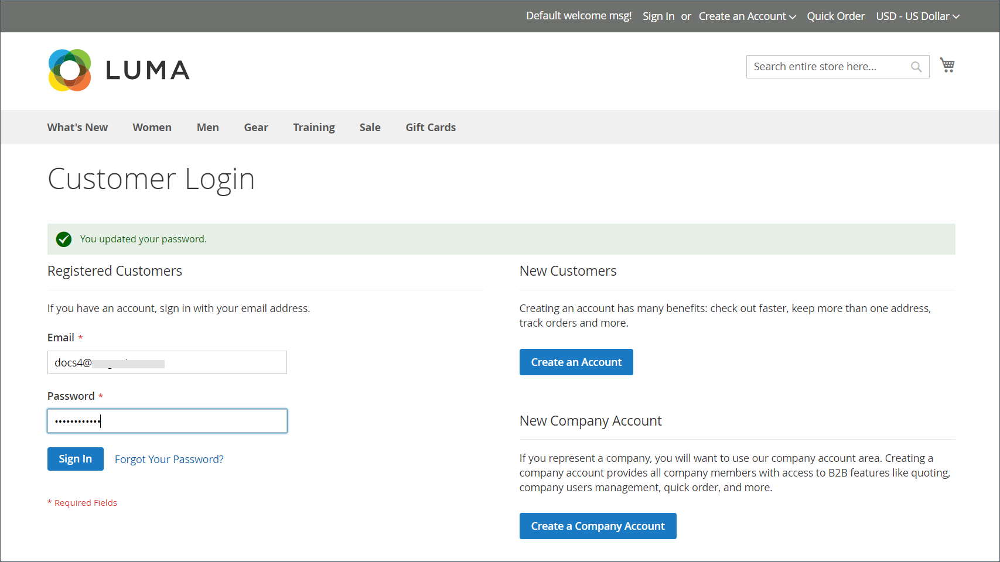
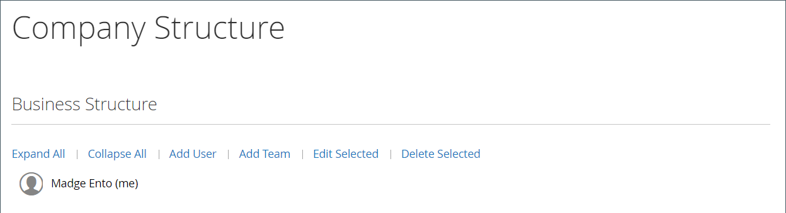

# Företagskonton

När du lägger in B2B-företagskonton i din butik kan du förenkla företagets shoppingupplevelse genom att göra det möjligt för företag att skapa flera underkonton med flexibel behörighet baserat på användarroller i organisationen.

Beroende på vilket företag det är kan en butiksadministratör anpassa kampanjer och priser efter deras behov och skapa skräddarsydda erbjudanden som tillgodoser kundernas krav och ökar beställningarna.

Om du lägger till en företagskontoassociation till en standard [enskild](../customers/account-create.md) kan kunden använda de specifika inköpsarbetsflöden som definierats för företaget.

Fördelar med ett företagskonto:

- Erbjuder obegränsat antal [företagsanvändare](account-company-users.md) och skapande av ytterligare konton, vilket förenklar företagsköp.

- Inkluderar stöd för en _smart_ företagskontohierarki med olika [roller och behörigheter](account-company-roles-permissions.md) för att placera order.

- Tillhandahåller en mekanism för handlare att öka intäkterna genom att erbjuda [företagskrediten](credit-company.md) som betalningsmetod.

- Stöder [hantering](account-company-manage.md) av alla företagskonton från administratören.

## Visa företagskonton

Rutnätet _Företag_ visar alla aktiva företagskonton och väntande begäranden, oavsett statusinställning. Den innehåller även verktyg för att [skapa](account-company-create.md) och [hantera](account-company-manage.md) företagskonton. Använd standardkontrollerna för stödraster för att filtrera listan och justera kolumnlayouten. En lista med kolumnbeskrivningar finns i avsnittet _Kolumnbeskrivningar_ i [Hantera företagskonton](account-company-manage.md).

Kunder kan skapa ett företagskonto från butiken eller en handlare kan skapa ett från administratören. Som standard är möjligheten att skapa företagskonton från butiken aktiverad. Om konfigurationen tillåter det kan en besökare i butiken begära att få öppna ett företagskonto. När företagskontot har godkänts kan företagsadministratören ställa in företagsstrukturen och användare med olika behörighetsnivåer.

Gå till **[!UICONTROL Customers]** > **[!UICONTROL Companies]** i sidofältet _Admin_.

{width="700" zoomable="yes"}

Rutnätet [!UICONTROL Companies] visar alla företag oavsett status. Företagslistan anger om ett företag är associerat med en [företagshierarki](manage-company-hierarchy.md) och ger [detaljerad information](/help/b2b/account-company-manage.md#company-options-and-columns) om företaget, företagsadministratören och annan information. Anpassa vyn genom att använda [Admin-kontrollerna för stödraster](../getting-started/admin-grid-controls.md) för att ange filter, alternativ för kolumnvisning med mera.

## Företagsadministratör

I följande exempel visas rutnätet _Kunder_ med inledande företagskonton.

{width="700" zoomable="yes"}

Varje företag har en enda företagsadministratör som identifieras av kontots e-postadress och administratörens för- och efternamn. Administratören kan tilldelas andra företag som användare, men kan bara vara administratör för ett företag.

När du har skapat kontot definierar företagsadministratören företagsstrukturen för [team](account-company-structure.md), konfigurerar [företagsanvändarna](account-company-users.md) och fastställer [roller och behörigheter](account-company-roles-permissions.md) för varje.

### Ange företagets administratörslösenord före första inloggningen

1. Företagsadministratören hittar ett välkomstmeddelande från butiken.

   {width="500"}

   >[!NOTE]
   >
   >E-postadressmålen och innehållet i e-postmeddelandet bestäms av alternativen som anges i konfigurationen för [företagets e-postadress](email-company-configuration.md).

1. Följ instruktionerna och klicka på [!UICONTROL **link**] för att ange lösenordet.

1. Anger ett [!UICONTROL **nytt lösenord**] och en lösenordsbekräftelse för deras konto.

   Lösenordet måste innehålla minst tre av följande teckentyper:

   - Gemener (abc...)
   - Versaler (ABC...)
   - Nummer (1234567890)
   - Specialtecken (!@#$...)

1. Klicka på [!UICONTROL **Ange ett nytt lösenord**].

   {width="700" zoomable="yes"}

1. När sidan [!UICONTROL Customer Login] visas anger kunden sin [!UICONTROL **e-postadress**] och [!UICONTROL **lösenord**].

1. Klicka på [!UICONTROL **Logga in**] för att komma åt deras kontoinstrumentpanel.

   {width="700" zoomable="yes"}

## Företagsstruktur

Ett företagskonto kan skapas för att återspegla affärsstrukturen. Till att börja med innehåller företagsstrukturen bara företagsadministratören, men kan utvidgas till att omfatta användargrupper. Användarna kan associeras med team eller vara organiserade i en hierarki av divisioner och indelningar inom företaget. Strukturen har utformats för att stödja användning av [godkännanderegler](account-dashboard-approval-rules.md) för [inköpsorder](purchase-order-flow.md) (inköpsorder) som är kopplade till företagskontot.

{width="450"}

I företagsadministratörens kontouppsättningspanel representeras företagsstrukturen som ett träd och består inledningsvis av endast företagsadministratören.

{width="600"}

När kontot skapas kan företagsadministratören använda företagets e-postadress eller tilldelas en annan e-postadress.

I följande exempel innehåller den inledande företagsstrukturen företagsadministratören plus ett individuellt användarkonto i namnet på företagsadministratören. Företagsadministratörsfunktioner (t.ex. företagsstruktur och godkännanderegler) är bara tillgängliga när de är inloggade på det användarkonto som har angetts som företagsadministratör.

{width="600"}
