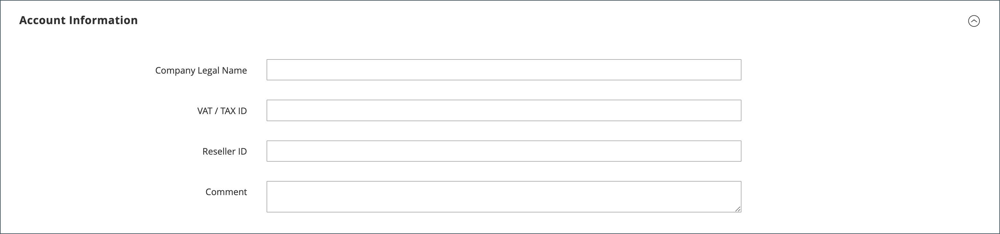

# Skapa ett företagskonto

Företagskonton kan konfigureras från butiken av kunden eller från administratören. Alla begäranden om att skapa ett företagskonto måste godkännas av butiksadministratören innan kontot aktiveras.

Den person som skapar ett företagskonto från butiken tilldelas en roll som [företagsadministratör](account-company-admin.md). När begäran om att skapa ett företagskonto har godkänts kan företagsadministratören ange ett kontolösenord och logga in på kontot.

## Metod 1: Kunden skapar kontot från butiken

>[!IMPORTANT]
>
>Kontrollera att [B2B-funktionerna](enable-basic-features.md) är aktiverade om du vill ha stöd för den här metoden (så att kunderna kan registrera sitt företag från butiken).

1. I det övre högra hörnet av butikshuvudet klickar kunden på **[!UICONTROL Create an Account]** och väljer **[!UICONTROL Create New Company Account]**.

   {width="700" zoomable="yes"}

   >[!NOTE]
   >
   >Om en besökare är inloggad på ett registrerat användarkonto kan de skapa ett företagskonto genom att gå till _[!UICONTROL Customer Profile]_>**[!UICONTROL Company Structure]**>**[!UICONTROL Create a Company Account]**.

1. I avsnittet _[!UICONTROL Company Information]_gör kunden följande:

   - Fyller i de obligatoriska fälten:

      - **[!UICONTROL Company Name]**
      - **[!UICONTROL Company Email]**

   - Fyller i de återstående fälten, beroende på vad som är tillämpligt:

      - **[!UICONTROL Company Legal Name]**
      - **[!UICONTROL VAT/TAX ID]**
      - **[!UICONTROL Reseller ID]**

   {width="700" zoomable="yes"}

1. Fyller i obligatoriska fält i avsnittet _[!UICONTROL Legal Address]_.

   - **[!UICONTROL Street Address]**
   - **[!UICONTROL City]**
   - **[!UICONTROL Country]**
   - **[!UICONTROL State/Province]**
   - **[!UICONTROL ZIP/Postal Code]**
   - **[!UICONTROL Phone Number]**

   {width="700" zoomable="yes"}

1. Gör följande i avsnittet _[!UICONTROL Company Administrator]_:

   - Anger **[!UICONTROL Email address]** för företagsadministratören.

     E-postadressen till företagsadministratören kan vara samma som företagets e-postadress eller en annan e-postadress. Om en annan e-postadress anges skapas ett företagsanvändarkonto förutom företagsadministratörskontot.

   - Anger **[!UICONTROL First Name]** och **[!UICONTROL Last Name]** för företagsadministratören.

   - Fyller i följande fält om du vill:

      - **[!UICONTROL Job Title]**
      - **[!UICONTROL Work Phone Number]**
      - **[!UICONTROL Gender]**

   

1. Slutför valideringen om reCAPTCHA är aktiverat för den här butiksfunktionen.

1. När informationen är klar väljer du **[!UICONTROL Submit]**.

   När begäran om att skapa ett företagskonto godkänns av handlaren skickas ett e-postmeddelande till företagsadministratören.

   {width="500"}

   När lösenordet har angetts kan företagsadministratören [logga in](../customers/customer-sign-in.md) på kontot.

## Metod 2: Merchant skapar kontot från administratören

Processen att skapa ett företag från Admin är i stort sett densamma som i butiken, men med ytterligare fält.

{width="700" zoomable="yes"}

1. Gå till **[!UICONTROL Customers]** > **[!UICONTROL Companies]** på sidofältet _Admin_.

1. Klicka på **[!UICONTROL Add New Company]** och gör följande:

   - Fyll i dessa obligatoriska fält:

      - **[!UICONTROL Company Name]**
      - **[!UICONTROL Company Email]**

   - Om du inte är redo för att kontot ska börja gälla anger du **[!UICONTROL Status]** till `Pending Approval`. (Inställd på `Active` som standard.)

   - Välj i tillämpliga fall administratörskontot för **[!UICONTROL Sales Representative]** som ska hantera kontot.

1. Gör följande i avsnittet _[!UICONTROL Account Information]_:

   - Fyll i följande fält efter behov:

      - **[!UICONTROL Company Legal Name]**
      - **[!UICONTROL VAT/TAX ID]**
      - **[!UICONTROL Reseller ID]**

   - För **[!UICONTROL Comment]** anger du eventuell ytterligare information om kunden som kan behövas.

     Kommentarerna visas bara från administratören.

   {width="700" zoomable="yes"}

1. När du skapar det första företaget är stödrastret _[!UICONTROL Company Hierarchy]_tomt när du expanderar det. När du har sparat företaget kan du inkludera det i en företagshierarki. Se [Företagshantering](manage-companies.md).

1. Fyll i följande obligatoriska fält i avsnittet _[!UICONTROL Legal Address]_:

   - **[!UICONTROL Street Address]**
   - **[!UICONTROL City Country]**
   - **[!UICONTROL ZIP/Postal Code]**
   - **[!UICONTROL Phone Number]**

1. Gör följande i avsnittet _[!UICONTROL Company Admin]_:

   - Fyll i dessa obligatoriska fält:

      - **[!UICONTROL Email]**
      - **[!UICONTROL First Name]**
      - **[!UICONTROL Last Name]**

   - Fyll i följande valfria delar av namnet, som kan gälla för vissa kundnamn mer än andra och som du kan använda efter eget gottfinnande:

      - **[!UICONTROL Prefix]**
      - **[!UICONTROL Middle Name/Initial]**
      - **[!UICONTROL Suffix]**

   - Om informationen är tillgänglig fyller du i de återstående fälten för att beskriva företagsadministratören:

      - **[!UICONTROL Website]**
      - **[!UICONTROL Job Title]**
      - **[!UICONTROL Work Phone Number]**
      - **[!UICONTROL Gender]**
      - **[!UICONTROL Send Welcome Email From]**

   {width="700" zoomable="yes"}

1. I avsnittet _[!UICONTROL Company Credit]_, som visar en sammanfattning av kundens kreditaktivitet, fyller du i så många som möjligt av fälten i den nedre delen av avsnittet:

   - **[!UICONTROL Credit Currency]**
   - **[!UICONTROL Credit Limit]**
   - **[!UICONTROL Allow to Exceed Credit Limit]**
   - **[!UICONTROL Reason for Change]**

   {width="700" zoomable="yes"}

1. Gör följande i avsnittet _[!UICONTROL Advanced Settings]_:

   >[!NOTE]
   >
   >Kundgruppstilldelningen avgör vilken delad katalog som är tillgänglig för företaget och dess anställda. Som standard tilldelas företaget till kundgruppen som är inställd som standard i konfigurationen.

   - Du kan ändra tilldelningen **[!UICONTROL Customer Group]** för företaget och dess anställda till en grupp som har åtkomst till en annan delad katalog eller till en standardkundgrupp. Du uppmanas att bekräfta innan gruppen ändras.

     {width="600"}

   - Om du vill tillåta företagsanställda att generera offerter från sina konton anger du **[!UICONTROL Allow Quotes]** till `Yes`.

   - Om du vill tillåta företagsanställda att skapa och använda inköpsorder från sina konton anger du **[!UICONTROL Enable Purchase Orders]** till `Yes`.

   - Om du vill ändra de **[!UICONTROL Applicable Payment Methods]** som är tillgängliga för företaget avmarkerar du kryssrutan **[!UICONTROL Use config settings]** och väljer något av följande:

     | Alternativ | Beskrivning |
     |-------------------------------|-----------------------------------------------------------------------------------------------------------------------------------------------------------------------------------------------------------------------------------------|
     | `B2B Payment Methods` | (Standard) Aktiverar alla [betalningsmetoder som angetts som standard](../configuration-reference/general/b2b-features.md#default-b2b-payment-methods) för B2B-order. |
     | `All Enabled Payment Methods` | Gör alla [aktiverade betalningsmetoder](../configuration-reference/sales/payment-methods.md) tillgängliga för kundkonton som är kopplade till företagskontot. |
     | `Selected Payment Methods` | Gör att du kan välja betalningsmetoder som är tillgängliga för kundkonton som är kopplade till företagskontot. Om du vill välja flera betalningsmetoder håller du ned Ctrl (PC) eller Kommando (Mac) och väljer varje alternativ. |

     {style="table-layout:auto"}

   - Om du vill ändra de **[!UICONTROL Applicable Shipping Methods]** som är tillgängliga för företaget avmarkerar du kryssrutan **[!UICONTROL Use config settings]** och väljer något av följande:

     | Alternativ | Beskrivning |
     |--------------------------------|----------------------------------------------------------------------------------------------------------------------------------------------------------------------------------------------------------------------------------------------------|
     | `B2B Shipping Methods` | (Standard) Aktiverar alla [leveransmetoder som angetts som standard](../configuration-reference/general/b2b-features.md#default-b2b-shipping-methods) för B2B-beställningar. |
     | `All Enabled Shipping Methods` | Gör alla [aktiverade leveransmetoder](../configuration-reference/sales/delivery-methods.md) tillgängliga för kundkonton som är kopplade till företagskontot. |
     | `Selected Shipping Methods` | Gör att du kan välja leveransmetoder som är tillgängliga för kundkonton som är kopplade till företagskontot. Om du vill välja flera leveransmetoder håller du ned Ctrl (PC) eller Kommando (Mac) och väljer varje alternativ. |

     {style="table-layout:auto"}

1. När du är klar väljer du **[!UICONTROL Save]**.

   När begäran om att skapa ett företagskonto godkänns av handlaren skickas ett e-postmeddelande till företagsadministratörens e-postadress.

   När lösenordet har angetts kan företagsadministratören [logga in](../customers/customer-sign-in.md) på kontot.

## Knappfält

| Knapp | Beskrivning |
|---------------------------|------------------------------------------------------------------|
| [!UICONTROL Back] | Återgår till sidan Företag utan att spara ändringar. |
| [!UICONTROL Reset] | Återställer originalvärdena till fält som inte har sparats. |
| [!UICONTROL Save] | Sparar ändringar i företaget och håller profilen öppen. |
| [!UICONTROL Save & Close] | Sparar ändringar i företaget och stänger profilen. |

{style="table-layout:auto"}

## Fältbeskrivningar

| Fält | Beskrivning |
|-----------------------------------|---------------------------------------------------------------------------------------------------------------------------------------------------------------------------------------------------------------------------------------------------------------------------------------------------------------------------------------------------------------------------------------------------------------------------------------------------------------------------------------------------------------------------------------------------------------------------------------------------------------------------------------------------------------------------------------------------------------------------------------------------------------------------------------------------------------------------------------------------------------------------------------------------------------------------------|
| [!UICONTROL Company Name] | Företagsnamnet anges när företagskontot skapas för första gången och kan vara en förkortad version av det fullständiga juridiska namnet. |
| [!UICONTROL Status] | (Endast administratör) Anger det aktuella tillståndet för företagskontot. Alternativ:  **[!UICONTROL Active]**- Företagskontot har godkänts av butiksadministratören. Företagsadministratören och associerade medlemmar kan logga in kontot från butiken och göra inköp. **[!UICONTROL Pending Approval]** - En begäran om att öppna ett företagskonto har skickats, men har ännu inte godkänts av butiksadministratören.  **[!UICONTROL Rejected]**- En begäran om att öppna ett företagskonto har skickats, men inte godkänts av butiksadministratören. De inloggningsuppgifter som användes för att skicka begäran blockeras. ** Blockerad **- Företagsmedlemmar kan logga in och komma åt katalogen, men de kan inte göra inköp. Butiksadministratören kan blockera ett företagskonto som inte är i gott skick. Butiksadministratören kan när som helst ta bort blocket på kontot. |
| [!UICONTROL Company Email] | E-postadressen som är associerad med företagskontot. |
| [!UICONTROL Sales Representative] | (Endast administratör) Den Admin-användare som är den primära kontakten för företagskontot. |

{style="table-layout:auto"}

### [!UICONTROL Account Information]

| Fält | Beskrivning |
|---------------------------------|-----------------------------------------------------------------------------------------------------------------------------------------------------------------------------------------------------------------------------------------------------------------------------------------------------------------------------------------------------------------------------------------------------------------------------------------------------------------|
| [!UICONTROL Company Legal Name] | Företagets officiella, fullständiga namn. |
| [!UICONTROL VAT / TAX ID] | [Moms](../stores-purchase/vat.md)-numret som tilldelas företaget av vissa jurisdiktioner för momsrapportering. Information om hur du konfigurerar kundens moms-/momsregistreringsnummer så att det visas i butiken finns i [Skapa nya kontoalternativ](../configuration-reference/customers/customer-configuration.md).   **_Obs!_** Företagsadministratören och andra företagsanvändare har inte sina egna separata momsregistreringsnummer i sina kundkonton. |
| [!UICONTROL Reseller ID] | Återförsäljningsnumret som har tilldelats företaget för momsrapportering. |
| [!UICONTROL Comment] | (Endast admin) Anteckningarna om företagskontot är till för referens och visas bara från administratören. |

{style="table-layout:auto"}

### [!UICONTROL Company Hierarchy]

| Fält | Beskrivning |
|-----------------------------------|------------------------------------------------------------------------------------------------------------------------------------------------------|
| [!UICONTROL Company ID] | Företagets ID-nummer. |
| [!UICONTROL Company Name] | Företagets fullständiga namn.  En `current company indicator` visas på den företagsrad som redigeras. |
| [!UICONTROL Company Email] | E-postadressen som är associerad med företagskontot. |
| [!UICONTROL Phone Number] | Företagets primära telefonnummer. |
| [!UICONTROL Country] | Det land där företaget är registrerat för att bedriva verksamhet. |
| [!UICONTROL State/Province] | Den delstat eller provins där företaget är registrerat för att bedriva verksamhet. |
| [!UICONTROL City] | Ort där företaget är registrerat för att bedriva verksamhet. |
| [!UICONTROL Group/Shared Catalog] | (Endast administratör) Anger den [kundgrupp](../customers/customer-groups.md) eller [delade katalog](catalog-shared.md) som är tilldelad företaget. |
| [!UICONTROL Company Admin] | Företagsadministratörens fullständiga namn. |
| [!UICONTROL Action] | Listan över möjliga åtgärder för den företagsraden. |

{style="table-layout:auto"}

### [!UICONTROL Legal Address]

| Fält | Beskrivning |
|------------------------------|-----------------------------------------------------------------------------|
| [!UICONTROL Street Address] | Den gatuadress där företaget är registrerat för att bedriva verksamhet. |
| [!UICONTROL City] | Ort där företaget är registrerat för att bedriva verksamhet. |
| [!UICONTROL Country] | Det land där företaget är registrerat för att bedriva verksamhet. |
| [!UICONTROL State/Province] | Den delstat eller provins där företaget är registrerat för att bedriva verksamhet. |
| [!UICONTROL ZIP/Postal Code] | Postnummer där företaget är registrerat för att bedriva verksamhet. |
| [!UICONTROL Phone Number] | Företagets primära telefonnummer. |

{style="table-layout:auto"}

### [!UICONTROL Company Admin]

| Fält | Beskrivning |
|--------------------------------------|---------------------------------------------------------------------------------------------------------------------------------------------------------------------------------------------------------------------------------------------------|
| [!UICONTROL Website] | Anger webbplatsen som företagsadministratören tillhör. |
| [!UICONTROL Job Title] | Namnet på den företagsadministratör som hanterar företagskontot. |
| [!UICONTROL Work Phone Number] | Telefonnumret till den företagsadministratör som hanterar företagskontot. |
| [!UICONTROL Email] | Företagsadministratörens e-postadress kan vara samma som företagets e-postadress. Om en annan e-postadress anges skapas ett separat individuellt konto för företagsadministratören, utöver företagskontot. |
| [!UICONTROL Prefix] | Om det är tillämpligt, det prefix som är associerat med namnet på företagsadministratören (till exempel `Mr.`, `Ms.`, `Mrs.` eller `Dr.`). Beroende på konfigurationen kan inmatningsfältet vara ett textfält eller en lista. |
| [!UICONTROL First Name] | Företagsadministratörens förnamn. |
| [!UICONTROL Middle Name/Initial] | Företagsadministratörens mellannamn eller initialnamn. |
| [!UICONTROL Last Name] | Företagsadministratörens efternamn. |
| [!UICONTROL Suffix] | Det suffix som är associerat med namnet på företagsadministratören (till exempel `Jr.`, `Sr.` eller `III.`), om tillämpligt. Beroende på konfigurationen kan inmatningsfältet vara ett textfält eller en lista. |
| [!UICONTROL Gender] | Företagsadministratörens kön. Alternativ: `Male` / `Female` / `Not Specified` |
| [!UICONTROL Send Welcome Email From] | Butiksvyn som välkomstmeddelandet ska skickas från. |

{style="table-layout:auto"}

### [!UICONTROL Company Credit]

| Fält | Beskrivning |
|-------------------------------------------|-----------------------------------------------------------------------------------------------------------------------------------------------------------------------------------------|
| [!UICONTROL Credit Currency] | (Endast administratör) Valutan som accepteras av butiken för köp av företagskrediter. |
| [!UICONTROL Credit Limit] | (Endast administratör) Den kreditgräns som utökas till företagskontot. |
| [!UICONTROL Allow to Exceed Credit Limit] | (Endast administratör) Anger om företaget har behörighet att överskrida kreditgränsen. Alternativ: `Yes` / `No` |
| [!UICONTROL Reason for Change] | (Endast administratör) En anteckning som förklarar varför företaget tillåts eller inte tillåts överskrida kreditgränsen. Det här fältet är bara aktivt om behörigheten att överskrida kreditgränsen ändras. |

{style="table-layout:auto"}

### [!UICONTROL Advanced Settings]

| Fält | Beskrivning |
|------------------------------------------|--------------------------------------------------------------------------------------------------------------------------------------------------------------------------------------------------------------------------|
| [!UICONTROL Customer Group] | (Endast administratör) Anger den [kundgrupp](../customers/customer-groups.md) eller [delade katalog](catalog-shared.md) som är tilldelad företaget. |
| [!UICONTROL Allow Quotes] | (Endast administratör) Avgör om företagsmedlemmar kan förbereda och skicka överlåtbara offerter för företagets räkning. |
| [!UICONTROL Enable Purchase Orders] | (Endast administratör) Avgör om företagsmedlemmar kan skicka order som [inköpsorder](account-dashboard-my-purchase-orders.md) för företagets räkning. |
| Tillämpliga betalningsmetoder | (Endast administratör) Anger betalningsmetoder som är tillgängliga för företagsköp. Alternativ: `B2B Payment Methods` / `All Enabled Payment Methods` / `Selected Payment Methods` |
| [!UICONTROL Payment Methods] | (Endast administratör) Börjar vara aktivt om specifika betalningsmetoder aktiveras. Om du vill göra flera betalningsmetoder tillgängliga för företagskontot håller du ned Ctrl-tangenten (PC) eller Kommando-tangenten (Mac) och väljer varje alternativ. |
| [!UICONTROL Applicable Shipping Methods] | (Endast administratör) Anger leveransmetoder som är tillgängliga för företagsköp. Alternativ: `B2B Shipping Methods` / `All Enabled Shipping Methods` / `Selected Shipping Methods` |
| [!UICONTROL Shipping Methods] | (Endast admin) Börjar vara aktivt om specifika leveransmetoder aktiveras. Om du vill göra flera betalningsmetoder tillgängliga för företagskontot håller du ned Ctrl-tangenten (PC) eller Kommando-tangenten (Mac) och väljer varje alternativ. |

{style="table-layout:auto"}
