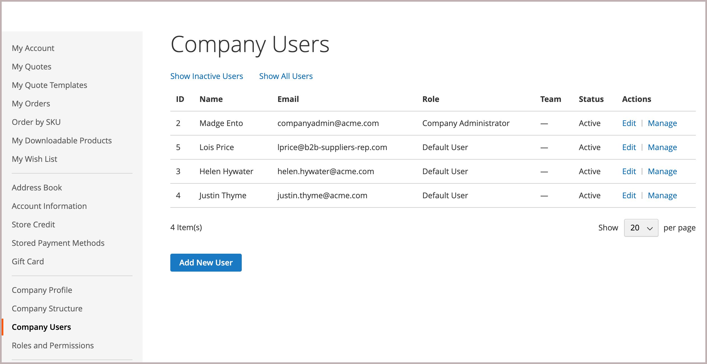

# Företagsroller och behörigheter

Roller för företagsanvändare skapas med olika behörighetsnivåer för att komma åt säljinformation och säljresurser. Som standard är företagsadministratören en _superanvändare_ med fullständig behörighet. The [Åtkomst nekad](../content-design/pages.md#access-denied) visas om användaren inte har behörighet att komma åt sidan.

{width="700" zoomable="yes"}

Systemet har en fördefinierad standardanvändarroll som du kan använda _as_ eller anpassa efter dina behov. Du kan skapa så många roller som behövs för att matcha företagets struktur och organisationsansvar, som exempelvis följande:

- **Standardanvändare** — Standardanvändaren har fullständig åtkomst till aktiviteter relaterade till försäljning och offerter samt skrivskyddad åtkomst till företagsprofil och kreditinformation.

- **Senior Buyer** — En högre köpare kan ha tillgång till alla Sales- och Quotes-resurser och endast visa behörigheter för företagsprofilen, användare och team, betalningsinformation och företagskrediter.

- **Assistent Buyer** — En assistentköpare kan ha behörighet att göra en beställning med _Utcheckning med offert_ och för att visa order, offerter och information i företagsprofilen.

## Hantera roller och behörigheter

1. Företagsadministratören loggar in på sitt butikskonto.

1. I den vänstra panelen väljer **[!UICONTROL Roles and Permissions]**.

1. Slutför någon av följande uppgifter.

### Skapa en roll

1. Klickningar **[!UICONTROL Add New Role]**.

   {width="600" zoomable="yes"}

1. Anger en beskrivning **[!UICONTROL Role Name]**.

1. Under _[!UICONTROL Role Permissions]_gör något av följande:

   - Markerar kryssrutan för varje resurs eller aktivitet som användare som har tilldelats rollen har behörighet att komma åt.

   - Markerar **[!UICONTROL All]** och avmarkerar kryssrutan för varje resurs eller aktivitet som användare som har tilldelats rollen inte har behörighet att komma åt.

1. Klickningar **[!UICONTROL Save Role]**.

1. Skapar så många roller som behövs genom att upprepa de här stegen.

### Ändra en roll

1. För rollen som ska ändras klickar företagsadministratören på **[!UICONTROL Edit]** i _[!UICONTROL Actions]_kolumn.

1. Gör nödvändiga ändringar i namn- och behörighetsinställningarna.

1. När det är klart klickar du **[!UICONTROL Save Role]**.

### Duplicera en roll

1. Företagsadministratören klickar på den roll som ska dupliceras **[!UICONTROL Duplicate]** i _[!UICONTROL Actions]_kolumn.

1. Gör nödvändiga ändringar i namn- och behörighetsinställningarna.

1. När det är klart klickar du **[!UICONTROL Save Role]**.

### Ta bort en roll

1. Företagsadministratören hittar rollen som ska tas bort i listan över roller.

   Endast roller utan tilldelade användare kan tas bort.

1. Klickningar **[!UICONTROL Delete]** i _[!UICONTROL Actions]_kolumn.

1. När du uppmanas att bekräfta klickar du **[!UICONTROL OK]**.

## Åtgärder

| Åtgärd | Beskrivning |
|-----------| ----------- |
| [!UICONTROL Duplicate] | Skapar en kopia av den valda rollen. Namnet på den duplicerade rollen har `- Duplicated` läggs till i slutet. |
| [!UICONTROL Edit] | Ändra namn och/eller uppsättning behörigheter. |
| [!UICONTROL Delete] | Ta bort rollen. Endast roller utan tilldelade användare kan tas bort. |

{style="table-layout:auto"}

## Rollbehörigheter

- Alla
   - Försäljning
      - Tillåt utcheckning (placera order)
         - Använd metoden Betala på konto
      - Visa order
         - Visa order för underordnade användare
- Citat
   - Visa
      - Begär, redigera, ta bort
      - Checka ut med citat
      - Visa offerter för underordnade användare
- Beställningsgodkännanden
   - Visa mina inköpsorder
      - Visa för underordnade
      - Visa för alla företag
   - Godkänn automatiskt inköpsordrar som skapats i den här rollen
   - Godkänn inköpsorder utan andra godkännanden
   - Visa godkännanderegler
      - Skapa, redigera och ta bort
- Företagsprofil
   - Kontoinformation (visa)
      - Redigera
   - Adress
      - Redigera
   - Kontakter (visa)
   - Betalningsinformation (vy)
   - Leveransinformation (vy)
- Företagets användarhantering
   - Visa roller och behörigheter
      - Hantera roller och behörigheter
   - Visa användare och team
      - Hantera användare och team
- Företagskrediter
   - Visa

## Tilldela en roll till en företagsanvändare

När du har definierat de roller som behövs tilldelar företagsadministratören en roll till varje företagsanvändare.

1. Loggar in på deras företagskonto som företagsadministratör.

1. I den vänstra panelen väljer **[!UICONTROL Company Users]**.

   {width="700" zoomable="yes"}

1. Söker efter användaren i listan och klickar **[!UICONTROL Edit]**.

1. Väljer lämplig **[!UICONTROL User Role]** för användaren.

   {width="700" zoomable="yes"}

1. Klickningar **[!UICONTROL Save]**.
