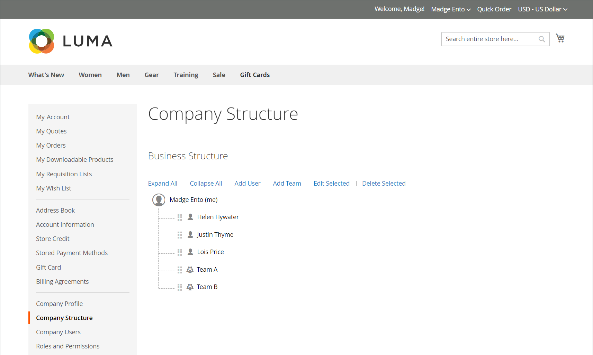

# Företagets kontostruktur

Ett företagskonto kan skapas för att återspegla affärsstrukturen. Till att börja med innehåller företagsstrukturen bara företagsadministratören, men kan utvidgas till att omfatta användargrupper. Användarna kan associeras med team eller vara organiserade i en hierarki av divisioner och indelningar inom företaget.

{width="500"}

I företagsadministratörens kontouppsättningspanel representeras företagsstrukturen som ett träd och består inledningsvis av endast företagsadministratören.

{width="600" zoomable="yes"}

När kontot skapas och godkänns kan företagsadministratören använda företagets e-postadress eller tilldelas en annan e-postadress.

Det är möjligt att den person som fungerar som företagsadministratör har flera roller inom företaget. Om en separat e-postadress anges för företagsadministratören, innehåller den inledande företagsstrukturen företagsadministratören plus ett individuellt användarkonto i företagsadministratörens namn. I så fall kan företagsadministratören logga in på kontot som företag eller som en enskild användare.

{width="600" zoomable="yes"}

För handlare återspeglas den fullständiga företagsstrukturen i rutnäten _Företag_ och _Kunder_ i Admin. I företagsrutnätet visas alla företag oavsett status. I följande exempel visas konton för två företag: företaget _ACME_ och företaget _Vendelay_.

{width="700" zoomable="yes"}

I följande exempel visas rutnätet [!UICONTROL Customers] med de inledande företagskontona för dessa företag.

{width="700" zoomable="yes"}

När du har skapat kontot måste företagsadministratören definiera företagsstrukturen för [team](account-company-structure.md), konfigurera [företagsanvändarna](account-company-users.md) och upprätta [roller och behörigheter](account-company-roles-permissions.md) för varje.

## Företagsstrukturikoner

| Ikon | Beskrivning |
| ---- | ----------------- |
|  | Representerar företagsadministratören i företagsstrukturen. |
|  | Representerar ett team i företagsstrukturen. |
|  | Representerar en användare i företagsstrukturen. |
|  | Flyttar ett team till en annan position i företagsstrukturen. |
|  | Utökar ett team i företagsstrukturen. |
|  | Komprimerar ett team i företagsstrukturen. |

{style="table-layout:auto"}

## Skapa företagsteam

Strukturen för ett företagskonto bör återspegla inköpsorganisationen, oavsett om det är enkelt och platt eller en komplex organisation med olika team för varje avdelning och avdelning i företaget.

Om butiken är [konfigurerad](enable-basic-features.md) för att tillåta företag att hantera sina egna konton, är konfigurering av företagsstrukturen en av de första uppgifterna som en företagsadministratör kan utföra efter att kontot har godkänts. I företagskontot representeras företagets struktur som ett träd med företagsadministratören högst upp.

{width="450"}

1. Företagsadministratören loggar in på sitt konto.

1. Välj **[!UICONTROL Company Structure]** i den vänstra panelen.

1. Under **[!UICONTROL Business Structure]** klickar du på **[!UICONTROL Add Team]** och gör följande:

   - Anger **[!UICONTROL Team Title]** och **[!UICONTROL Description]**.

     Team Title kan vara vad som helst som representerar företagets struktur, till exempel ett team, kontor eller en division inom företaget

     {width="700" zoomable="yes"}

   - Klicka på **[!UICONTROL Save]** när du är klar.

   - Skapar så många team som behövs.

     {width="600" zoomable="yes"}

1. Så här skapar du en hierarki av team:

   - Väljer det överordnade teamet och klickar på **[!UICONTROL Add Team]**.

     {width="600" zoomable="yes"}

   - Anger **[!UICONTROL Team Title]** och **[!UICONTROL Description]**.

   - Klicka på **[!UICONTROL Save]**.

1. Upprepar dessa steg för att skapa så många team, eller divisioner och indelningar som behövs.

   {width="600" zoomable="yes"}

## Flytta ett team

När företagsadministratören arbetar med företagsstrukturen kan de dra team eller avdelningar till andra platser i strukturen.

1. Företagsadministratören hittar teamet som ska flyttas.

1. Klicka och dra teamet till en ny position i företagsstrukturen.

## Ta bort ett team

>[!NOTE]
>
>Innan du tar bort ett team bör du kontrollera att rätt team har valts - borttagna team kan inte återställas.

1. Företagsadministratören väljer det team som ska tas bort.

1. Klicka på **[!UICONTROL Delete Selected]**.

1. När du uppmanas att bekräfta klickar du på **[!UICONTROL Delete]**.

## Expandera eller komprimera teamstrukturen

När företagsadministratören arbetar med företagsstrukturen kan de komprimera eller expandera trädet:

- Klicka på **[!UICONTROL Collapse All]** eller **[!UICONTROL Expand All]**.

- Klicka på  om du vill komprimera ett team eller på  om du vill expandera ett team.

## Tilldela användare till team

När team och användare först läggs till i [företagsstrukturen](account-company-structure.md) placeras de på samma nivå under företagsadministratören.

{width="700" zoomable="yes"}

| Kontroll | Beskrivning |
|--- |--- |
| [!UICONTROL Collapse All / Expand All] | Komprimerar eller utökar affärsstrukturträdet |
| [!UICONTROL Add User] | Skapar en användare under det aktuella teamet |
| [!UICONTROL Add Team] | Skapar ett team |
| [!UICONTROL Edit Selected / Delete Selected] | Redigera eller ta bort användare från affärsträdet |

{style="table-layout:auto"}

1. I den vänstra panelen väljer företagsadministratören **[!UICONTROL Company Structure]**.

1. Om du vill tilldela en användare till ett befintligt team drar de () användaren till rätt team.

   {width="700" zoomable="yes"}
