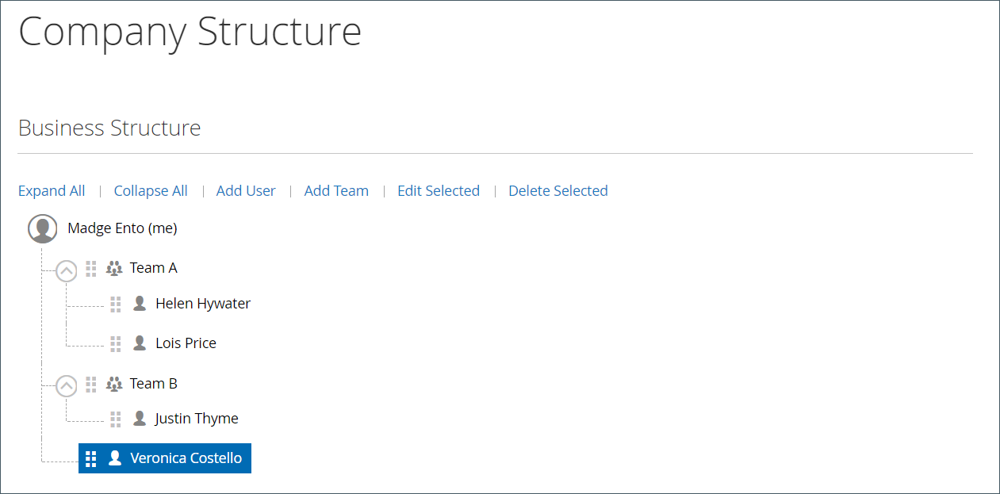

# Hantera företagsanvändarkonton

Företagsanvändare tilldelas av företagsadministratören i butiken och visas på sidan _[!UICONTROL Company Users]_. Dessa personer är vanligtvis köpare med olika behörighetsnivåer för att få tillgång till butikstjänster och resurser.

Företagsadministratören ställer först in [företagsstrukturen](account-company-structure.md) och slutför sedan följande uppgifter efter behov:

- Skapa företagsanvändare och tilldela användare till team

- Definiera roller och behörigheter och tilldela användare till roller

Företagsanvändare kan bara läggas till, redigeras, inaktiveras eller tas bort av företagsadministratören.

- När en användare tas bort ändras kontots status till *inaktiv* och kunden kan inte längre logga in på företaget. Administratörer kan fortfarande komma åt allt innehåll som är kopplat till användaren. Kontoadministratören kan återställa åtkomsten genom att ändra kontostatusen till *[!UICONTROL Active]* från sidan [!UICONTROL Company Users].

- När ett användarkonto tas bort tas kontot och allt tillhörande innehåll bort från butiken. Det går inte att återställa den här åtgärden.

## Lägg till företagsanvändare

1. Från butiken loggar företagsadministratören in på sitt konto.

1. Välj **[!UICONTROL Company Users]** i den vänstra panelen.

   {width="700" zoomable="yes"}

1. Klicka på **[!UICONTROL Add New User]** och gör följande:

   - Anger den nya användarens **[!UICONTROL Job Title]**.

   - Väljer lämplig **[!UICONTROL User Role]** om roller och behörigheter har definierats. Annars kan de gå tillbaka senare för att tilldela rollen.

     {width="700" zoomable="yes"}

   - Lägger till användarinformationen i de återstående fälten:
      - **[!UICONTROL First Name]** och **[!UICONTROL Last Name]**
      - **[!UICONTROL Email]**
      - **[!UICONTROL Work Phone Number]**

   Som standard är **[!UICONTROL Status]** för kontot `Active`.

1. Klicka på **[!UICONTROL Save]** när du är klar.

1. Upprepar processen att skapa så många företagsanvändare som behövs.

   De nya användarna visas i listan Företagsanvändare tillsammans med företagsadministratören.

Om du vill spara tid under den första beställningen kan företagsadministratören påminna varje företagsanvändare om att lägga till företagets standardfakturerings- och leveransadress i sin [adressbok](../customers/account-dashboard-address-book.md).

## Ta bort en användare från [!UICONTROL Company structure]

Företagsadministratörer kan ta bort en användare från [!UICONTROL Company Structure].

När ett konto har tagits bort ändras användarkontots status till *inaktiv* och användaren kan inte längre logga in i butiken.
Administratören kan återaktivera ett konto genom att redigera användarkontoinformationen på sidan Företagsanvändare.

1. Från butiken loggar företagsadministratören in på sitt konto.

1. Välj **[!UICONTROL Company Structure]** i den vänstra panelen.

1. Väljer företagsanvändaren i företagsstrukturen.

1. Klicka på **[!UICONTROL Remove from Structure]**.

   {width="600" zoomable="yes"}

1. När du uppmanas att bekräfta klickar du på **[!UICONTROL Remove]**.

   I Admin visas företagsanvändaren fortfarande i rutnätet [Kunder](../customers/customers-all.md), men med statusen `Inactive`.

## Visa och hantera företagsanvändarkonton

Företagsadministratörer kan visa och hantera företagsanvändarkonton med visningsfiltren på sidan [!UICONTROL Company Users].

{width="700" zoomable="yes"}

- Visa endast inaktiva användare genom att välja **[!UICONTROL Show Inactive Users]**.
- Visa endast aktiva användare genom att välja **[!UICONTROL Show Active Users]**.
- Visa alla användare genom att välja **[!UICONTROL Show All Users]**.

Företagsadministratören kan hantera ett enskilt konto med hjälp av radobjektet *[!UICONTROL Actions]* för att redigera kontoinformationen, hantera kontostatus eller ta bort ett konto.

### Redigera information om företagets användarkonto

Företagsadministratörer kan uppdatera information om användarkontoprofilen och ändra kontostatus.

1. På sidan [!UICONTROL Company Users] hittar du det användarkonto som ska uppdateras. Klicka på **[!UICONTROL Edit]**.

1. Gör nödvändiga ändringar i användarkontoinformationen, inklusive ändringar av kontostatus.

1. Tillämpa ändringarna genom att klicka på **[!UICONTROL Save]**.

>[!NOTE]
>
>Om du redigerar ett företagsanvändarkonto och märker att profilen saknar nödvändig kontoinformation, t.ex. jobbtitel och telefonnummer till arbetet, anger det att kontot har lagts till av en Commerce webbplatsadministratör. Dessa konton kan inte redigeras från butiken. Kontakta webbplatsadministratören om du vill uppdatera information eller ändra kontots status.

### Inaktivera eller ta bort ett aktivt konto

1. På sidan [!UICONTROL Company Users] hittar du det användarkonto som ska uppdateras. Klicka på **[!UICONTROL Manage]**.

   {width="600" zoomable="yes"}

1. Inaktivera eller ta bort användarkontot efter behov när du uppmanas till detta.

>[!IMPORTANT]
>
>Om du tar bort ett företagsanvändarkonto tas kontot och allt tillhörande innehåll bort från systemet. Det går inte att återställa den här åtgärden.

## Beskrivningar av profilfält för företagsanvändarkonto

| Fält | Beskrivning |
|--------------------------------|---------------|
| [!UICONTROL Job Title] | Företagsanvändarens jobbtitel. |
| [!UICONTROL User Role] | Den [roll](account-company-roles-permissions.md) som tilldelats företagsanvändaren. Alternativ: `Default User` / (andra roller) |
| [!UICONTROL First Name] | Företagsanvändarens förnamn. |
| [!UICONTROL Last Name] | Företagsanvändarens efternamn. |
| [!UICONTROL Email] | Företagsanvändarens e-postadress. |
| [!UICONTROL Work Phone Number] | Företagsanvändarens telefonnummer till arbetet. |
| [!UICONTROL Status] | Status för företagsanvändarkontot. Alternativ: `Active` / `Inactive` |

{style="table-layout:auto"}
