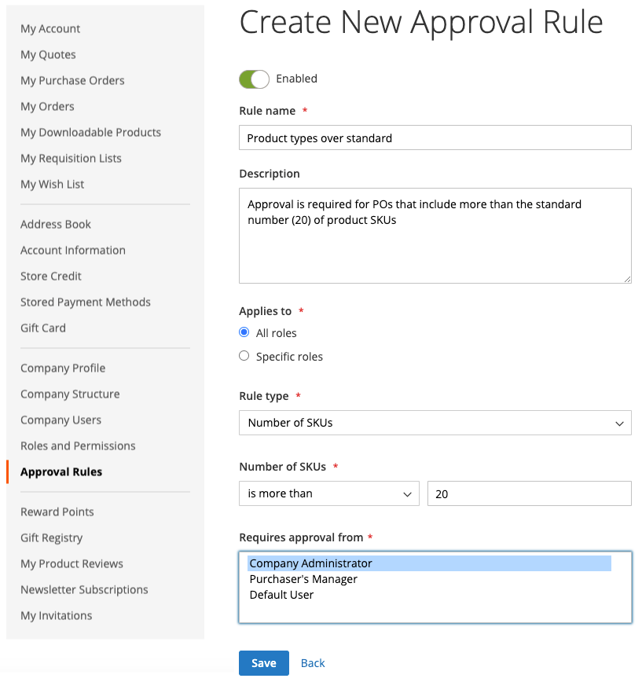

# Godkännanderegler för inköpsorder

De flesta företag kräver ordergodkännande för inköpsorder. Genom att lägga till godkännanderegler för sitt företagskonto kan de styra vem som kan skapa inköpsorder och hur mycket de kan spendera. Exempel:

* Alla PO som är mindre än X-värden godkänns automatiskt.
* PO:er över X-värdet men mindre än Q måste godkännas av Y.
* Alla PO över X-värden måste godkännas av Y och Z.
* En inköpsorder som skapats av alla på Director-nivå eller senare godkänns automatiskt.

Beroende på företagets roll och behörigheter kan användarna skapa, redigera, ta bort eller visa godkännanderegler.

>[!IMPORTANT]
>
>Inställning av godkännanderegel kräver en definierad [företagsstruktur](account-company-structure.md) för att kunna ange godkännande av den inköpandes kundchef.

## Betalningsmetoder

Godkännandeflöden för inköpsorder har stöd för betalningsmetoder både online och offline. Alla standardmetoder för offlinebetalning stöds för godkännande av inköpsorder. Följande metoder stöds för onlinebetalningar:

* PayPal Express
* Braintree betalningar

## Inställningar för godkännanderegel

Med de nödvändiga [behörigheterna för sin roll](account-company-roles-permissions.md) kan B2B-kunder konfigurera godkännanderegler för att framtvinga företagsprofiler genom att klicka på **[!UICONTROL Approval Rules]** i den vänstra panelen för sitt kundkonto.

{width="700" zoomable="yes"}

Kunden utför följande steg för att skapa en regel för godkännande:

1. Klicka på **[!UICONTROL Add New Rule]** för att skapa en regel.

1. Ändra regeln från **[!UICONTROL Enabled]** till **[!UICONTROL Disabled]** om det behövs.

   Regeln är lika aktiverad som standard, men en kund kan skapa regeln med en inaktiverad inställning och sedan aktivera den senare när de är redo att tillämpa den.

1. För **[!UICONTROL Rule name]** anger du ett kort men beskrivande namn för regeln, till exempel `Orders less than $100`.

   Regelnamn måste vara unika.

1. För **[!UICONTROL Description]** anger en längre förklaring av regeln.

1. För **[!UICONTROL Applies to]** väljer en eller flera företagsroller som används för att tillämpa regeln.

1. Väljer **[!UICONTROL Rule Type]** och definierar regeln.

   I följande avsnitt ges en detaljerad förklaring och ett exempel för varje regeltyp.

   {width="700" zoomable="yes"}

1. För **[!UICONTROL Requires approval from]** väljer en eller flera nödvändiga godkännare beroende på typ av godkännande.

   >[!NOTE]
   >
   >* När du tilldelar en roll som godkännare måste du se till att det finns minst en användare i den rollen.
   >* Om det finns två eller flera användare med samma godkännarroll kan den som skapade inköpsordern inte godkänna den. I det här fallet krävs manuellt godkännande av alla andra användare med den här godkännarrollen. Om alternativet `Auto-approve POs created within this role` anges i [rollbehörigheterna](account-company-roles-permissions.md) godkänns dock inköpsordern automatiskt.
   >* Om det bara finns en användare med godkännarrollen och den användaren är skaparen, godkänns alltid inköpsordern automatiskt. Behörighetsinställningen `Auto-approve POs created within this role` ignoreras.

1. Klicka på **[!UICONTROL Save]**.

### [!UICONTROL Order Total]

Den här regeltypen används för att kräva ett IO-godkännande baserat på ordersumman, inklusive moms.

1. Väljer ett **[!UICONTROL Order Total amount]**-alternativ:

   * `is more than`
   * `is less than`
   * `is more than or equal to`
   * `is less than or equal to`

1. Väljer valutatyp och anger beloppet.

{width="600" zoomable="yes"}

### [!UICONTROL Shipping Cost]

Den här regeltypen används för att kräva ett IO-godkännande baserat på fraktkostnad, som många företag kräver.

1. Anger **[!UICONTROL Shipping cost value]**:

   * `is more than`
   * `is less than`
   * `is more than or equal to`
   * `is less than or equal to`

1. Anger önskat leveransbelopp.

{width="600" zoomable="yes"}

### [!UICONTROL Number of SKUs]

Den här regeltypen används för att kräva ett PO-godkännande baserat på antalet SKU:er eller unika produkter i ordern. Det styr antalet distinkta artikeltyper, inte antalet artiklar som ordnas. En inköpsorder kan till exempel innehålla:

* Två stora vita skjortor
* Tre medelstora vita skjortor

I det här exemplet anges fem objekt, men två distinkta SKU:er.

1. Anger värdet **[!UICONTROL Number of SKUs]**:

   * `is more than`
   * `is less than`
   * `is more than or equal to`
   * `is less than or equal to`

1. Anger antalet SKU:er.

{width="600" zoomable="yes"}

## Redigera godkännanderegler

Om du vill ändra en befintlig regel för godkännande kan kunden utföra följande steg:

1. I sidofältet för deras konto väljer kunden **[!UICONTROL Approval Rules]**.

1. Söker efter den post för godkännanderegel som ska redigeras.

1. Klicka på **[!UICONTROL Edit]**.

1. Gör alla nödvändiga ändringar och klicka på **[!UICONTROL Save]**.

## Ta bort godkännanderegler

Om du vill ta bort en befintlig regel för godkännande kan kunden utföra följande steg:

1. Välj **[!UICONTROL Approval Rules]** i sidofältet för deras konto.

1. Söker efter den godkännanderegelpost som ska tas bort.

1. Klicka på **[!UICONTROL Delete]**.

1. Bekräfta åtgärden genom att klicka på **[!UICONTROL OK]**.

## Demo av godkännanden av inköpsorder

I den här videon får du lära dig mer om godkännanden av inköpsorder:

>[!VIDEO](https://video.tv.adobe.com/v/344450?quality=12)
