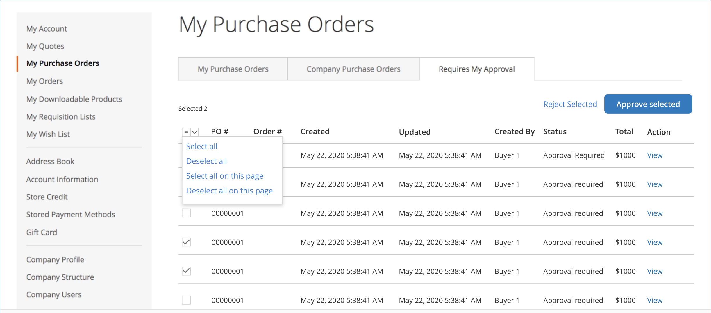

# [!UICONTROL My Purchase Orders]

När inköpsorder [aktiverat för ett företag](purchase-order-flow.md)skapas automatiskt alla order för en kund som är inloggad på ett företagsanvändarkonto som en inköpsorder. Företagsanvändare med nödvändig behörighet kan skapa, redigera och ta bort inköpsordrar som de skapar, tillsammans med de inköpsordrar som skapas av underordnade användare.

{width="700" zoomable="yes"}

>[!NOTE]
>
>Inköpsorder skapar en _ögonblicksbild_ av artikelpriser, rabatter och fraktpriser när ordern skapades. Om priset på en artikel ändras efter att inköpsordern har skapats, används det ursprungliga priset.

## Hantera inköpsorder

Från _Visa inköpsorder_ kan kunden hantera inköpsordern, beroende på vilken sida de har [rollbehörigheter](account-company-roles-permissions.md).

- Klicka på **[!UICONTROL View]**.
- Om du vill se kommentarer om PO:n klickar du på **[!UICONTROL Comments]** -fliken.
- Om du vill se en fullständig orderhistorik klickar du på **[!UICONTROL History Log]** -fliken.

>[!IMPORTANT]
>
>Om en artikel i en inköpsorder inte finns i lager, eller har otillräckligt antal tillgängliga, uppstår ett fel när inköpsordern konverteras till en faktisk order. Om restorder är aktiverade bearbetas ordern normalt.

## Ny inköpsorder från befintlig inköpsorder

Om kunden har en befintlig inköpsorder och vill lägga till nya artiklar kan de generera en dubblettinköpsorder med nya produkter som läggs till i den nya inköpsordern. Kunden utför följande steg:

1. På _Min inköpsorder_ sidan hittar kunden inköpsordern och klickar på **[!UICONTROL View]** länk.

1. Kunden klickar **[!UICONTROL Add Items to Shopping Cart]**.

   Sidan Kundvagn öppnas med alla artiklar listade.

1. Gör tillägg eller ändringar.

1. (Valfritt) Använder **[!UICONTROL Custom Reference Number]** om du vill lägga till ett internt faktura-/inköpsordernummer i ordern.

1. Följer det normala arbetsflödet för utcheckning och klickar **[!UICONTROL Place Purchase Order]**.

Om de har artiklar i kundvagnen när de klickar _[!UICONTROL Add Items to Shopping Cart]_visas en dialogruta. I den här dialogrutan kan de välja mellan att sammanfoga varukorgen med de nya artiklarna eller att ersätta artiklarna i kundvagnen med artiklarna i inköpsordern.

Den ursprungliga inköpsordern kan stängas om den inte längre behövs.

## Godkännanden av inköpsorder

För en kund som har utsetts till godkännare baserat på företagsstruktur eller tilldelad företagsroll är _[!UICONTROL My Purchase Orders]_på kontrollpanelsidan visas **[!UICONTROL Requires My Approval]**-fliken. Kunden klickar på den här fliken för att granska inköpsordrar som väntar på godkännande. Räknaren visar hur många order som väntar på godkännande.

Efter klickning **[!UICONTROL View]** för en inköpsorder och granska informationen kan godkännaren klicka på **[!UICONTROL Approve]** eller **[!UICONTROL Reject]**.

### Massgodkännande/avvisning

Från och med Adobe Commerce 2.4.1 kan godkännarna godkänna eller avvisa flera inköpsorder samtidigt.

1. På _[!UICONTROL My Purchase Order]_sida, klickar på&#x200B;**[!UICONTROL Requires My Approval]**-fliken.

1. Markera kryssrutan för varje inköpsorder som ska godkännas eller avvisas.

1. Klickningar **[!UICONTROL Approve Selected]** eller **[!UICONTROL Reject Selected]**.

En kund kan bara välja inköpsorder med en status som tillåter en åtgärd. Företagsadministratörer kan göra bulkgodkännanden eller avslag för aktiva inköpsorder i företaget.
