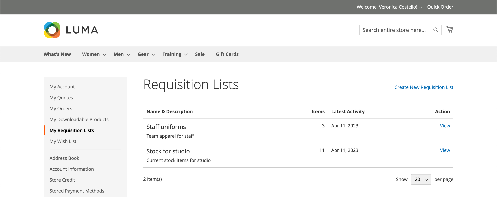

# [!UICONTROL My Requisition Lists]

Det främsta skälet till att upprätthålla en rekvisitionslista är att det är enkelt att ändra ordning på produkterna. Auktoriserade kunder kan enkelt ordna om artiklar från en rekvisitionslista genom att lägga dem i kundvagnen och flytta eller kopiera artiklar från en lista till en annan.

{width="700" zoomable="yes"}

## Öppna en rekvisitionslista

1. Kunden väljer **[!UICONTROL My Requisition Lists]** från sin kontouppsättning.

1. Söker efter den rekvisitionslista som de vill öppna och klickar på **[!UICONTROL View]** och gör något av följande:

### Lägg produkter i kundvagnen

1. Kunden gör något av följande för att välja de produkter som ska läggas till:

   - Markerar kryssrutan för varje objekt.
   - Klicka på **[!UICONTROL Select All]**.

1. Anger **[!UICONTROL Qty]** som ska läggas till i kundvagnen.

1. Så här ändrar du produktalternativ:

   - Klicka på ikonen _Redigera_ () i radobjektet.
   - Ändrar de alternativ som är nödvändiga.
   - Klicka på **[!UICONTROL Update Requisition List]**.

1. Klicka på **[!UICONTROL Add to Cart]**.

   {width="700" zoomable="yes"}

### Kopiera objekt till en annan lista

1. Kunden markerar kryssrutan för varje objekt som ska flyttas.

1. Klicka på **[!UICONTROL Copy Selected]** och gör något av följande:

   - Väljer en befintlig rekvisitionslista.
   - Klicka på **[!UICONTROL Create New Requisition List]**.

### Exportera en lista

1. Kunden öppnar den rekvisitionslista som ska exporteras.

1. Klicka på länken **[!UICONTROL Export]**.

Adobe Commerce genererar och hämtar en CSV-lista med `sku`- och `qty`-värden.

### Flytta objekt till en annan lista

1. Kunden markerar kryssrutan för varje objekt som ska flyttas.

1. Klicka på **[!UICONTROL Move Selected]** och gör något av följande:

   - Väljer en befintlig rekvisitionslista.
   - Klicka på **[!UICONTROL Create New Requisition List]**.

### Skriva ut en lista

1. I listans övre högra hörn klickar kunden på **[!UICONTROL Print]**.

1. Verifierar utdataenheten och klickar på **[!UICONTROL Print]**.

   {width="500" zoomable="yes"}

### Redigera produktalternativ

Kunden gör följande för att redigera produktalternativ i listan:

1. Klicka på ikonen _Penna_ () för att öppna produktsidan.

1. Ändrar de alternativ som är nödvändiga.

1. Klicka på **[!UICONTROL Update Requisition List]**.

   {width="700" zoomable="yes"}

En produkt i rekvisitionslistan kan redigeras när:

- Produkten har **[!UICONTROL all options set]** (när den är en [konfigurerad produkt](../catalog/product-create-configurable.md) i rekvisitionslistan).

  Produkten är **[!UICONTROL added to this Requisition List]**.

- Produkten är [en enkel produkt med alternativ](../catalog/settings-advanced-custom-options.md)

- Det är tillåtet att redigera för produkttypen.

### Ta bort objekt

1. Kunden markerar kryssrutan för varje objekt som ska tas bort.

1. Klicka på **[!UICONTROL Remove Selected]**.

1. När du uppmanas att bekräfta klickar du på **[!UICONTROL Delete]**.

### Byta namn på en lista

1. Efter listtiteln klickar kunden på **[!UICONTROL Rename]**.

1. Anger en annan **[!UICONTROL Requisition List Name]**.

1. Klicka på **[!UICONTROL Save]**.

   {width="300"}

### Ta bort en rekvisitionslista

1. Kunden öppnar rekvisitionslistan som ska tas bort.

1. Klicka på **[!UICONTROL Delete Requisition List]**.

1. När du uppmanas att bekräfta klickar du på **[!UICONTROL Delete]**.

>[!NOTE]
>
>Det går inte att ångra den här åtgärden.

## Åtgärder

| Åtgärd | Beskrivning |
|--- |--- |
| [!UICONTROL Rename] | Ger dig möjlighet att byta namn på rekvisitionslistan och uppdatera beskrivningen. |
| [!UICONTROL Export] | Exporterar rekvisitionslistan till en CSV-fil. |
| [!UICONTROL Print] | Skriver ut den aktuella rekvisitionslistan. |
| [!UICONTROL Select] | Hanterar de objektmarkeringar som ska bli föremål för en åtgärd.  **[!UICONTROL Select All]**- Markerar alla objekt i rekvisitionslistan. **[!UICONTROL Remove Selected]** - Tar bort alla markerade objekt från rekvisitionslistan.  **[!UICONTROL Copy Selected]**- Kopierar alla markerade objekt till en annan rekvisitionslista. |
| [!UICONTROL Add to Cart] | Lägger till valda artiklar i kundvagnen. |
| [!UICONTROL Update List] | Omberäknar delsumman så att den återspeglar en ändring i kvantitet. |
| [!UICONTROL Delete Requisition List] | Tar bort rekvisitionslistan från företagets användarkonto. |

{style="table-layout:auto"}
