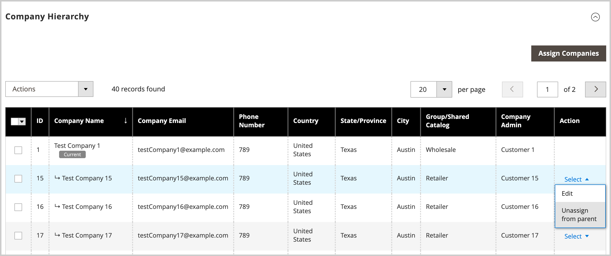

# Hantera [!UICONTROL Company Hierarchy]

[!BADGE 1.5.0-beta]{type=Informative url="/help/b2b/release-notes.md" tooltip="Endast tillgängligt för Beta programdeltagare"}

Administratörer kan skapa en [!UICONTROL Company Hierarchy] genom att tilldela relaterade företag till ett utsett överordnat företag, som är företaget överst i organisationen. Om [!UICONTROL Company Type] är `Company` är företaget inte en del av en organisation och är kvalificerat att bli ett överordnat företag, eller att tilldelas ett befintligt överordnat företag.

I Admin hanterar du företagstilldelningar genom att redigera ett företag och sedan uppdatera [!UICONTROL Company Hierarchy]-konfigurationen för att tilldela eller ta bort företagstilldelningar.

{width="700"}

>[!NOTE]
>
>Mer information om stödrastret [!UICONTROL Company Hierarchy] finns i [Fältbeskrivningar för företagshierarki](account-company-create.md#company-hierarchy).

## Tilldela företag till en organisation

1. Navigera till **[!UICONTROL Customers]** > **[!UICONTROL Companies]** från sidofältet _Admin_.

   {width="700" zoomable="yes"}

1. Öppna företagsinformationssidan i rutnätet [!UICONTROL Companies] för att skapa tilldelningarna.

   - Om du vill tilldela ytterligare företag till ett befintligt överordnat företag väljer du åtgärden **[!UICONTROL Edit]** för det överordnade företaget.
   - Om du vill skapa ett överordnat företag väljer du åtgärden **[!UICONTROL Edit]** för det företag som ska anges som överordnat.

     Du kan inte skapa ett överordnat företag från ett befintligt överordnat eller underordnat företag.

1. Expandera **[!UICONTROL Company Hierarchy]** på företagsinformationssidan.

   {width="700" zoomable="yes"}

   I rutnätet visas befintliga företagstilldelningar, om sådana finns. Det överordnade företaget placeras alltid överst i rutnätet [!UICONTROL Company Hierarchy]. Flaggan `[!UICONTROL Current]` anger vilket företag som redigeras.

1. Lägg till företag i den överordnade organisationen.

   - Välj från en lista över tillgängliga företag genom att välja **[!UICONTROL Assign Companies]**.

   - **Markera alla på den här sidan** eller välj ett eller flera specifika företagsposter.

   - Välj **[!UICONTROL Assign Selected Companies]**.

   - Slutför företagstilldelningen genom att välja **[!UICONTROL Assign]**.

     {width="675" zoomable="yes"}

## Ta bort tilldelning från ett moderföretag

1. Navigera till **[!UICONTROL Customers]** > **[!UICONTROL Companies]** på sidofältet _Admin_.

   {width="700" zoomable="yes"}

1. Öppna företagsinformationssidan för det överordnade företaget i rutnätet [!UICONTROL Companies] genom att välja **[!UICONTROL Edit]**.

1. Visa listan över tilldelade företag genom att expandera **[!UICONTROL Company Hierarchy]**.

1. I stödrastret [!UICONTROL Company Hierarchy] tar du bort tilldelningen av ett företag med hjälp av åtgärdskontrollen **[!UICONTROL Select]** och väljer **[!UICONTROL Unassign from parent]**.

   {width="700" zoomable="yes"}

1. När du uppmanas till det tar du bort det tilldelade företaget från hierarkin genom att välja **[!UICONTROL Unassign]**.
