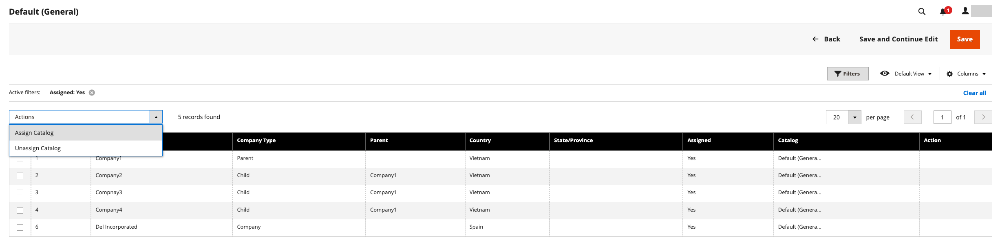

# Tilldela företag till en delad katalog

Det finns två sätt att tilldela ett företag till en delad katalog. Du kan göra tilldelningen från stödrastret _[!UICONTROL Shared Catalogs]_eller redigera företaget och tilldela den delade katalogen på samma sätt som du väljer en kundgrupp.

{width="700" zoomable="yes"}

## Metod 1: Tilldela företag från den delade katalogen

1. Gå till **[!UICONTROL Catalog]** > **[!UICONTROL Shared Catalogs]** på sidofältet _Admin_.

1. För den delade katalogen i rutnätet där du vill tilldela ett företag går du till kolumnen **[!UICONTROL Action]** och väljer **[!UICONTROL Assign Companies]**.

   Listan över tillgängliga företag visas i rutnätet.

1. Välj det företag som du vill tilldela den delade katalogen, klicka på menyn **[!UICONTROL Actions]** och välj **[!UICONTROL Assign Catalog]**.

   {width="700" zoomable="yes"}

   Du kan också klicka på **[!UICONTROL Assign]** i kolumnen **[!UICONTROL Action]** för ett företag som inte är tilldelat katalogen.

1. Upprepa för varje företag som du vill tilldela den delade katalogen.

   Företaget tilldelas den delade katalogen.

1. Klicka på **[!UICONTROL Save]** när du är klar.

## Metod 2: Redigera företaget

1. Gå till **[!UICONTROL Customers]** > **[!UICONTROL Companies]** på sidofältet _Admin_.

1. För det företag som visas i rutnätet går du till kolumnen **[!UICONTROL Action]** och klickar på **[!UICONTROL Edit]**.

   {width="700" zoomable="yes"}

1. Bläddra nedåt och expandera  i avsnittet **[!UICONTROL Advanced Settings]** på företagssidan.

1. Ange **[!UICONTROL Customer Group]** till lämplig delad katalog.

   Om du ändrar den delade katalogtilldelningen ändras även kundgruppstilldelningen för alla företagsmedlemmar.

   {width="600"}

1. När du uppmanas att bekräfta klickar du på **[!UICONTROL Proceed]** och sedan **[!UICONTROL Save]**.
