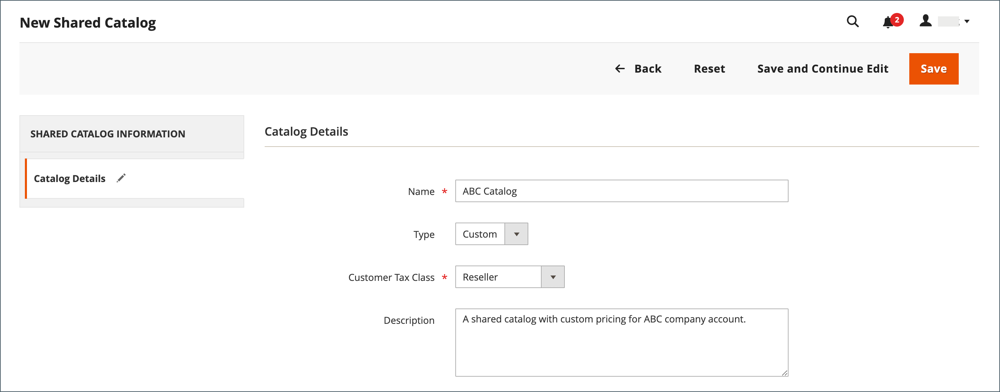

# Skapa en delad katalog

När en [delad katalog](catalog-shared.md) skapas skapas automatiskt en [kundgrupp](account-company-customer-group.md) med samma namn. Om du till exempel skapar en delad katalog med namnet _ABC-katalog_ skapas även en motsvarande _ABC-kataloggrupp_. Att tilldela ett företag till den delade anpassade katalogen är i stort sett detsamma som att tilldela dem till en kundgrupp.

En ny delad katalog innehåller inte produkter, specialpriser eller företagsassociationer. En offentlig katalog, som är standardkatalogen som skapas när delade kataloger är aktiverade, tilldelas automatiskt till gäster och kunder som inte är associerade med ett företag.

{width="700" zoomable="yes"}

Följande aspekter av en delad katalog måste konfigureras innan den kan användas:

- Katalogomfång
- Produktval
- Anpassade priser
- Företagstilldelning

## Prisområde

Om du har en multisiteinstallation måste du konfigurera prisomfattningen innan du skapar dina delade kataloger. Prisomfattningen [för ](../catalog/catalog-price-scope.md) kan anges till `Global` eller `Website`. Den kan dock bara ställas in i början av installationsprocessen. Webbplatsväljaren visas under steg 2 i [konfigurationen för delad katalog](catalog-shared-pricing-structure.md).

{width="600" zoomable="yes"}

1. Gå till **[!UICONTROL Stores]** > _[!UICONTROL Settings]_>**[!UICONTROL Configuration]**på sidofältet_ Admin _.

1. Expandera **Katalog** i den vänstra panelen och välj **Katalog** under.

1. Expandera  i avsnittet **Pris**.

1. Ange **katalogprisomfånget** till `Website`.

   {width="600" zoomable="yes"}

1. Klicka på **[!UICONTROL Save Config]**.

## Steg 1: Skapa den delade katalogen

Det finns två sätt att skapa en delad katalog. Du kan skapa en delad katalog av någon typ eller duplicera en befintlig delad katalog. En ny delad katalog innehåller inga produkter och har ännu inte tilldelats något företag.

### Metod 1: Lägg till en ny delad katalog

1. Gå till **[!UICONTROL Catalog]** > **[!UICONTROL Shared Catalogs]** på sidofältet _Admin_.

1. Klicka på **[!UICONTROL Add Shared Catalog]** i det övre högra hörnet och gör följande:

   - Ange **[!UICONTROL Name]** för den delade katalogen.

     Det namn du tilldelar används i hela Admin- och kundkontrollpanelen, om tillämpligt, för att referera till den delade katalogen. Det blir också namnet på motsvarande kundgrupp.

   - Välj **[!UICONTROL Type]** : `Custom` eller `Public`.

   - Välj lämplig **[!UICONTROL Customer Tax Class]** som gäller för köp som görs från den delade katalogen.

     Mer information om inställning och definition av momsklass finns i [Skatteklasser](../stores-purchase/tax-class.md).

     I följande exempel visas en ny anpassad katalog för en viss grossistkund.

     {width="600" zoomable="yes"}

   - Ange **[!UICONTROL Description]**

1. Klicka på **[!UICONTROL Save]** när du är klar.

   Den nya katalogen visas i rutnätet _[!UICONTROL Shared Catalogs]_.

### Metod 2: Duplicera en befintlig delad katalog

En dubblett av en anpassad katalog behåller prismodellen och strukturen för den ursprungliga katalogen, men inte företagsorganisationerna. En motsvarande kundgrupp skapas också med samma namn som den duplicerade katalogen. Som standard får den ursprungliga katalogen namnet _Duplicera_ för en dubblettkatalog.

Om en offentlig delad katalog dupliceras, ändras typen för den duplicerade katalogen till `custom`.

1. Gå till **[!UICONTROL Catalog]** > **[!UICONTROL Shared Catalogs]** på sidofältet _Admin_.

1. För den delade katalogen i rutnätet som du vill duplicera går du till kolumnen **[!UICONTROL Action]** och väljer **[!UICONTROL General Settings]**.

1. Klicka på **[!UICONTROL Duplicate]** i alternativen längst upp på sidan.

   {width="600" zoomable="yes"}

1. Uppdatera följande fält för den nya katalogen:

   - **[!UICONTROL Name]**
   - **[!UICONTROL Type]**
   - **[!UICONTROL Customer Tax Class]**
   - **[!UICONTROL Description]**

1. Klicka på **[!UICONTROL Save]** när du är klar.

   Dupliceringen visas i rutnätet _[!UICONTROL Shared Catalogs]_med ett unikt ID.

## Steg 2: Slutför installationen

När du har skapat en ny delad katalog måste den konfigureras med rätt produktval, [företagstilldelningar](catalog-shared-assign-companies.md) och [kategoribehörigheter](../catalog/category-permissions.md). Mer information finns i [Ange priser och struktur](catalog-shared-pricing-structure.md).

>[!NOTE]
>
>**[B2B version 1.3.0](release-notes.md#b2b-v130) och senare** - När du skapar en delad katalog anges varje [kategoribehörighet](../catalog/category-permissions.md) för katalogen till _[!UICONTROL Allow for the Display Product Prices]_och_[!UICONTROL Add to Cart]_ för kundgrupper som tilldelas den här åtkomsten i katalogens behörighetsinställningar. Tidigare var de här inställningarna automatiskt inställda på `Deny` även när katalogbehörigheter var inställda på `Allow`.

## Demo av delad katalog

Titta på den här videon om du vill se en demonstration av hantering av delade kataloger:

>[!VIDEO](https://video.tv.adobe.com/v/344446?quality=12&learn=on)

## Referens för sida med delad katalog

### Knappfält

| Knapp | Beskrivning |
|--- |--- |
| [!UICONTROL Back] | Återgår till sidan Delade kataloger utan att spara den nya delade katalogen. |
| [!UICONTROL Reset] | Rensar formen på ändringar som inte har sparats och återställer den ursprungliga katalogdetaljinformationen. |
| [!UICONTROL Save and Continue Edit] | Sparar alla ändringar och låter formuläret vara öppet i redigeringsläge. |
| [!UICONTROL Save] | Sparar ändringar, stänger formuläret och återgår till sidan Delade kataloger. |

{style="table-layout:auto"}

### Kataloginformation

| Fält | Beskrivning |
|--- |--- |
| [!UICONTROL Name] | Identifierar den delade katalogen i hela administratören och i kundkontona där den är tillgänglig. Katalognamnet ska vara beskrivande och högst 32 tecken långt. Du kan inte ha två delade kataloger med samma namn. Maximalt antal tecken: 32 |
| [!UICONTROL Type] | **[!UICONTROL Custom]** - Identifierar en katalog med anpassade priser som bara är tillgänglig för de specifika företag som den är tilldelad till. **[!UICONTROL Public]**- Identifierar den delade katalogen som är tillgänglig för alla gästbesökare och inloggade kunder som inte är associerade med ett företag. En offentlig standardkatalog skapas när [!DNL Adobe Commerce B2B] installeras, men måste konfigureras av en butiksadministratör. Det får bara finnas en offentlig delad katalog åt gången. |
| [!UICONTROL Customer Tax Class] | Bestämmer den momsklass som används för inköp som görs från katalogen. Alternativen omfattar alla tillgängliga momsklasser. |
| [!UICONTROL Description] | En kort förklaring av hur katalogen ska användas. |

{style="table-layout:auto"}

### Stödrasterkolumner

| Fält | Beskrivning |
|--- |--- |
| [!UICONTROL ID] | En unik numerisk identifierare som tilldelas den delade katalogentiteten. |
| [!UICONTROL Name] | Namnet på den delade katalogen. |
| [!UICONTROL Type] | Anger typen av delad katalog. Kan vara `Public` eller `Custom`. |
| [!UICONTROL Created At] | Det datum då den delade katalogen skapades i systemet. |
| [!UICONTROL Created By] | Namnet på den administratörsanvändare som skapade en delad katalog. |
| [!UICONTROL Action] | Listan med åtgärder. Alternativ: `Set Pricing and Structure`, `Assign Companies`, `General Settings`, `Delete`. |

{style="table-layout:auto"}
