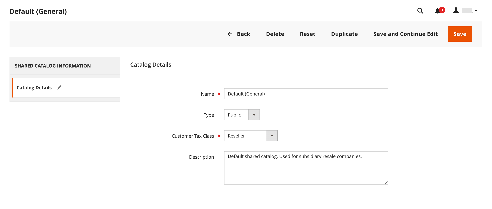

# Hantera dina delade kataloger

Sidan _[!UICONTROL Shared Catalogs]_ger tillgång till de verktyg som behövs för att hantera dina delade kataloger. Sidan liknar standardarbetsytan för administratörer med filter och åtgärdskontroller. I rutnätet visas alla delade kataloger, inklusive den gemensamma standardkatalogen och eventuella egna kataloger som du har konfigurerat.

## Uppdatera produktvalet

Det är enkelt att uppdatera urvalet av produkter i alla delade kataloger från kolumnen _[!UICONTROL Action]_i stödrastret för delade kataloger. De ändringar du gör är synliga för medlemmar i associerade företagskonton. Processen är i princip densamma som att välja produkter för en ny [katalogstruktur](catalog-shared-pricing-structure.md), förutom att konfigurationens omfattning inte kan ändras.

1. Gå till **[!UICONTROL Catalog]** > **[!UICONTROL Shared Catalogs]** på sidofältet _Admin_.

1. För den delade katalogen i rutnätet går du till kolumnen **[!UICONTROL Action]** och väljer **[!UICONTROL Set Pricing and Structure]**.

   {width="700" zoomable="yes"}

1. Följ instruktionerna i [Steg 2: Välj produkter](catalog-shared-pricing-structure.md#step-2-choose-the-products).

   Du kan hoppa över det första objektet eftersom omfånget för en delad katalog inte kan ändras när den har sparats för första gången.

Om du arbetar med en viss produkt listas alla delade kataloger där produkten är tillgänglig i avsnittet _[!UICONTROL Products In Shared Catalog]_. Mer information finns i [Lägga till produkter i en delad katalog](catalog-shared-product-add.md).

{width="600" zoomable="yes"}

## Uppdatera anpassade priser

De anpassade priserna för produkter i alla delade kataloger kan enkelt uppdateras från åtgärdskolumnen i rutnätet för delade kataloger. De ändringar du gör är synliga i butiken för medlemmar i det associerade företaget eller kundgruppen. Processen är i princip densamma som att ange anpassade priser för en ny [delad katalog](catalog-shared-pricing-structure.md), förutom att konfigurationens omfattning inte kan ändras.

1. Gå till **[!UICONTROL Catalog]** > **[!UICONTROL Shared Catalogs]** på sidofältet _Admin_.

1. För den delade katalogen i rutnätet som du vill uppdatera går du till kolumnen **[!UICONTROL Action]** och väljer **[!UICONTROL Set Pricing and Structure]**.

1. Klicka på **[!UICONTROL Configure]** på sidan _[!UICONTROL Catalog Structure]_och gör något av följande:

   - Klicka på **[!UICONTROL Pricing]** i förloppsindikatorn överst på sidan.
   - Klicka på **[!UICONTROL Next]** i det övre högra hörnet.

1. Följ instruktionerna i [Steg 3: Ange anpassade priser](catalog-shared-pricing-structure.md#step-3-set-custom-prices).

## Uppdatera kategoribehörigheter

[Kategoribehörigheter](../catalog/category-permissions.md) anges automatiskt till `Allow` för produkter som läggs till från kategoriträdet till en delad katalog. Du kan senare justera behörigheterna eller skapa ytterligare regler efter behov.

>[!NOTE]
>
>**[B2B version 1.3.0](release-notes.md#b2b-v130) och senare** - När du skapar en delad katalog anges varje [kategoribehörighet](../catalog/category-permissions.md) för katalogen till `Allow` för _[!UICONTROL Display Product Prices]_och_[!UICONTROL Add to Cart]_ för kundgrupper som tilldelats den här åtkomsten i katalogens behörighetsinställningar. Tidigare var de här inställningarna automatiskt inställda på `Deny` även när katalogbehörigheter var inställda på `Allow`.

>[!IMPORTANT]
>
>Alla befintliga [gruppbehörighetsinställningar](../configuration-reference/catalog/catalog.md#category-permissions) ignoreras av **_alla_** kategorier i katalogen när funktionen **_[!UICONTROL Shared Catalog]_** är aktiverad. [!UICONTROL Shared Catalog] styr alla kategoribehörigheter i katalogen när den är aktiverad.

1. Gå till **[!UICONTROL Catalog]** > **[!UICONTROL Categories]** på sidofältet _Admin_.

1. Välj kategorin för de produkter som du vill uppdatera i kategoriträdet.

   Om du vill inkludera alla produkter väljer du den översta kategorin i trädet.

1. Bläddra nedåt och utöka  i avsnittet **[!UICONTROL Category Permissions]**.

1. Klicka på **[!UICONTROL New Permission]** och gör följande:

   {width="600" zoomable="yes"}

   - Välj den **[!UICONTROL Customer Group]** som motsvarar den delade katalogen och ändra behörighetsinställningarna efter behov.

     {width="600" zoomable="yes"}

   - Om du vill skapa en behörighetsregel för en annan kundgrupp klickar du på **[!UICONTROL New Permissions]** och upprepar processen.

   - Om du vill ta bort en behörighetsregel klickar du på ikonen _Ta bort_  .

1. Klicka på **[!UICONTROL Save]** när du är klar.

## Uppdatera kataloginformationen

Detaljinformationen i alla delade kataloger kan enkelt uppdateras från åtgärdskolumnen i rutnätet för delade kataloger. De ändringar du gör återspeglas i alla associerade företagskonton.

{width="700" zoomable="yes"}

1. Gå till **[!UICONTROL Catalog]** > **[!UICONTROL Shared Catalogs]** på sidofältet _Admin_.

1. För den delade katalog som du vill uppdatera går du till kolumnen **[!UICONTROL Action]** och väljer **[!UICONTROL General Settings]**.

   {width="600" zoomable="yes"}

1. Uppdatera kataloginformationen efter behov.

   - Om du ändrar namnet på en delad katalog ändras även namnet på motsvarande kundgrupp.
   - Om du ändrar katalogtypen från `Custom` till `Public` konverteras den befintliga offentliga katalogen till en anpassad katalog. Alla företag som är associerade med den ursprungliga offentliga katalogen tilldelas om till ersättningen. En offentlig katalog kan inte konverteras till en anpassad katalog.

1. Klicka på **[!UICONTROL Save]** när du är klar.

## Referens för sida med delad katalog

### Knappfält

| Knapp | Beskrivning |
|--- |--- |
| [!UICONTROL Back] | Återgår till sidan Delade kataloger utan att spara den nya delade katalogen. |
| [!UICONTROL Delete] | Tar bort katalogen och tilldelar eventuella associerade företag och deras medlemmar till den offentliga delade katalogen. |
| [!UICONTROL Reset] | Rensar formen på ändringar som inte har sparats och återställer den ursprungliga katalogdetaljinformationen. |
| [!UICONTROL Duplicate] | Skapar en [kopia av katalogen](catalog-shared-create.md). För en anpassad katalog är prismodellen och strukturen för originalet, men utan företagsorganisationerna. Om en offentlig delad katalog dupliceras, ändras typen för den duplicerade katalogen till `custom`. En motsvarande kundgrupp skapas också med samma namn som den duplicerade katalogen. Som standard får den ursprungliga katalogen namnet _Duplicera_ för en dubblettkatalog. |
| [!UICONTROL Save and Continue Edit] | Sparar alla ändringar och låter formuläret vara öppet i redigeringsläge. |
| [!UICONTROL Save] | Sparar ändringar, stänger formuläret och återgår till sidan Delade kataloger. |

{style="table-layout:auto"}

### Kataloginformation

| Fält | Beskrivning |
|--- |--- |
| [!UICONTROL Name] | Identifierar den delade katalogen i hela administratören och i kundkontona där den är tillgänglig. Katalognamnet ska vara beskrivande och högst 32 tecken långt. Du kan inte ha två delade kataloger med samma namn. Maximalt antal tecken: 32 |
| [!UICONTROL Type] | **[!UICONTROL Custom]** - Identifierar en katalog med anpassade priser som bara är tillgänglig för de specifika företag som den är tilldelad till. **[!UICONTROL Public]**- Identifierar den delade katalogen som är tillgänglig för alla gästbesökare och inloggade kunder som inte är associerade med ett företag. En offentlig standardkatalog skapas när Adobe Commerce B2B installeras, men måste konfigureras av administratören. Det får bara finnas en offentlig delad katalog åt gången. |
| [!UICONTROL Customer Tax Class] | Bestämmer den momsklass som används för inköp som görs från katalogen. Alternativen omfattar alla tillgängliga momsklasser. |
| [!UICONTROL Description] | En kort förklaring av hur katalogen ska användas. |

{style="table-layout:auto"}
