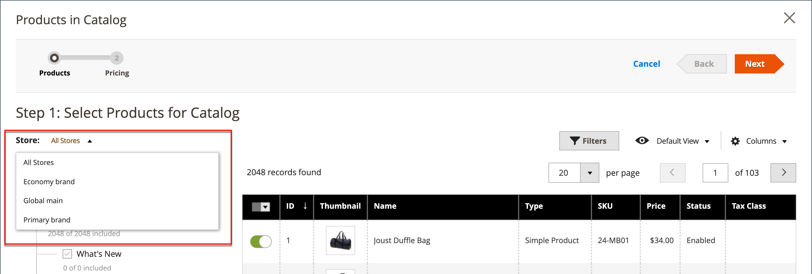

# Ange priser och struktur för delade kataloger

Att konfigurera priser och struktur för en delad katalog är en tvåstegsprocess. Den aktuella platsen i processen markeras med en siffra i förloppsindikatorn högst upp på sidan. Du kan när som helst visa det andra steget i processen genom att klicka på förloppsindikatorn. Om du till exempel arbetar med anpassade priser kan du behöva gå tillbaka till produktvalssidan för referens. Klicka bara **[!UICONTROL Products]** i förloppsindikatorn överst på sidan och klicka sedan på **[!UICONTROL Pricing]** för att återgå till sidan med anpassade priser. Ditt arbete går inte förlorat i den här processen.

{width="700" zoomable="yes"}

I standardkategoriträdet är rotkategorin den översta behållaren och kallas för _Standardkategori_ i exempeldata. När delade kataloger är aktiverade har kategoriträdet en yttre behållare som kallas _Rotkatalog_. Rotkatalogen omfattar alla andra kategoristrukturer som finns i systemet. Mer information finns i [Katalogomfång](../catalog/introduction.md#catalog-scope).

## Steg 1: Öppna den delade katalogprissättningen och strukturkonfigurationen

1. På _Administratör_ sidebar, gå till **[!UICONTROL Catalog]** > **[!UICONTROL Shared Catalogs]**

1. För den delade katalogen i rutnätet går du till _[!UICONTROL Action]_kolumn och klicka **[!UICONTROL Set Pricing and Structure]**.

   {width="700" zoomable="yes"}

1. Första gången som den delade katalogen konfigureras klickar du på **[!UICONTROL Configure]** om du vill fortsätta med följande steg.

## Steg 2: Välj produkter

Det första steget i processen är att välja de produkter som du vill inkludera i den delade katalogen. Sidan där du väljer produkt innehåller [kategoriträd](../catalog/category-create.md) till vänster och ett synkroniserat produktrutnät till höger. Om du klickar på en kategori i trädet visas produkterna i kategorin i rutnätet.

Endast kategorier med valda produkter visas i [navigering överst](../catalog/navigation-top.md) när den delade katalogen visas från butiken. Som standard inkluderas bara de tre första kategorinivåerna i butiksnavigeringen, inte rotkategorin.

1. Använd **Butik** välj för att ange [omfång](../catalog/introduction.md#product-scope) av konfigurationen.

   Konfigurationens omfång kan bara anges innan den delade katalogen sparas för första gången. Om du senare redigerar produktvalet är inte Store-väljaren tillgänglig.

   {width="600" zoomable="yes"}

1. Gör något av följande i kategoriträdet:

   - Om du vill inkludera alla produkter klickar du **[!UICONTROL Select all]** eller markera kryssrutan för den överordnade kategorin.
   - Om du vill ta med specifika produktkategorier markerar du kryssrutan för varje kategori som du vill ta med.
   - Om du vill inkludera eller exkludera en enskild produkt markerar eller avmarkerar du produktkryssrutan.

   Kommentaren under varje kategori i trädet visar antalet produkter i kategorin som för närvarande ingår i den delade katalogen. Kommentaren under [rotkategori](../catalog/category-root.md) visar det totala antalet produkter från alla kategorier som är markerade för den delade katalogen.

1. Om du vill visa kategoriprodukter i rutnätet klickar du på namnet på kategorin i trädet. När en kategori är markerad händer följande:

   - Växlingsknappen i stödrastrets första kolumn är inställd på grön _På_ position för varje vald produkt.
   - Om en produkt har tilldelats flera kategorier och inte har valts i någon av dem, är den tillgänglig genom de andra kategorierna, och även när du använder [katalogsökning](../catalog/search.md).
   - Systemet ställer in automatiskt [Kategoribehörigheter](../catalog/category-permissions.md) till `Allow` för de valda produkterna.

1. Om det behövs kan du använda filtren och andra rutnätskontroller för att hitta de produkter som du vill inkludera i den delade katalogen.

   Du kan välja eller utesluta enskilda produkter genom att klicka på växlingsknappen i den första kolumnen.

   Om du väljer en kategori som inte har några produkter, men är länkad till CMS-innehåll eller en extern länk, visas den i den översta navigeringen i butiken.

   De kategoriinställningar du gör registreras inte permanent i databasen förrän konfigurationen sparas. De sparas dock tillfälligt medan du arbetar med strukturen och prissättningen.

1. Klicka på **[!UICONTROL Next]**.

   {width="600" zoomable="yes"}

## Steg 3: Ange anpassade priser

Du kan ange anpassade priser för varje enskild produkt eller använda _[!UICONTROL Action]_kontroll för att ange anpassade priser som ett fast belopp eller en procentandel för flera produktposter.

- **[!UICONTROL Fixed]**: Anger det slutliga produktpriset. Om du till exempel anger ett fast pris på $10.00, är priset i butiken för motsvarande företag $10.00.

  >[!NOTE]
  >
  >Det minsta värdet mellan baspriset och det angivna fasta värdet används som slutproduktspris.

  >[!NOTE]
  >
  >**_Fast pris_** de anpassningsbara alternativen är _not_ påverkas av reglerna för grupppris, pris, specialpris eller katalogpris.

- **[!UICONTROL Percentage]**: Fastställer det anpassade priset baserat på rabatten i procent. Om du till exempel vill erbjuda en rabatt på 10 procent anger du den anpassade pristypen till `Percentage` och ange `10`. Det rabatterade anpassade priset är 90 % av det ursprungliga produktpriset.

Använd kommandot _[!UICONTROL Custom Price]_kolumn i rutnätet:

- [Enkel](../catalog/product-create-simple.md) (inklusive konfigurerbara produktvariationer)
- [Paket](../catalog/product-create-bundle.md)
- [Nedladdningsbar](../catalog/product-create-downloadable.md)
- [Virtuell](../catalog/product-create-virtual.md)

Kolumnen Anpassat pris är tom för [konfigurerbar](../catalog/product-create-configurable.md) och [grupperad](../catalog/product-create-grouped.md) produkttyper och för [presentkort](../catalog/product-gift-card-create.md).

Det går inte att ändra valet av produkter i rutnätet från _Anpassade priser_ sida. Du kan dock använda förloppsindikatorn längst upp på sidan för att gå tillbaka till föregående steg och ändra valet av produkter.

{width="600" zoomable="yes"}

### Använd ett anpassat pris

1. För installation på flera platser anger du **[!UICONTROL Website]** på den webbplats där de anpassade priserna gäller.

   {width="600" zoomable="yes"}

1. Använd någon av följande metoder för att välja de produkter där det anpassade priset ska gälla.

   - Använd kategoriträdet för att välja alla produkter i en viss kategori.
   - Ange _[!UICONTROL Mass Actions]_kontroll i sidhuvudet till `Select All`.
   - Markera kryssrutan för enskilda produkter.

   Rutnätet visar produkterna i de valda kategorierna och du kan använda standardkontrollerna för att hitta produkter och filtrera listan.

   {width="600" zoomable="yes"}

1. Ange **[!UICONTROL Actions]** till något av följande:

   - `Set Discount` - Använder en rabattprocent på alla valda produkter. Varje påverkat produktpris visas som **_diskonterad_** pris.
   - `Adjust Fixed Price` - Använder en fast prisrabatt i procent på alla valda produkter. Varje påverkat produktpris visas som **_justerad_** pris.

   {width="600" zoomable="yes"}

1. Ange rabatt eller prisjustering och klicka på **[!UICONTROL Apply]**.

   {width="400"} 

   {width="400"}

   Rabatten gäller alla valda produkter och _Anpassat pris_ -kolumnen återspeglar typen av rabatt och tillämpat belopp.

   {width="600" zoomable="yes"}

### Använd ett skiktpris

[Nivåpriser](../catalog/product-price-tier.md) Med kan du erbjuda en mängdrabatt för produkter i den delade katalogen. The _Pris_ kolumnen i rutnätet innehåller en länk till _Avancerade priser_ alternativ som gäller specifikt för den delade katalogen. Om produkten redan innehåller skiktprissättning visas antalet befintliga skikt inom parentes efter länken.

Följande instruktioner visar hur du tillämpar nivåpriser på en enskild produkt. Om du vill tillämpa nivåpriser på flera produkter, se [Importera nivåpriser](../systems/data-import-price-tier.md).

1. För produkten i rutnätet går du till _Pris_ kolumn och klicka **[!UICONTROL Configure]**.

   {width="600" zoomable="yes"}

1. På _Avancerade priser_ sida, klicka **[!UICONTROL Add Price]** och gör följande:

   {width="600" zoomable="yes"}

   - Ange **[!UICONTROL Website]** på webbplatsen där skiktpriset gäller.
   - Ange den kvantitet av produkten som måste köpas för att få rabatten.
   - Ange **[!UICONTROL Price]** till någon av följande rabattyper:
      - `Fixed`
      - `Discount`
   - Ange rabattbeloppet.
   - Om du vill ange ett annat skikt klickar du på **Lägg till pris** och upprepa processen för att definiera nästa skikt.

   {width="600" zoomable="yes"}

1. När du är klar klickar du på **[!UICONTROL Done]**.

   I rutnätet visas antalet lager inom parentes i _[!UICONTROL Tier Price]_kolumn.

   {width="600" zoomable="yes"}

## Spara struktur och prissättning

När de anpassade priserna är klara klickar du på **[!UICONTROL Generate Catalog]** sedan **[!UICONTROL Save]**.

Den delade katalogen sparas nu i databasen. Namnet visas i dialogrutan _[!UICONTROL Shared Catalog]_kolumn i_[!UICONTROL Products]_ rutnät. Nästa steg är att [tilldela en delad katalog till ett företag](./catalog-shared-assign-companies.md).
