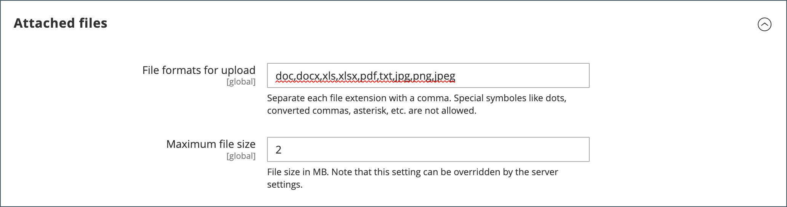

# Konfigurera offerter

Om citattecken är aktiverade i de allmänna [B2B-funktionerna](enable-basic-features.md) kan du konfigurera stöd för citattecken i Admin. Offertkonfigurationen avgör den minsta ordermängd som krävs för offertförfrågningar, offertens livstid och vilka filformat som stöds för bifogade filer.

>[!NOTE]
>
>Offertkonfigurationsalternativ och möjligheten att använda offertförhandlingsfunktioner styrs med [rollresurserna](../systems/permissions-user-roles.md#role-resources). Dessa rollresurser måste väljas för den administratörsanvändarroll som tilldelas administratörsanvändarkontot. Om du vill ge åtkomst till offertfunktioner i Admin går du till **[!UICONTROL System]** > _[!UICONTROL Permissions]_>**[!UICONTROL User Roles]**, markerar rollen och navigerar till [!UICONTROL Sales] > [!UICONTROL Operations] > [!UICONTROL Quotes] i trädet_ Rollresurser _.

1. Gå till **[!UICONTROL Stores]** > _[!UICONTROL Settings]_>**[!UICONTROL Configuration]**på sidofältet_ Admin _.

1. Expandera **[!UICONTROL Sales]** i den vänstra panelen och välj **[!UICONTROL Quotes]**.

1. Expandera  i avsnittet **[!UICONTROL General]** och gör följande:

   {width="700" zoomable="yes"}

   Se [Citattecken](../configuration-reference/sales/quotes.md) i _konfigurationsreferensen_ för en fullständig lista över alternativ för citattecken och deras funktioner.

   - Ange **[!UICONTROL Minimum Amount]** i kundvagnen som måste uppfyllas innan en anbudsförfrågan kan skickas.

   - För **[!UICONTROL Minimum Amount Message]** anger du det meddelande som du vill ska visas när kundvagnssumman inte uppfyller minimibeloppet.

   - För **[!UICONTROL Default Expiration Period]** anger du det antal **[!UICONTROL days]**, **[!UICONTROL weeks]** eller **[!UICONTROL months]** som en offert ska förbli giltig.

1. Expandera  i avsnittet **[!UICONTROL Attached files]** och gör följande:

   - För **[!UICONTROL File formats for upload]** anger du suffixet för varje filtyp som du stöder för filer som är kopplade till en offert.

     Ange varje filsuffix med gemener och avgränsade med kommatecken.

     Som standard stöds följande format: `doc`, `docx`, `xls`, `xlsx`, `pdf`, `txt`, `jpg`, `png` och `jpeg`

   - För **[!UICONTROL Maximum file size]** anger du den maximala storleken för en bifogad fil i MB.

     Värdet som du anger kan åsidosättas av serverinställningen.

     {width="600" zoomable="yes"}

1. Klicka på **[!UICONTROL Save Config]** när du är klar.
