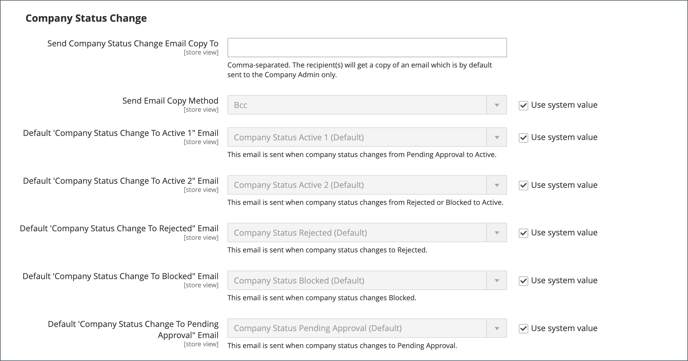
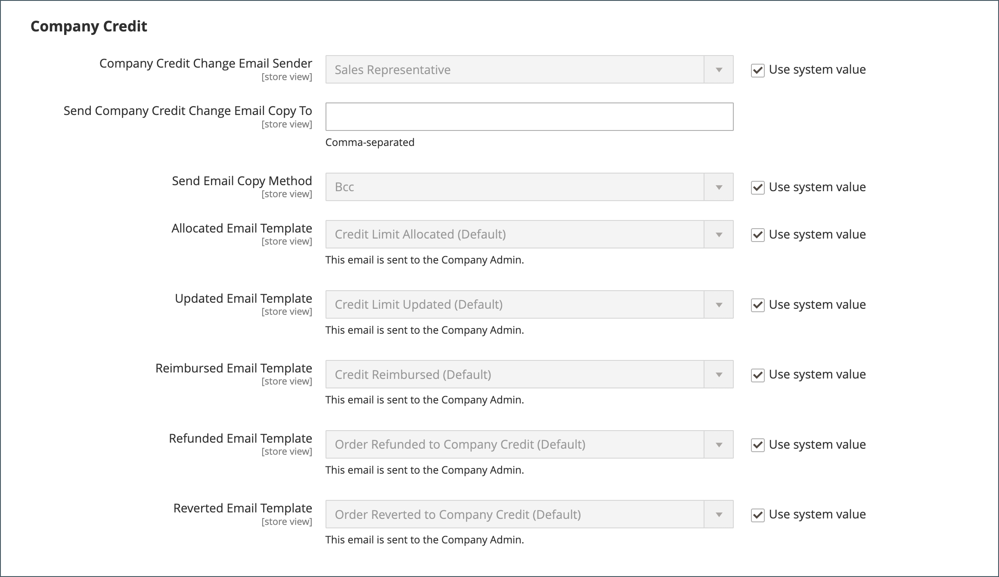

# Konfigurera e-postalternativ för företag

The [säljare](account-company-manage.md) som har tilldelats som primär kontakt för ett företag konfigureras som standard som avsändare av många automatiska e-postmeddelanden som skickas till företaget.

1. På _Administratör_ sidebar, gå till **[!UICONTROL Stores]** > _[!UICONTROL Settings]_>**[!UICONTROL Configuration]**.

1. Expandera på den vänstra panelen **[!UICONTROL Customers]** och välja **[!UICONTROL Company Configuration]**.

1. Ange vid behov **[!UICONTROL Store View]** till butiksvyn för att definiera [omfång](../getting-started/websites-stores-views.md#scope-settings) av konfigurationen.

1. Slutför **[!UICONTROL Company Registration]** avsnitt:

   >[!NOTE]
   >
   >Rensa **[!UICONTROL Use system value]** för att göra fältet redigerbart.

   - Ange **[!UICONTROL Company Registration Email Recipient]** till [butikskontakt](../getting-started/store-details.md#store-email-addresses) som ska meddelas när en ny registreringsbegäran tas emot.

   - I **[!UICONTROL Send Company Registration Email Copy To]** anger du e-postadressen till varje person som ska få en kopia av registreringsmeddelandet. Avgränsa flera e-postadresser med komma.

   - Ange hur kopian av meddelandet ska skickas **[!UICONTROL Send Email Copy Method]** till något av följande:

      - `Bcc` - Skickar en _blankt text_ genom att inkludera mottagaren i rubriken för samma e-postmeddelande som skickas till kunden. Mottagaren av hemlig kopia är inte synlig för kunden.
      - `Separate Email` - Skickar kopian som ett separat e-postmeddelande.

   - Om du har förberett en e-postmall som ska användas i stället för standardmallen anger du **[!UICONTROL Default Company Registration Email]** till mallens namn. Som standard är `Company Registration Request` -mallen används.

     {width="600" zoomable="yes"}

1. Slutför **[!UICONTROL Customer-Related Emails]** avsnitt:

   Om du har förberett alternativa e-postmallar som ska användas i stället för standardvärdena, väljer du den mall som du vill använda för följande:

   - **[!UICONTROL Default 'Sales Rep Assigned' Email]**
   - **[!UICONTROL Default 'Assign Company to Customer' Email]**
   - **[!UICONTROL Default 'Assign Company Admin' Email]**
   - **[!UICONTROL Default 'Company Admin Inactive' Email]**
   - **[!UICONTROL Default 'Company Admin Changed to Member' Email]**
   - **[!UICONTROL Default 'Customer Status Active' Email]**
   - **[!UICONTROL Default 'Customer Status Inactive' Email]**

   {width="600" zoomable="yes"}

1. Slutför **[!UICONTROL Company Status Change]** avsnitt:

   - Ange **[!UICONTROL Company Status Change for Email Recipient]** till [butikskontakt](../getting-started/store-details.md#store-email-addresses) som ska meddelas när status för ett företag ändras.

   - I **[!UICONTROL Send Company Status Change Email Copy To]** anger du e-postadressen till varje person som ska få en kopia av meddelandet om statusändring. Avgränsa flera e-postadresser med komma.

   - Ange hur kopian av meddelandet ska skickas **[!UICONTROL Send Email Copy Method]** till något av följande:

      - `Bcc` - Skickar en _blankt text_ genom att inkludera mottagaren i rubriken för samma e-postmeddelande som skickas till kunden. Mottagaren av hemlig kopia är inte synlig för kunden.
      - `Separate Email` - Skickar kopian som ett separat e-postmeddelande.

   - Om du har en förberedd e-postmall som ska användas i stället för standardmallen när företagsstatusen ändras från `Pending Approval` till `Active`, ange **[!UICONTROL Default 'Company Status Change to Active 1' Email]** till den mallen. Som standard är `Company Status Active 1` -mallen används.

   - Om du har en förberedd e-postmall som ska användas i stället för standardmallen när företagsstatusen ändras från `Rejected` eller `Blocked` till `Active`, ange **[!UICONTROL Default 'Company Status Change to Active 2' Email]** till den mallen. Som standard är `Company Status Active 2` -mallen används.

   - Om du har en förberedd e-postmall som ska användas i stället för standardmallen när företagsstatusen ändras till `Rejected`, ange **[!UICONTROL Default 'Company Status Change to Rejected' Email]** till den mallen. Som standard är `Company Status Rejected` -mallen används.

   - Om du har en förberedd e-postmall som ska användas i stället för standardmallen när företagsstatusen ändras till `Blocked`, ange **[!UICONTROL Default 'Company Status Change to Blocked' Email]** till den mallen. Som standard är `Company Status Blocked` -mallen används.

   - Om du har en förberedd e-postmall som ska användas i stället för standardmallen när företagsstatusen ändras till `Pending Approval`, ange **[!UICONTROL Default 'Company Status Change to Pending Approval' Email]** till den mallen. Som standard är `Company Status Pending Approval` -mallen används.

     {width="600" zoomable="yes"}

1. Slutför **[!UICONTROL Company Credit Emails]** avsnitt:

   - Ange **[!UICONTROL Company Credit Change Email Sender]** till [butikskontakt](../getting-started/store-details.md#store-email-addresses) som ska meddelas när en ändring görs av kreditgränsen som tilldelas ett företag. Som standard skickas meddelandet till _Säljare_.

   - I **[!UICONTROL Send Company Credit Change Email Copy To]** Ange e-postadressen till varje person som ska få en kopia av meddelandet om kreditändring. Avgränsa flera e-postadresser med komma.

   - Ange hur kopian av meddelandet ska skickas **[!UICONTROL Send Email Copy Method]** till något av följande:

      - `Bcc` - Skickar en _blankt text_ genom att inkludera mottagaren i rubriken för samma e-postmeddelande som skickas till kunden. Mottagaren av hemlig kopia är inte synlig för kunden.
      - `Separate Email` - Skickar kopian som ett separat e-postmeddelande.

   - Om du har förberett e-postmallar som ska användas i stället för standardvärdena, väljer du mallen för vart och ett av följande meddelanden som skickas till företagsadministratören.

      - **[!UICONTROL Allocated Email Template]**
      - **[!UICONTROL Updated Email Template]**
      - **[!UICONTROL Reimbursed Email Template]**
      - **[!UICONTROL Refunded Email Template]**
      - **[!UICONTROL Reverted Email Template]**

   {width="600" zoomable="yes"}

1. När du är klar klickar du på **[!UICONTROL Save Config]**.
