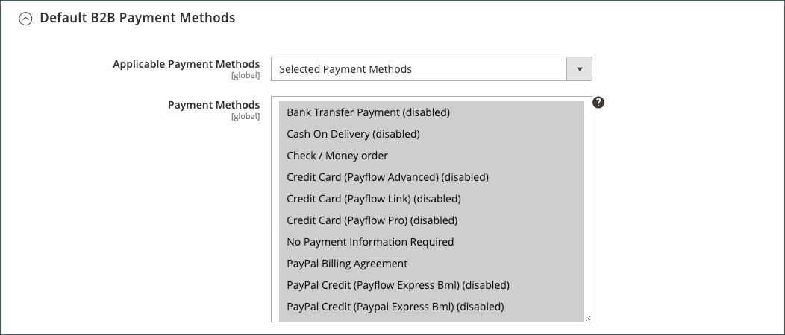

# Aktivera B2B-funktioner

Som standard är alla B2B-funktioner inaktiverade från början. En butiksadministratör kan aktivera eller inaktivera B2B-funktionerna efter behov för Commerce butiker. En fullständig lista över B2B-konfigurationsinställningar finns i [Konfigurationsreferens för B2B-funktioner](../configuration-reference/general/b2b-features.md).

När du aktiverar stöd för kundföretag aktiveras ytterligare B2B-funktioner automatiskt:

- [[!DNL Shared Catalog]](catalog-shared.md)

  Stöder anpassad priskonfiguration för olika företag och aktiverar även kategoribehörigheter för alla butiker.

- [!DNL Enable Shared Catalog direct products price assigning]

  Förbättrar webbplatsens prestanda genom att endast produkter som har tilldelats en delad katalog lagras i prisindexet. Att aktivera den här funktionen är en bra metod för Merchants som har många delade kataloger att hantera anpassade priser för olika företag.

- [[!DNL B2B Quotes]](quotes.md)

  Ger säljare och företagsköpare möjlighet att förhandla om priser.

- [!DNL B2B default payment and shipping methods]

  Fastställer valet av betalnings- och leveransalternativ som är tillgängliga för B2B-köpare i butiken.

Konfigurationsinställningarna för de här funktionerna visas bara när [!DNL Enable Company] är inställt på `Yes`.

Funktionerna B2B [[!DNL Quick Order]](quick-order.md) och [[!DNL Requisition List]](requisition-lists.md) kan aktiveras och inaktiveras oberoende av varandra.

## Konfigurera B2B-funktioner

Alternativen för att konfigurera Adobe Commerce B2B-funktioner är bara tillgängliga i Commerce-projekt som har [Adobe Commerce B2B-tillägget installerat](install.md).

1. Gå till **[!UICONTROL Stores]** > _[!UICONTROL Settings]_>**[!UICONTROL Configuration]**&#x200B;på sidofältet_ Admin _.

   Om du har en installation med flera platser anger du kontrollen **[!UICONTROL Store View]** i det övre vänstra hörnet på webbplatsen där konfigurationen gäller.

1. Välj **[!UICONTROL B2B Features]** i den vänstra panelen under _[!UICONTROL General]_:

   {width="600"}

   - Tillåt kunder att hantera sina egna företagskonton och aktivera stöd för ytterligare B2B-funktioner genom att ange **[!UICONTROL Enable Company]** till `Yes`.

     När du aktiverar företagsstöd aktiveras automatiskt metoderna för delad katalog, B2B-offert, B2B-betalning och B2B-leverans.

     {width="600"}

   - Om du vill att kunder och gäster snabbt ska kunna göra beställningar baserat på SKU eller produktnamn anger du **[!UICONTROL Enable Quick Order]** till `Yes`.

   - Om du vill att kunderna ska kunna skapa och hantera rekvisitionslistor från sin kontokontrollpanel anger du **[!UICONTROL Enable Requisition List]** till `Yes`.

     Du kan också [konfigurera maximalt antal listor](configure-requisition-lists.md) som en kund kan ha för sitt konto.

1. Klicka på **[!UICONTROL Save Config]** när du är klar.

## Konfigurera standardmetoder för B2B-betalning och -leverans

1. Expandera  i avsnittet **[!UICONTROL Default B2B Payment Methods]**.

1. Om du vill ange standardbetalningsmetoder för B2B-order anger du **[!UICONTROL Applicable Payment Methods]** till något av följande:

   - `All Payment Methods`

   - `Selected Payment Methods`

     För det specifika alternativet väljer du den **[!UICONTROL Payment Methods]** som du vill göra tillgänglig för dina kunder genom att hålla ned Ctrl-tangenten (PC) eller Kommando-tangenten (Mac) när du klickar på varje alternativ.

   Listan över [betalningsmetoder](../configuration-reference/sales/payment-methods.md) visar vilka alternativ som är aktiverade eller inaktiverade i din butik. Förutom standardbetalningsmetoderna innehåller listan även följande:

   - Ingen betalningsinformation krävs
   - [Betalning à conto](#configure-payment-on-account)
   - Lagrade konton
   - Lagrade kort

   {width="600"}

1. Expandera  i avsnittet **[!UICONTROL Default B2B Shipping Methods]**.

1. Om du vill ange standardleveransmetoder för B2B-beställningar anger du **[!UICONTROL Applicable Shipping Methods]** till något av följande:

   - `All Shipping Methods`
   - `Selected Shipping Methods`

     För det specifika alternativet väljer du den **[!UICONTROL Shipping Methods]** som du vill göra tillgänglig för dina kunder genom att hålla ned Ctrl-tangenten (PC) eller Kommando-tangenten (Mac) när du klickar på varje alternativ.

     Listan över leveransmetoder visar vilka som för närvarande är [aktiverade eller inaktiverade](../configuration-reference/sales/delivery-methods.md).

   {width="600"}

1. Klicka på **[!UICONTROL Save Config]** när du är klar.

## Konfigurera e-postalternativ för företag

Den [säljare](account-company-manage.md#assign-a-sales-representative) som är tilldelad som primär kontakt för ett företag är som standard konfigurerad som avsändare av många automatiska e-postmeddelanden som skickas till företaget.

1. Gå till **[!UICONTROL Stores]** > _[!UICONTROL Settings]_>**[!UICONTROL Configuration]**&#x200B;på sidofältet_ Admin _.

1. Expandera **[!UICONTROL Customers]** i den vänstra panelen och välj **[!UICONTROL Company Configuration]**.

1. Om det behövs anger du **[!UICONTROL Store View]** i butiksvyn för att definiera [scopet](../getting-started/websites-stores-views.md#scope-settings) för konfigurationen.

1. Slutför avsnittet **[!UICONTROL Company Registration]**:

   >[!NOTE]
   >
   >Avmarkera kryssrutan **[!UICONTROL Use system value]** för att göra fältet redigerbart.

   - Ange **[!UICONTROL Company Registration Email Recipient]** till [butikskontakten](../getting-started/store-details.md#store-email-addresses) som ska meddelas när en ny företagsregistreringsbegäran tas emot.

   - För **[!UICONTROL Send Company Registration Email Copy To]** anger du e-postadressen till varje person som ska få en kopia av registreringsmeddelandet. Avgränsa flera e-postadresser med komma.

   - Ange **Skicka e-postkopia** till något av följande för att avgöra hur kopian av meddelandet ska skickas:

      - `Bcc` - Skickar en _kopia med blindhet_ genom att inkludera mottagaren i huvudet i samma e-postmeddelande som skickas till kunden. Mottagaren av hemlig kopia är inte synlig för kunden.
      - `Separate Email` - Skickar kopian som ett separat e-postmeddelande.

   - Om du har förberett en e-postmall som ska användas i stället för standardmallen anger du **[!UICONTROL Default Company Registration Email]** till mallens namn. Som standard används mallen `Company Registration Request`.

     {width="600"}

1. Slutför avsnittet **[!UICONTROL Customer-Related Emails]**:

   Om du har förberett alternativa e-postmallar som ska användas i stället för standardvärdena, väljer du den mall som du vill använda för följande:

   - **[!UICONTROL Default 'Sales Rep Assigned' Email]**
   - **[!UICONTROL Default 'Assign Company to Customer' Email]**
   - **[!UICONTROL Default 'Assign Company Admin' Email]**
   - **[!UICONTROL Default 'Company Admin Inactive' Email]**
   - **[!UICONTROL Default 'Company Admin Changed to Member' Email]**
   - **[!UICONTROL Default 'Customer Status Active' Email]**
   - **[!UICONTROL Default 'Customer Status Inactive' Email]**

   {width="600"}

1. Slutför avsnittet **[!UICONTROL Company Status Change]**:

   - För **[!UICONTROL Send Company Status Change Email Copy To]** anger du e-postadressen till varje person som ska få en kopia av meddelandet om statusändring. Avgränsa flera e-postadresser med komma.

   - Ange **Skicka e-postkopia** till något av följande för att avgöra hur kopian av meddelandet ska skickas:

      - `Bcc` - Skickar en _kopia med blindhet_ genom att inkludera mottagaren i huvudet i samma e-postmeddelande som skickas till kunden. Mottagaren av hemlig kopia är inte synlig för kunden.
      - `Separate Email` - Skickar kopian som ett separat e-postmeddelande.

   - Om du har förberett en e-postmall som ska användas när företagsstatusen ändras från `Pending Approval` till `Active`, anger du **[!UICONTROL Default 'Company Status Change to Active 1' Email]** som mallens namn. Som standard används mallen `Company Status Active 1`.

   - Om du har förberett en e-postmall som ska användas när företagsstatusen ändras från `Rejected` eller `Blocked` till `Active` anger du **[!UICONTROL Default 'Company Status Change to Active 2' Email]** till mallens namn. Som standard används mallen `Company Status Active 2`.

   - Om du har förberett en e-postmall som ska användas när företagsstatusen ändras till `Rejected` anger du **[!UICONTROL Default 'Company Status Change to Rejected' Email]** till mallens namn. Som standard används mallen `Company Status Rejected`.

   - Om du har förberett en e-postmall som ska användas när företagsstatusen ändras till `Blocked` anger du **[!UICONTROL Default 'Company Status Change to Blocked' Email]** till mallens namn. Som standard används mallen `Company Status Blocked`.

   - Om du har förberett en e-postmall som ska användas när företagsstatusen ändras till `Pending Approval` anger du **[!UICONTROL Default 'Company Status Change to Pending Approval' Email]** till mallens namn. Som standard används mallen `Company Status Pending Approval`.

   {width="600"}

1. Slutför avsnittet **[!UICONTROL Company Credit Emails]**:

   - Ange **[!UICONTROL Company Credit Change Email Sender]** till [butikskontakten](../getting-started/store-details.md#store-email-addresses) som ska meddelas när en ändring görs av kreditgränsen som har tilldelats ett företag. Som standard skickas meddelandet till _Säljare_.

   - För **[!UICONTROL Send Company Credit Change Email Copy To]** anger du e-postadressen till varje person som ska få en kopia av meddelandet om kreditändring. Avgränsa flera e-postadresser med komma.

   - Ange **Skicka e-postkopia** till något av följande för att avgöra hur kopian av meddelandet ska skickas:

      - `Bcc` - Skickar en _kopia med blindhet_ genom att inkludera mottagaren i huvudet i samma e-postmeddelande som skickas till kunden. Mottagaren av hemlig kopia är inte synlig för kunden.
      - `Separate Email` - Skickar kopian som ett separat e-postmeddelande.

   - Om du har förberett e-postmallar som ska användas i stället för standardvärdena, väljer du mallen för vart och ett av följande meddelanden som skickas till företagsadministratören.

      - **[!UICONTROL Allocated Email Template]**
      - **[!UICONTROL Updated Email Template]**
      - **[!UICONTROL Reimbursed Email Template]**
      - **[!UICONTROL Refunded Email Template]**
      - **[!UICONTROL Reverted Email Template]**

   {width="600"}

1. Klicka på **[!UICONTROL Save Config]** när du är klar.

## Konfigurera ordergodkännande

Möjligheten att spåra orderbehandling och inköpsorder ger företagsadministratörer kontroll över hur företagets köpare agerar. Funktionen för ordergodkännande är tillgänglig när funktionen för inköpsorder aktiveras av en butiksadministratör.

1. Gå till **[!UICONTROL Stores]** > _[!UICONTROL Settings]_>**[!UICONTROL Configuration]**&#x200B;på sidofältet_ Admin _.

1. Expandera **[!UICONTROL General]** i den vänstra panelen och välj **[!UICONTROL B2B Features]**.

1. Expandera  i avsnittet **[!UICONTROL Order Approval Configuration]**.

   {width="600"}

1. Om du vill tillåta företag att skapa egna inköpsorder anger du **[!UICONTROL Enable Purchase Orders]** till `Yes`.

1. Klicka på **[!UICONTROL Save Config]** när du är klar.

   Funktionen för inköpsorder är aktiverad på webbplatsnivå. Om du vill aktivera den här typen av beställning för ett företag gör du samma sak med lämpliga inställningar i varje [företagsprofil](account-company-manage.md).

## Konfigurera inköpsorder

1. Gå till **[!UICONTROL Customers]** > **[!UICONTROL Companies]** på sidofältet _Admin_.

1. Hitta företaget i listan och klicka på **[!UICONTROL Edit]**.

1. Expandera  i avsnittet **[!UICONTROL Advanced Settings]**.

1. Ange **[!UICONTROL Enable Purchase Orders]** till `Yes`.

1. Klicka på **[!UICONTROL Save]** när du är klar.

Efter aktiveringen visas avsnittet **[!UICONTROL Approval Rules]** på [kontokontrollpanelen](../customers/account-dashboard.md) i butiken för en företagsadministratör.

>[!NOTE]
>
>Åtkomst till inköpsorder i butiken måste beviljas av företagsadministratören baserat på [användarrollsbehörigheter](account-company-roles-permissions.md) för företag.

## Konfigurera betalning a conto

Betalning på konto är en offlinebetalningsmetod som gör att företag kan göra köp upp till den kreditgräns som anges i deras profil. Betalning på konto kan aktiveras globalt, eller per företag, och visas endast vid utcheckning om det är aktiverat. När _Betalning på konto_ används som betalningsmetod visas ett meddelande högst upp i ordern som anger kontots status. Mer information om hur du konfigurerar den här betalningsmetoden för ett visst företag finns i [Hantera företagskonton](account-company-manage.md).

>[!NOTE]
>
>Betalning på konto stöds inte för order med [flera leveransadresser](../stores-purchase/shipping-settings.md#multiple-addresses) och visas inte bland betalningsalternativen för dessa order.

Så här aktiverar du Betalning på konto för din butik:

1. Gå till **[!UICONTROL Stores]** > _[!UICONTROL Settings]_>**[!UICONTROL Configuration]**&#x200B;på sidofältet_ Admin _.

1. Expandera **[!UICONTROL Sales]** i den vänstra panelen och välj **[!UICONTROL Payment Methods]**.

1. Expandera  i avsnittet **[!UICONTROL Payment on Account]**.

   {width="600"}

   >[!NOTE]
   >
   >Om det behövs avmarkerar du kryssrutan **[!UICONTROL Use system value]** för att ändra inställningarna.

1. Ange **[!UICONTROL Enabled]** till `Yes` om du vill tillåta kontobetalning.

1. Ange en **[!UICONTROL Title]** som identifierar betalningsmetoden under utcheckningen, eller så kan du acceptera standardtiteln `Payment on Account`.

1. Om beställningarna vanligtvis väntar på godkännande ska du godkänna standardvärdet **[!UICONTROL New Order Status]** som `Pending` tills det godkänns.

   Om du vill kan du använda statusen `Processing` eller `Suspected Fraud` för nya order med den här betalningsmetoden.

1. Ange **[!UICONTROL Payment from Applicable Countries]** till något av följande:

   - `All Allowed Countries` - Kunder från alla [länder](../getting-started/store-details.md#country-options) som anges i din butikskonfiguration kan använda den här betalningsmetoden.
   - `Specific Countries` - När du har valt det här alternativet visas listan _[!UICONTROL Payment from Specific Countries]_. Om du vill markera flera länder håller du ned Ctrl (PC) eller Kommando (Mac) och klickar på varje alternativ.

1. Ange **[!UICONTROL Minimum Order Total]** och **[!UICONTROL Maximum Order Total]** till de orderbelopp som krävs för att kvalificera dig för den här betalningsmetoden.

   >[!NOTE]
   >
   >En order kvalificerar om summan faller mellan, eller exakt matchar, minimi- eller maximivärdena för totalvärdet.

1. Ange ett **[!UICONTROL Sort Order]**-tal som anger positionen för det här objektet i listan över betalningsmetoder som visas vid utcheckning.

   Värdet är relativt till de andra betalningsmetoderna. (`0` = först, `1` = sekund, `2` = tredje o.s.v.)

1. Klicka på **[!UICONTROL Save Config]** när du är klar.
