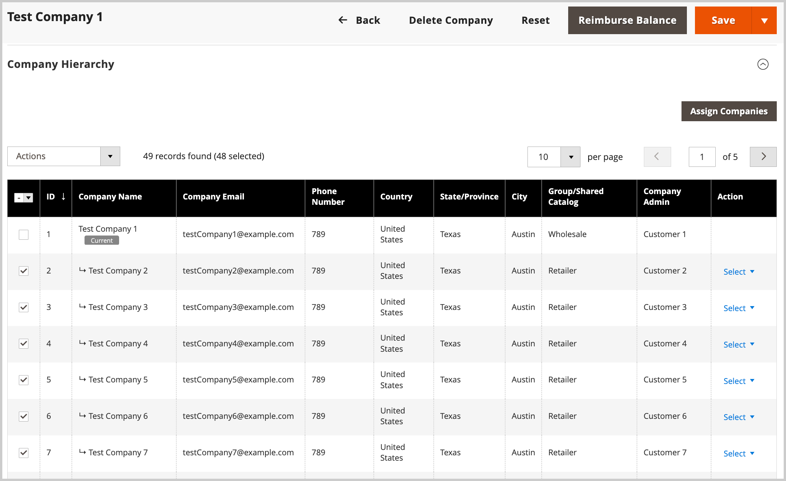
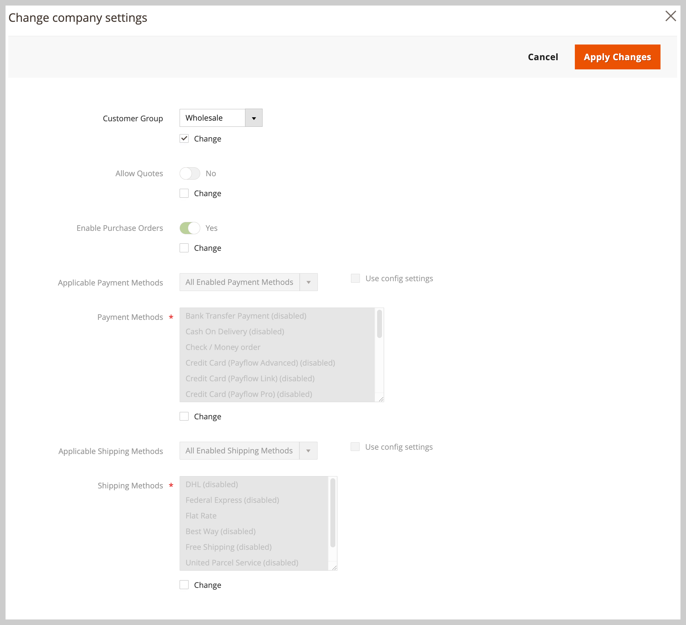

# Hantera [!UICONTROL Company Hierarchy]

Administratörer kan skapa en [!UICONTROL Company Hierarchy] genom att tilldela relaterade företag till ett utsett överordnat företag, som är företaget överst i organisationshierarkin.

Skapa ett överordnat företag från Admin genom att redigera ett enskilt företag (`[!UICONTROL Company Type] = Company`) och tilldela relaterade företag i konfigurationen [!UICONTROL Company Hierarchy].

{width="700"}

>[!NOTE]
>
>Mer information om stödrastret [!UICONTROL Company Hierarchy] finns i [Fältbeskrivningar för företagshierarki](account-company-create.md#company-hierarchy).

Hantera företagstilldelningar genom att redigera ett överordnat företag och använda stödrastret *[!UICONTROL Company Hierarchy]* för att lägga till eller ta bort företag. Använd kontrollen *[!UICONTROL Actions]* för att hantera konfigurationen för [avancerade inställningar](#change-company-settings) för företag i organisationen.

## Tilldela företag till ett moderföretag

1. Navigera till **[!UICONTROL Customers]** > **[!UICONTROL Companies]** på sidofältet _Admin_.

   {width="700" zoomable="yes"}

1. Öppna företagsinformationssidan från stödrastret [!UICONTROL Companies] för att skapa tilldelningarna.

   - Om du vill tilldela ytterligare företag till ett befintligt överordnat företag väljer du åtgärden **[!UICONTROL Edit]** för det överordnade företaget.
   - Om du vill skapa ett överordnat företag väljer du åtgärden **[!UICONTROL Edit]** för det företag som har angetts som överordnat.

     Du kan inte skapa ett nytt överordnat företag från ett befintligt överordnat eller underordnat företag.

1. Expandera **[!UICONTROL Company Hierarchy]** på sidan Företagsinformation och välj sedan **[!UICONTROL Assign Companies]**.

   {width="675" zoomable="yes"}

1. I listan över tillgängliga företag väljer du de företag som ska tilldelas och sedan **[!UICONTROL Assign Selected Companies]**.

   {width="675" zoomable="yes"}

1. Slutför företagstilldelningen genom att välja **[!UICONTROL Assign]** när du uppmanas till detta.

## Ta bort tilldelning från ett moderföretag

1. På sidan Företag öppnar du företagsinformationssidan för det överordnade företaget genom att välja åtgärden **[!UICONTROL Edit]**.

   {width="700" zoomable="yes"}

1. Visa listan över tilldelade företag genom att expandera **[!UICONTROL Company Hierarchy]**.

1. Ta bort företaget från organisationen.

   - I kolumnen [!UICONTROL Action] för företaget som ska tas bort, **[!UICONTROL Select]** > **[!UICONTROL Unassign from parent]**.

     {width="640" zoomable="yes"}

   - När du uppmanas till det tar du bort det tilldelade företaget från hierarkin genom att välja **[!UICONTROL Unassign]**.

## Hantera företagsinställningar för en organisation

Uppdatera konfigurationen för [Avancerade inställningar](account-company-create.md#advanced-settings) för en organisation om du vill tillämpa den överordnade konfigurationen på alla underordnade företag, eller om du vill använda samma inställningar för valda företag i organisationen.

Under uppdateringsprocessen används de ursprungliga konfigurationsvärdena som standard till de aktuella värden som konfigurerats för det överordnade företaget. Du måste ändra minst en inställning för att kunna uppdatera konfigurationen för valda företag.

**Ändra konfigurationen för avancerade inställningar för flera företag**

1. Navigera till **[!UICONTROL Customers]** > **[!UICONTROL Companies]** på sidofältet _Admin_.

1. I stödrastret [!UICONTROL Companies] redigerar du det överordnade företaget genom att välja **[!UICONTROL Edit]** i kolumnen **[!UICONTROL Action]**.

1. På detaljsidan för det överordnade företaget expanderar du avsnittet **[!UICONTROL Company Hierarchy]** för att visa företag som ingår i organisationen.

1. Välj de företag som ska konfigureras.

   {width="675" zoomable="yes"}

1. Välj **[!UICONTROL Change company settings]** i kontrollen **[!UICONTROL Actions]** ovanför stödrastret.

   {width="675" zoomable="yes"}

1. Ändra inställningskonfigurationen.

   - På sidan [!UICONTROL Change company settings] hittar du konfigurationsinställningen som du vill ändra.

   - Markera kryssrutan **[!UICONTROL Change]** om du vill aktivera inställningen.

   - Uppdatera värdet efter behov.

     {width="575" zoomable="yes"}

1. När du har uppdaterat konfigurationen väljer du **[!UICONTROL Apply Changes]**.

1. Välj **[!UICONTROL Change settings]** när du uppmanas att uppdatera konfigurationen för de valda företagen.

>[!TIP]
>
>Hantera den avancerade inställningskonfigurationen för ett enskilt företag genom att redigera företagsradartikeln.
