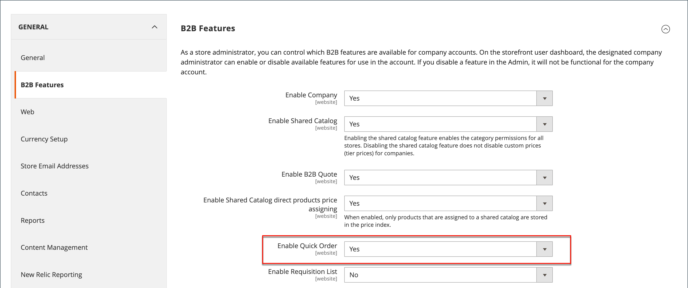
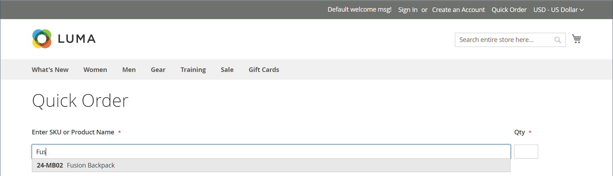

# Snabborder

Funktionen _Snabbbeställning_ minskar beställningsprocessen till flera klick för kunder som känner till produktnamnet eller SKU:n för de produkter de vill beställa. Beställningar med flera SKU:er kan anges manuellt eller importeras till formuläret Snabbordning. Snabbbeställning kan användas av kunder som är inloggade på sina konton och av gäster. När det här alternativet är aktiverat visas länken _Snabbordning_ högst upp på sidan, bredvid kundnamnet.

{width="700" zoomable="yes"}

## Aktivera snabbbeställningar för din butik

1. Gå till **[!UICONTROL Stores]** > _[!UICONTROL Settings]_>**[!UICONTROL Configuration]**&#x200B;på sidofältet_ Admin _.

1. Välj **[!UICONTROL B2B Features]** i avsnittet _[!UICONTROL General]_&#x200B;på den vänstra panelen.

1. Ange **[!UICONTROL Enable Quick Order]** till `Yes`.

   {width="600" zoomable="yes"}

1. Klicka på **[!UICONTROL Save Config]**.

1. Klicka på [Cachehantering](../systems/cache-management.md) när du uppmanas till detta och uppdatera eventuella ogiltiga cacheminnen.

## Snabborderarbetsflöden

Kunder kan ange produkter för snabbbeställningar på något av följande sätt.

### Metod 1: Ange enskilda produkter

1. Kunden klickar på länken **[!UICONTROL Quick Order]**.

1. Väljer produkt efter SKU eller produktnamn:

   Om du vill göra en **snabbbeställning av SKU** gör kunden följande:

   - Anger **[!UICONTROL SKU]**.

   - Klicka på **[!UICONTROL Add to List]**.

     SKU:n visas på inmatningsraden med produktinformationen nedan.

     {width="600" zoomable="yes"}

   Om du vill göra en **snabbbeställning efter produktnamnet** gör kunden följande:

   - Anger de första tecknen i **[!UICONTROL Product Name]**.

     >[!NOTE]
     >
     >Använd inte tangenten _Enter_ för att välja namnet på produkten.

   - När listan över möjliga matchningar visas klickar kunden på produkten som de vill beställa.

     {width="700" zoomable="yes"}

1. Anger **[!UICONTROL Qty]**.

1. Om du använder nästa inmatningsrad upprepas processen så många gånger som behövs.

1. Klicka på **[!UICONTROL Add to Cart]**.

### Metod 2: Ange flera produkter

1. I rutan **[!UICONTROL Enter Multiple SKUs]** gör kunden något av följande:

   - Ange en SKU per rad

   - Anger alla SKU:er på samma rad, avgränsade med kommatecken och utan mellanslag.

     {width="600" zoomable="yes"}

1. Klicka på **[!UICONTROL Add to List]** om du vill lägga till produkterna i listan.

1. Anger **[!UICONTROL Qty]** som ska ordnas för varje objekt i listan.

   {width="600" zoomable="yes"}

   >[!NOTE]
   >
   >Om produkten har de alternativ som krävs uppmanas kunden att välja alternativen. De kan vänta tills de når kundvagnen och lägga till produktalternativ.

   {width="600" zoomable="yes"}

### Metod 3: Överför en lista över produkter

1. Klicka på **[!UICONTROL Download Sample]** i avsnittet _[!UICONTROL Add from File]_&#x200B;för att hämta en ordermall.

   {width="600" zoomable="yes"}

1. Öppnar den hämtade filen.

1. Använder mallen för att lägga till SKU:er för produkten som ska överföras för snabborderlistan.

1. Klicka på **[!UICONTROL Save]** när du är klar.

   {width="400" zoomable="yes"}

1. Om du vill överföra filen klickar du på **[!UICONTROL Choose]** och väljer filen i systemet.

   Objekten läggs till i listan Snabbordning.

1. Klicka på **[!UICONTROL Add to Cart]** när du är klar.

När kunden har skapat den snabba beställningen kan de fortsätta till kassan som vanligt.

{width="700" zoomable="yes"}
