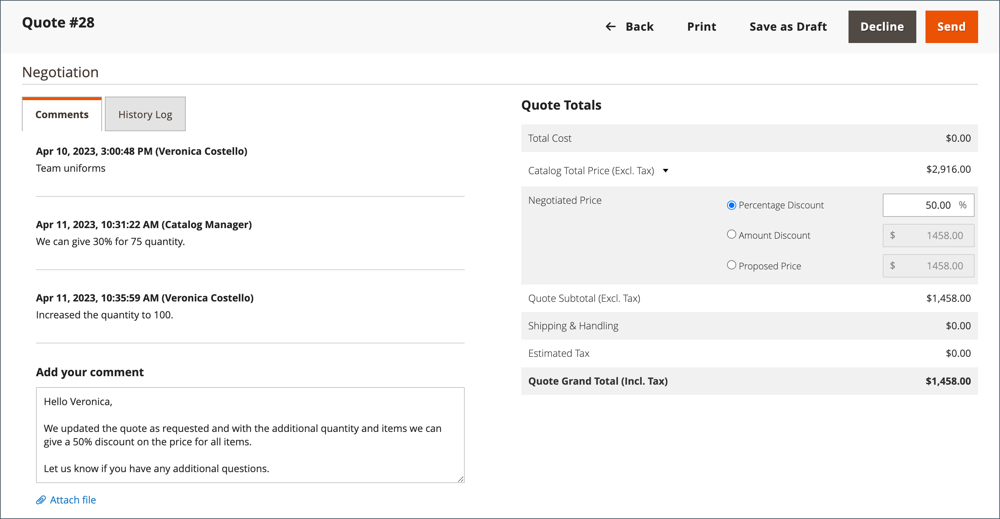

# Förhandla om en offert

Om [B2B-offerter är aktiverade](configure-quotes.md) i konfigurationen kan prisförhandling initieras av en auktoriserad köpare från ett företag eller en säljare.

Köparna initierar prisförhandlingsprocessen genom att [begära en offert](quote-request.md) från kundvagnen. Försäljningsrepresentanter kan initiera förhandlingar genom att [skapa ett utkast till offert för en köpare](sales-rep-initiates-quote.md), uppdatera offerten med de ursprungliga orderartiklarna och -priserna och skicka den till köparen.

När prisförhandlingen börjar visas citattecken i rutnätet [Offerter](quotes.md). Alla förhandlingar mellan köparen och säljaren äger rum via e-post och inleds och spåras utifrån offertens detaljvy.

Under förhandlingsprocessen kan säljaren göra följande från administratören:

- Lägg till eller ta bort produkter
- Ändra kvantiteten
- Tillämpa en rabatt på radobjekt eller på hela offerten
- Lägg till eller ändra leveranssätt
- Lägg till kommentarer
- Skicka den uppdaterade offerten till köparen eller spara som ett utkast

Köpare hanterar offertförhandlingsprocessen från butiken med [[!UICONTROL My Quotes]](account-dashboard-my-quotes.md). Medan offerten är öppen för granskning är dess status på köparens konto inställd på `Pending`. Köparen kan ändra och skicka offerten på nytt även om den har avvisats eller gått ut.

## Steg 1: Visa förfrågan

1. Gå till **[!UICONTROL Sales]** > **[!UICONTROL Quotes]** på sidlisten Admin.

   Den nya begäran visas i rutnätet _[!UICONTROL Quotes]_.

1. Klicka på **[!UICONTROL View]** i kolumnen _Åtgärder_.

   {width="700" zoomable="yes"}

## Steg 2: Ändra offerten

1. Klicka på ikonen _Kalender_ () under _[!UICONTROL Quote & Account Information]_.

   {width="575" zoomable="yes"}

1. Välj en **[!UICONTROL Expiration Date]** för offerten.

1. Bläddra ner till avsnittet _[!UICONTROL Quote Totals]_och uppdatera **[!UICONTROL Negotiated Price]**efter behov.

   {width="600" zoomable="yes"}

   Om köparen ändrar kvantiteten för någon artikel i offerten visas ett meddelande högst upp i offerten, vilket anger att listan över artiklar har ändrats, och det förhandlade priset måste uppdateras.

   {width="600" zoomable="yes"}

### Lägg till nya produkter i offerten

1. Klicka på **[!UICONTROL Add Products by SKU]**.

1. Ange **[!UICONTROL SKU]** och **[!UICONTROL Qty]** som ska läggas till.

   {width="600" zoomable="yes"}

### Tillämpa radobjektsuppdateringar

Tillämpa ändringar av radobjekt i avsnittet _[!UICONTROL Items Quoted]_om det behövs.

{width="600" zoomable="yes"}

- Ändra **[!UICONTROL Quantity]** som måste köpas till föreslaget pris.

- Välj **[!UICONTROL Configure]** och ändra produktalternativen.

  Alternativet [!UICONTROL Configure] är endast tillgängligt för ett radobjekt för en konfigurerbar produkt

- Välj en åtgärd på menyn **[!UICONTROL Action]** för att uppdatera objektet:
   - **Rabattartikel** för att tillämpa en rabatt i procent, fast belopp eller rekommenderat pris.
Du kan även låsa rabattbeloppet för att förhindra ytterligare rabatter. Om rabatten inte är låst
både radobjektrabatten och eventuell rabatt på offertnivå tillämpas på produktpriset.
   - **Lämna ett meddelande till köparen** för att ge köparen ytterligare information om ett objekt
   - **Ta bort** om du vill ta bort ett objekt från offerten.

### Tillämpa ändringar och uppdatera

- Klicka på **[!UICONTROL Add to Quote]** om du vill använda ändringarna.

- Klicka på **[!UICONTROL Recalculate the Quote]** om du vill uppdatera offerten.

- Om du vill tillämpa ändringarna och uppdatera offerten till den delade katalogen och prisreglerna klickar du på **[!UICONTROL Update Prices]** och sedan på **[!UICONTROL Proceed]** för att bekräfta uppdateringen.

  {width="600" zoomable="yes"}

### Uppdatera leveransinformation

1. Om köparen inkluderar en _leveransadress_ i offerten klickar du på **[!UICONTROL Get shipping methods and rates]**.

1. Välj en leveransmetod bland de tillgängliga alternativen.

1. Ange **[!UICONTROL Proposed Shipping Price]**.

   _[!UICONTROL Quote Totals]_har uppdaterats för att återspegla det föreslagna fraktpriset.

### Bifoga ett stöddokument

1. Under rutan _Lägg till din kommentar_ klickar du på **[!UICONTROL Attach file]**.

   Som standard kan [bifogade filer](../configuration-reference/sales/quotes.md) vara upp till 2 MB i följande filformat: DOC, DOCX, XLS, XLSX, PDF, TXT, JPG eller JPEG, PNG.

1. Välj filen från din katalog.

## Steg 3: Uppdatera information på offertnivå och skicka ditt svar

1. Ange ditt svar i avsnittet **[!UICONTROL Add your comment]** i avsnittet _[!UICONTROL Negotiation]_på fliken_[!UICONTROL Comments]_.

1. Om du vill inkludera ett stöddokument klickar du på **[!UICONTROL Attach file]** och väljer filen i din katalog.

   Den största tillåtna filstorleken för bilagor är 2 MB.

1. Så här tillämpar du en rabatt på offerten:

   - Välj någon av följande rabattyper under _[!UICONTROL Quote Totals]_i avsnittet_[!UICONTROL Negotiated Price]_:

      - `Percentage Discount`: En procentuell rabatt minskar det ursprungliga priset med en viss procentandel.
      - `Amount Discount`: En beloppsrabatt tillämpar en fast prissänkning.
      - `Proposed Price`: En föreslagen prisrabatt sätter slutpriset till ett visst belopp, oavsett det ursprungliga priset.

   - Ange beloppet som en procentandel eller ett fast pris.

     {width="600" zoomable="yes"}

   - Du kan tillämpa rabatter på varje radartikel eller offerten som helhet:

      - **Rabatter för radobjekt**: Rabatter för radobjekt tillämpas på enskilda artiklar i vagnen. Rabatten kan vara en `percentage`, en specifik `amount` eller en `proposed price`.
      - **Rabatter på kundvagnsnivå**: Rabatterna ges i kundvagnen. Rabatten kan vara antingen `percentage` eller en specifik `amount` och tillämpas på det totala kundvagnsvärdet.
      - **Kombination av kundvagn- och radobjektsrabatter**: I vissa fall kan rabatter tillämpas både på vagn- och radobjektsnivåer. Rabatten för radobjekt tillämpas först, följt av rabatten på kundvagnsnivå på den återstående summan.

1. Skicka eller spara offerten:

   - Om offerten är klar att skickas tillbaka till köparen klickar du på **[!UICONTROL Send]**.

   - Klicka på **[!UICONTROL Save as Draft]** om du vill fortsätta arbeta med offerten senare.

>[!NOTE]
>
> Under offertförhandlingen kan rabatterna låsas för att förhindra ytterligare ändringar. När en offert är låst kan varken rabattypen eller beloppet ändras utan att offerten först låses upp. Detta låssystem säkerställer att de överenskomna villkoren mellan säljaren och köparen bevaras.

## Steg 4: Följ upp en offert

När du skickar en offert meddelas både köparen och säljaren som hanterar företagskontot. E-postmeddelandet innehåller en länk till offerten på köparens konto och offertens förfallodatum. Köparen kan när som helst under förhandlingen göra något av följande:

- Acceptera den förhandlade offerten och slutför köpet.
- Skicka ett svar med ett moterbjudande och fortsätt förhandlingen.
- Avsluta förhandlingarna.

För att övervaka dess position i arbetsflödet kontrollerar du din e-post och offertens status i rutnätet. Ni kan fortsätta förhandlingsprocessen så länge det behövs.

## Knappfält

| knapp | Beskrivning |
|----------------------------|---------------------------------------------------------------------------------------------------------------------------------------------------------------------------------------------------------------------------------------------------------------------------------------------------------------------------------------------------------------|
| [!UICONTROL Back] | Återgår till sidan _[!UICONTROL Quotes]_utan att spara ändringarna. |
| [!UICONTROL Print] | Skickar offerten till en skrivare eller sparar den som en PDF-fil. |
| [!UICONTROL Create Copy] | Skapar och öppnar en kopia av den aktuella offerten med `(copy)` bifogat till det ursprungliga namnet. Byt namn på den nya offerten genom att redigera fältet [!UICONTROL Name]. Bearbeta den nya offerten genom att spara den som ett utkast eller skicka den till kunden. |
| Skapa mall | Skapa en offertmall baserad på den aktuella offerten. Offertmallar effektiviserar offertförhandlingen genom att göra det möjligt för köpare och säljare att komma överens om kontrakt och prisvillkor som kan tillämpas på flera offerter. . Vid avtal kan köparen generera en i förväg godkänd, länkad offert från mallen för efterföljande order i stället för att starta om processen för anbudsförfrågan. |
| [!UICONTROL Save as Draft] | Spara eventuella ändringar av offerten, men skicka inte tillbaka den till köparen. |
| [!UICONTROL Decline] | Avvisar begäran om att förhandla om priser, antingen under den inledande undersökningen eller under pågående förhandlingar. När en offert avvisas bör säljaren lägga till en kommentar för att förklara beslutet. När en offert avvisas återställs alla förhandlade priser till ursprungsvärdena. Den här knappen är inaktiverad medan säljaren väntar på ett svar från köparen. |
| [!UICONTROL Send] | Skickar den uppdaterade offerten som ett svar på köparens fråga. Den här knappen är inaktiverad om säljaren väntar på ett svar från köparen. |

{style="table-layout:auto"}

## Fältbeskrivningar

Citatinformation och funktioner i Admin är ordnade i följande avsnitt.

### [!UICONTROL Quote & Account Information]

| Fält | Beskrivning |
|-------------------------------------------------|------------------------------------------------------------------------------------------------------------------------------------------------------------------------------------------------------------------------------------------------------------------------------------------------------------------------------------------------------------------------------------------------------------------------------------------------------------------------------------------------------------------------------------------------------------------------------------------------------------------------------------------------------------------------------------------------------------------------------------------------------------------------------------------------------------------------------------------------------------------------------------------------------------------------------------------------------------------------------------------------------------------------------------------------------------------------------------------------------------|
| [!UICONTROL Name] | Namnet som tilldelats en offertförfrågan av [köparen](account-company-roles-permissions.md). |
| [!UICONTROL Status] | Anger offertens aktuella tillstånd. Status för en offert kan bara ändras genom åtgärder från antingen köparen eller säljaren. Se även [statusinställningarna](quotes.md) från administratören och [köparens konto](account-dashboard-my-quotes.md). |
| [!UICONTROL Created] | Datum och tid då köparen först skickade anbudsförfrågan. |
| [!UICONTROL Created By] | För- och efternamn på den företagsköpare som skickade anbudsförfrågan. |
| [!UICONTROL Expiration Date] | Anger den sista dagen som den aktuella offerten är giltig. Standardförfallodatumet anges i konfigurationen som 30 dagar efter att en köpare skickar en anbudsförfrågan.   Säljaren kan åsidosätta standardförfallodatumet genom att ange ett annat datum (MMM DD ÅÅÅÅ ) eller välja datumet i kalendern. Offerten upphör aldrig att gälla om fältet lämnas tomt.   För öppna offerter får säljaren ett [e-postmeddelande](../systems/email-templates.md) 48 timmar innan offerten är schemalagd att förfalla. Köpare meddelas 24 timmar före utgångsdatumet.   Statusen för offerten ändras till _Förfallen_ och köparen kan inte göra fler ändringar i offerten. De föreslagna priserna i offerten återgår till de ursprungliga värdena från katalogen.   Om en offert är öppen för granskning av säljaren när offerten är inställd på att förfalla, återställs förfallodatumet enligt det intervall som är inställt i konfigurationen.   Förfallodatumet är det enda fältet i avsnittet _Offert och konto_ som kan redigeras under granskningsprocessen. |
| [!UICONTROL Company] | Det juridiska namnet på [företaget](account-companies.md) som köparen representerar. |
| [!UICONTROL Company Admin Email] | E-postadressen till [företagsadministratören](account-company-admin.md). |
| [!UICONTROL Sales Rep] | Den [säljare](account-company-manage.md) som arbetar för säljaren och är den primära kontakten som har tilldelats företagskontot. |
| [!UICONTROL Shared Catalog (or Customer Group)] | Den [delade katalogen](catalog-shared.md) eller [kundgruppen](account-company-customer-group.md) som företaget är tilldelat. Offerten kan innehålla anpassade priser från den delade katalogen som är tilldelad företaget. |

{style="table-layout:auto"}

### [!UICONTROL Add to Quote by SKU]

| Fält | Beskrivning |
|---------------------------|-----------------------------------------------------------|
| [!UICONTROL Enter SKU] | SKU:n för den produkt som ska läggas till i offerten. |
| [!UICONTROL Qty] | Antalet objekt i denna SKU som ska läggas till i offerten. |
| [!UICONTROL Add to Quote] | Lägger till den angivna produktkvantiteten i offerten. |

{style="table-layout:auto"}

### [!UICONTROL Items Quoted]

| Fält | Beskrivning |
|-----------------------------------------|---------------------------------------------------------------------------------------------------------------------------------------------------------------------------------------------------------------------------|
| [!UICONTROL Name & SKU] | Länkat produktnamn och lagerställeenhet. |
| [!UICONTROL Stock] | Antalet produkter under denna SKU som är tillgängliga för försäljning. |
| [!UICONTROL Cost] | Det belopp som säljaren betalade för att köpa produkten. |
| [!UICONTROL Catalog Price] | Priset på produkten i köparens katalog, baserat på kundgruppen eller den delade katalogen som är tilldelad köparens företag. |
| [!UICONTROL Cart Price] | Det ursprungliga priset för artikeln i vagnen, minus eventuella rabatter som tillämpas från vagnen. Kundvagnspriset kan skilja sig från katalogpriset om det finns rabatter eller kundvagnsregler som gäller för köparens kundgrupp. |
| [!UICONTROL Discount] | Radartikelrabatten som tillämpas på artikeln. Värdet kan vara en procentandel, ett fast belopp eller ett föreslaget pris. |
| [!UICONTROL Qty] | Antalet enheter i SKU:n som utgör basen för det angivna priset. Endast ett positivt tal större än noll kan anges. Om du vill ändra kvantiteten till noll tar du bort radobjektet från offerten. |
| [!UICONTROL Subtotal] | Det föreslagna priset multiplicerat med antalet beställda artiklar. |
| [!UICONTROL Estimated Tax] | Momsbeloppet som beräknas för den här radartikeln enligt konfigurationen. Beroende på inställningarna för momsberäkning kan den uppskattade momsen baseras på något av följande: Pris per enhet / Summa för rad / Summa |
| [!UICONTROL Subtotal (Incl./Excl. Tax)] | Beroende på konfigurationen kan den här kolumnen visa delsumman med eller utan uppskattad moms. |
| [!UICONTROL Action] | Markeringsmenyn för åtgärder som kan tillämpas på ett radobjekt:<ul><li>**[!UICONTROL Discount item]**</li><li>**[!UICONTROL Leave a note to Buyer]**</li><li>**[!UICONTROL Remove an item from the quote]**</li></ul>. |
| [!UICONTROL Configure] | Gör att du kan ändra produktalternativen för en konfigurerbar produkt. |
| [!UICONTROL Update Prices] | Uppdaterar offerten med de senaste ändringarna från den delade katalogen och prisreglerna. |
| [!UICONTROL Recalculate Quote] | Beräknar om alla offertpriser, regler för kundvagnspriser och moms för att återspegla ändringar i offerten. |

{style="table-layout:auto"}

### [!UICONTROL Shipping Information]

| Fält | Beskrivning |
|--------------------------------------|------------------------------------------------------------------------------------------------------------------------------------------------------------------------------|
| [!UICONTROL Shipping Address] | Visar leveransadressen som är angiven i köparens konto. Leveransadressen är tom om köparen inte angav en adress innan begäran lämnades in. |
| [!UICONTROL Shipping Method & Price] | Länken Hämta leveransmetoder och fraktsatser visas om köparen inkluderar en _leveransadress_ i offerten. |

{style="table-layout:auto"}

### [!UICONTROL Negotiation]

| Fält | Beskrivning |
|--------------------------|----------------------------------------------------------------------------------------------------------------------------------------------------------------------------------------------------------------------------------------------------------------------------------------------------------------------------------------------------------------------------------------------------------------------------------------------------------------------------------------------------------------------------------------------------------------------------------------------------------------------------------------------------------|
| [!UICONTROL Comments] | Fliken Kommentarer i förhandlingsavsnittet används för att ange ett meddelande till köparen om offerten.  **[!UICONTROL Add your comment]**- Kommentarerna används för att kommunicera med köparen under förhandlingsprocessen. Använd kommentarerna för att förklara eventuella rabatter som ges i offerten eller orsaken till att en offertförfrågan avvisas. **[!UICONTROL Attach file]** - Den maximala filstorleken och de filtyper som stöds för [bifogade filer](configure-quotes.md) bestäms av konfigurationen. Som standard kan en bifogad fil vara upp till 2 MB och av någon av följande filtyper: DOC, DOCX, XLS, XLSX, PDF, TXT, JPG eller JPEG, PNG. |
| [!UICONTROL History Log] | På den här fliken visas en komplett historik över offerten med datum, offertstatus och kommentarer. |

{style="table-layout:auto"}

### [!UICONTROL Quote Totals]

| Fält | Beskrivning |
|-----------------------------------------------------|-----------------------------------------------------------------------------------------------------------------------------------------------------------------------------------------------------------------------------------------------------------------------------------------------------------------------------------------------------------------------------------------------------------------------------------------------------------------------------------------------------------------------------------------------------------------------------------------------------------------------------------------------------------------------|
| [!UICONTROL Total Cost] | Den totala kostnaden för säljaren av de artiklar som ingår i offerten. |
| [!UICONTROL Catalog Total Price  (Incl./Excl. Tax)] | Det totala priset för artiklarna i offerten utan moms, enligt priserna i den delade katalogen eller den primära katalogen som används som bas för offerten. Expandera avsnittet för att visa de värden som används i beräkningen, beroende på inställningen [Visa delsumma](../configuration-reference/sales/tax.md) i konfigurationen. Alternativ:  **[!UICONTROL Subtotal (Excl. Tax)]**- Katalogens totala pris utan uppskattad moms. **[!UICONTROL Subtotal (Incl. Tax)]** - Katalogens totala pris utan uppskattad moms.  **[!UICONTROL Estimated Tax]**- Momsbeloppet som beräknas gälla för katalogens totalpris. |
| Förhandlat pris | Rabatten som erbjuds köparen kan baseras på något av följande:  **[!UICONTROL Percentage Discount]**- Rabatten i procent. **[!UICONTROL Amount Discount]** - Rabatten som ett fast belopp.  **[!UICONTROL Proposed Price]**- Det pris som säljaren föreslår.
Om alla artiklar i offerten har en låst artikelrabatt inaktiveras avsnittet [!UICONTROL Negotiated Price] eftersom ingen ytterligare rabatt kan tillämpas.

Om en produkt har en rabatt på radobjekt som inte är låst tillämpas både rabatten på radobjektet och rabatten på offertnivån på produktpriset.
 |
| [!UICONTROL Quote Subtotal (Incl./Excl. Tax)] | Det totala föreslagna priset för varje radartikel i offerten, antingen med eller utan moms, beroende på inställningarna för [momsberäkning](../configuration-reference/sales/tax.md) i konfigurationen. |
| [!UICONTROL Shipping & Handling] | Det belopp som säljaren angett i fältet Föreslaget leveranspris i avsnittet Leveransinformation i offerten. Om fältet är tomt baseras beloppet på den valda leveransmetoden. |
| [!UICONTROL Estimated Tax] | Momsbeloppet som beräknas förfalla, enligt konfigurationen [visningsinställningar](../configuration-reference/sales/tax.md). |
| [!UICONTROL Quote Grand Total (Incl. Tax)] | Slutsumman längst ned i offerten som inkluderar förhandlat pris, uppskattad skatt och föreslagen frakt och hantering. |

{style="table-layout:auto"}
