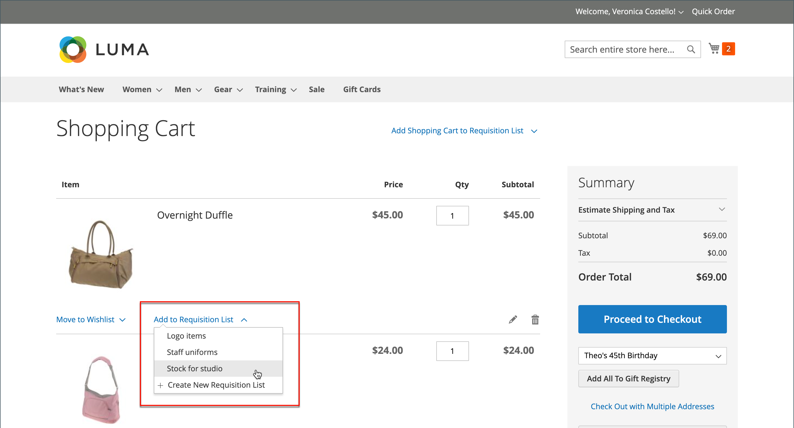

# Rekvisitionslistor

Genom att använda en rekvisitionslista sparar du tid när du köper produkter som beställts ofta, eftersom artiklarna läggs till i kundvagnen direkt från listan. Köpare kan hantera flera listor som fokuserar på produkter från olika leverantörer, köpare, team, kampanjer eller annat som effektiviserar arbetsflödet. Den är tillgänglig för både inloggade användare och gäster.

>[!NOTE]
>
>Information om hur du aktiverar rekvisitionslistor för din butik finns i [Aktivera B2B-funktioner](enable-basic-features.md). Upp till 999 rekvisitionslistor kan upprätthållas för varje köpkonto, beroende på [konfigurationen](configure-requisition-lists.md).

Funktionen för rekvisitionslista liknar önskelistor, med följande skillnader:

- En rekvisitionslista rensas inte efter att artiklar har skickats till kundvagnen. Det kan användas flera gånger.
- I användargränssnittet för rekvisitionslistor används en kompakt vy för att visa många objekt.

{width="600" zoomable="yes"}

## Skapa en rekvisitionslista från kontokontrollpanelen

En inloggad köpare som är associerad med ett företagskonto kan skapa en rekvisitionslista från sin kontokontrollpanel.

1. I sidofältet för deras konto väljer **[!UICONTROL My Requisition Lists]**.

1. Klicka på **[!UICONTROL Create New Requisition List]** på sidan _[!UICONTROL Requisition Lists]_.

1. Anger **[!UICONTROL Requisition List Name]** och **[!UICONTROL Description]**.

   {width="300"}

1. Klicka på **[!UICONTROL Save]** när du är klar.

## Skapa en rekvisitionslista från en produktsida

En inloggad köpare som är kopplad till ett företagskonto kan skapa en rekvisitionslista från en produktsida. Med den här metoden kan du enkelt skapa en lista och lägga till produkten.

1. Köparen klickar på **[!UICONTROL Add to Requisition List]** på produktinformationssidan.

1. Klicka på **[!UICONTROL Create New Requisition List]**.

1. Anger **[!UICONTROL Requisition List Name]** och **[!UICONTROL Description]**.

1. Klicka på **[!UICONTROL Save]** när du är klar.

## Lägg till produkter i en rekvisitionslista

Köpare kan lägga till produkter i en rekvisitionslista från:

- Produktsidor
- En katalogsida
- Kundvagnen
- Befintliga order
- Befintliga citattecken

### Från en produktinformationssida

1. Från butiken går köparen till detaljsidan för den produkt som ska läggas till i rekvisitionslistan.

1. Klicka på **[!UICONTROL Add to Requisition List]** och gör något av följande:

   - Väljer en befintlig rekvisitionslista.
   - Skapar en rekvisitionslista.

   {width="700" zoomable="yes"}

### Från en katalogsida

1. Från butiken går köparen till katalogsidan som innehåller den produkt som ska läggas till i rekvisitionslistan.

1. Hovrar över produkten.

1. Klicka på **[!UICONTROL Add to Requisition List]** och gör något av följande:

   - Väljer en befintlig rekvisitionslista.
   - Skapar en rekvisitionslista.

   {width="700" zoomable="yes"}

### Från en befintlig order

1. Köparen väljer **[!UICONTROL My Orders]** i sidofältet på sin kontokontrollpanel.

1. Klicka på **[!UICONTROL Add to Requisition List]** överst i ordningen och gör något av följande:

   - Väljer en befintlig rekvisitionslista.
   - Skapar en rekvisitionslista.

   {width="700" zoomable="yes"}

### Från en befintlig offert

Från en överlåtbar offert kan köpare använda alternativet [!UICONTROL Move to Requisition List] för att flytta produkter från offerten till en befintlig rekvisitionslista. Om det inte finns några rekvisitionslistor är alternativet [!UICONTROL Move to Requisition List] inte tillgängligt.

1. Köparen väljer **[!UICONTROL My Quotes]** i sidofältet på sin kontokontrollpanel.

1. Hitta och öppna den önskade citattecknen i listan.

1. På fliken [!UICONTROL Items Quoted] väljer du den produkt du vill flytta.

1. Använd listrutan [!UICONTROL Select] i kolumnen [!UICONTROL Actions] för produktradobjektet och välj **[!UICONTROL Move to Requisition list]**.

1. Välj rekvisitionslistan för de valda artiklarna.

1. Klicka på **[!UICONTROL Move item to Requisition List]**.

Mer information om B2B-offerter finns i avsnittet [Mina citattecken](account-dashboard-my-quotes.md).

### Från kundvagnen

1. Under objektet klickar köparen på menyn **[!UICONTROL Add to Requisition List]** och gör något av följande:

   - Väljer en befintlig rekvisitionslista.
   - Skapar en rekvisitionslista.

   {width="700" zoomable="yes"}

## Visa den uppdaterade rekvisitionslistan

När en köpare är inloggad på sitt konto kan han eller hon använda någon av följande metoder för att visa sina rekvisitionslistor.

{width="700" zoomable="yes"}

### Från kontokontrollpanelen

1. Välj **[!UICONTROL My Requisition Lists]** i sidofältet på deras kontokontrollpanel.

1. Klicka på **[!UICONTROL View]** i kolumnen _Åtgärder_ i listan över rekvisitionslistor.

### Från alla butikssidor

1. Klicka på användarnamnet i fältet för snabblänkar högst upp på sidan.

1. Välj **[!UICONTROL My Requisition Lists]** på menyn.
