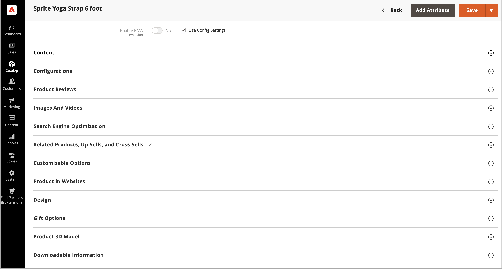

# Hantera 3D-produktmodeller med [!DNL AR Viewer] för Adobe Commerce

För varje produkt kan du överföra en `.USDZ`-fil som tillåter att AIR- och 3D-modeller används i produktlistan.

[!DNL AR Viewer] stöder bara `.USDZ`-filer.

## Installera tillägget

[!DNL AR Viewer] installeras som ett tillägg från [Adobe Commerce Marketplace](https://commercemarketplace.adobe.com/magento-module-arviewer.html){target=_blank}.

Mer information om installationsprocessen för tillägget finns i [_installationshandboken_](https://experienceleague.adobe.com/docs/commerce-operations/installation-guide/tutorials/extensions.html?lang=sv-SE).

När tillägget [!DNL AR Viewer] har installerats och konfigurerats kan administratörsanvändare konfigurera, anpassa och hantera produktlistor för att inkludera 3D-modeller.

## Lägga till en 3D-modell

1. Öppna produkten i redigeringsläge.

1. Om du vill arbeta med en viss butiksvy ställer du in **[!UICONTROL Store View]**-väljaren på rätt vy.

   >[!NOTE]
   >
   >Nya 3D-produktmodeller överförs _alltid_ och visas i _alla_ butiksvyer, även om `All Store Views`-omfånget inte används för överföring.   Om du vill dölja 3D-produktmodeller från en viss butiksvy måste du växla till den butiksvyn, markera kryssrutan **[!UICONTROL Hide from Product Page]** för 3D-modellen och klicka på **[!UICONTROL Save]**.

1. Bläddra nedåt och expandera avsnittet _[!UICONTROL Product 3D Model]_.

   {width="700" zoomable="yes"}

1. Lägg till 3D-modellen (`.USDZ` fil) för produkten.

1. Klicka på **[!UICONTROL Save]**.

### Ta bort en 3D-modell

Så här tar du bort en 3D-modell från produktinformationen:

1. Klicka på **[!UICONTROL Delete]**.

1. Klicka på **[!UICONTROL Save]**.

## Visa 3D-produktmodeller

När produktinformationen uppdateras med 3D-modellen:

1. [!DNL AR Viewer] genererar en QR-kod i produktbeskrivningen som kodar AR-filen.

1. Kunden kan se den här QR-koden på produktsidan.

1. När kunderna skannar QR-koden med sina mobila enheter återges en AR-upplevelse på den mobila enheten.

>[!NOTE]
>
> En serie demonstrationsvideor om hur en användare lägger till en 3D-modell till en produkt finns på sidan [AR Viewer for Adobe Commerce](https://experienceleague.adobe.com/docs/commerce-learn/tutorials/catalog/augmented-reality.html?lang=sv-SE) i _Commerce Videos och Tutorials_.
