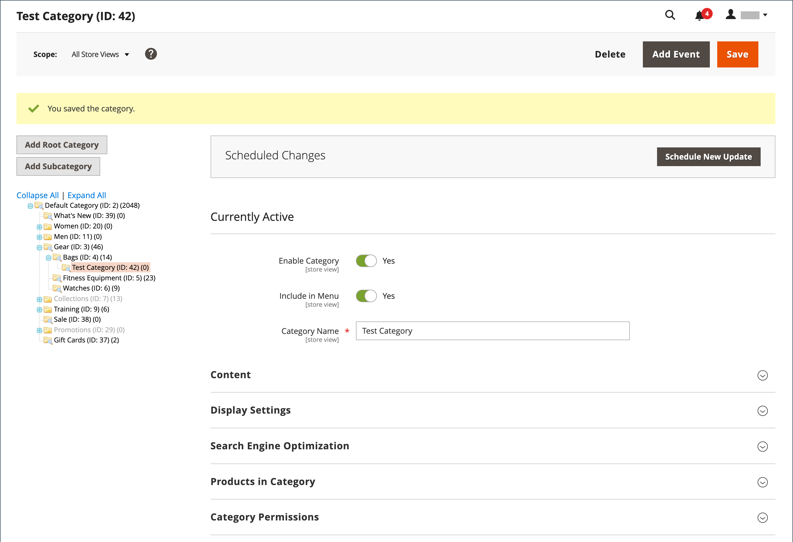
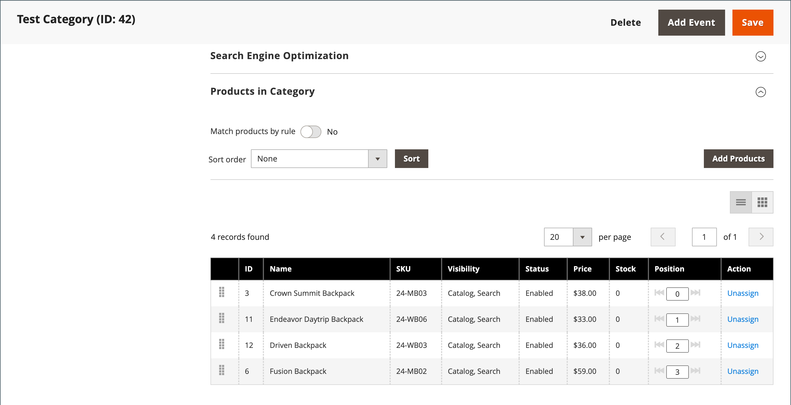

# Platta kataloger

>[!IMPORTANT]
>
>Vi rekommenderar inte längre att du använder en platt katalog som bästa praxis. Fortsatt användning av den här funktionen är känd för att orsaka prestandaförsämring och andra indexeringsproblem. En detaljerad beskrivning och lösning finns i [Help Center](https://experienceleague.adobe.com/docs/commerce-knowledge-base/kb/troubleshooting/miscellaneous/slow-performance-slow-and-long-running-crons.html).  Berörda versioner:  - Adobe Commerce om molninfrastruktur, 2.3.x och högre - Adobe Commerce (lokal), 2.3.x och senare - Magento Open Source, 2.3.x och senare   I alla versioner fungerar vissa tillägg bara med platta tabeller, vilket innebär en risk om du inaktiverar platta tabeller. Om du vet att du har tillägg som använder platta katalogindexerare måste du vara medveten om den här risken när du anger dessa värden till `No`.

I Commerce lagras vanligtvis katalogdata i flera tabeller, baserat på entitetsattribut-värde-modellen (EAV). Eftersom produktattribut lagras i många tabeller är SQL-frågor ibland långa och komplexa.

En platt katalog skapar i stället tabeller direkt, där varje rad innehåller alla nödvändiga data om en produkt eller kategori. En platt katalog uppdateras automatiskt, antingen varje minut eller enligt ditt cron-jobb. Platt katalogindexering kan också snabba upp bearbetningen av prisregler för kataloger och kundvagnar. En katalog med upp till 500 000 SKU:er kan indexeras snabbt som en platt katalog.

>[!NOTE]
>
>Innan du aktiverar en plan katalog för en livebutik måste du testa konfigurationen i en utvecklingsmiljö.

## Steg 1: Aktivera den platta katalogen

1. På _Administratör_ sidebar, gå till **[!UICONTROL Stores]** > _[!UICONTROL Settings]_>**[!UICONTROL Configuration]**.

1. Expandera på den vänstra panelen **[!UICONTROL Catalog]** och välja **[!UICONTROL Catalog]** under.

1. Expandera _Storefront_ och gör följande:

   - Ange **[!UICONTROL Use Flat Catalog Category]** till `Yes`. (Avmarkera vid behov **[!UICONTROL Use system value]** .)

   - Ange **[!UICONTROL Use Flat Catalog Product]** till `Yes`.

   {width="700" zoomable="yes"}

1. När du är klar klickar du på **[!UICONTROL Save Config]**.

1. När du uppmanas att uppdatera cachen klickar du på **[!UICONTROL Cache Management]** i systemmeddelandet och följ instruktionerna för att uppdatera cachen.

## Steg 2: Verifiera resultaten

Det finns två metoder som du kan använda för att verifiera resultatet.

### Metod 1: Verifiera resultaten för en enskild produkt

1. På _Administratör_ sidebar, gå till **[!UICONTROL Catalog]** > **[!UICONTROL Products]**.

1. Öppna en produkt i redigeringsläge.

1. För **[!UICONTROL Name]**, lägga till text `_TEST` till slutet av produktnamnet.

1. Klicka på **[!UICONTROL Save]**.

1. Navigera till butikens hemsida på en ny flik och gör följande:

   - Sök efter den redigerade produkten.

   - Använd navigeringen för att bläddra till produkten under den tilldelade kategorin.

     Uppdatera sidan om det behövs för att se resultatet. Ändringen visas inom en minut eller enligt din [Cron](../systems/cron.md) schema.

   {width="700" zoomable="yes"}

### Metod 2: Verifiera resultaten för en kategori

1. På _Administratör_ sidebar, gå till **[!UICONTROL Catalog]** > **[!UICONTROL Categories]**.

1. Kontrollera att **[!UICONTROL Store View]** är inställd på `All Store Views`.

   Om du uppmanas till det klickar du på **[!UICONTROL OK]** för att bekräfta.

1. Välj en befintlig kategori i kategoriträdet och klicka på **[!UICONTROL Add Subcategory]** och gör följande:

   - För **[!UICONTROL Category Name]**, ange `Test Category`.

   - När du är klar klickar du på **[!UICONTROL Save]**.

     {width="600" zoomable="yes"}

   - Expandera  den **[!UICONTROL Products in Category]** och klicka **[!UICONTROL Reset Filter]** för att visa alla produkter.

   - Markera kryssrutan för flera produkter som ska läggas till i den nya kategorin.

   - klicka **[!UICONTROL Save]**.

   {width="600" zoomable="yes"}

1. På en ny flik i webbläsaren går du till butikens hemsida och använder butiksnavigeringen för att bläddra till den kategori du har skapat.

   Uppdatera sidan om det behövs för att se resultatet. Ändringen visas inom en minut eller enligt ditt cron schema.

## Steg 3: Ta bort testdata

Så här tar du bort testdata och återställer det ursprungliga produktnamnet och katalogkonfigurationen.

### Ta bort testkategorin

1. På _Administratör_ sidebar, gå till **[!UICONTROL Catalog]** > **[!UICONTROL Categories]**.

1. Välj den testunderkategori som du skapade i kategoriträdet.

1. Klicka på i det övre högra hörnet **[!UICONTROL Delete]**.

1. När du uppmanas att bekräfta klickar du på **[!UICONTROL OK]**.

   Den här kategoriborttagningen tar inte bort produkterna som är tilldelade kategorin.

### Återställ det ursprungliga produktnamnet

1. På _Administratör_ sidebar, gå till **[!UICONTROL Catalog]** > **[!UICONTROL Categories]**.

1. Öppna testprodukten i redigeringsläge.

1. Ta bort `_TEST` text som du har lagt till i **[!UICONTROL Product Name]**.

1. Klicka på i det övre högra hörnet **[!UICONTROL Save]**.

### Återställ den ursprungliga katalogkonfigurationen

1. På _Administratör_ sidebar, gå till **[!UICONTROL Stores]** > _[!UICONTROL Settings]_>**[!UICONTROL Configuration]**.

1. Expandera på den vänstra panelen **[!UICONTROL Catalog]** och välja **[!UICONTROL Catalog]** under.

1. Expandera _Storefront_ och gör följande:

   - Ange **[!UICONTROL Use Flat Catalog Category]** till `No`.

   - Ange **[!UICONTROL Use Flat Catalog Product]** till `No`.

1. När du är klar klickar du på **[!UICONTROL Save Config]**.

1. Uppdatera cacheminnet när du uppmanas till detta.
