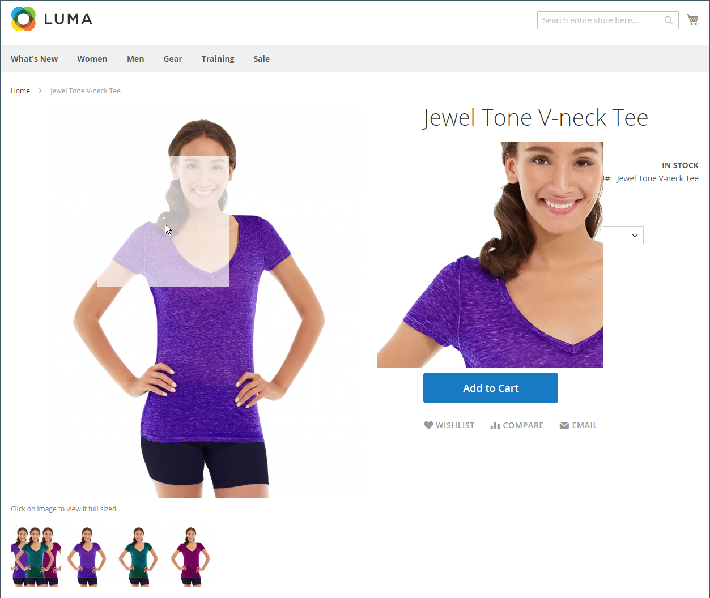

# Katalogbilder och video

Om du använder högkvalitativa bilder med enhetlig proportion får katalogen en professionell look med affärsintresse. Om du har en stor katalog med flera bilder per produkt kan du enkelt ha hundratals, kanske tusentals, produktbilder att hantera. Innan du börjar bör du skapa en namnkonvention för bildfilerna och ordna dem så att du kan hitta originalen om du behöver dem.

{width="600" zoomable="yes"}

En enda produktbild återges i olika storlekar i hela katalogen. Visningsstorleken för bildbehållaren på sidan definieras i temats formatmall. Var bilden visas i din butik avgörs dock av den roll som är tilldelad till bilden. huvudproduktbilden, eller _bas_ måste vara tillräckligt stor för att ge den förstoring som behövs för zoomning. Förutom huvudbilden kan en mindre version av samma bild visas i produktlistorna, eller som en miniatyrbild i kundvagnen. Du kan överföra en bild i den största storlek som behövs eller använda en [Adobe Stock](../content-design/adobe-stock.md) och låt Commerce rendera de storlekar som behövs för varje användning. Samma bild kan användas för alla roller, eller en annan bild kan tilldelas varje roll. Som standard tilldelas den första bilden som överförs till alla tre rollerna.

## Webbläsare för butiksmedier

Medieläsaren på produktsidan visar flera bilder, videor eller färgrutor som hör till produkten. Varje miniatyrbild kan visa olika vyer eller varianter av produkten. Köparen kan klicka på en miniatyrbild för att bläddra bland medieresurserna. Även om läget för medieläsaren varierar beroende på tema, ligger standardpositionen precis under huvudbilden på produktsidan. Information om tillgänglighetskontroller finns i [Navigeringstillgänglighet](../getting-started/navigation-accessibility.md).

{width="700" zoomable="yes"}

### Zooma bilden

Om [basbild](product-image.md) är tillräckligt stor för att skapa zoomeffekten, kan kunderna visa en förstorad del av bilden när de för musen över den. När zoomningen är aktiverad kan kunderna klicka på huvudbilden och flytta runt markören för att förstora olika delar av bilden. Den förstorade markeringen visas till höger om bilden.

{width="700" zoomable="yes"}

### Ljusrutor och reglage

Det finns många ljusrutor och reglage från tredje part som du kan använda för att förbättra presentationen av dina produktbilder. Sök efter tillägg i [Commerce Marketplace](../getting-started/commerce-marketplace.md).

## Felsökningsresurser

Hjälp med felsökning av bild- och videoproblem finns i följande artiklar i kunskapsbasen med Commerce Support:

- [Efter installationen läses inte bilder och formatmallar in. Endast textvisning, inga bilder](https://experienceleague.adobe.com/docs/commerce-knowledge-base/kb/troubleshooting/storefront/after-installing-images-and-stylesheets-do-not-load-only-text-displays-no-graphics.html)
- [Problem med att hantera produktbilder via REST API](https://experienceleague.adobe.com/docs/commerce-knowledge-base/kb/support-tools/patches/v1-0-5/mdva-28763-magento-patch-issues-with-managing-product-images-via-rest-api.html)
- [Importera produkter (csv-bilder) duplicerade](https://experienceleague.adobe.com/docs/commerce-knowledge-base/kb/support-tools/patches/v1-0-14/mdva-31969-magento-patch-import-products-.csv-images-duplicated.html)
- [Produktbilder visas inte trots produktredigeringsroller](https://experienceleague.adobe.com/docs/commerce-knowledge-base/kb/troubleshooting/storefront/product-images-do-not-display-despite-product-edit-image-roles.html)
- [Lagra bilder som inte visas efter distributionen](https://experienceleague.adobe.com/docs/commerce-knowledge-base/kb/troubleshooting/storefront/store-images-not-displayed-after-deployment.html)
