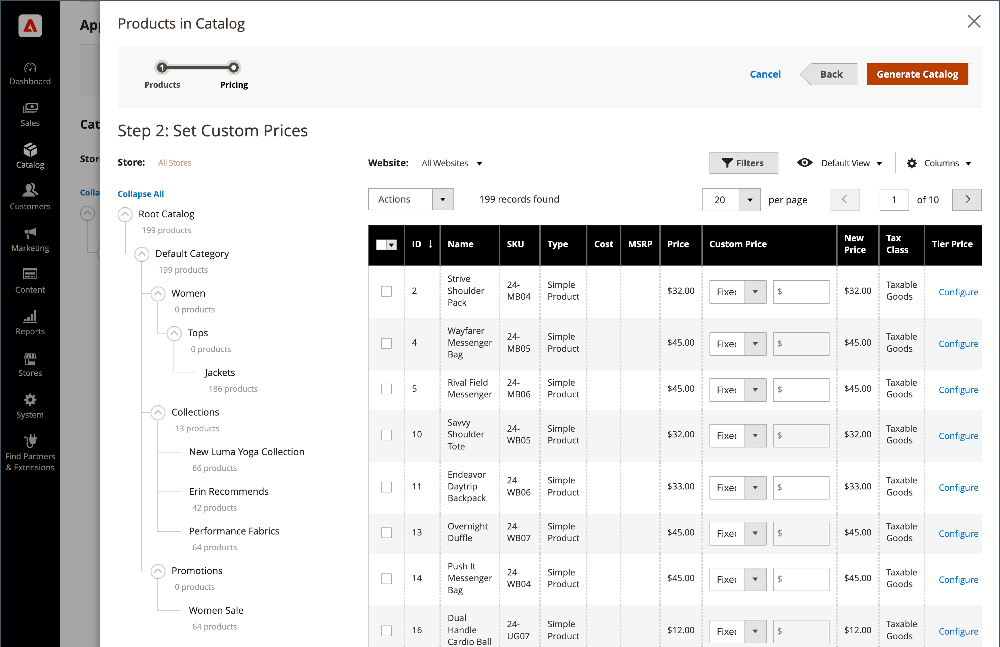

# [!UICONTROL Catalog]-menyn

Menyn [!UICONTROL Catalog] ger enkel åtkomst till verktyg för att skapa produkter, kategorier och lagerhantering samt delade kataloger för anpassade priser i [B2B-butiker](https://experienceleague.adobe.com/docs/commerce-admin/b2b/introduction.html).

>[!BEGINTABS]

>[!TAB Adobe Commerce]

[!BADGE Endast PaaS]{type=Informative url="https://experienceleague.adobe.com/en/docs/commerce/user-guides/product-solutions" tooltip="Gäller endast Adobe Commerce i molnprojekt (Adobe-hanterad PaaS-infrastruktur) och lokala projekt."}

{width="300" zoomable="yes"}

>[!TAB Adobe Commerce as a Cloud Service]

[!BADGE Endast SaaS]{type=Positive url="https://experienceleague.adobe.com/en/docs/commerce/user-guides/product-solutions" tooltip="Gäller endast Adobe Commerce as a Cloud Service- och Adobe Commerce Optimizer-projekt (SaaS-infrastruktur som hanteras av Adobe)."}

{width="300" zoomable="yes"}

>[!ENDTABS]

Klicka på **[!UICONTROL Catalog]** på sidofältet _Admin_.

## [!UICONTROL Products]

Skapa [produkter](products-list.md) av alla typer och hantera ditt lager.

{width="700" zoomable="yes"}

## [!UICONTROL Categories]

Skapa [kategoristrukturen](categories.md) som är grunden för butikens navigering.

{width="700" zoomable="yes"}

## [!UICONTROL Shared Catalogs]

För butiker där Adobe Commerce B2B är installerat och aktiverat ger [delade kataloger](https://experienceleague.adobe.com/docs/commerce-admin/b2b/shared-catalogs/catalog-shared.html) dig möjlighet att göra anpassade priser tillgängliga för olika företag.

{width="700" zoomable="yes"}
