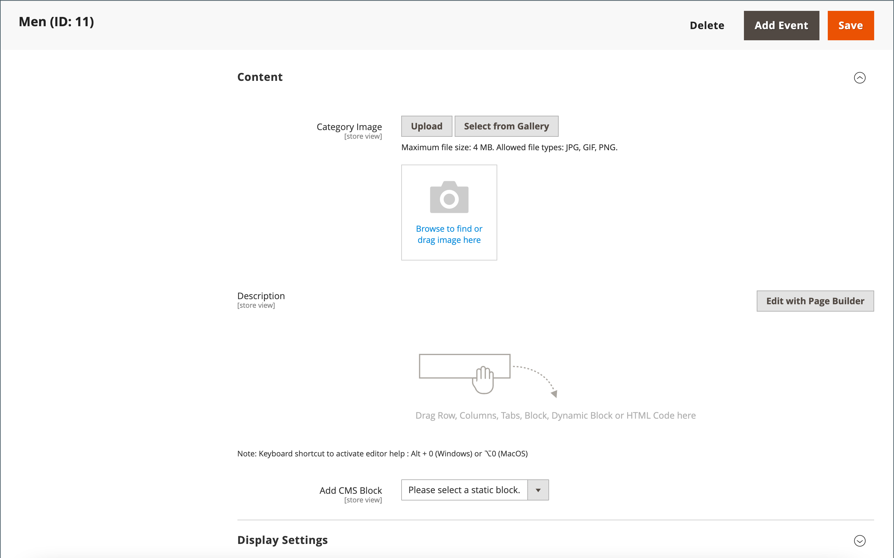

# Kategorier - Innehållsinställningar

Inställningarna för _[!UICONTROL Content]_&#x200B;avgör om ytterligare innehåll visas på kategorisidan. Förutom listan med kategoriprodukter kan sidan innehålla en bild, beskrivning och CMS-block. Du kan använda [[!DNL Page Builder]](../page-builder/introduction.md)-innehållsverktygen för att definiera kategoribeskrivningen.

## Lägg till kategoribeskrivningen i [!DNL Page Builder]

1. Öppna kategorin i redigeringsläge.

1. Bläddra nedåt och utöka  i avsnittet **[!UICONTROL Content]**.

   {width="600" zoomable="yes"}

1. Klicka på **[!UICONTROL Edit with Page Builder]** längst upp till höger i området **[!UICONTROL Description]**.

1. Använd [[!DNL Page Builder]](../page-builder/introduction.md)-innehållsverktygen för att [redigera befintlig text](../page-builder/text.md) och lägga till annat innehåll (om det behövs).

## [!DNL Page Builder] förhandsgranskning

När du expanderar avsnittet _Innehåll_ för en befintlig kategori där det finns innehåll som har skapats med [!DNL Page Builder] visas en förhandsvisning av **[!UICONTROL Description]**-innehållet så som det skulle visas på kategorisidan. När du klickar på innehållsområdet öppnas arbetsytan [!DNL Page Builder], där du kan göra nödvändiga uppdateringar.

{width="500" zoomable="yes"}

Den här innehållsförhandsgranskningen är som standard aktiverad för produkt- och kategoriformulären. Om prestandan försämras på grund av att förhandsgranskningen har lästs in kan du inaktivera förhandsgranskningen i inställningarna för [konfigurationen för innehållshantering](../configuration-reference/general/content-management.md#advanced-content-tools).

## Lägg till kategoribeskrivningen i redigeraren

Ange endast vanliga ASCII-tecken i textrutan. Om du klistrar in text från en ordbehandlare bör du först spara den som en vanlig TXT-fil för att ta bort osynliga kontrolltecken.

Mer information finns i [WYSIWYG-redigeraren](../content-design/editor.md).

1. Öppna kategorin i redigeringsläge.

1. Bläddra nedåt och utöka  i avsnittet **[!UICONTROL Content]**.

   {width="500" zoomable="yes"}

1. Ange kategorin **[!UICONTROL Description]** och använd [redigeringsverktygsfältet](../content-design/editor.md) för att formatera efter behov.

   Du kan dra i det nedre högra hörnet om du vill ändra textrutans höjd.

## Lägg till ett CMS-block på kategorisidan

1. Gå till **[!UICONTROL Catalog]** > **[!UICONTROL Categories]** på sidofältet _Admin_.

1. Välj den kategori som du vill redigera i kategoriträdet.

1. Expandera  i avsnittet **[!UICONTROL Content]**.

1. För **[!UICONTROL Add the CMS block]** väljer du ett block som du vill lägga till.

1. Expandera  i avsnittet **[!UICONTROL Display Settings]**.

1. Ange **[!UICONTROL Display Mode]** till något av följande:

   - `Static block only`
   - `Static block and products`

1. När det är klart klickar du på **[!UICONTROL Save]** och granskar blockvisningen på butiken (kräver cacheuppdatering).

## Referens för innehållsinställningar

| Inställning | [Omfång](../getting-started/websites-stores-views.md#scope-settings) | Beskrivning |
|--- |--- |--- |
| [!UICONTROL Category Image] | Butiksvy | Anger en bild för kategorisidans överkant. Metoder:   **[!UICONTROL Upload]**- Överför en bildfil från den lokala datorn till galleriet och använder den som kategoribild.  **[!UICONTROL Select from Gallery]** - Uppmanar dig att välja en befintlig bild från galleriet.    - Dra en bildfil till kamerapanelen eller bläddra till bilden och markera den i det lokala filsystemet. |
| [!UICONTROL Description] | Butiksvy | Anger en beskrivning som visas på kategorisidan.   **[!UICONTROL Edit with Page Builder]**- Öppnar [[!DNL Page Builder] arbetsytan](../page-builder/workspace.md), där du kan redigera beskrivningen.  **[!UICONTROL Show / Hide Editor]** - Växlar visning mellan WYSIWYG-redigerarläge och HTML. |
| [!UICONTROL Add CMS Block] | Butiksvy | Lägger till ett befintligt [CMS-block](../content-design/blocks.md) på kategorisidan. |

{style="table-layout:auto"}
