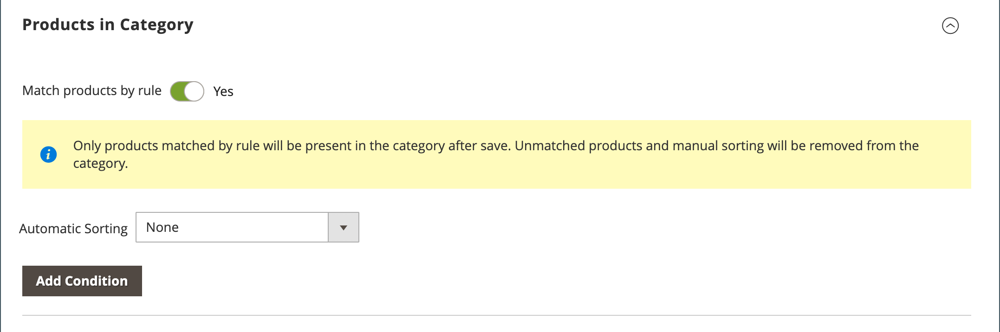

# Kategoriprodukttilldelningar

För en kategori använder du avsnittet _[!UICONTROL Products in Category]_för att granska de produkter som för närvarande är tilldelade till kategorin. Sökfiltren högst upp i varje kolumn används för att lägga till och ta bort produkter från kategorin. Du kan också använda [kategoriregler](../merchandising-promotions/category-product-rules.md) (  Adobe Commerce) för att dynamiskt ändra produktvalet när en uppsättning villkor uppfylls. Mer information finns i [Visual Merchandiser](../merchandising-promotions/visual-merchandiser.md)).

>[!TIP]
>
>Under konfigurationen av kategoriregler sorteras produkterna __, _matchas_, _tilldelas_ och _inte tilldelade_ enligt den regeln **_endast_** när den här kategorin sparas. För att säkerställa att en ny produkt tilldelas enligt regeln när du lägger till den i katalogen måste du **spara om varje kategori** som är inställd på att matcha produkter enligt regel. Om någon produktStock-status ändras till `In Stock` eller `Out of Stock` och produkterna i kategorin _sorteras_ enligt regeln **Automatisk sortering** måste du klicka på **[!UICONTROL Save Category]**.

{width="600" zoomable="yes"}

>[!NOTE]
>
>I kolumnen _Stock_ visas endast tillgänglig produktkvantitet för _**det valda kategoriomfånget**_. När flera lager hanteras för produkter bör du växla mellan motsvarande omfång för att visa andra _Stock_-kolumnvärden i rutnätet _Kategoriprodukter_.

## Använd en kategoriregel

{{ee-feature}}

1. Ange **[!UICONTROL Match products by rule]** till `Yes`.

   Alternativen för automatisk sortering och villkor visas.

   {width="600" zoomable="yes"}

1. Ange ordningen **[!UICONTROL Automatic Sorting]**.

   Den här automatiska sorteringen baseras på aktuella förhållanden.

   - `Stock level` - Flytta uppåt eller nedåt.
   - `Special price` - Flytta uppåt eller nedåt.
   - `New Products` - Visa de senaste produkterna först.
   - `Color` - Sortera i bokstavsordning efter färg.
   - `Name` - Sortera i stigande eller fallande ordning efter namn.
   - `SKU` - Sortera i stigande eller fallande ordning efter SKU
   - `Price` - Sortera i stigande eller fallande ordning efter pris.

1. Klicka på **[!UICONTROL Add Condition]** och gör följande:

   - Välj den **[!UICONTROL Attribute]** som utgör grunden för villkoret.
   - Välj **[!UICONTROL Operator]** som krävs för att bilda uttrycket.
   - Ange **[!UICONTROL Value]** som ska matchas.

   {width="600" zoomable="yes"}

   Upprepa den här processen för varje attribut som ska användas för att beskriva de villkor som ska uppfyllas. Om du till exempel vill matcha produkter som skapades för 7 till 30 dagar sedan gör du följande:

   - Ange **[!UICONTROL Date Created]** till `Less than 30`.
   - Ange **[!UICONTROL Logic]** till `AND`.
   - Ange **[!UICONTROL Date Modified]** till `Greater than 7`.

1. Klicka på **[!UICONTROL Save Category]** när du är klar.

### Sidalternativ

| Alternativ | Beskrivning |
|--- |--- |
| [!UICONTROL Match products by rule] | Avgör om listan med produkter i kategorin genereras dynamiskt av en kategoriregel. Alternativ: `Yes` / `No` |
| [!UICONTROL Automatic Sorting] | Använder automatiskt en sorteringsordning i listan med kategoriprodukter. Alternativ:  `None` `Move low stock to top` `Move low stock to bottom` `Special price to top` `Special price to bottom` `Newest products first` `Sort by color` `Name: A - Z` `Name: Z - A` `SKU: Ascending` `SKU: Descending` `Price: High to Low` `Price: Low to High` |
| [!UICONTROL Add Condition] | Lägger till ett annat villkor till regeln. |

{style="table-layout:auto"}

### Sidvillkor

| Alternativ | Beskrivning |
|--- |--- |
| [!UICONTROL Attribute] | Anger det attribut som används som bas för villkoret. Alternativ:  **[!UICONTROL Clone Category ID(s)]**- Klonar produkter dynamiskt, utan sortering och ordning, från flera kategorier baserat på kategori-ID. **[!UICONTROL Color]** - Inkluderar produkter baserade på färg.  **[!UICONTROL Date Created (days ago)]**- Inkluderar produkter baserat på antalet dagar sedan produkterna lades till i katalogen. **[!UICONTROL Date Modified (days ago)]** - Inkluderar produkter baserat på antalet dagar sedan produkterna senast ändrades.  **[!UICONTROL Name]**- Inkluderar produkter baserat på produktnamnet. **[!UICONTROL Price]** - Inkluderar produkter baserat på pris.  **[!UICONTROL Quantity]**- Inkluderar produkter baserat på lagerkvantiteten. ** SKU **- Innehåller produkter baserade på SKU. |
| [!UICONTROL Operator] | Anger den operator som används i attributvärdet för att uppfylla villkoret. Om ingen operator anges används `Equal` som standard. Alternativ: `Equal` / `Not equal` / `Greater than` / `Greater than or equal to` / `Less than` / `Less than or equal to` / `Contains` |
| [!UICONTROL Value] | Anger det värde som attributet måste ha för att uppfylla villkoret. |
| [!UICONTROL Logic] | Används för att definiera flera villkor och visas bara när ett annat villkor läggs till. Alternativ: `OR` / `AND` |

{style="table-layout:auto"}

>[!NOTE]
>
>Kvantiteten för en konfigurerbar produkt med underordnade alternativ beräknas genom att kombinera alla underordnade produktkvantiteter. Ta ett exempel på en konfigurerbar produkt _Endurance Fitness Tank_ med färgalternativen lila, röd och gul och olika mängder av varje. I det här scenariot är den överordnade produktkvantiteten den kombinerade kvantiteten för de lila, röda och gula underordnade produkterna.

## Kontroller

## Sidkontroller

{{ee-feature}}

| Kontroll | Beskrivning |
|----------|--------------|
|  | Visa som lista |
|  | Visa som rutor |
|  | Matcha enligt regel - Nej |
|  | Matcha enligt regel - Ja |
|  | Med dra-och-släpp-kontrollen kan du ta tag i en produkt och flytta den till en annan plats på stödrastrets aktuella sida. Mer information finns i [Visual Merchandiser](../merchandising-promotions/visual-merchandiser.md). |
|  | Bestämmer produktens position i listan. |

{style="table-layout:auto"}

## Sidkontroller

{{ce-feature}}

| Kontroll | Beskrivning |
|----------|--------------|
|  | Använd kryssrutan i rubriken för den första kolumnen när du ska välja alla produkter eller ta bort alla val. Kontrollen i den första raden avgör typen av sökning och kan ställas in så att den inkluderar alla poster eller bara de poster som antingen är tilldelade kategorin eller inte. Kryssrutan i den första kolumnen på varje rad identifierar produkter som ska läggas till i kategorin. Alternativ: `Yes` / `No` / `Any` |
| [!UICONTROL Search Filters] | Filterkontrollerna högst upp i varje kolumn kan användas för att ange specifika värden som du vill ta med eller utelämna från listan, beroende på inställningen Markera alla. |
| [!UICONTROL Reset Filter] | Tar bort alla sökfilter. |
| [!UICONTROL Search] | Söker i katalogen baserat på filtervillkoren och visar resultatet. |

{style="table-layout:auto"}
