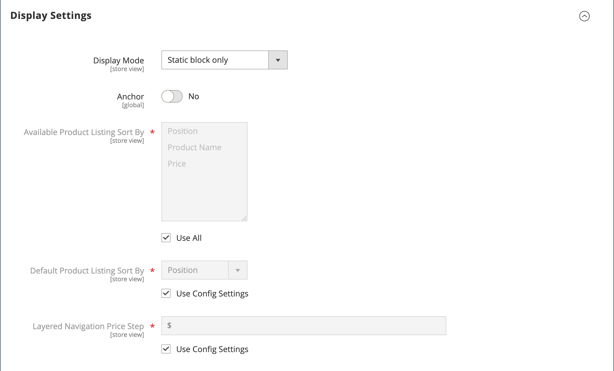

# Skapa kategorier

Katalogens kategoristruktur är som ett upp-och-ned-träd med roten högst upp. Varje sektion i trädet kan expanderas och komprimeras. Alla inaktiverade eller dolda kategorier är nedtonade. Kategorierna på den första nivån (under [roten](category-root.md)) visas vanligtvis som alternativ på [huvudmenyn](navigation-top.md). Du kan skapa så många ytterligare underkategorier som behövs, enligt det maximala menydjup som har angetts i konfigurationen. Kategorier kan dras och släppas till andra platser i trädet. Kategori-ID-numret visas inom parentes efter kategorinamnet överst på sidan.

För en webbplats med flera [butiker](../stores-purchase/stores.md#add-stores) kan du skapa olika rotkategorier för varje butik som definierar den uppsättning kategorier som används för den [översta navigeringen](navigation-top.md).

{width="700" zoomable="yes"}

## God praxis

Använd dessa metodtips när du planerar och skapar kategorier.

### Kategoristruktur

Strukturen på kategorierna i huvudmenyn kan påverka kundupplevelsen och prestandan. Det är en god vana att identifiera en överordnad kategori på den översta nivån och undvika att ha andra kategorier med samma namn. I stället för att ha flera kategorier för &quot;Barn&quot; organiserade under olika avdelningar, till exempel `Clothing/Kids`, `Shoes/Kids`, `Accessories/Kids`. Det kan vara mer effektivt att göra den överordnade kategorin `Kids` på den översta nivån och sedan skapa underkategorier enligt nedan. Var konsekvent med kategoristrukturen och använd samma metod för alla produkttyper i katalogen.

### Affärsregler och automatisering

Överväg kategoristrukturen och tillgängliga attributvärden när du använder affärslogik för att visa liknande objekt på en katalogsida, eller för att ställa in en anpassad kampanj, automatiserad process eller sökvillkor. Om du t.ex. anger &quot;polo&quot; som en överordnad kategori kan resultatet vara blandade könen och åldersolämpliga produkter. Men om du matchar en viss underkategori poloskjortor blir resultatet mer smalt och kan tilltala en viss kund. Resultatet kan bli ännu mer specifikt när det kombineras med andra attributvärden som riktar sig till en viss kund. Ta hänsyn till antalet produkter som måste filtreras igenom och hämtas när en specifik kategorisökväg refereras. Skillnaden i resultat kan vara dramatisk. Tänk på de olika resultat som returneras av följande kategorisökvägar:

- `[Category:  All Products/Shirts/Father's Day/Polos/Sale]`
- `[Category Path: Men/Shirts/Polos]`
- `[Child Category: Polos]`

Det är viktigt att tydligt definiera kategoriserade relationer, t.ex.

- överordnad kategori
- underkategori
- kategorisökväg

Definiera även eventuella associerade nyckelord och attribut, till exempel:

- tillgänglighet
- försäljningspris
- varumärke
- size
- färg

## Steg 1: Skapa en kategori

1. Gå till **[!UICONTROL Catalog]** > **[!UICONTROL Categories]** på sidofältet _Admin_.

1. Ange **[!UICONTROL Store View]** för att bestämma var den nya kategorin ska vara tillgänglig.

1. Välj den överordnade kategorin för den nya kategorin i kategoriträdet.

   Den överordnade är en nivå ovanför den nya kategorin.

   Om du börjar från början utan data kan det bara finnas två kategorier i listan: _Standardkategori_, som är roten, och en _exempelkategori_

1. Klicka på **[!UICONTROL Add Subcategory]**.

## Steg 2: Fyll i den grundläggande informationen

1. Om du vill att kategorin ska vara omedelbart tillgänglig i butiken anger du **[!UICONTROL Enable Category]** till `Yes`.

1. Om du vill inkludera kategorin i den [övre navigeringen](navigation-top.md) anger du **[!UICONTROL Include in Menu]** till `Yes`.

1. Ange **[!UICONTROL Category Name]**.

   {width="500" zoomable="yes"}

1. klicka på **[!UICONTROL Save]** och fortsätt.

## Steg 3: Slutför kategoriinnehållet

1. Expandera  i avsnittet **[!UICONTROL Content]**.

   {width="600" zoomable="yes"}

1. Om du vill visa en **[!UICONTROL Category Image]** överst på sidan kan du antingen överföra din egen bild eller använda en bild som finns i [medielagringen](../content-design/media-storage.md).

   - Om du vill överföra en egen bild klickar du på **[!UICONTROL Upload]** och väljer den bild som du vill representera kategorin.

   - Om du vill använda bilder från medielagringen klickar du på **[!UICONTROL Select from Gallery]** och väljer den bild som du vill visa kategorin.

   >[!NOTE]
   >
   >I mediegalleriet kan du även använda [Adobe Stock Integration](../content-design/adobe-stock.md) för att hitta rätt bild genom att klicka på **[!UICONTROL Search Adobe Stock]**.

1. För **[!UICONTROL Description]** anger du texten eller annat innehåll som du vill ska visas på kategorilandningssidan.

   Mer information finns i [Kategoriinnehåll](categories-content-settings.md).

1. Om du vill inkludera ett innehållsblock på kategoristartsidan väljer du **[!UICONTROL CMS Block]** som du vill ska visas.

1. klicka på **[!UICONTROL Save]** och fortsätt.

## Steg 4: Slutför visningsinställningarna

1. Expandera  i avsnittet **[!UICONTROL Display Setting]**.

   {width="600" zoomable="yes"}

   Mer information om dessa alternativ finns i [Visningsinställningar](categories-display-settings.md).

1. Ange **[!UICONTROL Display Mode]** till något av följande:

   - `Products Only`
   - `Static Block Only`
   - `Static Block and Products`

1. Om du vill att kategorisidan ska innehålla avsnittet _`Filter by Attribute`_för lagerstyrd navigering anger du **[!UICONTROL Anchor]**till `Yes`.

1. För alternativen för **[!UICONTROL Available Product Listing Sort By]** väljer du ett eller flera av de tillgängliga värdena som ska vara tillgängliga för kunder för att sortera listan. Den här inställningen gäller inte för [!DNL Live Search] [Sidwidgeten Produktlista](https://experienceleague.adobe.com/en/docs/commerce-merchant-services/live-search/live-search-storefront/plp-styling).

   Som standard inkluderas alla tillgängliga värden. Avmarkera kryssrutan **[!UICONTROL Use All]** om du vill ändra valen. Värdena kan till exempel vara:

   - `Position`
   - `Product Name`
   - `Price`

1. Om du vill ange standardsorteringsordningen för kategorin väljer du värdet **[!UICONTROL Default Product Listing Sort By]**. Den här inställningen gäller inte för [!DNL Live Search] [Sidwidgeten Produktlista](https://experienceleague.adobe.com/en/docs/commerce-merchant-services/live-search/live-search-storefront/plp-styling).

1. Så här ändrar du standardinställningen för [prissteg](navigation-layered.md#configure-price-navigation) för navigering i flera lager:

   - Avmarkera kryssrutan **[!UICONTROL Use Config Settings]**.

   - Ange det värde som ska användas som ett stegvis prissteg för lagerstyrd navigering.

1. Klicka på **[!UICONTROL Save]** och fortsätt.

## Steg 5: Slutför optimeringsinställningarna för sökmotorn

1. Expandera  i avsnittet **[!UICONTROL Search Engine Optimization Settings]**.

   {width="600" zoomable="yes"}

   Mer information om de här alternativen finns i [Sökmotoroptimering](categories-search-engine-optimization.md).

1. Fyll i följande [metadata](../merchandising-promotions/meta-data.md) för kategorin:

   - [!UICONTROL Meta Title]
   - [!UICONTROL Meta Keywords]
   - [!UICONTROL Meta Description]

1. Klicka på **[!UICONTROL Save]** och fortsätt.

## Steg 6: Välj produkter i kategori

1. Expandera  i avsnittet **[!UICONTROL Products in Category]**.

   {width="600" zoomable="yes"}

   Mer information om de här alternativen finns i [Produkter i kategori](categories-product-assignments.md).

1. Använd vid behov [filters](../getting-started/admin-grid-controls.md) för att hitta produkterna.

   Om du vill visa alla poster som ännu inte ingår i kategorin anger du `No` som postväljare i den första kolumnen och klickar på **[!UICONTROL Search]**.

1. I den första kolumnen markerar du kryssrutan för varje produkt som ska ingå i kategorin.

1. Klicka på **[!UICONTROL Save]** och fortsätt.

## Steg 7: Ange kategoribehörigheter

{{ee-feature}}

1. Expandera  i avsnittet **[!UICONTROL Category Permissions]**.

1. För en installation på flera platser väljer du **[!UICONTROL Website]** där kategoribehörigheterna gäller.

1. Välj **[!UICONTROL Customer Group]** där kategoribehörigheterna gäller.

    ([Endast Adobe Commerce B2B](../b2b/introduction.md)) Om det behövs kan du välja en **[!UICONTROL Shared Catalog]** i stället.

1. Ange följande behörigheter efter behov:

   - [!UICONTROL Browsing Category]
   - [!UICONTROL Display Product Prices]
   - [!UICONTROL Add to Cart]

1. Om du vill lägga till en annan behörighetsregel klickar du på **[!UICONTROL New Permission]** och upprepar processen.

   {width="600" zoomable="yes"}

## Steg 8: Slutför designinställningarna

1. Expandera  i avsnittet **[!UICONTROL Design]**.

1. Ange designinställningarna efter behov:

   - ([Endast Adobe Commerce B2B](../b2b/introduction.md)) Om du vill använda designinställningarna för den överordnade kategorin i den här kategorin anger du **[!UICONTROL Use Parent Category Settings]** till `Yes`.

   - Om du vill ändra designen för kategorisidorna väljer du **[!UICONTROL Theme]** som du vill använda.

   - Om du vill ändra kolumnlayouten för kategorisidorna väljer du **[!UICONTROL Layout]** som du vill använda.

   - Ange en anpassad kod genom att ange en giltig XML-kod i rutan **[!UICONTROL Layout Update XML]**.

   - Om du vill använda samma design för produktsidor anger du **[!UICONTROL Apply Design to Products]** till `Yes`.

   {width="600" zoomable="yes"}

1.  (endast Magento Open Source) Så här schemalägger du en designuppdatering för en viss tidsperiod:

   - Expandera avsnittet _[!UICONTROL Schedule Design Update]_.

   - Använd kalendern () för att välja datumen **[!UICONTROL from]** och **[!UICONTROL to]** för schemauppdateringen.

   {width="600" zoomable="yes"}

1. Klicka på **[!UICONTROL Save]** när du är klar.
