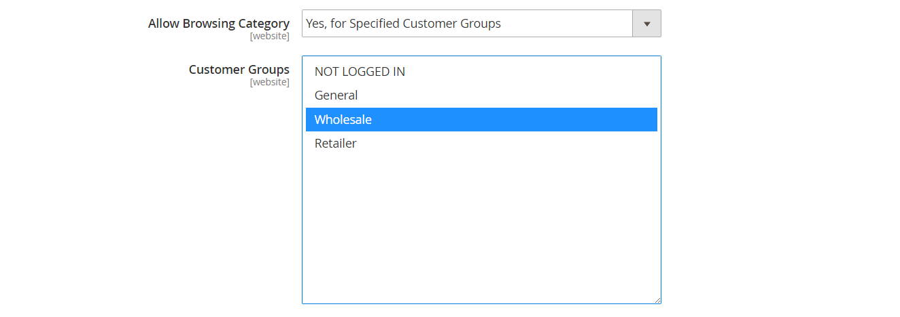

# Kategoribehörigheter

{{ee-feature}}

Kategoriåtkomsten kan begränsas till specifika kundgrupper eller helt och hållet begränsas. Du kan styra visningen av produktpriser, avgöra vilka kundgrupper som kan lägga till produkter i kundvagnen och specificera landningssidan.

>[!NOTE]
>
>Kategoribehörigheter har ett globalt omfång och när de är aktiverade begränsas åtkomsten till varje kategori enligt dess individuella behörigheter. Kategoribehörigheter är inte aktiverade som standard.

Om du till exempel bara säljer till kunder i grossistledet kan du låta vem som helst bläddra i katalogen, men visa priser och endast tillåta köp för kunder i kundgruppen _grossister_. I följande exempel har bara inloggade användare åtkomst till kategorin Samlingar. För gäster visas inte alternativet Samlingar på huvudmenyn.

{width="600" zoomable="yes"}

När det här alternativet är aktiverat visas ett nytt _[!UICONTROL Category Permissions]_-avsnitt på kategorisidan där du kan tillämpa den åtkomst som krävs för varje kategori. Du kan lägga till flera behörighetsregler i varje kategori för olika webbplatser och kundgrupper.

## Steg 1: Konfigurera kategoribehörigheter

>[!IMPORTANT]
>
>Alla befintliga [gruppbehörighetsinställningar](../configuration-reference/catalog/catalog.md#category-permissions) ignoreras av **_alla_** kategorier i katalogen när funktionen **_[!UICONTROL Shared Catalog]_** är aktiverad. [!UICONTROL Shared Catalog] styr alla kategoribehörigheter i katalogen när den är aktiverad.

1. Gå till **[!UICONTROL Stores]** > _[!UICONTROL Settings]_>**[!UICONTROL Configuration]**&#x200B;på sidofältet_ Admin _.

1. Expandera **[!UICONTROL Catalog]** i den vänstra panelen och välj **[!UICONTROL Catalog]** under.

1. Expandera  i avsnittet **[!UICONTROL Category Permissions]**.

   {width="600" zoomable="yes"}

   En detaljerad lista över dessa alternativ finns i [Kategoribehörigheter](../configuration-reference/catalog/catalog.md#category-permissions) i _Konfigurationsreferens_.

1. Ange **[!UICONTROL Enable]** till `Yes`.

1. Fyll i de andra alternativen enligt vad du vill tillåta eller begränsa i din butik (se följande avsnitt).

1. Klicka på **[!UICONTROL Save Config]** när du är klar.

1. När du uppmanas att uppdatera cachen klickar du på länken **[!UICONTROL Cache Management]** i systemmeddelandet och följer instruktionerna för att uppdatera cachen.

### [!UICONTROL Allow Browsing Category]

Det här alternativet gäller för alla kategorier på [webbplatsen](../getting-started/websites-stores-views.md).

Gör så här om du vill tillåta medlemmar i en **_specifik kundgrupp_** att bläddra bland kategoriprodukter:

1. Ange **[!UICONTROL Allow Browsing Category]** till `Specified Customer Groups`.

1. I rutan **[!UICONTROL Customer Groups]** väljer du varje grupp som du kan bläddra bland produkter i kategorin.

   Om du vill markera flera grupper håller du ned Ctrl-tangenten (PC) eller Kommando-tangenten (Mac) när du klickar på varje grupp.

   {width="600" zoomable="yes"}

Så här begränsar du åtkomst och omdirigering till en landningssida _&#x200B;**:**&#x200B;_ Gör så här:

1. Ange **[!UICONTROL Allow Browsing Category]** till `No, Redirect to Landing Page`.

1. Välj **[!UICONTROL Landing Page]** där besökarna omdirigeras.

   {width="600" zoomable="yes"}

   >[!NOTE]
   >
   >Även om inställningen _[!UICONTROL Allow Browsing Category]_&#x200B;gäller för alla kategorier på webbplatsen kan du konfigurera olika landningssidor för varje butiksvy.

### [!UICONTROL Display Product Prices]

Det här alternativet gäller för alla kategorier på [webbplatsen](../getting-started/websites-stores-views.md).

Gör så här om du bara vill tillåta medlemmar i **_specifika kundgrupper_** att se priset på produkter i kategorin:

1. Ange **[!UICONTROL Display Product Prices]** till `Yes, for Specified Customer Groups`.

1. I rutan **[!UICONTROL Customer Groups]** väljer du varje grupp som får se priset på produkter i kategorin.

   Om du vill markera flera grupper håller du ned Ctrl-tangenten (PC) eller Kommando-tangenten (Mac) när du klickar på varje grupp.)

   {width="600" zoomable="yes"}

### [!UICONTROL Allow Adding to Cart]

Det här alternativet gäller för alla kategorier på [webbplatsen](../getting-started/websites-stores-views.md).

Gör så här om du bara vill tillåta medlemmar i **_specifika kundgrupper_** att placera kategoriprodukter i kundvagnen:

1. Ange **[!UICONTROL Allow Adding to Cart]** till `Yes, for Specified Customer Groups`.

1. I rutan **[!UICONTROL Customer Groups]** väljer du varje grupp som har rätt att lägga till produkter från kategorin i kundvagnen.

   Om du vill markera flera grupper håller du ned Ctrl-tangenten (PC) eller Kommando-tangenten (Mac) när du klickar på varje grupp.

   {width="600" zoomable="yes"}

### [!UICONTROL Disallow Catalog Search]

Ange det här alternativet om du inte vill att medlemmar i en viss kundgrupp ska kunna använda katalogsökning. Det gäller för alla kategorier på [webbplatsen](../getting-started/websites-stores-views.md).

- Om du vill tillåta **_endast inloggade kunder_** att använda katalogsökning väljer du `NOT LOGGED IN`.

- Om du vill tillåta att **_endast vissa kundgrupper_** använder katalogsökning markerar du varje grupp som ska uteslutas från att använda kategorisökning.

  Om du vill markera flera grupper håller du ned Ctrl-tangenten (PC) eller Kommando-tangenten (Mac) när du klickar på varje grupp.

  {width="600" zoomable="yes"}

## Steg 2: Använd kategoribehörigheter

1. Gå till **[!UICONTROL Catalog]** > **[!UICONTROL Categories]** på sidofältet _Admin_.

1. Välj målkategori i kategoriträdet.

1. Expandera  **[!UICONTROL Category Permissions]** på sidan och gör följande:

   - Om du vill skapa en behörighetsregel klickar du på **[!UICONTROL New Permission]**.

     {width="600" zoomable="yes"}

   - Välj tillämplig **[!UICONTROL Website]** och **[!UICONTROL Customer Group]**.

   - Ange de enskilda behörigheterna efter behov.

   >[!NOTE]
   >
   >När behörigheten `Browsing Category` = `Deny` har angetts för en överordnad kategori visas den inte på [Breadcrumb Trail](navigation-breadcrumb-trail.md) på sidan för den underordnade kategorin.

1. Klicka på **[!UICONTROL Save]** när du är klar.

>[!NOTE]
>
>Om **_Tillåt_**-behörigheter har angetts för `Root Category` tillämpas dessa behörigheter automatiskt på alla underkategorier och alla produkter i `Catalog`. Om en produkt har tilldelats flera kategorier och har **_Tillåt_**-behörigheter för minst en kategori, har den automatiskt samma **_Tillåt_**-behörigheter för alla tilldelade kategorier.
