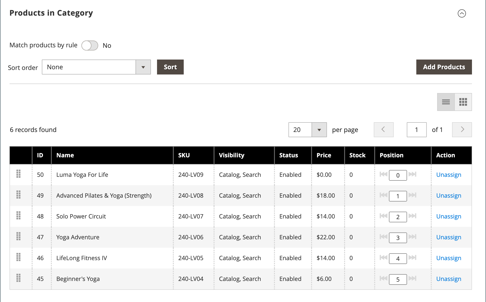

# Lägg till och ta bort kategoriprodukter

Från [Produkter i kategori](categories-product-assignments.md) kan en butiksadministratör lägga till produkter i kategorin. I det här avsnittet visas alla produkter som har tilldelats kategorin och **[!UICONTROL Add Product]** när **[!UICONTROL Match products by rule]** är inställd på `No`.

{width="600" zoomable="yes"}

## Sök efter produkter att lägga till

1. På _Administratör_ sidebar, gå till **[!UICONTROL Catalog]** > **[!UICONTROL Categories]**.

1. I kategoriträdet till vänster väljer du den kategori där du vill lägga till en produkt.

1. Expandera  den _Produkter i kategori_ -avsnitt.

1. Klicka på **[!UICONTROL Add Products]**.

1. Använd _Sök efter nyckelord_ eller filter för att hitta de produkter du vill lägga till.

   {width="700" zoomable="yes"}

1. I _[!UICONTROL Assign]_kolumn, växla till `Yes` för varje produkt som du vill lägga till.

   Om du vill inkludera alla produkter som visas kan du klicka på menypilen i kolumnrubriken och välja **[!UICONTROL Select All]**.

1. Om du vill använda ändringarna klickar du på **[!UICONTROL Save and Close]**.

### Åtgärder

| Åtgärd | Beskrivning |
|--- |--- |
| [!UICONTROL Select All] | Markerar kryssrutan för alla poster i listan. |
| [!UICONTROL Unselect All] | Rensar kryssrutan för alla poster i listan. |
| [!UICONTROL Select All on This Page] | Markerar kryssrutan för poster på den aktuella sidan. |
| [!UICONTROL Deselect All on This Page] | Rensar kryssrutan för poster på den aktuella sidan. |

{style="table-layout:auto"}

## Lägg till produkter efter SKU

1. Klicka på **[!UICONTROL Add Products]**

1. Välj **[!UICONTROL Add Products by SKU]** -fliken.

1. Ange SKU (en per rad) och klicka **[!UICONTROL Assign]**.

   Klicka på **[!UICONTROL Remove]**.

   {width="700" zoomable="yes"}

1. Om du vill använda ändringarna klickar du på **[!UICONTROL Save and Close]**.

## Ta bort produkter från en kategori

1. På _Administratör_ sidebar, gå till **[!UICONTROL Catalog]** > **[!UICONTROL Categories]**.

1. Välj den kategori som du vill redigera i kategoriträdet till vänster.

1. Expandera  den _[!UICONTROL Products in Category]_-avsnitt.

1. Hitta de produkter som ska tas bort.

1. I _[!UICONTROL Actions]_kolumn, klicka **[!UICONTROL Unassign]**.

1. Om du vill använda ändringarna klickar du på **[!UICONTROL Save]**.
