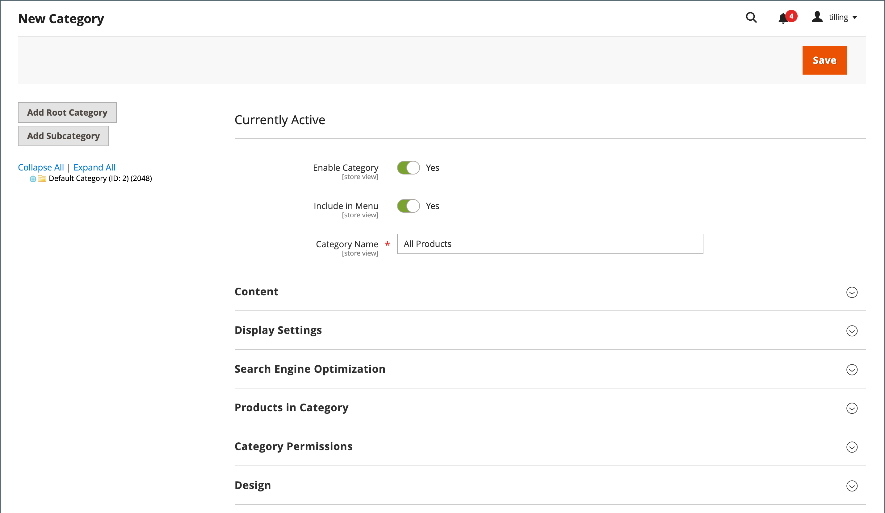

# Rotkategori och hierarki

Produkterna på huvudmenyn avgörs av rotkategorin som är tilldelad [butiken](../stores-purchase/stores.md#add-stores). Rotkategorin är i princip en behållare för huvudmenyn i kategoriträdet. Du kan skapa en rotkategori med en helt ny uppsättning produkter eller kopiera produkter från en befintlig rotkategori. Rotkategorin kan tilldelas den aktuella butiken eller en annan butik på samma webbplats.

{width="550"}

Från Admin fungerar kategoristrukturen som ett upp-och-ned-träd med roten överst. Roten har ett namn, men ingen URL-nyckel, och visas inte i butikens [övre navigering](navigation-top.md). Alla andra kategorier på menyn är kapslade under roten. Eftersom rotkategorin är den högsta nivån i katalogen, kan det bara finnas en rotkategori i taget. Du kan dock skapa ytterligare rotkategorier för alternativa katalogstrukturer och olika arkiv.

I följande exempel visas hur du skapar en rotkategori och tilldelar den till en annan butik.

## Steg 1: Skapa en rotkategori

1. Gå till **[!UICONTROL Catalog]** > **[!UICONTROL Categories]** på sidofältet _Admin_.

1. Klicka på **[!UICONTROL Add Root Category]** till vänster.

   {width="600" zoomable="yes"}

1. Ange **[!UICONTROL Category Name]**.

   Det namn du väljer tilldelas från början till alla butiksvyer.

1. Om du vill lägga till produkter i katalogen från den aktuella katalogen gör du följande:

   - Expandera  i avsnittet _Produkter i kategorin_.

   - Använd [sökfiltren](../getting-started/admin-grid-controls.md) för att hitta de produkter du vill ha och markera kryssrutan för varje produkt som du vill kopiera till den nya katalogen.

1. Klicka på **[!UICONTROL Save]** när du är klar.

## Steg 2: Skapa huvudmenyn

1. Till vänster väljer du den nya rotkategorin som du skapade i föregående steg.

1. Om du vill skapa [kategoristrukturen](category-create.md) för huvudmenyn klickar du på **[!UICONTROL Add Subcategory]** och följer instruktionerna.

## Steg 3: Tilldela rotkategorin till arkivet

1. Gå till **[!UICONTROL Stores]** > _[!UICONTROL Settings]_>**[!UICONTROL All Stores]**på sidofältet_ Admin _.

1. Klicka på den butik som du vill tilldela den nya katalogen i kolumnen _Lagrar_ i rutnätet.

1. Ange **[!UICONTROL Root Category]** till den nya rotkategorin som du skapade.

1. Kontrollera att arkivet har tilldelats **[!UICONTROL Default Store View]**.

   Butiken måste ha minst en [butiksvy](../stores-purchase/store-views.md).

1. Klicka på **[!UICONTROL Save Store]** när du är klar.

1. Så här kontrollerar du att butiken har en ny katalog:

   - Gå till **[!UICONTROL Catalog]** > **[!UICONTROL Products]** på sidofältet _Admin_.

     Alla produkter som kopierades till den nya katalogen visas i rutnätet.

   - Kontrollera att den nya katalogen och huvudmenyn fungerar som de ska genom att gå till butiken.
