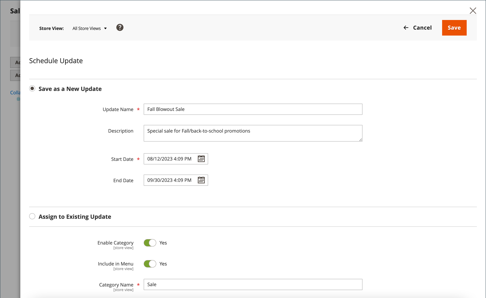

# Schemalagda ändringar för kategorier

{{ee-feature}}

Kategoriuppdateringar kan tillämpas enligt schema och grupperas med andra innehållsändringar. Du kan skapa en kampanj baserat på schemalagda ändringar av kategorin eller tillämpa ändringarna på en befintlig kampanj. Mer information finns på [Innehållsmellanlagring](../content-design/content-staging.md).

>[!NOTE]
>
>The [!UICONTROL Schedule Design Update] har tagits bort från  Adobe Commerce och kan inte ändras direkt i kategorin. Du måste skapa en schemalagd uppdatering för dessa aktiveringar.

>[!NOTE]
>
>Alla schemalagda uppdateringar tillämpas i följd, vilket innebär att alla enheter bara kan ha en schemalagd uppdatering åt gången. Alla schemalagda uppdateringar tillämpas på alla butiksvyer inom tidsramen. Därför kan en enhet inte ha flera schemalagda uppdateringar för olika butiksvyer samtidigt. Alla värden för entitetsattribut i alla butiksvyer, som inte påverkas av den aktuella schemalagda uppdateringen, hämtas från standardvärdena och inte från den tidigare schemalagda uppdateringen.

## Schemalägg en uppdatering av en kategori

1. På _Administratör_ sidebar, gå till **[!UICONTROL Catalog]** > **[!UICONTROL Categories]**.

1. Välj den kategori som ska ändras i kategoriträdet till vänster.

1. I _Schemalagda ändringar_ överst på sidan klickar du på **[!UICONTROL Schedule New Update]**.

   {width="600" zoomable="yes"}

1. Med **[!UICONTROL Save as a New Update]** om du väljer det här alternativet anger du de grundläggande parametrarna för uppdateringen:

   - För **[!UICONTROL Update Name]** anger du ett namn för den nya innehållstagningskampanjen.

   - Ange en kort beskrivning **[!UICONTROL Description]** av uppdateringen och hur den ska användas.

   - Använd kalendern (  ) för att välja **[!UICONTROL Start Date]** och **[!UICONTROL End Date]** för kampanjen.

   >[!IMPORTANT]
   >
   >Campaign **[!UICONTROL Start Date]** och **[!UICONTROL End Date]** måste definieras med hjälp av **_standard_** Administratörens tidszon, som konverteras från den lokala tidszonen för varje webbplats. Om du till exempel har flera webbplatser i olika tidszoner där du vill starta en kampanj som baseras på en tidszon i USA måste du schemalägga en separat uppdatering för varje lokal tidszon. Du ställer in **[!UICONTROL Start Date]** och **[!UICONTROL End Date]** för varje, som konverteras från den lokala webbplatsens tidszon till standardtidszonen för administratörer.

   {width="600" zoomable="yes"}

1. Gör de ändringar som behövs för den schemalagda uppdateringen.

1. Klicka på om du vill förhandsgranska ändringarna **[!UICONTROL Preview]** i det övre högra knappfältet.

1. När du är klar klickar du på **[!UICONTROL Save]**.

## Tilldela till en befintlig uppdatering

1. På _Administratör_ sidebar, gå till **[!UICONTROL Catalog]** > **[!UICONTROL Categories]**.

1. Välj den kategori som ska ändras i kategoriträdet till vänster.

1. I _Schemalagda ändringar_ överst på sidan klickar du på **[!UICONTROL Schedule New Update]**.

1. Välj **[!UICONTROL Assign to Existing Campaign]**.

1. Leta reda på den kampanj som behövs och klicka på **[!UICONTROL Select]**.

1. Gör de ändringar som krävs i den schemalagda uppdateringen.

1. När du är klar klickar du på **[!UICONTROL Save]**.
