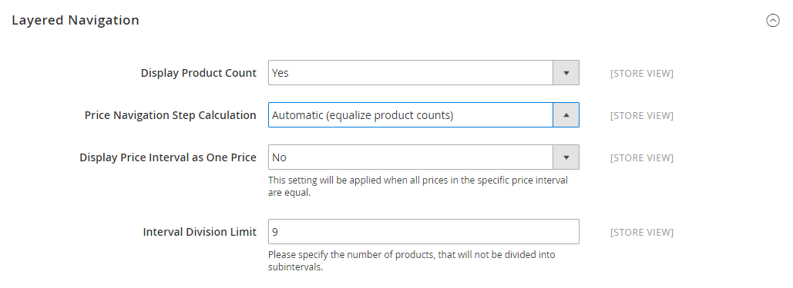

# Navigering i flera lager

>[!NOTE]
>
>Den standardnavigering i lager som beskrivs i det här avsnittet skiljer sig från filtrerad navigering i Live Search med [facets](https://experienceleague.adobe.com/docs/commerce-merchant-services/live-search/live-search-admin/facets/facets.html).

Navigering i flera lager gör det enkelt att hitta produkter baserat på kategori, prisintervall eller något annat tillgängligt attribut. Navigering med flera lager visas vanligtvis i den vänstra kolumnen med sökresultat och kategorisidor och ibland på hemsidan. Standardnavigeringen innehåller en _Köp av_ lista över kategorier och prisintervall. Du kan konfigurera visningen av lagerstyrd navigering, inklusive produktantal och prisintervall.

{width="700" zoomable="yes"}

## Filterbara attribut

>[!NOTE]
>
>De filterbara attributkraven som beskrivs i det här avsnittet skiljer sig åt för [Live Search](https://experienceleague.adobe.com/docs/commerce-merchant-services/live-search/overview.html). Mer information finns på [Fasetter](https://experienceleague.adobe.com/docs/commerce-merchant-services/live-search/live-search-admin/facets/facets.html).

Navigering i flera lager kan användas för att söka efter produkter efter kategori eller attribut. När en kund t.ex. väljer kategorin Mens/Korts i den övre navigeringen innehåller de inledande resultaten alla produkter i kategorin. Du kan filtrera listan ytterligare genom att välja ett specifikt format, klimat, färg, material, mönster eller pris, eller en kombination av värden. Filterbara attribut visas i ett expanderande avsnitt som visar varje attributvärde. Som ett alternativ kan listan med produkter med matchande resultat konfigureras så att den innehåller produkter med eller utan en matchning.

Attributegenskaperna, i kombination med produktindatatypen, avgör vilka attribut som kan användas för lagerstyrd navigering. Navigering i flera lager är bara tillgängligt för [_ankare_](categories-display-settings.md) -kategorier, men kan även läggas till på sökresultatsidor. The **Katalogindatatyp för butiksägare** egenskapen för varje attribut måste anges till `Yes/No`, `Dropdown`, `Multiple Select`, eller `Price`. Om du vill göra attributen filterbara **Använd i navigering i lager** måste egenskapen för var och en anges till antingen `Filterable (with results)` eller `Filterable (no results)`.

_Exempel: Filterbara attribut med resultat_

{width="700" zoomable="yes"}

_Exempel: Filterbara värden för färgrutor utan resultat_

{width="700" zoomable="yes"}

Följande instruktioner visar hur du ställer in grundläggande lagerstyrd navigering med filterbara attribut. Om du vill ha avancerad navigering i flera lager med prissteg går du till [Prisnavigering](navigation-layered.md#configure-price-navigation).

## Steg 1: Ange attributegenskaperna

1. På _Administratör_ sidebar, gå till **[!UICONTROL Stores]** > _[!UICONTROL Attributes]_>**[!UICONTROL Product]**.

1. Bläddra eller använd filtrerad sökning för att hitta ett attribut i listan och öppna det i redigeringsläge.

   {width="700" zoomable="yes"}

1. Välj **[!UICONTROL Storefront Properties]** och ange **[!UICONTROL Use In Layered Navigation]** till något av följande:

   - `Filterable (with results)` - Navigering i flera lager innehåller endast de filter för vilka matchande produkter kan hittas. Alla attributvärden som redan gäller för alla produkter som visas i listan bör fortfarande visas som ett tillgängligt filter. Attributvärden med antalet noll (0) produktmatchningar utelämnas från listan med tillgängliga filter. Den filtrerade listan innehåller bara de produkter som matchar filtret. Produktlistan uppdateras bara om de valda filtren ändrar vad som visas.

   - `Filterable (no results)` - Navigering i flera lager innehåller filter för alla tillgängliga attributvärden och deras produktantal, inklusive produkter med noll (0) produktmatchningar. Om attributvärdet är en färgruta visas värdet som ett filter, men stryks över. Prisnivåfiltrering stöds inte av det här alternativet och påverkar inte prisfilter.

1. Ange **[!UICONTROL Use In Search Results Layered Navigation]** till `Yes`.

   {width="600" zoomable="yes"}

1. Upprepa dessa steg för varje attribut som du vill inkludera i navigeringen i lager.

>[!NOTE]
>
>När _[!UICONTROL Use in Search]_inställningen är inställd på `No`,_[!UICONTROL Use in Search Results Layered Navigation]_ inställningen visas inte och produktattributet används inte i sökningen med [!UICONTROL Use in Layered Navigation] inställningsvärde.

>[!NOTE]
>
>The [!UICONTROL Position] är som standard nedtonat, så du måste spara attributet innan du kan ändra den här inställningen.

## Steg 2: Gör kategorin till en ankarpunkt

1. På _Administratör_ sidebar, gå till **[!UICONTROL Catalog]** > **[!UICONTROL Categories]**.

1. I kategoriträdet väljer du den kategori där du vill använda lagerstyrd navigering.

1. Expandera  den **[!UICONTROL Display Settings]** avsnitt och ange **[!UICONTROL Anchor]** till `Yes`.

   {width="600" zoomable="yes"}

1. Klicka på **[!UICONTROL Save]**.

## Steg 3: Testa resultaten

Testa inställningarna på din butik och navigera till kategorin på huvudmenyn. Urvalet av filterbara attribut visas i kategorinsidans lagernavigering.

Sök, filtrera och granska de visade produkterna.

## Ta bort filterbara attributvärden från navigering i lager

Navigering i flera lager innehåller filter för alla tillgängliga attributvärden och deras produktantal, inklusive produkter med noll (0) produktmatchningar (som i bilden nedan).

{width="700" zoomable="yes"}

Detta kan göra det svårt för kunderna att välja en föredragen produkt och det finns inget behov av att visa attributvärden &#x200B; &#x200B; med 0 produkter i frontend.

Du kan använda följande steg för att ta bort filterbara attributvärden med 0 produkter från lagernavigeringen:

1. På _Administratör_ sidebar, gå till **[!UICONTROL Stores]** > _[!UICONTROL Attributes]_>**[!UICONTROL Product]**.

1. Bläddra eller använd filtrerad sökning för att hitta ett attribut i listan och öppna det i redigeringsläge.

1. Under _[!UICONTROL Attribute Information]_, klicka **[!UICONTROL Storefront Properties]**.

1. För **[!UICONTROL Layered Navigation]**, välja `Filterable (with results)`.

   {width="600" zoomable="yes"}

1. Klicka på **[!UICONTROL Save Attribute]**.

## Prisnavigering

>[!NOTE]
>
>Den prisnavigeringskonfiguration som beskrivs i det här avsnittet skiljer sig åt för [Live Search](https://experienceleague.adobe.com/docs/commerce-merchant-services/live-search/overview.html).

Prisnavigering kan användas för att distribuera produkter efter prisintervall i lagernavigering. Du kan också dela upp varje intervall i intervall. Det finns några sätt att beräkna prisnavigering:

- Automatiskt (Utjämna prisintervall)
- Automatiskt (Utjämna produktantal)
- Manuell

Med de första två metoderna beräknas navigeringsstegen automatiskt. Med den manuella metoden kan du ange en divisionsgräns för prisintervall. I följande exempel visas skillnaden mellan prisnavigeringsstegen 10 och 100.

Iterativ uppdelning ger den bästa produktfördelningen mellan olika prisintervall. Med iterativ uppdelning kan kunden, efter att ha valt intervallet 0,00-99 USD, gå igenom flera olika prisintervall. Prisintervallsdelningen avbryts när antalet produkter når det tröskelvärde som anges av Avdelningsgränsen.

## Exempel: Prisnavigeringssteg

| Prissteg med 10 | Prissteg med 100 |
|----------|--------|
| 20,00 - 29,99 USD (1) | $0,00 - $99,99 (4) |
| 30,00-39,99 USD (2) | 100-199,99 USD (5) |
| 70,00-79,99 USD (1) | 400,00-499,99 USD (2) |
| 100,00 - 109,99 USD (1) | $700.00 och högre (1) |
| 120,00 - 129,99 USD (2) |   |
| 150,00 - 159,99 USD (1) |   |
| 180,00 - 189,99 USD (1) |   |
| 420,00 - 429,99 USD (1) |   |
| 440,00 - 449,99 USD (1) |   |
| $710.00 och högre (1) |   |

{style="table-layout:auto"}

## Konfigurera prisnavigering

>[!IMPORTANT]
>
>För korrekt visning av produkter och deras priser enligt _prisfilter_ i lagerstyrd navigering, se till att inställningarna för priset visas i [Momskonfiguration](../configuration-reference/sales/tax.md) har samma värde (`Excluding Tax` **eller** `Including Tax`). För _[!UICONTROL Calculation Settings]_, kontrollera **[!UICONTROL Catalog Prices]**värde. Och för_[!UICONTROL Price Display Settings]_, kontrollera **[!UICONTROL Display Product Prices in Catalog]** värde. Om de har olika värden kan prisfiltren i lagernavigeringen eventuellt inte filtrera och sortera produkter efter pris.

1. På _Administratör_ sidebar, gå till **[!UICONTROL Stores]** > _[!UICONTROL Settings]_>**[!UICONTROL Configuration]**.

1. Expandera på den vänstra panelen **[!UICONTROL Catalog]** och välja **[!UICONTROL Catalog]** under.

1. Expandera  den _Navigering i flera lager_ -avsnitt.

   Som standard **[!UICONTROL Display Product Count]** är inställd på `Yes`. Avmarkera vid behov **[!UICONTROL Use system value]** om du vill ändra inställningen.

   {width="600" zoomable="yes"}

   En detaljerad lista över dessa konfigurationsalternativ finns i [Navigering i flera lager](../configuration-reference/catalog/catalog.md#layered-navigation) i _Konfigurationsreferens_.

1. Ange **[!UICONTROL Price Navigation Steps Calculation]** för en av metoderna i följande avsnitt.

1. När du är klar klickar du på **[!UICONTROL Save Config]**.

### Metod 1: Automatisk (jämför prisintervall)

Lämna **[!UICONTROL Price Navigation Steps Calculation]** ange till `Automatic (Equalize Price Ranges)` (standard). Den här inställningen använder standardalgoritmen för prisnavigering.

### Metod 2: Automatisk (utjämna antalet produkter)

>[!TIP]
>
>Om det behövs avmarkerar du **[!UICONTROL Use system value]** om du vill ändra inställningarna.

1. Ange **[!UICONTROL Price Navigation Steps Calculation]** till `Automatic (equalize product counts)`.

1. Om du vill visa ett enda pris när flera produkter har samma pris anger du **[!UICONTROL Display Price Interval as One Price]** till `Yes`.

1. För **[!UICONTROL Interval Division Limit]** anger du tröskelvärdet för antalet produkter inom ett prisintervall.

   Intervallet kan inte delas ytterligare efter den här gränsen. Standardvärdet är `9`.

   {width="600" zoomable="yes"}

### Metod 3: Manuell

>[!NOTE]
>
>Om det behövs avmarkerar du **[!UICONTROL Use system value]** om du vill ändra inställningarna.

1. Ange **[!UICONTROL Price Navigation Steps Calculation]** till `Manual`.

1. Ange ett värde som bestämmer **[!UICONTROL Default Price Navigation Step]**.

1. Ange **[!UICONTROL Maximum Number of Price Intervals]** tillåtna, upp till `100`.

   {width="600" zoomable="yes"}

## Konfigurera lagernavigering

>[!NOTE]
>
>Standardkonfigurationen som beskrivs på den här sidan skiljer sig åt för [Live Search](https://experienceleague.adobe.com/docs/commerce-merchant-services/live-search/overview.html).

Konfigurationen för lagerstyrd navigering avgör om ett produktantal visas inom parentes efter varje attribut och storleken på stegberäkningen som används i prisnavigeringen.

1. På _Administratör_ sidebar, gå till **[!UICONTROL Stores]** > _[!UICONTROL Settings]_>**[!UICONTROL Configuration]**.

1. Expandera _[!UICONTROL Catalog]_och välja **[!UICONTROL Catalog]**under.

1. Expandera avsnittet _[!UICONTROL Layered Navigation]_.

   >[!NOTE]
   >
   >Om det behövs avmarkerar du **[!UICONTROL Use system value]** om du vill ändra inställningarna.

1. Om du vill visa antalet produkter som hittas för varje attribut anger du **[!UICONTROL Display Product Count]** till `Yes`.

1. Ange **[!UICONTROL Price Navigation Step Calculation]** till `Automatic (equalize price ranges)`.

1. När du är klar klickar du på **[!UICONTROL Save Config]**.
