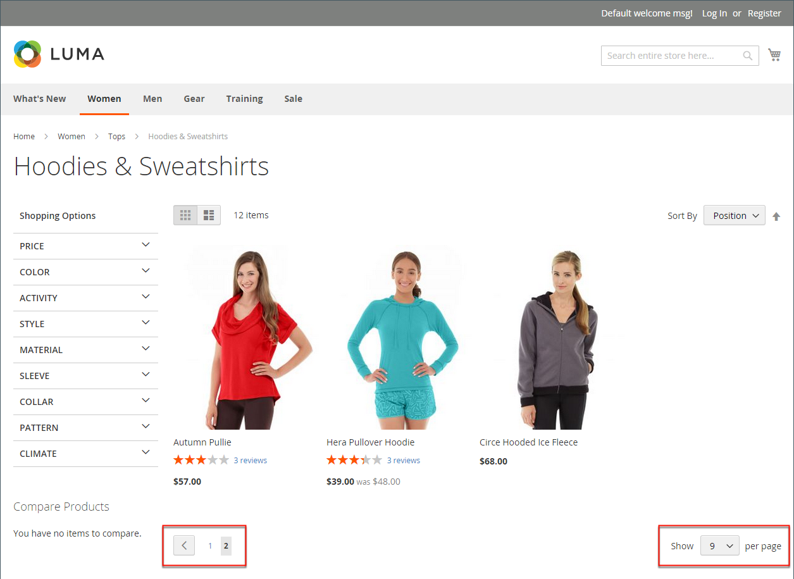

# Produktlistor

Produktlistor kan ställas in så att de visas som standard som antingen en lista eller ett rutnät. Du kan också bestämma hur många produkter som ska visas per sida och vilket attribut som ska användas för att sortera listan. Produktlistan innehåller en uppsättning kontroller som kan användas för att sortera produkterna, ändra listformatet, sortera efter attribut och gå från en sida till nästa.

>[!NOTE]
>
>När du sorterar en kategori efter ett produktattribut sorteras även produkter med samma attributvärden efter deras _[!UICONTROL Product ID]_i stigande ordning.

{width="700" zoomable="yes"}

## Konfigurera produktlistor

1. På _Administratör_ sidebar, gå till **[!UICONTROL Stores]** > _[!UICONTROL Settings]_>**[!UICONTROL Configuration]**.

1. Expandera på den vänstra panelen **[!UICONTROL Catalog]** och välja **[!UICONTROL Catalog]** under.

1. Expandera  den **[!UICONTROL Storefront]** -avsnitt.

   {width="600" zoomable="yes"}

   En detaljerad lista över dessa alternativ finns på [Storefront](../configuration-reference/catalog/catalog.md#storefront) i _Konfigurationsreferens_.

   >[!NOTE]
   >
   >För korrekt visning av produkter och deras priser enligt _produktsortering efter pris_ kontrollerar du att inställningarna för priset visas i dialogrutan [Momskonfiguration](../configuration-reference/sales/tax.md) har samma värde (`Excluding Tax` **eller** `Including Tax`). För _[!UICONTROL Calculation Settings]_, kontrollera **[!UICONTROL Catalog Prices]**värde. Och för_[!UICONTROL Price Display Settings]_, kontrollera **[!UICONTROL Display Product Prices in Catalog]** värde. Om de har olika värden kan prisfiltren i lagernavigeringen eventuellt inte filtrera och sortera produkter efter pris.

1. Ange standard **[!UICONTROL List Mode]** till något av följande:

   - `Grid Only`
   - `List Only`
   - `Grid (default) / List`
   - `List (default / Grid`

1. För **[!UICONTROL Products per Page on Grid Allowed Values]** anger du antalet produkter som ska visas per sida i stödrasterformat.

   Om du vill ange ett urval av värden avgränsar du varje tal med ett kommatecken.

1. För **[!UICONTROL Products per Page on Grid Default Value]** anger du standardantalet produkter som ska visas i rutnätet per sida.

1. För **[!UICONTROL Products per Page on List Allowed Values]** anger du antalet produkter som du vill ska visas per sida när de visas i listformat.

   Om du vill ange ett urval av värden avgränsar du varje tal med ett kommatecken.

1. För **[!UICONTROL Products per page on List Default Value]** anger du standardantalet produkter som visas i listan, per sida.

1. Ange **[!UICONTROL Product Listing Sorted by]** till standardattributet som ursprungligen används för att sortera listan.

1. För att ge kunderna möjlighet att lista alla produkter, ange **[!UICONTROL Allow All Products on Page]** till `Yes`.

1. Om du vill behålla alla sidnumreringsinställningar när kunderna bläddrar bland kataloglistorna anger du **[!UICONTROL Remember Category Pagination]** till `Yes`.

   Om du aktiverar den här inställningen behålls antalet produkter som visas i en lista eller rutnät när kunderna bläddrar från en kategori till en annan. Som standard är det här fältet inställt på `No` eftersom det använder mer cache-lagring och kan påverka hur sidor indexeras av sökmotorer.

1. Om du använder [platt katalog](catalog-flat.md) (**rekommenderas inte**) gör du följande:

   - Om du vill visa en platt kategorilista med produkter anger du **[!UICONTROL Use Flat Catalog Category]** till `Yes`.

   - Om du vill visa en platt produktlista anger du **[!UICONTROL Use Flat Catalog Product]** till `Yes`.

1. Om du vill tillåta dynamiska referenser för medieresurser i kategori- och produkt-URL:er anger du **[!UICONTROL Allow Dynamic Media URLs in Products and Categories]** till `Yes`.

1. När du är klar klickar du på **[!UICONTROL Save Config]**.

## Sidkontroller

| Kontroll | Beskrivning |
|--- |--- |
| [!UICONTROL View As] | Visar produkterna i antingen rutnät- eller listformat. |
| [!UICONTROL Sort By] | Ändrar sorteringsordningen för listan. |
| [!UICONTROL Show Per Page] | Avgör hur många produkter som visas per sida. |
| Sidnumreringslänkar | Navigering länkar till andra sidor. |

{style="table-layout:auto"}

## Sidnumreringskontroller

Sidnumreringsinställningarna visas högst upp och längst ned i listan och styr formatet på sidnumreringslänkarna för produktlistor. Du kan ange antalet länkar som ska visas i kontrollen och konfigurera länkarna Nästa och Föregående. För att sidnumreringslänkarna ska visas måste det finnas fler produkter i listan än vad som tillåts per sida i produktlistkonfigurationen.

{width="700" zoomable="yes"}

### Sidnumreringskontroller i Storefront

| Kontroll | Beskrivning |
|--- |--- |
|  | [!UICONTROL View As] - Visar listan i antingen rutnät- eller listformat. |
|  | [!UICONTROL Sort By] - Ändrar sorteringsordningen i listan. The _[!UICONTROL Used for Sorting in Product Listing]_egenskapen storefront avgör vilken [produktattribut](../catalog/product-attributes.md) kan användas för att sortera listan. |
|  | [!UICONTROL Show Per Page] - Anger hur många produkter som visas per sida. |
|  | Sidnumreringslänkar - Navigeringslänkar till andra sidor. |

{:style=&quot;table-layout:auto&quot;}

### Konfigurera sidnumreringskontrollerna

1. På _Administratör_ sidebar, gå till **[!UICONTROL Content]** > _[!UICONTROL Design]_>**[!UICONTROL Configuration]**.

1. Hitta den butiksvy som du vill konfigurera och, i dialogrutan **[!UICONTROL Action]** kolumn, klicka **[!UICONTROL Edit]**.

1. Under **[!UICONTROL Other Settings]**, expandera  den **[!UICONTROL Pagination]** -avsnitt.

   {width="600" zoomable="yes"}

   Mer information om de här inställningarna finns i [Designkonfiguration](../content-design/configuration.md).

1. För **[!UICONTROL Pagination Frame]** anger du antalet länkar som du vill ska visas i sidnumreringskontrollen.

1. För **[!UICONTROL Pagination Frame Skip]** anger du antalet länkar som du vill hoppa över innan du visar nästa uppsättning länkar i sidnumreringskontrollen.

   Om sidnumreringsramen t.ex. har fem länkar och du vill hoppa till de kommande fem länkarna, hur många länkar vill du hoppa över? Om du anger värdet till fyra (`4`) är den sista länken från den föregående uppsättningen den första länken i nästa uppsättning.

1. För **[!UICONTROL Anchor Text for Previous]** anger du den text som du vill ska visas för länken Föregående.

   Lämna tomt om du vill använda standardpilen.

1. För **[!UICONTROL Anchor Text for Next]** anger du den text som du vill ska visas för länken Nästa. Lämna tomt om du vill använda standardpilen.

1. När du är klar klickar du på **[!UICONTROL Save Configuration]**.
