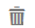
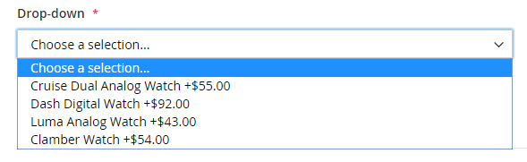

# Paketprodukt

Ett paket är en _bygga din egen_, anpassningsbar produkt. Varje artikel i ett paket kan baseras på någon av följande produkttyper:

- [Enkel produkt](product-create-simple.md)
- [Virtuell produkt](product-create-virtual.md)

{width="700" zoomable="yes"}

Alternativen visas när kunden klickar på antingen **[!UICONTROL Customize]** eller **[!UICONTROL Add to Cart]**. Eftersom produkterna som ingår i paketet varierar kan SKU, Price och Weight anges som antingen ett dynamiskt eller fast värde.

>[!NOTE]
>
>Det lägsta kampanjpriset är inte tillgängligt för paketprodukter som använder dynamiska priser.

>[!NOTE]
>
>Överordnad paketprodukt visas alltid automatiskt som en merförsäljningsprodukt för alla dess underordnade produkter.

If [Omedelbart köp](../stores-purchase/checkout-instant-purchase.md) är tillgänglig, _Omedelbart köp_ visas under _Lägg i kundvagnen_ för varje objekt i paketet.

{width="600" zoomable="yes"}

Följande instruktioner tar dig igenom processen med att skapa en paketprodukt med en [produktmall](attribute-sets.md), obligatoriska fält och grundläggande inställningar. Varje obligatoriskt fält markeras med en röd asterisk (`*`). När du är klar med grunderna kan du slutföra de andra produktinställningarna efter behov.

## Steg 1: Välj produkttyp

1. På _Administratör_ sidebar, gå till **[!UICONTROL Catalog]** > **[!UICONTROL Products]**.

1. I det övre högra hörnet på _[!UICONTROL Add Product]_( {width="25"} ) väljer du **[!UICONTROL Bundle Product]**.

   {width="700" zoomable="yes"}

## Steg 2: Välj attributuppsättning

Välj [attributuppsättning](attribute-sets.md) som används som mall för produkten gör du något av följande:

- För **[!UICONTROL Search]**, ange namnet på attributuppsättningen,
- I listan väljer du den attributuppsättning som du vill använda.

Formuläret uppdateras för att återspegla ändringen.

{width="600" zoomable="yes"}

## Steg 3: Slutför de obligatoriska inställningarna

1. Ange produkten **[!UICONTROL Product Name]**.

1. Godkänn standardinställningen **[!UICONTROL SKU]** som baseras på produktnamnet eller anger ett annat värde.

   Så här avgör du vilken typ av SKU som tilldelas till varje källartikel:

   - A **[!UICONTROL Dynamic SKU]** kan tilldelas automatiskt till varje paketobjekt genom att lägga till ett suffix till standard-SKU:n. Som standard är den inställd på `Yes`.

   - Om du vill tilldela en unik SKU för varje paketartikel anger du **[!UICONTROL Dynamic SKU]** till `No`.

   {width="600" zoomable="yes"}

1. Gör något av följande för att fastställa paketpriset:

   - Om priset ska återspegla de alternativ som kunden valt anger du **[!UICONTROL Dynamic Price]** till `Yes` och lämna **[!UICONTROL Price]** tom.

   - Ange ett fast pris för paketet **[!UICONTROL Dynamic Price]** till `No` och anger **[!UICONTROL Price]** som du vill debitera för paketet.

   >[!NOTE]
   >
   >[!UICONTROL Special Price] och [!UICONTROL Customer Group Price] (Pris) anges alltid som rabattprocent för alla paketprodukttyper.

1. Eftersom produkten ännu inte är klar att publiceras kan du ange **[!UICONTROL Enable Product]** till `No`.

1. Klicka **[!UICONTROL Save]** och fortsätta.

   När produkten sparas kan du [Butiksvy](introduction.md#product-scope) Väljaren visas i det övre vänstra hörnet.

1. Välj **[!UICONTROL Store View]** där produkten ska finnas tillgänglig.

   {width="600" zoomable="yes"}

## Steg 4: Slutför de grundläggande inställningarna

1. Om paketet har fast pris anger du **[!UICONTROL Tax Class]** till något av följande:

   - `None`
   - `Taxable Goods`

   Om paketet har Dynamic Pricing bestäms momsen för **_var_** paketobjekt. Om paketet har fast pris, bestäms momsen för **_hel_** paketprodukt.

1. Observera följande:

   - The **[!UICONTROL Quantity]** är inte tillgängligt eftersom värdet bestäms för varje paketartikel.

   - Som standard är **[!UICONTROL Stock Status]** är inställd på `In Stock`.

1. Gör något av följande för att bestämma paketets vikt:

   - Om du vill att vikten ska återspegla de alternativ som kunden valt anger du **[!UICONTROL Dynamic Weight]** set `Yes` och lämna **[!UICONTROL Weight]** tom.

   - Ange en fast vikt för paketet **[!UICONTROL Dynamic Weight]** till `No` och anger **[!UICONTROL Weight]** av paketet.

   {width="600" zoomable="yes"}

1. Så här visar du produkten i listan över [nya produkter](../content-design/widget-new-products-list.md)väljer du **[!UICONTROL Set Product as New]** kryssrutan.

1. Acceptera standardinställningen **[!UICONTROL Visibility]** inställning för `Catalog, Search`.

1. Tilldela _[!UICONTROL Categories]_till produkten klickar du på&#x200B;**[!UICONTROL Select…]**och gör något av följande:

   **Välj en befintlig kategori:**

   - Börja skriva i rutan tills du hittar en matchning.

   - Markera kryssrutan för varje kategori som ska tilldelas.

   {width="600" zoomable="yes"}

   **Skapa en kategori:**

   - Klicka på **[!UICONTROL New Category]**.

   - Ange **[!UICONTROL Category Name]** och väljer **[!UICONTROL Parent Category]** som bestämmer dess placering i menystrukturen.

   - Klicka på **[!UICONTROL Create Category]**.

1. Välj **[!UICONTROL Country of Manufacture]**.

   Det kan finnas ytterligare attribut som beskriver produkten. Markeringen varierar attributuppsättningen och du kan slutföra dem senare.

## Steg 5: Lägg till paketobjekten

The _[!UICONTROL Bundle Items]_-avsnittet används för att lägga till artiklar i en paketprodukttyp och för att redigera det aktuella urvalet av artiklar.

{width="600" zoomable="yes"}

1. Bläddra nedåt till _Paketera objekt_ avsnitt och ange **[!UICONTROL Ship Bundle Items]** till något av följande:

   - `Separately`
   - `Together`

   Om du väljer `Together`måste alla paketartiklar tilldelas samma [källa](../inventory-management/sources-manage.md).

1. Klicka **[!UICONTROL Add Option]** och gör följande:

   - Ange en **[!UICONTROL Option Title]** som ska användas som fältetikett.

   - Ange **[!UICONTROL Input Type]** till något av följande:

      - `Drop-down`
      - `Radio buttons`
      - `Checkbox`
      - `Multiple Select`

   - Om du vill göra fältet till en obligatorisk post väljer du **[!UICONTROL Required]** kryssrutan.

   - Klicka **[!UICONTROL Add Products to Option]** och markera kryssrutan för varje produkt som du vill ta med i det här alternativet.

     Om det finns många produkter använder du listfiltren och sidnumreringskontrollerna för att hitta de produkter du behöver.

   - Klicka på **[!UICONTROL Add Selected Products]**.

     {width="600" zoomable="yes"}

   - När objekten visas i _Alternativ_ väljer du ett objekt som **[!UICONTROL Default]** markering.

   - I _Standardantal_ anger du kvantiteten för varje artikel som ska läggas till i paketet när en kund väljer artikeln.

   - Om du vill tillåta kunderna att ändra kvantiteten för en paketartikel väljer du **[!UICONTROL User Defined]**.

     >[!NOTE]
     >
     >Kvantiteten kan vara ett förinställt eller användardefinierat värde. Tilldela emellertid inte _[!UICONTROL User Defined]_till kryssruta eller indatatyper som har markerats flera gånger.

     Som standard kan kunden inte ändra standardkvantiteten som ingår i en paketartikel. Kunden kan dock ange den kvantitet av artikeln som ska inkluderas i paketet.

     Om till exempel standardkvantiteten för Sprite-statussamlingen är inställd på `2` och kundorder `4` av denna paketoption är det totala antalet köpta kulor `8`.

     {width="600" zoomable="yes"}

1. Upprepa dessa steg för varje objekt som du vill lägga till i paketet.

1. Om du vill ändra objektens ordning i ett paketavsnitt klickar du på _Flytta_ (  ) i början av raden och dra objektet till rätt plats.

   {width="600" zoomable="yes"}

   Du kan också ändra objektens ordning i data för en exporterad paketprodukt och sedan importera den igen till katalogen. Mer information finns i [Importerar paketprodukter](../systems/data-transfer-bundle-products.md).

   Om du vill få en bättre vy över arbetsytan kan du komprimera varje avsnitt först och sedan dra dem till rätt plats.

1. Om du vill ta bort ett objekt från paketet klickar du på **[!UICONTROL Delete]** (  ).

1. När du är klar klickar du på **[!UICONTROL Save]**.

## Steg 6: Fyll i produktinformationen

Bläddra nedåt och fyll i informationen i följande avsnitt efter behov:

- [Innehåll](product-content.md)
- [Bilder och video](product-images-and-video.md)
- [Sökmotoroptimering](product-search-engine-optimization.md)
- [Samhörande produkter, merförsäljning och korsförsäljning](related-products-up-sells-cross-sells.md)
- [Anpassningsbara alternativ](settings-advanced-custom-options.md)
- [Produkter på webbplatser](settings-basic-websites.md)
- [Design](settings-advanced-design.md)
- [Presentalternativ](product-gift-options.md)

## Steg 7: Publicera produkten

1. Om du är redo att publicera produkten i katalogen anger du **[!UICONTROL Enable Product]** till `Yes` (  ).

1. Gör något av följande:

   **Metod 1:** Spara och förhandsgranska

   - Klicka på i det övre högra hörnet **[!UICONTROL Save]**.

   - Om du vill visa produkten i din butik väljer du **[!UICONTROL Customer View]** på _Administratör_ (  ).

     Butiken öppnas på en ny flik i webbläsaren.

   {width="600" zoomable="yes"}

   **Metod 2:** Spara och stäng

   På _[!UICONTROL Save]_( {width="25"} ) väljer du **[!UICONTROL Save & Close]**.

## Indatakontroller

| Kontroll | Beskrivning | Exempel |
|--- |--- |--- |
| [!UICONTROL Drop-down] | Visar en listruta med alternativ för produktnamn och pris. Det går bara att markera ett objekt. | {width="200"} |
| [!UICONTROL Radio Buttons] | Visar en alternativknapp för varje alternativ, följt av produktnamn och pris. Det går bara att markera ett objekt. | {width="200"} |
| [!UICONTROL Checkbox] | Visar en kryssruta för varje alternativ, följt av produktnamn och pris. Du kan markera flera objekt. | {width="200"} |
| [!UICONTROL Multiple Select] | Visar en lista med alternativ med produktnamn och pris. Om du vill markera flera objekt håller du ned Ctrl (PC) eller Kommando (Mac) och klickar på varje objekt. | {width="200"} |

{style="table-layout:auto"}

## Fältbeskrivningar

| Fält | Beskrivning |
|--- |--- |
| [!UICONTROL SKU] | Avgör om varje objekt tilldelas en variabel eller dynamisk SKU eller om en fast SKU används för paketet. Alternativ: `Fixed` / `Dynamic` |
| [!UICONTROL Weight] | Anger om vikten beräknas baserat på de valda artiklarna eller är en fast vikt för hela paketet. Alternativ: `Fixed` / `Dynamic` |
| [!UICONTROL Price View] | Avgör om produktpriset visas som ett intervall, från det billigaste till det mest dyra (prisintervall) eller med det billigaste (som lägst). Alternativ: `Price Range` / `As Low As` |
| Leveranspaket | Anger om enskilda artiklar kan levereras separat. |

{style="table-layout:auto"}

## Produktlagerstatus för paket

Produktlagerstatus för paket är **_ändras automatiskt till Utanför lager_** när något av dessa scenarier inträffar:

- Alla alternativ är valfria och alla tillhörande produkter är _Slut på lager_.

- Vissa alternativ är obligatoriska och produkter som är kopplade till obligatoriska alternativ är _Slut på lager_.

Produktlagerstatus för paket är **_ändras inte automatiskt till Ej i lager_** när något av dessa scenarier inträffar:

- Alla alternativ är valfria och minst en tillhörande produkt är _I Stock_.

- Vissa alternativ krävs och minst en associerad produkt i varje obligatoriskt alternativ är _I Stock_.

## Saker att komma ihåg

 Kunderna kan _bygga egna_ paketprodukt.

 Paketobjekt kan vara enkla eller virtuella produkter utan anpassade alternativ.

 Prisvyn kan anges till antingen `Price Range` eller `As Low As`.

 SKU och Weight kan vara `Fixed` eller `Dynamic`.

 Kvantiteten kan vara ett förinställt eller användardefinierat värde. Tilldela emellertid inte _[!UICONTROL User Defined]_till kryssruta eller indatatyper som har markerats flera gånger.

 Paketartiklar kan levereras tillsammans eller separat.

 Överordnad paketprodukt visas alltid automatiskt som en merförsäljningsprodukt för alla dess underordnade produkter.

 [!UICONTROL Special Price] och [!UICONTROL Customer Group Price] (Pris) anges alltid som rabattprocent för alla paketprodukttyper.