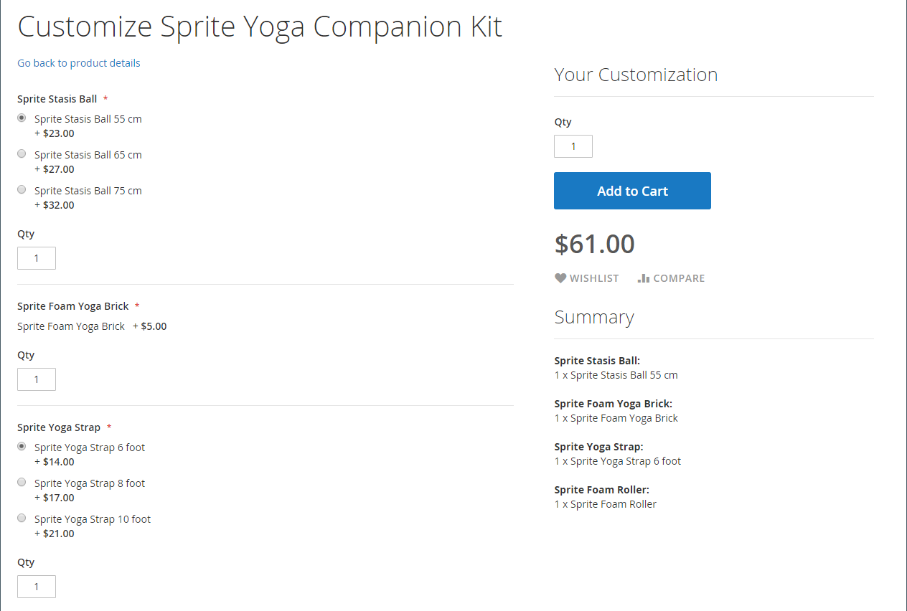
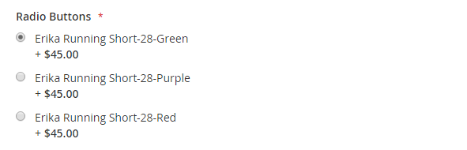

# Paketprodukt

Ett paket är en _bygg en egen_, anpassningsbar produkt. Varje artikel i ett paket kan baseras på någon av följande produkttyper:

- [Enkel produkt](product-create-simple.md)
- [Virtuell produkt](product-create-virtual.md)

{width="700" zoomable="yes"}

Alternativen visas när kunden klickar på antingen **[!UICONTROL Customize]** eller **[!UICONTROL Add to Cart]**. Eftersom produkterna som ingår i paketet varierar kan SKU, Price och Weight anges som antingen ett dynamiskt eller fast värde.

>[!NOTE]
>
>Det lägsta kampanjpriset är inte tillgängligt för paketprodukter som använder dynamiska priser.

>[!NOTE]
>
>Överordnad paketprodukt visas alltid automatiskt som en merförsäljningsprodukt för alla dess underordnade produkter.

Om [Direktköp](../stores-purchase/checkout-instant-purchase.md) är tillgängligt visas knappen _Direktköp_ nedanför knappen _Lägg till i kundvagnen_ för varje objekt i paketet.

{width="600" zoomable="yes"}

Följande instruktioner tar dig genom processen att skapa en paketprodukt med hjälp av en [produktmall](attribute-sets.md), obligatoriska fält och grundläggande inställningar. Alla obligatoriska fält är markerade med en röd asterisk (`*`). När du är klar med grunderna kan du slutföra de andra produktinställningarna efter behov.

## Steg 1: Välj produkttyp

1. Gå till **[!UICONTROL Catalog]** > **[!UICONTROL Products]** på sidofältet _Admin_.

1. Välj **[!UICONTROL Bundle Product]** i det övre högra hörnet på menyn _[!UICONTROL Add Product]_( {width="25"} ).

   {width="700" zoomable="yes"}

## Steg 2: Välj attributuppsättning

Gör något av följande om du vill välja den [attributuppsättning](attribute-sets.md) som används som mall för produkten:

- För **[!UICONTROL Search]** anger du namnet på attributuppsättningen,
- I listan väljer du den attributuppsättning som du vill använda.

Formuläret uppdateras för att återspegla ändringen.

{width="600" zoomable="yes"}

## Steg 3: Slutför de obligatoriska inställningarna

1. Ange produkten **[!UICONTROL Product Name]**.

1. Acceptera standardvärdet **[!UICONTROL SKU]** som baseras på produktnamnet eller ange ett annat värde.

   Så här avgör du vilken typ av SKU som tilldelas till varje källartikel:

   - En **[!UICONTROL Dynamic SKU]** kan tilldelas automatiskt till varje källobjekt genom att ett suffix läggs till i standard-SKU:n. Som standard är den inställd på `Yes`.

   - Om du föredrar att tilldela en unik SKU för varje paketobjekt anger du **[!UICONTROL Dynamic SKU]** till `No`.

   {width="600" zoomable="yes"}

1. Gör något av följande för att fastställa paketpriset:

   - Om du vill att priset ska återspegla de alternativ som valts av kunden anger du **[!UICONTROL Dynamic Price]** till `Yes` och lämnar **[!UICONTROL Price]** tomt. I det här fallet har en paketprodukt inte ett eget pris från katalogen, och produktpriset härleds från priset för de enskilda produkter som ingår i paketet.

   - Om du vill debitera ett fast pris för paketet anger du **[!UICONTROL Dynamic Price]** till `No` och anger **[!UICONTROL Price]** som du vill debitera för paketet.

   >[!NOTE]
   >
   >[!UICONTROL Special Price] och [!UICONTROL Customer Group Price] (Tier Price) anges alltid som rabattprocent för alla paketprodukttyper.

1. Eftersom produkten ännu inte är klar att publiceras anger du **[!UICONTROL Enable Product]** till `No`.

1. Klicka på **[!UICONTROL Save]** och fortsätt.

   När produkten sparas visas väljaren [Store View](introduction.md#product-scope) i det övre vänstra hörnet.

1. Välj den **[!UICONTROL Store View]** där produkten ska vara tillgänglig.

   {width="600" zoomable="yes"}

## Steg 4: Slutför de grundläggande inställningarna

1. Om paketet har fast pris anger du **[!UICONTROL Tax Class]** till något av följande:

   - `None`
   - `Taxable Goods`

   Om paketet har dynamiska priser bestäms momsen för **_varje_**-paketobjektet. Om paketet har fast pris fastställs momsen för paketprodukten **_hel_**.

1. Observera följande:

   - **[!UICONTROL Quantity]** är inte tillgänglig eftersom värdet har bestämts för varje paketobjekt.

   - Som standard är **[!UICONTROL Stock Status]** inställd på `In Stock`.

1. Gör något av följande för att bestämma paketets vikt:

   - Om du vill att vikten ska återspegla de alternativ som valts av kunden anger du **[!UICONTROL Dynamic Weight]**, anger `Yes` och lämnar **[!UICONTROL Weight]** tomt.

   - Om du vill tilldela en fast vikt till paketet anger du **[!UICONTROL Dynamic Weight]** till `No` och anger **[!UICONTROL Weight]** för paketet.

   {width="600" zoomable="yes"}

1. Markera kryssrutan **[!UICONTROL Set Product as New]** om du vill visa produkten i listan över [nya produkter](../content-design/widget-new-products-list.md).

1. Acceptera standardinställningen **[!UICONTROL Visibility]** för `Catalog, Search`.

1. Om du vill tilldela _[!UICONTROL Categories]_&#x200B;till produkten klickar du på rutan **[!UICONTROL Select…]**&#x200B;och gör något av följande:

   **Välj en befintlig kategori:**

   - Börja skriva i rutan tills du hittar en matchning.

   - Markera kryssrutan för varje kategori som ska tilldelas.

   {width="600" zoomable="yes"}

   **Skapa en kategori:**

   - Klicka på **[!UICONTROL New Category]**.

   - Ange **[!UICONTROL Category Name]** och välj **[!UICONTROL Parent Category]** som avgör dess position i menystrukturen.

   - Klicka på **[!UICONTROL Create Category]**.

1. Välj **[!UICONTROL Country of Manufacture]**.

   Det kan finnas ytterligare attribut som beskriver produkten. Markeringen varierar attributuppsättningen och du kan slutföra dem senare.

## Steg 5: Lägg till paketobjekten

Avsnittet _[!UICONTROL Bundle Items]_&#x200B;används för att lägga till objekt i en paketprodukttyp och för att redigera det aktuella urvalet av objekt.

{width="600" zoomable="yes"}

1. Bläddra ned till avsnittet _Paketobjekt_ och ställ in **[!UICONTROL Ship Bundle Items]** på något av följande:

   - `Separately`
   - `Together`

   Om du väljer `Together` måste alla paketobjekt tilldelas samma [källa](../inventory-management/sources-manage.md).

1. Klicka på **[!UICONTROL Add Option]** och gör följande:

   - Ange en **[!UICONTROL Option Title]** som ska användas som fältetikett.

   - Ange **[!UICONTROL Input Type]** till något av följande:

      - `Drop-down`
      - `Radio buttons`
      - `Checkbox`
      - `Multiple Select`

   - Markera kryssrutan **[!UICONTROL Required]** om du vill göra fältet till en obligatorisk post.

   - Klicka på **[!UICONTROL Add Products to Option]** och markera kryssrutan för varje produkt som du vill inkludera i det här alternativet.

     Om det finns många produkter använder du listfiltren och sidnumreringskontrollerna för att hitta de produkter du behöver.

   - Klicka på **[!UICONTROL Add Selected Products]**.

     {width="600" zoomable="yes"}

   - När objekten visas i avsnittet _Alternativ_ väljer du ett objekt som ska vara **[!UICONTROL Default]** -markeringen.

   - I kolumnen _Standardkvantitet_ anger du kvantiteten för varje artikel som ska läggas till i paketet när en kund väljer artikeln.

   - Om du vill tillåta kunder att ändra kvantiteten för ett paketobjekt väljer du **[!UICONTROL User Defined]**.

     >[!NOTE]
     >
     >Kvantiteten kan vara ett förinställt eller användardefinierat värde. Tilldela emellertid inte egenskapen _[!UICONTROL User Defined]_&#x200B;till kryssrutor eller indatatyper med flera val.

     Som standard kan kunden inte ändra standardkvantiteten som ingår i en paketartikel. Kunden kan dock ange den kvantitet av artikeln som ska inkluderas i paketet.

     Om till exempel standardantalet för Sprite-statussamlingen är `2` och kundbeställningarna `4` för det paketalternativet, blir det totala antalet köpta bollar `8`.

     {width="600" zoomable="yes"}

1. Upprepa dessa steg för varje objekt som du vill lägga till i paketet.

1. Om du vill ändra objektens ordning i ett paketavsnitt klickar du på ikonen _Flytta_ (  ) i början av raden och drar objektet till rätt plats.

   {width="600" zoomable="yes"}

   Du kan också ändra objektens ordning i data för en exporterad paketprodukt och sedan importera den igen till katalogen. Mer information finns i [Importera paketprodukter](../systems/data-transfer-bundle-products.md).

   Om du vill få en bättre vy över arbetsytan kan du komprimera varje avsnitt först och sedan dra dem till rätt plats.

1. Om du vill ta bort ett objekt från paketet klickar du på ikonen **[!UICONTROL Delete]** (  ).

1. Klicka på **[!UICONTROL Save]** när du är klar.

## Steg 6: Fyll i produktinformationen

Bläddra nedåt och fyll i informationen i följande avsnitt efter behov:

- [Innehåll](product-content.md)
- [Bilder och video](product-images-and-video.md)
- [Sökmotoroptimering](product-search-engine-optimization.md)
- [Samhörande produkter, merförsäljning och korsförsäljning](related-products-up-sells-cross-sells.md)
- [Anpassningsbara alternativ](settings-advanced-custom-options.md)
- [Produkter på webbplatser](settings-basic-websites.md)
- [Design](settings-advanced-design.md)
- [Presentalternativ](product-gift-options.md)

## Steg 7: Publish produkten

1. Om du är redo att publicera produkten i katalogen anger du **[!UICONTROL Enable Product]** till `Yes` (  ).

1. Gör något av följande:

   **Metod 1:** Spara och förhandsgranska

   - Klicka på **[!UICONTROL Save]** i det övre högra hörnet.

   - Om du vill visa produkten i din butik väljer du **[!UICONTROL Customer View]** på menyn _Admin_ (  ).

     Butiken öppnas på en ny flik i webbläsaren.

   {width="600" zoomable="yes"}

   **Metod 2:** Spara och stäng

   Välj **[!UICONTROL Save & Close]** på menyn _[!UICONTROL Save]_( {width="25"} ).

## Indatakontroller

| Kontroll | Beskrivning | Exempel |
|--- |--- |--- |
| [!UICONTROL Drop-down] | Visar en listruta med alternativ för produktnamn och pris. Det går bara att markera ett objekt. | {width="200"} |
| [!UICONTROL Radio Buttons] | Visar en alternativknapp för varje alternativ, följt av produktnamn och pris. Det går bara att markera ett objekt. | {width="200"} |
| [!UICONTROL Checkbox] | Visar en kryssruta för varje alternativ, följt av produktnamn och pris. Du kan markera flera objekt. | {width="200"} |
| [!UICONTROL Multiple Select] | Visar en lista med alternativ med produktnamn och pris. Om du vill markera flera objekt håller du ned Ctrl (PC) eller Kommando (Mac) och klickar på varje objekt. | {width="200"} |

{style="table-layout:auto"}

## Fältbeskrivningar

| Fält | Beskrivning |
|--- |--- |
| [!UICONTROL SKU] | Avgör om varje objekt tilldelas en variabel eller dynamisk SKU eller om en fast SKU används för paketet. Alternativ: `Fixed` / `Dynamic` |
| [!UICONTROL Weight] | Anger om vikten beräknas baserat på de valda artiklarna eller är en fast vikt för hela paketet. Alternativ: `Fixed` / `Dynamic` |
| [!UICONTROL Price View] | Avgör om produktpriset visas som ett intervall, från det billigaste till det mest dyra (prisintervall) eller med det billigaste (som lägst). Alternativ: `Price Range` / `As Low As` |
| Leveranspaket | Anger om enskilda artiklar kan levereras separat. |

{style="table-layout:auto"}

## Produktlagerstatus för paket

Bundle-produktlagerstatus ändras **_automatiskt till Utanför lager_** när något av följande inträffar:

- Alla alternativ är valfria och alla tillhörande produkter är _Utanför lager_.

- Vissa alternativ är obligatoriska och produkter som är kopplade till obligatoriska alternativ är _Utanför lager_.

Status för produktlager ändras **_inte automatiskt till Utanför lager_** när något av dessa scenarier inträffar:

- Alla alternativ är valfria och minst en associerad produkt är _I Stock_.

- Vissa alternativ krävs och minst en associerad produkt i varje obligatoriskt alternativ är _I Stock_.

## Saker att komma ihåg

 Kunder kan _skapa egna_ paketprodukter.

 Alla underordnade produkter tilldelas och frånkopplas från paketprodukten **_globalt_** för alla webbplatser, butiker och butiksvyer samtidigt.

 Paketobjekt kan vara enkla eller virtuella produkter utan anpassade alternativ.

 Prisvyn kan ställas in på `Price Range` eller `As Low As`.

 SKU och vikt kan vara antingen `Fixed` eller `Dynamic`.

 Kvantiteten kan vara en förinställning eller ett användardefinierat värde. Tilldela emellertid inte egenskapen _[!UICONTROL User Defined]_&#x200B;till kryssrutor eller indatatyper med flera val.

 Paketartiklar kan levereras tillsammans eller separat.

 Överordnad paketprodukt visas alltid som en merförsäljningsprodukt för alla dess underordnade produkter automatiskt.

 [!UICONTROL Special Price] och [!UICONTROL Customer Group Price] (pris) anges alltid som rabattprocent för alla paketprodukttyper.
