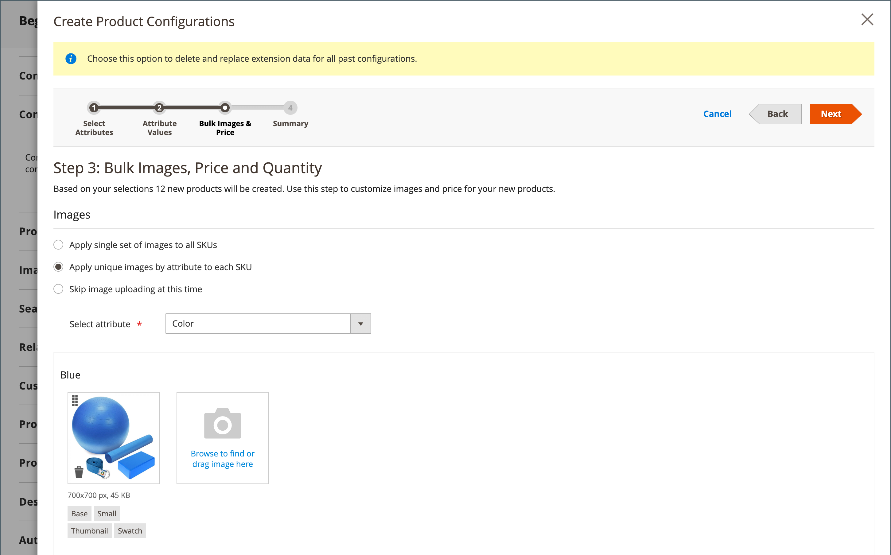

# Konfigurerbar produkt

En konfigurerbar produkt ser ut som en enskild produkt med en listruta över varje variant. Varje listartikel är i själva verket en separat enkel produkt med en unik SKU, som gör det möjligt att spåra lager för varje produktvariation. Du kan uppnå en liknande effekt genom att använda en enkel produkt med anpassade alternativ, men utan möjlighet att spåra lager för varje variation.

I följande instruktioner visas hur du skapar en konfigurerbar produkt med hjälp av en [produktmall](attribute-sets.md), obligatoriska fält och grundläggande inställningar. Alla obligatoriska fält är markerade med en röd asterisk (`*`). När du är klar med grunderna kan du slutföra de andra produktinställningarna efter behov.

{width="700" zoomable="yes"}

## Del 1: Skapa en konfigurerbar produkt

Även om en konfigurerbar produkt använder fler SKU:er och till att börja med tar lite längre tid att konfigurera, kan det spara tid i slutänden. Om du planerar att utöka din verksamhet är den konfigurerbara produkttypen ett bra val för produkter med flera alternativ.

Innan du börjar förbereder du en [attributuppsättning](attribute-sets.md) som innehåller ett attribut som är inställt på en av de tillåtna indatatyperna för varje produktvariant. Attributuppsättningen kan till exempel innehålla listruteattribut för färg och storlek.

Egenskaperna för varje attribut som används för en konfigurerbar produktvariation måste ha följande inställningar:

### Krav för produktvariantattribut

| Egenskap | Inställning |
|--- |--- |
| [!UICONTROL Scope] | `Global` |
| [!UICONTROL Catalog Input Type for Store Owner] | Indatatypen för alla attribut som används för en produktvariation måste vara något av följande: `Dropdown`, `Visual Swatch` eller `Text Swatch`. |
| [!UICONTROL Values Required] | `Yes` |

{style="table-layout:auto"}

### Steg 1: Välj produkttyp

1. Gå till _>_ på sidofältet **[!UICONTROL Catalog]** Admin **[!UICONTROL Products]**.

1. Välj _[!UICONTROL Add Product]_&#x200B;på menyn {width="25"}menypil **[!UICONTROL Configurable Product]**) i det övre högra hörnet.

   {width="700" zoomable="yes"}

### Steg 2: Välj attributuppsättning

[attributuppsättningen](attribute-sets.md) avgör vilka fält som används i produkten. Attributuppsättningen som används i följande exempel har attribut för färg och storlek. Attributuppsättningens namn anges högst upp på sidan och ställs från början in på `Default`.

1. Om du vill välja attributuppsättning för produkten klickar du på fältet överst på sidan och gör något av följande:

   - Ange namnet på attributuppsättningen för **[!UICONTROL Search]**.
   - I listan väljer du den attributuppsättning som du vill använda.

   Formuläret uppdateras för att återspegla ändringen.

1. Om du vill lägga till ytterligare ett attribut i attributuppsättningen klickar du på **[!UICONTROL Add Attribute]** och följer instruktionerna i [Lägga till ett attribut](product-attributes-add.md).

   {width="600" zoomable="yes"}

### Steg 3: Slutför de obligatoriska inställningarna

1. Ange produkten **[!UICONTROL Product Name]**.

1. Acceptera standardvärdet **[!UICONTROL SKU]** som baseras på produktnamnet eller ange ett annat.

1. Ange produkten **[!UICONTROL Price]**.

1. Eftersom produkten ännu inte är klar att publiceras anger du **[!UICONTROL Enable Product]** till `No`.

1. klicka på **[!UICONTROL Save]** och fortsätt.

   När produkten sparas visas väljaren [Store View](introduction.md#product-scope) i det övre vänstra hörnet.

1. Välj den **[!UICONTROL Store View]** där produkten ska vara tillgänglig.

   {width="600" zoomable="yes"}

### Steg 4: Slutför de grundläggande inställningarna

1. Ange **[!UICONTROL Tax Class]** till något av följande:

   - `None`
   - `Taxable Goods`

1. **[!UICONTROL Quantity]** bestäms av produktvariationerna, så du kan lämna den tom.

1. Lämna **[!UICONTROL Stock Status]** som angivet.

   Lagerstatus för en konfigurerbar produkt bestäms av varje associerad konfiguration. Eftersom produkten sparades utan att någon kvantitet angavs, är **[!UICONTROL Stock Status]** inställd på `Out of Stock`.

   >[!NOTE]
   >
   >**Stock-status** för den konfigurerbara produkten är en **_halvmanuell_** kontrollerad inställning. Den kontrolleras delvis av statusen Stock för dess underordnade produkter. Det ingår i en **_multikriterieberäkning_** för Stock-status, som beskrivs i avsnittet [Konfigurera Stock-status](#configure-the-stock-status).

1. Ange produkten **[!UICONTROL Weight]**.

>[!NOTE]
>
>En konfigurerbar produkt måste alltid ha en vikt. Om du väljer **[!UICONTROL This item has no weight]** i listrutan ändras den automatiskt till **[!UICONTROL This item has weight]** när du har sparat produkten.

1. Acceptera standardinställningen **[!UICONTROL Visibility]** för `Catalog, Search`.

1. Markera kryssrutan [ om du vill visa produkten i listan över ](../content-design/widget-new-products-list.md)nya produkter **[!UICONTROL Set Product as New]**.

1. Om du vill tilldela kategorier till produkten klickar du på rutan **[!UICONTROL Select…]** och gör något av följande:

   **Välj en befintlig kategori**:

   - Börja skriva i rutan tills du hittar en matchning.

   - Markera kryssrutan för den kategori som ska tilldelas.

   {width="600" zoomable="yes"}

   **Skapa en kategori**:

   - Klicka på **[!UICONTROL New Category]**.

   - Ange **[!UICONTROL Category Name]** och välj **[!UICONTROL Parent Category]** som avgör dess position i menystrukturen.

   s- Klicka på **[!UICONTROL Create Category]**.

1. Välj **[!UICONTROL Country of Manufacture]**.

   Det kan finnas ytterligare attribut som används för att beskriva produkten. Markeringen varierar efter attributuppsättning och du kan slutföra dem senare.

### Steg 5: Spara och fortsätt

Nu är ett bra tillfälle att spara ditt arbete. Klicka på **[!UICONTROL Save]** i det övre högra hörnet. I nästa serie steg ställer du in konfigurationerna för varje produktvariant.

## Del 2: Lägga till konfigurationer

I följande exempel visas hur du lägger till konfigurationer för tre färger och tre storlekar. Sammantaget skapas nio enkla produkter med unika SKU:er som täcker alla möjliga kombinationer av variationer. Som standard baseras produktnamnet och SKU:n för varje variation på attributvärdet och antingen det överordnade produktnamnet eller SKU:n.

Förloppsindikatorn högst upp på sidan visar var du befinner dig i processen och guidar dig genom varje steg.

### Steg 1: Välj attribut

1. Bläddra nedåt till avsnittet _[!UICONTROL Configurations]_&#x200B;och klicka på&#x200B;**[!UICONTROL Create Configurations]**&#x200B;om du fortsätter uppifrån.

   {width="600" zoomable="yes"}

1. Markera kryssrutan för alla attribut som du vill inkludera som en konfiguration.

   I det här exemplet är `color` och `size` markerade.

   {width="600" zoomable="yes"}

   Listan innehåller alla attribut från attributuppsättningen som kan användas i en konfigurerbar produkt.

1. Om du vill lägga till ett attribut klickar du på **[!UICONTROL Create New Attribute]** och gör följande:

   - Fyll i attributegenskaperna.

   - Klicka på **[!UICONTROL Save Attribute]**.

   - Markera kryssrutan för attributet.

1. Klicka på **[!UICONTROL Next]** i det övre högra hörnet.

### Steg 2: Ange attributvärden

1. För varje attribut markerar du kryssrutan för de värden som gäller för produkten.

   {width="600" zoomable="yes"}

1. Om du vill ordna om attributen, tar du ikonen _Ändra ordning_ (  ) och flyttar avsnittet till en ny plats.

   Ordningen bestämmer positionen för listrutorna på produktsidan.

1. Klicka på **[!UICONTROL Next]** i förloppsindikatorn.

### Steg 3: Konfigurera bilder, pris och kvantitet

I det här steget fastställs bilder, priser och kvantitet för varje konfiguration. De tillgängliga alternativen är desamma för alla, och du kan bara välja ett. Du kan använda samma inställning för alla SKU:er, använda en unik inställning för varje SKU:er eller hoppa över inställningarna för tillfället.

Välj de konfigurationsalternativ som gäller.

Använd någon av följande metoder för att konfigurera **[!UICONTROL images]**:

**Metod 1:** Använda en uppsättning bilder på alla SKU:er

1. Välj **[!UICONTROL Apply single set of images to all SKUs]**.

1. Bläddra till varje bild som du vill ta med i produktgalleriet eller dra dem till rutan.

{width="600" zoomable="yes"}

**Metod 2:** Använd unika bilder för varje SKU

Eftersom bilden för den överordnade produkten redan har överförts kan du använda det här alternativet för att överföra en bild av varje färg. Du kan lägga till en annan bild som visas i kundvagnen när någon köper artikeln i en viss färg.

1. Välj **[!UICONTROL Apply unique images by attribute to each SKU]**.

1. Markera **[!UICONTROL Attribute]** som bilderna illustrerar, till exempel `color`.

1. För varje attributvärde bläddrar du till de bilder du vill använda för den konfigurationen eller drar dem till rutan.

   Om du drar bilden till en värderuta visas den även i avsnitten för de andra värdena. Om du vill ta bort en bild klickar du på ikonen _Papperskorgen_ ().

   {width="600" zoomable="yes"}

Använd någon av följande metoder för att konfigurera **[!UICONTROL prices]**:

>[!NOTE]
>
>En konfigurerbar produkt har inte ett eget pris i katalogen. Det konfigurerbara produktpriset härleds från dess [!UICONTROL In Stock] underordnade produkter.

**Metod 1:** Använd samma pris på alla SKU:er

1. Om priset är detsamma för alla variationer väljer du **[!UICONTROL Apply single price to all SKUs]**.

1. Ange **[!UICONTROL Price]**.

   {width="600" zoomable="yes"}

**Metod 2:** Använd olika pris för varje SKU

1. Om priset skiljer sig för var och en eller för vissa variationer av produkten väljer du **[!UICONTROL Apply unique prices by attribute to each SKU]**.

1. Välj den **[!UICONTROL Attribute]** som utgör grunden för prisskillnaden.

1. Ange **[!UICONTROL Price]** för varje attributvärde.

   I det här exemplet kostar XL-storleken mer.

   {width="600" zoomable="yes"}

Använd någon av följande metoder för att konfigurera **[!UICONTROL Quantity]**:

**Metod 1:** Använd samma kvantitet för alla SKU:er

Om kvantiteten är densamma för alla SKU:er väljer du **[!UICONTROL Apply single quantity to each SKU]** och anger kvantiteten.

_Handlare med en enda källa_ - Ange **[!UICONTROL Quantity]**.

_Flera Source-handlare använder [Inventory management](../inventory-management/introduction.md)_ - Tilldela källor och lägg till kvantiteter för alla genererade produktvarianter:

1. Välj alternativet **[!UICONTROL Apply single quantity to each SKU]**.

1. Klicka på **[!UICONTROL Assign Sources]** om du vill lägga till en källa.

1. Bläddra eller sök efter en källa som du vill lägga till. Markera kryssrutan bredvid de källor som du vill lägga till för produkten.

1. Ange ett lagerbehållningsbelopp per källa.

   {width="600" zoomable="yes"}

**Metod 2:** Använd en annan kvantitet efter attribut

_Handlare med en enda källa_ - Ange **[!UICONTROL Quantity]**.

_Flera Source-handlare använder [Inventory management](../inventory-management/introduction.md)_ - Tilldela källor och lägg till kvantiteter för alla genererade produktvarianter:

1. Om kvantiteten är olika för varje SKU väljer du **[!UICONTROL Apply unique quantity by attribute to each SKU]**.

1. Ange **[!UICONTROL Quantity]** för varje.

   {width="600" zoomable="yes"}

När konfigurationen för bilder, pris och kvantitet är klar klickar du på **[!UICONTROL Next]** i det övre högra hörnet.

### Steg 4: Generera produktkonfigurationer

Vänta en stund tills produktlistan visas och gör något av följande:

- Om du är nöjd med konfigurationerna klickar du på **[!UICONTROL Generate Products]**.

- Klicka på **[!UICONTROL Back]** om du vill korrigera.

{width="600" zoomable="yes"}

De aktuella produktvariationerna visas längst ned i avsnittet _Konfiguration_.

{width="600" zoomable="yes"}

### Steg 5: Lägg till produktbilder

1. Bläddra nedåt och utöka  i avsnittet _[!UICONTROL Images and Videos]_.

1. Klicka på rutan _Kamera_ och bläddra till huvudbilden som du vill använda för den konfigurerbara produkten.

Mer information finns i [Bilder och video](product-images-and-video.md).

### Steg 6: Fyll i produktinformationen

Bläddra nedåt och fyll i informationen i följande avsnitt efter behov:

- [Innehåll](product-content.md)

- [Samhörande produkter, merförsäljning och korsförsäljning](related-products-up-sells-cross-sells.md)

- [Sökmotoroptimering](product-search-engine-optimization.md)

- [Anpassningsbara alternativ](settings-advanced-custom-options.md)

- [Produkter på webbplatser](settings-basic-websites.md)

- [Design](settings-advanced-design.md)

- [Presentalternativ](product-gift-options.md)

### Steg 7: Publicera produkten

1. Om du är redo att publicera produkten i katalogen anger du **[!UICONTROL Enable Product]** till `Yes` och gör något av följande:

   - **Metod 1:** Spara och förhandsgranska

      - Klicka på **[!UICONTROL Save]** i det övre högra hörnet.

      - Om du vill visa produkten i din butik väljer du **[!UICONTROL Customer View]** på menyn _Admin_ (  ).

     Butiken öppnas på en ny flik i webbläsaren.

     {width="600" zoomable="yes"}

   - **Metod 2:** Spara och stäng

     Välj _[!UICONTROL Save]_&#x200B;på menyn {width="25"}Menypil **[!UICONTROL Save & Close]**).

### Steg 8: Konfigurera kundvagnsminiatyrerna

Om du har en annan bild för varje variant kan du ställa in konfigurationen så att rätt bild används för kundvagnsminiatyrbilden.

1. Gå till _>_ > **[!UICONTROL Stores]** på sidofältet _[!UICONTROL Settings]_&#x200B;Admin **[!UICONTROL Configuration]**.

1. Expandera **[!UICONTROL Sales]** i den vänstra panelen och välj **[!UICONTROL Checkout]** under.

1. Expandera  i avsnittet _[!UICONTROL Shopping Cart]_.

1. Ange **[!UICONTROL Configurable Product Image]** till `Product Thumbnail Itself`.

1. Klicka på **[!UICONTROL Save Config]** när du är klar.

   {width="600" zoomable="yes"}

## Konfigurera Stock-status

Konfigurerbar produktlagerstatus skiljer sig från den enkla produktens lagerstatus, där det är en direkt representation av produktens tillgänglighet. För en konfigurerbar produkt är lagerstatusen en del av en **_multikriterieberäkning_** för lagerstatus.

### Ökning

De viktigaste principerna för Stock-statusrelationer är följande:

- När du ändrar **[!UICONTROL Stock Status]** för den konfigurerbara produkten till `Out of Stock` och klickar på **[!UICONTROL Save]**, styrs den **_inte_** av de underordnade produkternas Stock-status. Det visas alltid som `Out of Stock` i Admin och på Storefront.

- När du anger **[!UICONTROL Stock Status]** för den konfigurerbara produkten som `In Stock` och klickar på **[!UICONTROL Save]** kontrolleras den **_endast delvis_** av de underordnade produkternas Stock-status, som återspeglas i Admin och på Storefront.

### Detaljbeskrivning

_Stock-status_ för den konfigurerbara produkten styrs delvis av Stock-statusen för dess underordnade produkter och enligt följande **_multivillkor_**-lagerstatusberäkningar:

#### Endast med standardkälla/standardlager:

- Om den konfigurerbara produktStock-statusen är **_manuellt_** inställd på `Out of Stock` av en administratörsanvändare, filimport eller API-anrop förblir den `Out of Stock` på både **_Admin_** och **_Storefront_** tills den **_ändras manuellt_** till `In stock` av en administratörsanvändare, filimport eller API-anrop. Den kan inte styras av lagerstatusen för dess underordnade produkter.

- Om den konfigurerbara produktStock-statusen är **_manuellt_** inställd på `In Stock` av en Admin-användare, en filimport eller ett API-anrop, styrs dess lagerstatus **_automatiskt_** av den underordnade produktens Stock-status både på **_Admin_** och **_Storefront_** .

>[!NOTE]
>
>Anpassade lager och källor ingår i tillägget [Inventory management](../inventory-management/sources-stocks.md) och vi rekommenderar att du använder det här verktyget enbart för att hantera lager och källor. Standardfunktionerna för källa och lager ingår i modulen `CatalogInventory`, som nu är inaktuell.

#### Med minst en anpassad källa/aktie:

- Om det konfigurerbara värdet för produktStock-status är **_manuellt_** inställt på `Out of Stock` av en Admin-användare, filimport eller API-anrop förblir det `Out of Stock` på både **_Admin_** och **_Storefront_** tills det **_ändras manuellt_** till `In Stock` av en Admin-användare, fil-import eller API-anrop. Det **_kan inte_** kontrolleras av den underordnade produktens arkivstatus.

- Om det konfigurerbara värdet för produktStock-status är **_manuellt_** inställt på `In Stock` av en Admin-användare, en filimport eller ett API-anrop, styrs dess lagerstatus **_automatiskt_** endast av den underordnade produktens Storefront **_6&rbrace; -status._**

- Om det konfigurerbara värdet för produktStock-status är **_manuellt_** inställt på `In Stock` av en administratörsanvändare, filimport eller API-anrop förblir det `In Stock` i **_Admin_** tills det **_ändras manuellt_** till `Out of Stock` av en administratörsanvändare, filimport eller API-anrop. Det **_kan inte_** kontrolleras av den underordnade produktens arkivstatus.

## Saker att komma ihåg

- En konfigurerbar produkt låter kunden välja mellan olika indatatyper: listrutor, flera markeringar, visuella färgrutor och textrutor. Varje alternativ är en separat, enkel produkt.

- [Stock-status](../inventory-management/sources-stocks.md) för en konfigurerbar produkt är en halvmanuell inställning. Den skiljer sig från den enkla produktens lagerstatus, där den utgör en direkt representation av produktens tillgänglighet. För en konfigurerbar produkt är lagerstatusen en del av en lagerstatusberäkning med flera kriterier.

- Konfigurerbara underordnade produkter kan vara enkla eller virtuella produkter **utan anpassade alternativ**. Om du vill göra anpassade underordnade produkter virtuella måste du välja `Тhis item has no weight` för inställningen **[!UICONTROL Weight]** för var och en av dem.

- Alla underordnade produkter tilldelas och frånkopplas från den konfigurerbara produkten **_globalt_** för alla webbplatser, butiker och butiksvyer samtidigt.

- En konfigurerbar produkt har inte ett eget pris i katalogen. Det konfigurerbara produktpriset härleds från dess [!UICONTROL In Stock] underordnade produkter.

- De attribut som används för produktvariationer måste ha ett globalt omfång och kunden måste vara skyldig att välja ett värde. Produktvariantattributen måste inkluderas i den attributuppsättning som används som mall för den konfigurerbara produkten.

- Attributuppsättningen som används som mall för en konfigurerbar produkt måste innehålla de attribut som innehåller de värden som behövs för varje produktvariation.

- Miniatyrbilden i kundvagnen kan ställas in så att bilden visas från den konfigurerbara produktposten eller från produktvariationen.

- [Färgruteattribut](swatches.md#create-swatches-for-products) kan konfigureras så att de inte visar motsvarande enkla produktbilder när färgrutan väljs genom att ställa in alternativvärdet **[!UICONTROL Update Product Preview Image]** på `No` på attributredigeringssidan i Admin.

- Temat styr hur bildgalleriet fungerar när en användare växlar mellan produktkonfigurationer. Standardbeteendet för temat _Tom_ är att åsidosätta de överordnade konfigurerbara produktbilderna med den valda produktvariationen. För Luma-temat är standardbeteendet att lägga till de valda produktvariationsbilderna i de överordnade konfigurerbara produktbilderna.
