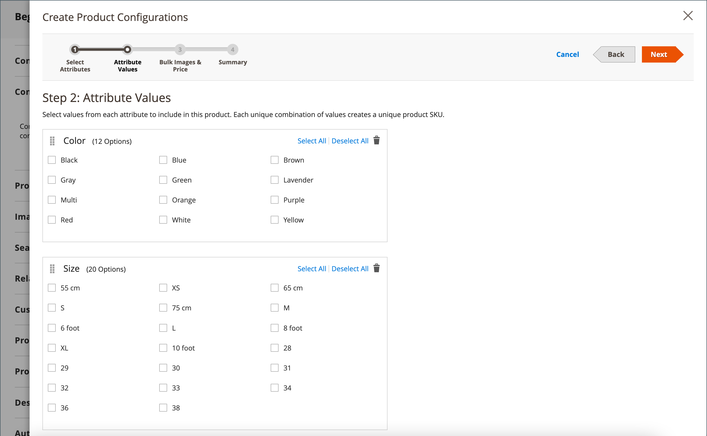

# Konfigurerbar produkt

En konfigurerbar produkt visas som en enda produkt med listrutealternativ för variationer (som färg eller storlek). Varje ändring är en separat enkel produkt med en egen SKU som möjliggör individuell lagerhantering - till skillnad från enkla produkter med anpassade alternativ.

**Passar bäst för:** Produkter med flera alternativ (färg, storlek, material osv.) där du måste spåra lager för varje variation. Inledande konfiguration tar längre tid men ger bättre skalbarhet.

{width="700" zoomable="yes"}

## Innan du börjar

### Kontrollista för krav

Innan du skapar en konfigurerbar produkt måste du se till att du har:

1. **Attributuppsättning** - En attributuppsättning som innehåller variantattribut (till exempel färg och storlek)
1. **Variationsattribut skapade** - Attribut konfigurerade med inställningarna nedan
1. **Produktbilder** - (valfritt men rekommenderas) Bilder för den överordnade produkten och varje variant

### Attributkrav

Varje attribut som används för produktvariationer måste ha följande inställningar:

| Egenskap | Nödvändig inställning |
|--- |--- |
| [!UICONTROL Scope] | `Global` |
| [!UICONTROL Catalog Input Type for Store Owner] | `Dropdown`, `Visual Swatch` eller `Text Swatch` |
| [!UICONTROL Values Required] | `Yes` |

{style="table-layout:auto"}

Instruktioner om hur du skapar attribut finns i [Produktattribut](product-attributes.md).

## Fas 1: Skapa produktbasen

### Steg 1: Välj produkttyp

1. Gå till _>_ på sidofältet **[!UICONTROL Catalog]** Admin **[!UICONTROL Products]**.

1. Välj _[!UICONTROL Add Product]_på menyn {width="25"}menypil **[!UICONTROL Configurable Product]**) i det övre högra hörnet.

   {width="700" zoomable="yes"}

### Steg 2: Välj attributuppsättning

[attributuppsättningen](attribute-sets.md) avgör vilka fält som visas i produktformuläret och vilka attribut som är tillgängliga för variationer.

1. Klicka på attributuppsättningsfältet överst på sidan och gör något av följande:

   - Ange namnet på attributuppsättningen för **[!UICONTROL Search]**.
   - I listan väljer du den attributuppsättning som du vill använda.

   Formuläret uppdateras med den valda attributuppsättningen.

1. Om du behöver lägga till ytterligare ett attribut i attributuppsättningen klickar du på **[!UICONTROL Add Attribute]** och följer instruktionerna i [Lägga till ett attribut](product-attributes-add.md).

   {width="600" zoomable="yes"}

### Steg 3: Ange grundläggande information

1. Ange produkten **[!UICONTROL Product Name]**.

1. Acceptera standardvärdet **[!UICONTROL SKU]** baserat på produktnamnet eller ange ett annat värde.

1. Ange produkten **[!UICONTROL Price]**.

   >[!NOTE]
   >
   >Priset åsidosätts av de underordnade produktpriserna. Det faktiska pris som visas för kunderna kommer från de [!UICONTROL In Stock] underordnade produkterna.

1. Eftersom produkten ännu inte är klar att publiceras anger du **[!UICONTROL Enable Product]** till `No`.

1. Klicka på **[!UICONTROL Save]** och fortsätt.

   När produkten sparas visas väljaren [Store View](introduction.md#product-scope) i det övre vänstra hörnet.

1. Välj den **[!UICONTROL Store View]** där produkten ska vara tillgänglig.

   {width="600" zoomable="yes"}

### Steg 4: Slutför grundläggande inställningar

1. Ange **[!UICONTROL Tax Class]** till något av följande:

   - `None`
   - `Taxable Goods`

1. Lämna **[!UICONTROL Quantity]** tomt. Kvantiteten bestäms av produktvariationerna.

1. Lämna **[!UICONTROL Stock Status]** som angivet.

   Lagerstatus för en konfigurerbar produkt bestäms av de tillhörande variationerna. Eftersom produkten sparades utan någon kvantitet är **[!UICONTROL Stock Status]** inställd på `Out of Stock`.

   >[!NOTE]
   >
   >**Stock-status** för en konfigurerbar produkt är en **_halvmanuell_** kontrollerad inställning som delvis baseras på Stock-statusen för dess underordnade produkter. Det ingår i en **_lagerstatusberäkning med flera kriterier_**. Mer information finns i [Konfigurera Stock-status](#configure-stock-status).

1. Ange produkten **[!UICONTROL Weight]**.

   >[!NOTE]
   >
   >En konfigurerbar produkt måste alltid ha en vikt. Om du väljer **[!UICONTROL This item has no weight]** i listrutan ändras den automatiskt till **[!UICONTROL This item has weight]** när du sparar produkten.

1. Acceptera standardinställningen **[!UICONTROL Visibility]** för `Catalog, Search`.

1. Markera kryssrutan [ om du vill visa produkten i listan över ](../content-design/widget-new-products-list.md)nya produkter **[!UICONTROL Set Product as New]**.

1. Om du vill tilldela kategorier till produkten klickar du på rutan **[!UICONTROL Select…]** och gör något av följande:

   **Välj en befintlig kategori:**

   - Börja skriva i rutan för att hitta en matchning.

   - Markera kryssrutan för varje kategori som ska tilldelas.

   {width="600" zoomable="yes"}

   **Skapa en ny kategori:**

   - Klicka på **[!UICONTROL New Category]**.

   - Ange **[!UICONTROL Category Name]** och välj **[!UICONTROL Parent Category]** för att bestämma dess position i menystrukturen.

   - Klicka på **[!UICONTROL Create Category]**.

1. Välj **[!UICONTROL Country of Manufacture]**.

   Ytterligare attribut kan visas beroende på attributuppsättningen. Du kan slutföra dem senare.

### Steg 5: Spara och fortsätt

Det här är ett bra tillfälle att spara ditt arbete. Klicka på **[!UICONTROL Save]** i det övre högra hörnet. I nästa fas ställer du in konfigurationerna för varje variation.

## Fas 2: Lägg till produktvariationer

I följande steg visas hur du lägger till konfigurationer för flera varianter. Förloppsindikatorn överst på sidan visar din aktuella position i processen.

**Exempel:** För en skjorta med 3 färger och 3 storlekar skapar du 9 enkla produkter med unika SKU:er (en för varje kombination). Som standard baseras produktnamnet och SKU:n för varje variation på attributvärdet och det överordnade produktnamnet eller SKU:n.

### Steg 6: Välj variantattribut

1. Bläddra ned till avsnittet _[!UICONTROL Configurations]_och klicka på&#x200B;**[!UICONTROL Create Configurations]**.

   {width="600" zoomable="yes"}

1. Markera kryssrutan för varje attribut som ska inkluderas som en variation.

   I det här exemplet är `color` och `size` markerade.

   {width="600" zoomable="yes"}

   Listan innehåller alla attribut från attributuppsättningen som kan användas i en konfigurerbar produkt.

1. Om du behöver lägga till ett attribut klickar du på **[!UICONTROL Create New Attribute]** och gör följande:

   - Fyll i attributegenskaperna.

   - Klicka på **[!UICONTROL Save Attribute]**.

   - Markera kryssrutan för attributet.

1. Klicka på **[!UICONTROL Next]** i det övre högra hörnet.

### Steg 7: Välj attributvärden

1. För varje attribut markerar du kryssrutan för de värden som gäller för produkten.

   {width="600" zoomable="yes"}

1. Om du vill ordna om attributen, tar du ikonen _Ändra ordning_ (  ) och flyttar avsnittet till en ny plats.

   Ordningen bestämmer positionen för listrutorna på produktsidan.

1. Klicka på **[!UICONTROL Next]** i förloppsindikatorn.

### Steg 8: Konfigurera bilder, priser och lager

I det här steget fastställs bilder, priser och kvantitet för varje konfiguration. De tillgängliga alternativen är desamma för alla. Du kan använda samma inställning för alla SKU:er, använda unika inställningar för varje SKU:er eller hoppa över inställningarna för tillfället.

#### Konfigurera bilder

Välj det konfigurationsalternativ som gäller:

**Alternativ 1: Använd en uppsättning bilder på alla SKU:er**

1. Välj **[!UICONTROL Apply single set of images to all SKUs]**.

1. Bläddra till varje bild som ska ingå i produktgalleriet eller dra bilder till rutan.

{width="600" zoomable="yes"}

**Alternativ 2: Använd unika bilder för varje SKU**

Eftersom den överordnade produktbilden redan har överförts använder du det här alternativet för att överföra bilder för varje variation. Du kan lägga till olika bilder som visas i kundvagnen när någon köper en viss variant.

1. Välj **[!UICONTROL Apply unique images by attribute to each SKU]**.

1. Markera **[!UICONTROL Attribute]** som bilderna illustrerar, till exempel `color`.

1. För varje attributvärde bläddrar du till bilderna som ska användas för konfigurationen eller drar dem till rutan.

   Om du drar en bild till en värderuta visas den även i avsnitten för andra värden. Klicka på ikonen _Papperskorgen_ () om du vill ta bort en bild.

   {width="600" zoomable="yes"}

#### Konfigurera priser

>[!NOTE]
>
>En konfigurerbar produkt har inte ett eget pris i katalogen. Det konfigurerbara produktpriset härleds från dess [!UICONTROL In Stock] underordnade produkter.

Välj det konfigurationsalternativ som gäller:

**Alternativ 1: Använd samma pris på alla SKU:er**

1. Om priset är detsamma för alla variationer väljer du **[!UICONTROL Apply single price to all SKUs]**.

1. Ange **[!UICONTROL Price]**.

   {width="600" zoomable="yes"}

**Alternativ 2: Använd olika pris för varje SKU**

1. Om priset skiljer sig för varje eller några variationer väljer du **[!UICONTROL Apply unique prices by attribute to each SKU]**.

1. Välj den **[!UICONTROL Attribute]** som utgör grunden för prisskillnaden.

1. Ange **[!UICONTROL Price]** för varje attributvärde.

   I det här exemplet kostar XL-storleken mer.

   {width="600" zoomable="yes"}

#### Konfigurera lager

Välj det konfigurationsalternativ som gäller:

**Alternativ 1: Använd samma kvantitet för alla SKU:er**

Om kvantiteten är densamma för alla SKU:er väljer du **[!UICONTROL Apply single quantity to each SKU]** och anger kvantiteten.

_Enskilda Source-handlare :_

Ange **[!UICONTROL Quantity]**.

_Flera Source-handlare med [Inventory management ](../inventory-management/introduction.md):_

Tilldela källor och lägg till kvantiteter för alla genererade produktvarianter:

1. Välj alternativet **[!UICONTROL Apply single quantity to each SKU]**.

1. Klicka på **[!UICONTROL Assign Sources]** om du vill lägga till en källa.

1. Bläddra eller sök efter en källa som ska läggas till. Markera kryssrutan bredvid källorna för produkten.

1. Ange ett lagerbehållningsbelopp per källa.

   {width="600" zoomable="yes"}

**Alternativ 2: Använd en annan kvantitet efter attribut**

_Enskilda Source-handlare :_

Ange **[!UICONTROL Quantity]** för varje attributvärde.

_Flera Source-handlare med [Inventory management ](../inventory-management/introduction.md):_

Tilldela källor och lägg till kvantiteter för alla genererade produktvarianter:

1. Välj **[!UICONTROL Apply unique quantity by attribute to each SKU]**.

1. Ange **[!UICONTROL Quantity]** för varje variation.

   {width="600" zoomable="yes"}

När konfigurationen för bilder, pris och kvantitet är klar klickar du på **[!UICONTROL Next]** i det övre högra hörnet.

### Steg 9: Generera produktkonfigurationer

Vänta en stund tills produktlistan visas och gör något av följande:

- Om du är nöjd med konfigurationerna klickar du på **[!UICONTROL Generate Products]**.

- Klicka på **[!UICONTROL Back]** om du vill korrigera.

{width="600" zoomable="yes"}

De aktuella produktvariationerna visas längst ned i avsnittet _Konfiguration_.

{width="600" zoomable="yes"}

### Steg 10: Lägg till produktbilder

1. Bläddra nedåt och utöka  i avsnittet _[!UICONTROL Images and Videos]_.

1. Klicka på rutan _Kamera_ och bläddra till huvudbilden som ska användas för den konfigurerbara produkten.

Mer information finns i [Bilder och video](product-images-and-video.md).

### Steg 1: Fullständig produktinformation

Bläddra nedåt och fyll i informationen i följande avsnitt efter behov:

- [Innehåll](product-content.md)

- [Samhörande produkter, merförsäljning och korsförsäljning](related-products-up-sells-cross-sells.md)

- [Sökmotoroptimering](product-search-engine-optimization.md)

- [Anpassningsbara alternativ](settings-advanced-custom-options.md)

- [Produkter på webbplatser](settings-basic-websites.md)

- [Design](settings-advanced-design.md)

- [Presentalternativ](product-gift-options.md)

## Fas 3: Publicera produkten

### Steg 12: Publicera produkten

1. Om du är redo att publicera produkten i katalogen anger du **[!UICONTROL Enable Product]** till `Yes`.

1. Gör något av följande:

   **Metod 1: Spara och förhandsgranska**

   - Klicka på **[!UICONTROL Save]** i det övre högra hörnet.

   - Om du vill visa produkten i din butik väljer du **[!UICONTROL Customer View]** på menyn _Admin_ (  ).

   Butiken öppnas på en ny flik i webbläsaren.

   {width="600" zoomable="yes"}

   **Metod 2: Spara och stäng**

   Välj _[!UICONTROL Save]_på menyn {width="25"}Menypil **[!UICONTROL Save & Close]**).

## Konfigurera Stock-status

Konfigurerbar produktlagerstatus skiljer sig från enkel produktlagerstatus. För en konfigurerbar produkt ingår Stock-statusen i en **_multikriterieberäkning_**.

### Så fungerar lagerstatus

De viktigaste principerna för aktiestatus:

| Ange status till | Resultat | Kontrolleras av underordnade produkter? |
|---|---|---|
| `Out of Stock` (manuellt) | Visar alltid `Out of Stock` i Admin och Storefront | Nej - återstår tills manuellt ändrat till `In Stock` |
| `In Stock` (manuellt) | Status är dynamisk baserat på underordnade produkter | Delvis - se informationen nedan |

{style="table-layout:auto"}

### När det är inställt på&quot;I Stock&quot;

När du ställer in den konfigurerbara produktlagerstatusen manuellt till `In Stock` fungerar den annorlunda beroende på din lagerinställning:

**Endast med standardkälla/standardlager:**

- **Admin och Storefront:** Stock-statusen återspeglar automatiskt tillgängligheten för underordnade produkter

**Med minst en anpassad källa/aktie:**

- **Storefront:** Stock-status visar automatiskt tillgängligheten för underordnade produkter
- **Admin:** Bevaras som `In Stock` tills den ändras manuellt (inte styrs av underordnade produkter)

>[!NOTE]
>
>Anpassade lager och källor ingår i tillägget [Inventory management](../inventory-management/sources-stocks.md). Vi rekommenderar att du endast använder verktyget för att hantera lager och källfiler. Standardfunktionerna för källa och lager ingår i modulen `CatalogInventory`, som nu är inaktuell.

### Manuella förändringar i lagerstatus

Om du ställer in Stock-statusen manuellt till `Out of Stock` (via användaråtgärden Admin, filimport eller API-anrop), förblir den `Out of Stock` både i Admin och Storefront tills du manuellt ändrar tillbaka den till `In Stock`. Den påverkas inte av status för underordnade produkter.

## Systemkonfiguration (valfritt)

### Visa variantbilder i kundvagnsminiatyrer

Om du har olika bilder för varje variant kan du konfigurera systemet så att rätt bild visas för kundvagnsminiatyrbilden.

1. Gå till _>_ > **[!UICONTROL Stores]** på sidofältet _[!UICONTROL Settings]_Admin **[!UICONTROL Configuration]**.

1. Expandera **[!UICONTROL Sales]** i den vänstra panelen och välj **[!UICONTROL Checkout]**.

1. Expandera  i avsnittet _[!UICONTROL Shopping Cart]_.

1. Ange **[!UICONTROL Configurable Product Image]** till `Product Thumbnail Itself`.

1. Klicka på **[!UICONTROL Save Config]**.

   {width="600" zoomable="yes"}

## Viktiga överväganden

- **Variationstyper:** Shoppare kan välja alternativ från listrutor, flera markeringar, visuella färgrutor och indatatyper för textrutor. Varje alternativ är en separat, enkel produkt.

- **Inventeringsspårning:** Till skillnad från enkla produkter med anpassade alternativ spårar konfigurerbara produkter lager för varje enskild variation.

- **Underordnade produkttyper:** Underordnade produkter kan vara enkla eller virtuella produkter **utan anpassade alternativ**. Om du vill göra underordnade produkter virtuella väljer du `Тhis item has no weight` som **[!UICONTROL Weight]**-inställning för varje underordnat objekt.

- **Global tilldelning:** Underordnade produkter tilldelas och frånkopplas från den konfigurerbara produkten **globalt** för alla webbplatser, butiker och butiksvyer samtidigt.

- **Priser:** En konfigurerbar produkt har inte ett eget pris i katalogen. Det visade priset kommer från dess [!UICONTROL In Stock] underordnade produkter.

- **Attribut:** Variationsattribut måste ha ett globalt omfång, och kunder måste vara skyldiga att välja ett värde. Attributen måste inkluderas i den attributuppsättning som används för den konfigurerbara produkten.

- **Miniatyrbilder:** Miniatyrbilden för kundvagnen kan visa bilden antingen från den konfigurerbara produktposten eller från produktvariationen. Se [Systemkonfiguration](#system-configuration-optional) ovan.

- **Färgrutebeteende:** [Färgruteattribut](swatches.md#create-swatches-for-products) kan konfigureras till att inte visa motsvarande enkla produktbilder när färgrutan väljs genom att ställa in **[!UICONTROL Update Product Preview Image]** på `No` på attributredigeringssidan.

- **Beteende för bildgalleri:** Temat styr hur bildgalleriet fungerar när användare växlar mellan produktkonfigurationer. Standardbeteendet för temat _Tom_ åsidosätter de överordnade konfigurerbara produktbilderna med den valda variationen. För Luma-temat är standardbeteendet att lägga till de valda variantbilderna i de överordnade konfigurerbara produktbilderna.
