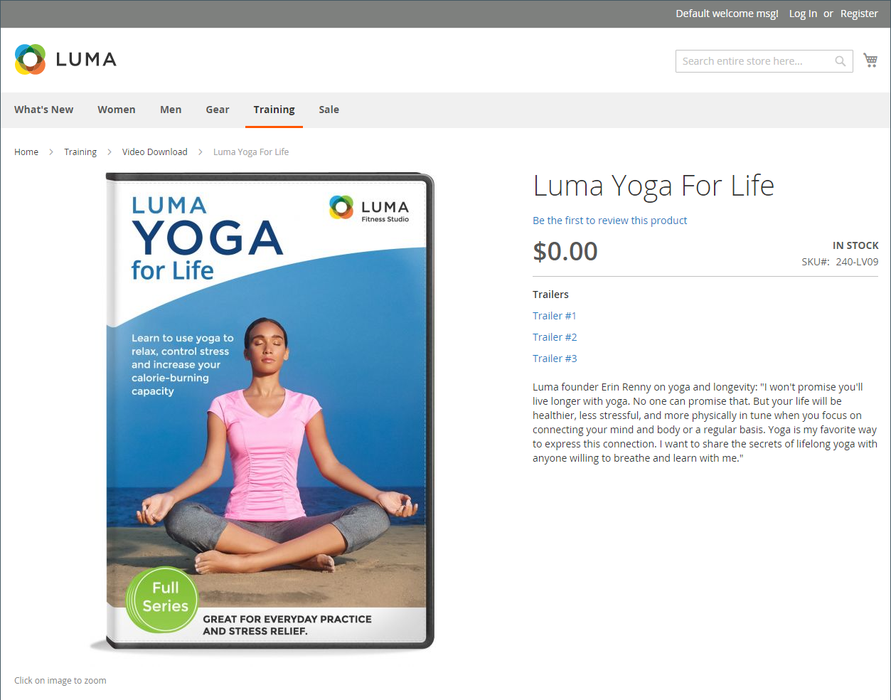
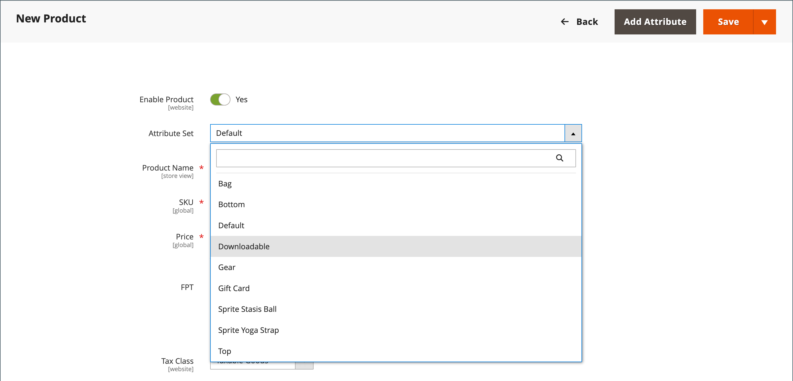

# Nedladdningsbar produkt

En nedladdningsbar produkt kan vara allt du kan leverera som en fil, till exempel en eBook, musik, video, programvara eller uppdatering. Du kan erbjuda ett album att sälja och sälja varje låt separat. Du kan också använda en nedladdningsbar produkt för att leverera en elektronisk version av produktkatalogen.

Eftersom nedladdningen inte är tillgänglig förrän efter köpet kan du ta fram exempel, t.ex. ett utdrag från en bok, ett klipp från en ljudfil eller en trailer från en video. Ett exempel är något som kunden kan prova innan man köper produkten. De filer du gör tillgängliga för hämtning kan antingen överföras till servern eller från en annan server.

{width="700" zoomable="yes"}

Hämtningsbara produkter kan konfigureras så att kunden måste logga in på ett konto för att kunna ta emot länken eller skickas med e-post och dela dem med andra. Status för ordern innan hämtningen blir tillgänglig, standardvärden och andra leveransalternativ anges i konfigurationen. När du planerar dina hämtningsbara katalogtillägg bör du tänka på följande:

- Hämtningsbara produkter kan överföras till servern eller länkas till från en annan server på Internet.

- Du kan bestämma hur många gånger en kund kan hämta en produkt.

- Kunder som köper en nedladdningsbar produkt kan behöva logga in innan de går igenom kassan.

- Leveransen av en nedladdningsbar produkt kan göras när ordern har statusen `Pending` eller `Invoiced`.

- Eftersom nedladdningsbara produkter inte levereras hoppas steget _Leverans_ i utcheckningen över när vagnen bara innehåller den nedladdningsbara produkten.

## Konfigurera hämtningsalternativ

De hämtningsbara konfigurationsinställningarna avgör standardvärdena och leveransalternativen för hämtningsbara produkter och anger om gästerna kan köpa hämtningar.

1. Gå till _>_ > **[!UICONTROL Stores]** på sidofältet _[!UICONTROL Settings]_&#x200B;Admin **[!UICONTROL Configuration]**.

1. Expandera **[!UICONTROL Catalog]** i den vänstra panelen och välj **[!UICONTROL Catalog]** under.

1. Expandera  i avsnittet _[!UICONTROL Downloadable Product Options]_.

   {width="700" zoomable="yes"}

   En detaljerad lista över dessa konfigurationsalternativ finns i [_Hämtningsbara produktalternativ_](../configuration-reference/catalog/catalog.md#downloadable-product-options) i _Konfigurationsreferens_.

1. Ange **[!UICONTROL Order Item Status to Enable Downloads]** till något av följande för att fastställa status för orderprocessen när hämtningen blir tillgänglig:

   - `Pending`
   - `Invoiced`

1. Om du vill ange en standardgräns för hur många hämtningar en enskild kund kan göra anger du numret för **[!UICONTROL Default Maximum Number of Downloads]**.

1. Ange **[!UICONTROL Shareable]** till något av följande:

   - `Yes` - Gör att kunder kan skicka länken till andra via e-post.
   - `No` - Hindrar kunder från att dela nedladdningslänken med andra genom att kräva att kunder loggar in på sina konton för att få åtkomst till nedladdningslänkar.

1. För **[!UICONTROL Default Sample Title]** anger du den rubrik som du vill ska visas ovanför urvalet av exempel.

   {width="400"}

1. För **[!UICONTROL Default Link Title]** anger du den standardtext som du vill använda för att hämta länkar.

1. Om du vill att nedladdningslänken ska öppnas i ett nytt webbläsarfönster anger du **[!UICONTROL Opens Links in New Window]** till `Yes`.

   Den här inställningen används för att hålla webbläsarfönstret öppet.

1. Om du vill avgöra hur hämtningsbart innehåll levereras ställer du in **[!UICONTROL Use Content Disposition]** på något av följande:

   - `Attachment` - Levererar nedladdningslänken via e-post som en bifogad fil.
   - `Inline` - Levererar nedladdningslänken som en länk på en webbsida.

1. Om du vill att köpare ska registrera sig för ett kundkonto och logga in innan de köper en nedladdning anger du **[!UICONTROL Disable Guest Checkout if Cart Contains Downloadable Items]** till `Yes`.

1. Klicka på **[!UICONTROL Save Config]** när du är klar.

## Skapa en nedladdningsbar produkt

I följande instruktioner visas hur du skapar en hämtningsbar produkt med hjälp av en [produktmall](attribute-sets.md), obligatoriska fält och grundläggande inställningar. Alla obligatoriska fält är markerade med en röd asterisk (`*`). När du är klar med grunderna kan du slutföra de andra produktinställningarna efter behov.

>[!NOTE]
>
>Filnamn som kan hämtas kan innehålla bokstäver och siffror. Ett streck eller ett understreck kan användas för att representera ett mellanrum mellan ord. Alla ogiltiga tecken i filnamnet ersätts med ett understreck.

### Steg 1: Välj produkttyp

1. Gå till _>_ på sidofältet **[!UICONTROL Catalog]** Admin **[!UICONTROL Products]**.

1. Välj _[!UICONTROL Add Product]_&#x200B;på menyn {width="25"}menypil `Downloadable Product` ) i det övre högra hörnet.

   {width="700" zoomable="yes"}

### Steg 2: Välj attributuppsättning

Exempeldata innehåller en [attributuppsättning](attribute-sets.md) med namnet _Hämtningsbar_ som har specialfält för hämtningsbara produkter. Du kan använda en befintlig mall eller skapa en annan innan produkten sparas.

Gör något av följande om du vill välja den attributuppsättning som används som mall för produkten:

- Ange namnet på attributuppsättningen för **[!UICONTROL Search]**.

- Välj attributuppsättningen `Downloadable` i listan.

Formuläret uppdateras för att återspegla ändringen.

{width="600" zoomable="yes"}

### Steg 3: Slutför de obligatoriska inställningarna

1. Ange **[!UICONTROL Product Name]**.

1. Acceptera standardvärdet **[!UICONTROL SKU]** som baseras på produktnamnet eller ange ett annat.

1. Ange produkten **[!UICONTROL Price]**.

1. Eftersom produkten ännu inte är klar att publiceras anger du **[!UICONTROL Enable Product]** till `No`.

1. klicka på **[!UICONTROL Save]** och fortsätt.

   När produkten sparas visas väljaren [Store View](introduction.md#product-scope) i det övre vänstra hörnet.

1. Välj den **[!UICONTROL Store View]** där produkten ska vara tillgänglig.

   {width="600" zoomable="yes"}

### Steg 4: Slutför de grundläggande inställningarna

1. Ange **[!UICONTROL Tax Class]** till något av följande:

   - `None`
   - `Taxable Goods`

1. Ange **[!UICONTROL Quantity]** för produkten som finns i lager.

   Observera följande:

   - Som standard är **[!UICONTROL Stock Status]** inställd på `Out of Stock`.

   - Eftersom nedladdningsbara produkter inte levereras används inte fältet **[!UICONTROL Weight]**. Om du aktiverar den här funktionen blir den [enkel produkt](product-create-simple.md) och _Är den här hämtningsbara produkten?Det går inte att använda fliken_.

   >[!NOTE]
   >
   >Om du aktiverar [Inventory management](../inventory-management/introduction.md) anger handlare med en enda Source kvantiteten i det här avsnittet. Flera Source-handlare lägger till källor och kvantiteter i avsnittet Källor. Se följande avsnitt _Tilldela källor och kvantiteter (Inventory management)_.

1. Acceptera standardinställningen **[!UICONTROL Visibility]** för `Catalog, Search`.

1. Markera kryssrutan [&#x200B; om du vill att produkten ska visas i listan &#x200B;](../content-design/widget-new-products-list.md)med nya produkter **[!UICONTROL Set Product as New]**.

1. Om du vill tilldela _[!UICONTROL Categories]_&#x200B;till produkten klickar du på rutan **[!UICONTROL Select…]**&#x200B;och gör något av följande:

   **Välj en befintlig kategori**:

   - Börja skriva i rutan tills du hittar en matchning.

   - Markera kryssrutan för varje kategori som ska tilldelas.

   **Skapa en kategori**:

   - Klicka på **[!UICONTROL New Category]**.

   - Ange **[!UICONTROL Category Name]** och välj **[!UICONTROL Parent Category]** som avgör dess position i [menystrukturen](category-root.md).

   - Klicka på **[!UICONTROL Create Category]**.

1. Ange **[!UICONTROL Format]** till något av följande:

   - `Download`
   - `DVD`

   Om det behövs kan du redigera [attributet](attribute-product-create.md) och lägga till fler värden.

   Det kan finnas ytterligare attribut som beskriver produkten. Markeringen varierar beroende på attributuppsättning och du kan slutföra dem senare.

#### Tilldela källor och kvantiteter ([!DNL Inventory Management])

{{$include /help/_includes/inventory-assign-sources.md}}

### Steg 5: Fyll i den hämtningsbara informationen

Bläddra nedåt, expandera  i avsnittet _[!UICONTROL Downloadable Information]_&#x200B;och markera kryssrutan **[!UICONTROL Is this downloadable product?]**.

När alternativet är aktiverat har avsnittet _[!UICONTROL Downloadable Information]_&#x200B;två delar. I den första delen beskrivs varje nedladdningslänk och i den andra delen beskrivs varje exempelfil. Standardvärdet för många av dessa alternativ kan anges i [konfigurationen](#configure-the-download-options).

{width="600" zoomable="yes"}

#### Fyll i länkarna

1. I avsnittet _[!UICONTROL Links]_&#x200B;anger du den **[!UICONTROL Title]**&#x200B;som du vill använda som rubrik för hämtningslänkarna.

1. Markera kryssrutan **[!UICONTROL Links can be purchased separately]** om tillämpligt.

1. Klicka på **[!UICONTROL Add Link]** och gör följande:

   - Ange **[!UICONTROL Title]** och **[!UICONTROL Price]** för hämtningen.

   - För både **[!UICONTROL File]**- och **[!UICONTROL Sample]**-filer väljer du en av följande distributionsmetoder för hämtningarna:

      - `Upload File` - Välj den här metoden om du vill överföra distributionsfilen till servern. Bläddra till filen och markera den för överföring.
      - `URL` - Välj den här metoden om du vill komma åt distributionsfilen från en URL. Ange den fullständiga URL:en till den hämtade filen.

   >[!NOTE]
   >
   >Du kan inte använda länkar till externa resurser som hämtningsbara produkter. Giltiga länkdomäner är fördefinierade programmatiskt i filen `env.php` (se [env.php-referens](https://experienceleague.adobe.com/docs/commerce-operations/configuration-guide/files/config-reference-envphp.html?lang=sv-SE) i _konfigurationshandboken_).

   - Ange **[!UICONTROL Shareable]** till något av följande:

      - `No` - Kunder måste logga in på sina konton för att komma åt nedladdningslänken.

      - `Yes` - Skickar länken via e-post, som kunder kan dela med andra.

      - `Use Config` - Använder den metod som anges i konfigurationen för [hämtningsbara produktalternativ](../configuration-reference/catalog/catalog.md).

   - Gör något av följande:

      - Om du vill begränsa antalet nedladdningar per kund anger du det maximala antalet för **[!UICONTROL Max. Downloads]**.
      - Markera kryssrutan **[!UICONTROL Unlimited]** om du vill tillåta ett obegränsat antal hämtningar.

   {width="600" zoomable="yes"}

1. Om du vill lägga till en till länk klickar du på **[!UICONTROL Add Link]** och upprepar de här stegen.

#### Fyll i exemplen

1. I avsnittet _[!UICONTROL Samples]_&#x200B;anger du den **[!UICONTROL Title]**&#x200B;som du vill använda som rubrik för exemplen.

1. Klicka på **[!UICONTROL Add Link]** om du vill slutföra informationen för varje exempel.

   {width="600" zoomable="yes"}

1. Fyll i länkinformationen enligt följande:

   - Ange **[!UICONTROL Title]** för det enskilda exemplet.

   - Välj någon av följande distributionsmetoder:

      - `Upload File` - Välj den här metoden om du vill överföra distributionsfilen till servern. Bläddra till filen och markera den för överföring.
      - `URL` - Välj den här metoden om du vill komma åt distributionsfilen från en URL. Ange den fullständiga URL:en till den hämtade filen.

   - Om du vill lägga till ytterligare ett exempel klickar du på **[!UICONTROL Add Link]** och upprepar de här stegen.

   - Om du vill ändra ordningen på exemplen, tar du ikonen _Ändra ordning_ (  ) och drar exemplet till en ny plats.

### Steg 6: Fyll i produktinformationen

Bläddra nedåt och fyll i informationen i följande avsnitt efter behov:

- [Innehåll](product-content.md)
- [Bilder och video](product-images-and-video.md)
- [Sökmotoroptimering](product-search-engine-optimization.md)
- [Samhörande produkter, merförsäljning och korsförsäljning](related-products-up-sells-cross-sells.md)
- [Anpassningsbara alternativ](settings-advanced-custom-options.md)
- [Produkter på webbplatser](settings-basic-websites.md)
- [Design](settings-advanced-design.md)
- [Presentalternativ](product-gift-options.md)

### Steg 7: Publicera produkten

Om du är redo att publicera produkten i katalogen anger du **[!UICONTROL Enable Product]** till `Yes` och gör något av följande:

**Metod 1:** Spara och förhandsgranska

- Klicka på **[!UICONTROL Save]** i det övre högra hörnet.

- Om du vill visa produkten i din butik väljer du **[!UICONTROL Customer View]** på menyn _Admin_ (  ).

  Butiken öppnas på en ny flik i webbläsaren.

  {width="600" zoomable="yes"}

**Metod 2:** Spara och stäng

Välj _[!UICONTROL Save]_&#x200B;på menyn {width="25"}Menypil **[!UICONTROL Save & Close]**).

## StoreFront

På kontrollpanelen för kundkonton länkar sidan _[!UICONTROL My Downloadable Products]_&#x200B;till varje order med hämtningsbara produkter. Nedladdningarna blir tillgängliga från kundens konto när beställningen är klar.

{width="700" zoomable="yes"}

I följande tabell beskrivs värdena för _Mina hämtningsbara produkter_:

| Kolumn | Beskrivning |
|--- |--- |
| [!UICONTROL Order#] | Den [beställning](../stores-purchase/orders.md) där den hämtningsbara produkten köptes. Tillhandahåller en länk till orderinformationen. |
| [!UICONTROL Date] | Orderskapandedatum. |
| [!UICONTROL Title] | Namnet på den hämtningsbara produkten som köpts tillsammans med ordern. En länk till den hämtningsbara produkten. |
| [!UICONTROL Status] | Beställningsstatus. |
| [!UICONTROL Remaining Downloads] | Antal tillgängliga hämtningar av den hämtade produkten. |

_&#x200B;**Så här hämtar du en produktfil från kontouppsättningen**&#x200B;_

1. I kontouppsättningen väljer kunden **[!UICONTROL My Downloadable Products]**.

1. Söker efter ordningen i listan och klickar på länken efter titeln.

1. Klicka på ikonen _download_ i det nedre högra hörnet av hämtningsfönstret.

1. Söker efter filen på hämtningsplatsen och sparar filen på önskad plats.

<!-- Last updated from includes: 2023-05-19 17:14:58 -->
