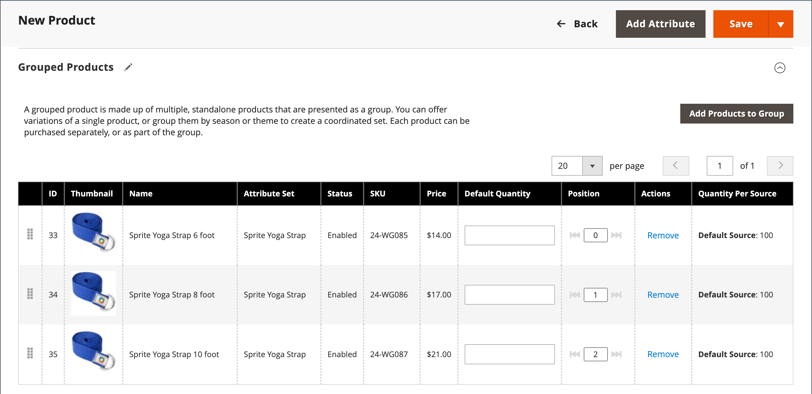

# Grupperad produkt

En grupperad produkt består av enkla fristående produkter som presenteras som en grupp. Du kan erbjuda varianter av en enskild produkt eller gruppera dem efter årstid eller tema. Att presentera en grupperad produkt kan vara ett incitament för kunderna att köpa ytterligare artiklar. En grupperad produkt är ett enkelt sätt att erbjuda olika varianter av en produkt och visa alla på samma sida.

Du kan till exempel sälja öppna lageruppbyggda program och lista alla typer av utskrifter som används på en formell plats. Vissa kan beställa flera salladsgafflar, fiskgafflar, middagsknivar, fiskknivar, smörknivar, soppskedar och dessertskedar. Andra kunder kan beställa en enkel gaffel, kniv och sked. Kunderna kan beställa valfritt antal av varje artikel som de vill.

Även om de presenteras som en grupp, köps varje produkt i gruppen som en separat artikel. I kundvagnen visas varje artikel och inköpskvantiteten som en separat radartikel.

I följande instruktioner visas hur du skapar en grupperad produkt med hjälp av en [produktmall](attribute-sets.md), obligatoriska fält och grundläggande inställningar. Alla obligatoriska fält är markerade med en röd asterisk (`*`). När du är klar med grunderna kan du slutföra de andra produktinställningarna efter behov.

{width="700" zoomable="yes"}

## Steg 1: Välj produkttyp

1. Gå till **[!UICONTROL Catalog]** > **[!UICONTROL Products]** på sidofältet _Admin_.

1. Välj **[!UICONTROL Grouped Product]** på menyn _[!UICONTROL Add Product]_( {width="25"} ) i det övre högra hörnet.

   {width="700" zoomable="yes"}

## Steg 2: Välj attributuppsättning

Gör något av följande om du vill välja den [attributuppsättning](attribute-sets.md) som används som mall för produkten:

- Ange namnet på **[!UICONTROL Attribute Set]** om du vill söka.
- I listan väljer du den attributuppsättning som du vill använda.

Formuläret uppdateras för att återspegla ändringen.

{width="600" zoomable="yes"}

Om de attribut som behövs inte finns kan du lägga till nya attribut när du skapar en produkt:

- Klicka på **[!UICONTROL Add Attribute]** i det övre högra hörnet.
- Definiera ett nytt attribut (se [Lägga till ett attribut i en produkt](product-attributes-add.md)).

  {width="600" zoomable="yes"}

Om du vill lägga till ett befintligt attribut i produkten använder du [filterkontrollerna](../getting-started/admin-grid-controls.md) för att hitta attributet i rutnätet och gör följande:

- Markera kryssrutan i den första kolumnen i varje attribut som ska läggas till.
- Klicka på **[!UICONTROL Add Selected]**.

## Steg 3: Slutför de obligatoriska inställningarna

1. Ange **[!UICONTROL Product Name]**.

1. Acceptera standardvärdet **[!UICONTROL SKU]** som baseras på produktnamnet eller ange ett annat.

   Observera att fältet **[!UICONTROL Quantity]** inte är tillgängligt eftersom värdet härleds från de enskilda produkter som ingår i gruppen.

   En grupperad produkt har inte ett eget pris i katalogen. Det grupperade produktpriset härleds från priset för de enskilda produkter som ingår i gruppen.

1. Eftersom produkten ännu inte är klar att publiceras anger du **[!UICONTROL Enable Product]** till `No` (  ).

1. Klicka på **[!UICONTROL Save]** och fortsätt.

   När produkten sparas visas produktnamnet högst upp på sidan och [butiksvyn](introduction.md#product-scope) visas i det övre vänstra hörnet.

1. Välj den **[!UICONTROL Store View]** där produkten ska vara tillgänglig.

   {width="600" zoomable="yes"}

## Steg 4: Slutför de grundläggande inställningarna

1. Acceptera inställningen **[!UICONTROL Stock Status]** för `In Stock`.

1. Om du vill tilldela **[!UICONTROL Categories]** till produkten klickar du på rutan **[!UICONTROL Select…]** och gör något av följande:

   **Välj en befintlig kategori:**

   - Börja skriva i rutan tills du hittar en matchning.

   - Markera kryssrutan för den kategori som ska tilldelas.

   **Skapa en kategori:**

   - Klicka på **[!UICONTROL New Category]**.

   - Ange **[!UICONTROL Category Name]** och välj **[!UICONTROL Parent Category]** som avgör dess position i menystrukturen.

   - Klicka på **[!UICONTROL Create Category]**.

1. Acceptera **[!UICONTROL Visibility]**-inställningarna för `Catalog, Search`.

1. Om du vill visa produkten i listan [med nya produkter](../content-design/widget-new-products-list.md) väljer du datumen **[!UICONTROL Set Product as New]** **[!UICONTROL from]** och **[!UICONTROL to]** i kalendern.

1. Välj **[!UICONTROL Country of Manufacture]**.

   Det kan finnas ytterligare enskilda attribut som beskriver produkten. Markeringen varierar attributuppsättningen och du kan slutföra dem senare.

## Steg 5: Lägg till produkter i gruppen

1. Bläddra ned till avsnittet **[!UICONTROL Grouped Products]** och klicka på **[!UICONTROL Add Products to Group]**.

   {width="600" zoomable="yes"}

1. Om det behövs kan du använda [filters](../getting-started/admin-grid-controls.md) för att hitta de produkter som du vill inkludera i gruppen.

1. Markera kryssrutan för varje objekt som du vill ta med i gruppen i listan.

   >[!NOTE]
   >
   >Endast enkla, nedladdningsbara och virtuella produkter utan konfigurerbara alternativ kan grupperas i underordnade produkter. Andra produkttyper visas inte i urvalslistan.

   {width="600" zoomable="yes"}

1. Klicka på **[!UICONTROL Add Selected Products]** om du vill lägga till dem i produktgruppen.

   De valda produkterna visas i avsnittet _[!UICONTROL Grouped Products]_.

   För flera Source-handlare med [Inventory management](../inventory-management/sources-stocks.md) innehåller rutnätet en **[!UICONTROL Quantity per Source]**-kolumn med varje tilldelad käll- och lagerlagersumma.

   {width="600" zoomable="yes"}

1. Ange **[!UICONTROL Default Quantity]** för något av objekten.

1. Om du vill ändra ordning på produkterna, klickar du på ikonen _Ändra ordning_ (  ) i den första kolumnen och drar produkten till den nya positionen i listan.

1. Klicka på **[!UICONTROL Remove]** om du vill ta bort en produkt från gruppen.

## Steg 5: Fyll i produktinformationen

Fyll i informationen i följande avsnitt efter behov:

- [Innehåll](product-content.md)
- [Bilder och video](product-images-and-video.md)
- [Sökmotoroptimering](product-search-engine-optimization.md)
- [Samhörande produkter, merförsäljning och korsförsäljning](related-products-up-sells-cross-sells.md)
- [Anpassningsbara alternativ](settings-advanced-custom-options.md)
- [Produkter på webbplatser](settings-basic-websites.md)
- [Design](settings-advanced-design.md)
- [Presentalternativ](product-gift-options.md)

## Steg 6: Publish produkten

1. Om du är redo att publicera produkten i katalogen anger du **[!UICONTROL Enable Product]** till `Yes`.

1. Gör något av följande:

   **Metod 1:** Spara och förhandsgranska

   - Klicka på **[!UICONTROL Save]** i det övre högra hörnet.

   - Om du vill visa produkten i din butik väljer du **[!UICONTROL Customer View]** på menyn _Admin_ (  ).

     Butiken öppnas på en ny flik i webbläsaren.

     {width="700" zoomable="yes"}

   **Metod 2:** Spara och stäng

   - Välj **[!UICONTROL Save & Close]** på menyn _[!UICONTROL Save]_( {width="25"} ).

## Steg 7: Konfigurera kundvagnsminiatyrerna (valfritt)

Om du har en annan bild för varje produkt i gruppen kan du ställa in konfigurationen så att rätt bild används för kundvagnsminiatyrbilden.

1. Gå till **[!UICONTROL Stores]** > _[!UICONTROL Settings]_>**[!UICONTROL Configuration]**&#x200B;på sidofältet_ Admin _.

1. Expandera **[!UICONTROL Sales]** i den vänstra panelen och välj **[!UICONTROL Checkout]**.

1. Expandera  och **[!UICONTROL Shopping Cart]**.

   En detaljerad lista över dessa konfigurationsalternativ finns i [Kundvagn](../configuration-reference/sales/checkout.md#shopping-cart) i _Konfigurationsreferens_.

1. Ange **[!UICONTROL Grouped Product Image]** till `Product Thumbnail Itself`.

   {width="600" zoomable="yes"}

   Om det behövs avmarkerar du kryssrutan **[!UICONTROL Use system value]** för att ange det här alternativet.

1. Klicka på **[!UICONTROL Save Config]**.

## Saker att komma ihåg

- En grupperad produkt är en samling enkla tillhörande produkter.

- Alla underordnade produkter tilldelas och tas bort från den grupperade produkten **_globalt_** för alla webbplatser, butiker och butiksvyer samtidigt.

- Grupperade underordnade produkter kan vara enkla, nedladdningsbara eller virtuella produkter **[!UICONTROL without custom options]**.

- Varje inköpt artikel visas separat i kundvagnen i stället för som en del av gruppen.

- En grupperad produkt har inte ett eget pris i katalogen. Det grupperade produktpriset härleds från priset för de enskilda produkter som ingår i gruppen.

- Miniatyrbilden i kundvagnen kan ställas in så att den visar bilden från den grupperade överordnade produkten eller tillhörande produkt.
