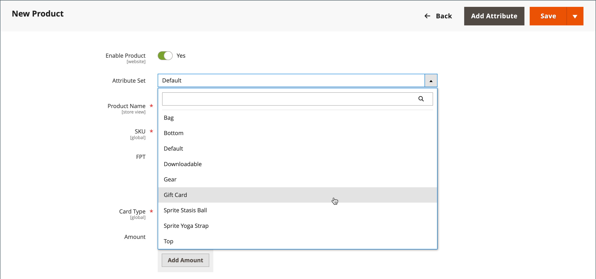
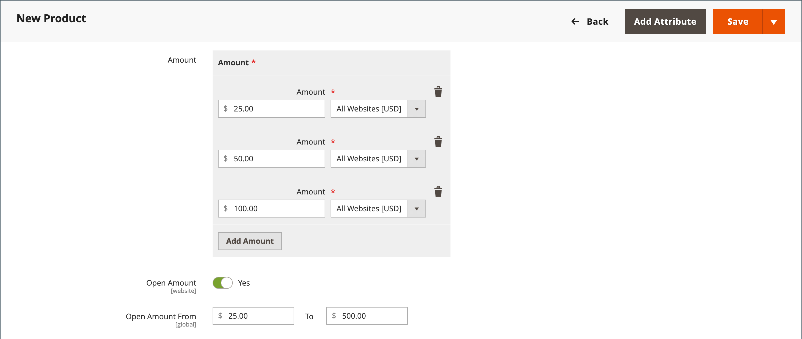

# Presentkortsprodukt

{{ee-feature}}

Varje presentkort har en unik kod som bara en kund kan få tillbaka vid utcheckningen. A [kodpool](../stores-purchase/product-gift-card-accounts.md#step-3-establish-the-gift-card-code-pool) måste vara upprättat innan presentkort kan säljas. Se [Arbetsflöde för presentkort](../stores-purchase/product-gift-card-workflow.md) om du vill ha information om hur presentkort löses in i kundvagnen.

{width="700" zoomable="yes"}

Det finns tre typer av presentkortsprodukter:

- **Virtuell** - Ett virtuellt presentkort skickas till mottagarens e-postadress, som krävs vid köpet av presentkortet. Ingen leveransadress behövs.

- **Fysisk** - Ett fysiskt presentkort skickas till mottagarens adress, vilket krävs vid köpet av presentkortet.

- **Kombinerad** - Ett kombinerat presentkort skickas och skickas med e-post till mottagaren. Mottagarens e-postadress och leveransadress krävs vid köpet av presentkortet.

## Skapa en presentkortsprodukt

Följande instruktioner visar hur du skapar ett presentkort med en [produktmall](attribute-sets.md), obligatoriska fält och grundläggande inställningar. Varje obligatoriskt fält markeras med en röd asterisk (`*`). När du är klar med grunderna kan du slutföra de andra produktinställningarna efter behov.

### Steg 1: Välj produkttyp

1. På _Administratör_ sidebar, gå till **[!UICONTROL Catalog]** > **[!UICONTROL Products]**.

1. I det övre högra hörnet på _[!UICONTROL Add Product]_( {width="25"}  ) väljer du **[!UICONTROL Gift Card]**.

   {width="700" zoomable="yes"}

### Steg 2: Välj attributuppsättning

Du kan använda standardinställningen `Gift Card` eller välj en annan. Gör något av följande om du vill välja den attributuppsättning som används som mall för produkten:

- Klicka på **[!UICONTROL Attribute Set]** och ange hela eller delar av attributuppsättningens namn.

- Välj den attributuppsättning som du vill använda i listan som visas.

{width="600" zoomable="yes"}

### Steg 3: Slutför de obligatoriska inställningarna

1. Ange en **[!UICONTROL Product Name]** för presentkortet.

   Du kan också ange typ av presentkort i namnet. Till exempel: _Virtuellt presentkort för Luma_.

1. Ange en **[!UICONTROL SKU]** för produkten.

   Som standard används produktnamnet som SKU.

1. Ange **[!UICONTROL Card Type]** till något av följande:

   - `Virtual` - Virtuella presentkort levereras via e-post till mottagaren.
   - `Physical` - Fysiska presentkort kan vara masstillverkade i förväg och präglade med unika koder.
   - `Combined` - Ett kombinerat presentkort har samma egenskaper som ett virtuellt och fysiskt presentkort.

   {width="600" zoomable="yes"}

1. Om du vill erbjuda kunden ett val av fasta belopp klickar du **[!UICONTROL Add Amount]** och ange kortets första fasta värde som ett decimaltal.

   Om du vill ange ett val av fasta belopp upprepar du det här steget för varje.

1. Så här kan du ge kunderna möjlighet att ange värdet på presentkortet:

   - Ange **[!UICONTROL Open Amount]** till `Yes`.

   - Om du vill definiera intervallet för minsta och högsta godtagbara värden anger du **[!UICONTROL Open Amount From]** och **[!UICONTROL To]** värden.

   Du kan skapa presentkort med fast pris, öppet belopp eller både och.

   {width="600" zoomable="yes"}

### Steg 4: Slutför de grundläggande inställningarna

1. För ett fysiskt eller kombinerat presentkort anger du **[!UICONTROL Quantity]** i lager.

1. Om presentkortet som ska skickas ska du ange **[!UICONTROL Weight]** i paketet.

1. I **[!UICONTROL Categories]** fält, välj `Gift Card`.

Det kan finnas ytterligare enskilda attribut som beskriver produkten. Markeringen varierar attributuppsättningen och du kan slutföra dem senare.

### Steg 5: Fyll i presentkortsinformationen

The _[!UICONTROL Gift Card Information]_-avsnittet i produktinställningarna kan användas för att åsidosätta [presentkortskonfiguration](../configuration-reference/sales/gift-cards.md) inställningar som bestämmer hur kortet hanteras.

1. Bläddra nedåt till _[!UICONTROL Gift Card Information]_-avsnitt.

   Standardinställningarna i det här avsnittet bestäms av systemkonfigurationen.

   {width="600" zoomable="yes"}

1. Ändra ytterligare fält efter hur du vill att presentkortet ska fungera:

   - **[!UICONTROL Treat Balance as Store Credit]** - Avgör om presentkortsinnehavaren kan lösa in saldot som butikskrediter.

   - **[!UICONTROL Lifetime (days)]** - Anger antalet dagar efter köpet tills presentkortet går ut. Om du inte vill ange en gräns för kortets livslängd lämnar du det här fältet tomt.

   - **[!UICONTROL Allow Message]** - Anger om köparen av presentkortet kan skriva ett meddelande till mottagaren. Ett presentmeddelande kan inkluderas för både virtuella (e-postade) och fysiska (levererade) presentkort.

   - **[!UICONTROL Email Template]** - Bestämmer e-postmallen som används för meddelandet som skickas till mottagaren av ett presentkort.

### Steg 6: Fyll i produktinformationen

Fyll i informationen i följande avsnitt efter behov:

- [Innehåll](product-content.md)
- [Bilder och video](product-images-and-video.md)
- [Samhörande produkter, merförsäljning och korsförsäljning](related-products-up-sells-cross-sells.md)
- [Sökmotoroptimering](product-search-engine-optimization.md)
- [Anpassningsbara alternativ](settings-advanced-custom-options.md)
- [Produkter på webbplatser](settings-basic-websites.md)
- [Design](settings-advanced-design.md)
- [Presentalternativ](product-gift-options.md)

### Steg 7: Publicera produkten

1. Om du vill publicera produkten i katalogen anger du **Aktivera produkt** växla till `Yes`.

1. Gör något av följande:

   **Metod 1:** Spara och förhandsgranska

   - Klicka på i det övre högra hörnet **[!UICONTROL Save]**.

   - Om du vill visa produkten i din butik väljer du **[!UICONTROL Customer View]** på _Administratör_ (  ),

   {width="600" zoomable="yes"}

   **Metod 2:** Spara och stäng

   På _[!UICONTROL Save]_( {width="25"} ) väljer du **[!UICONTROL Save & Close]**.

## Saker att komma ihåg

- A _kodpool_ unika nummer måste genereras innan ett presentkort kan köpas.

- Presentkort kan ställas in på `Redeemable` eller `Non-Redeemable`.

- Skatter är **_används inte_** till presentkort vid köpet av presentkortet. Skatter tillämpas endast på produkter när ett köpt presentkort används för att köpa produkter.

- Presentkortets livslängd kan vara obegränsad eller inställd på ett visst antal dagar.

- Värdet på ett presentkort kan anges till ett fast belopp eller anges till ett öppet belopp med ett lägsta och högsta värde.

- Ett presentkortskonto för kunden kan skapas när ordern läggs eller när fakturan skickas.
