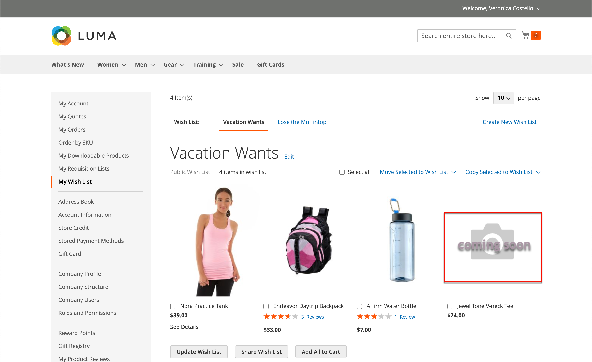
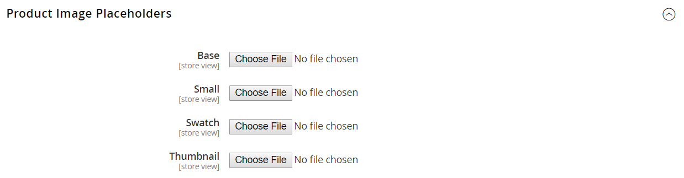

# Produktbildskonfiguration

Om du planerar att överföra stora bilder för visning på _[!UICONTROL Product Details]_kan det vara bra att ange en maximal pixelstorlek (bredd och höjd) och automatiskt ändra storlek på filerna vid överföringen. För att ge stöd för den här typen av överföring av produktbilder finns det ett alternativ för att aktivera automatisk storleksändring av större bildfiler när du överför dem. Du kan konfigurera en platshållarbild för produkter som du vill lägga till i katalogen men ännu inte har någon bildresurs att visa.

## Ändra storlek på produktbilder

När du överför produktbilder kan du lägga till större bilder med olika storlekar för att ge detaljerade, högkvalitativa zoomningar på _[!UICONTROL Product Details]_sida. För att säkerställa att alla bilder har en liknande storlek och utseende finns det ett alternativ för att ändra bildstorlek som säkerställer att alla bilder matchar en viss pixelstorlek. Det här alternativet ändrar automatiskt storlek på alla produktbilder med hjälp av konfigurationsinställningarna, vilket kan hjälpa till med zoomningsprestanda, snabbare inläsning av bilder och få ett enhetligt utseende på produktbilderna.

>[!NOTE]
>
>För bästa kompatibilitet rekommenderar vi att du överför alla produktbilder med `sRGB` färgprofil. Alla andra färgprofiler konverteras automatiskt till `sRGB` färgprofil under överföringen av produktavbildningen, vilket kan orsaka färginkonsekvenser i den överförda bilden.

Om du anger en maximal pixelbredd och -höjd ändras bildens storlek till de fysiska måtten med pixlar. I Commerce ändras storleken på bilden enligt den högre bredden eller höjden samtidigt som proportionerna behålls. Om du minskar kvalitetsmängden för JPG-bilder minskar filstorleken.

En bildfil på 3 000 x 2 100 pixlar JPG vid 100 % kan till exempel vara en bildfil på 5 MB eller mer. Om du ändrar storlek på den här bilden minskas bredden till 1 920 pixlar, proportionerna bevaras och kvaliteten till 80 %, vilket ger en mycket mindre filstorlek med hög kvalitet.

### Aktivera storleksändring av bilder

1. På _Administratör_ sidebar, gå till **[!UICONTROL Stores]** > _[!UICONTROL Settings]_>**[!UICONTROL Configuration]**.

1. Expandera på den vänstra panelen **[!UICONTROL Advanced]** och välja **[!UICONTROL System]**.

1. Expandera  den _Konfiguration för överföring av bilder_ -avsnitt.

   Om du vill ändra standardinställningarna avmarkerar du **[!UICONTROL Use system value]** vid behov.

   {width="600" zoomable="yes"}

   En detaljerad lista över de här konfigurationsinställningarna finns i [_Konfiguration för bildöverföring_](../configuration-reference/advanced/system.md#image-upload-configuration) i _Konfigurationsreferens_.

1. Om du vill aktivera måste du **[!UICONTROL Enable Frontend Resize]** är inställd på `Yes`.

1. Ange en **[!UICONTROL Quality]** inställning mellan `1` och `100`%.

   Du bör ange mellan 80 och 90 % för att minska filstorleken och få hög kvalitet.

1. Ange **[!UICONTROL Maximum Width]** i pixlar för bilden.

   När bildens storlek ändras överskrider den inte den bredden och behåller proportionerna.

1. Ange **[!UICONTROL Maximum Height]** i pixlar för bilden.

   När bildens storlek ändras överskrider den inte den här höjden och behåller proportionerna.

1. När du är klar klickar du på **[!UICONTROL Save Config]**.

### Fältbeskrivningar

| Fält | [Omfång](../getting-started/websites-stores-views.md#scope-settings) | Beskrivning |
|--- |--- |--- |
| [!UICONTROL Quality] | Global | Anger JPG-kvaliteten för den storleksändrade bilden. Lägre kvalitet minskar filstorleken. 80-90 % rekommenderas för att minska filstorleken med hög kvalitet. Standard: 80 |
| [!UICONTROL Enable Frontend Resize] | Global | Gör det möjligt för Commerce att ändra storlek på stora, stora bilder som du kan överföra för _[!UICONTROL Product Details]_sida. I Commerce ändras bildfilernas storlek med JavaScript när filen överförs. När du ändrar storlek på bilden behålls de exakta proportionerna så att den uppfyller och inte överskrider den största storleken för Maximal bredd eller Maximal höjd. Standard: `Yes` |
| [!UICONTROL Maximum Width] | Global | Anger bildens maximala pixelbredd. När bildens storlek ändras överskrider den inte denna bredd. Standard: `1920` |
| [!UICONTROL Maximum Height] | Global | Anger bildens maximala pixelhöjd. När bildens storlek ändras överskrider den inte den här höjden. Standard: `1200` |

{style="table-layout:auto"}

## Bildplatshållare

Adobe Commerce och Magento Open Source använder temporära bilder som platshållare tills de permanenta produktbilderna blir tillgängliga. En annan platshållare kan överföras för varje roll. Den ursprungliga platshållarbilden är en exempellogotyp som du kan ersätta med den bild du väljer.

{width="600" zoomable="yes"}

**_Så här överför du platshållarbilder:_**

1. På _Administratör_ sidebar, gå till **[!UICONTROL Stores]** > _[!UICONTROL Settings]_>**[!UICONTROL Configuration]**.

1. Expandera på den vänstra panelen **[!UICONTROL Catalog]** och välja **[!UICONTROL Catalog]** under.

1. Expandera  den **[!UICONTROL Product Image Placeholders]** -avsnitt.

   {width="600" zoomable="yes"}

   En detaljerad lista över de här konfigurationsinställningarna finns i [_Platshållare för produktbilder_](../configuration-reference/catalog/catalog.md#product-image-placeholders) i _Konfigurationsreferens_.

1. För varje bildroll klickar du på **[!UICONTROL Choose File]**, söker efter bilden på datorn och överför filen.

   Du kan använda samma bild för alla tre rollerna eller så kan du överföra en annan platshållarbild för varje roll.

1. När du är klar klickar du på **[!UICONTROL Save]**.

Mer information om bildroller och rekommenderade storlekar finns i [Överföra en bild](product-image.md#upload-an-image).
