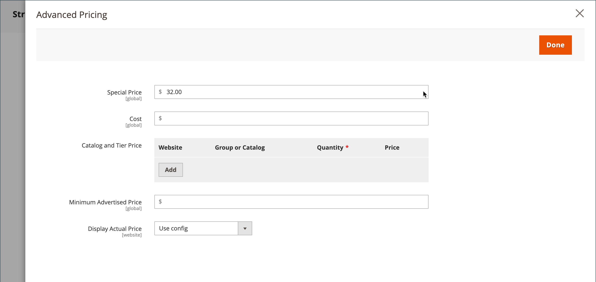

# Grupppriser

Du kan använda produktkonfigurationsinställningarna i Admin för att ange priser för rabatterade artiklar baserat på kundgrupper i din butik. Denna strategiska prismodell kallas _grupppriser_.

Det rabatterade priset för valfri produkt kan erbjudas medlemmar i en viss kundgrupp när kunden är inloggad på sitt konto. Kundgruppspriset visas på produktsidan tillsammans med det vanliga priset så att en kund enkelt kan jämföra priser och agera därefter. När de har lagt till produkten i kundvagnen ersätts det ordinarie priset av grupppriset baserat på kundgruppen.

Priserna för kundgrupper ingår i [differentierad prissättning](product-price-tier.md) och är inställt på liknande sätt. Den enda skillnaden är att kundgruppspriserna har en kvantitet på 1.

{width="600" zoomable="yes"}

## Fördelar med att använda grupppriser

- Lämpligt för grossister

- Kundernas incitament att uppgradera sin kundgrupp för att dra nytta av rabatterna

- Målinriktade marknadsföringskampanjer

- Skapa förtroende och trovärdighet genom att belöna lojala kunder

## Ställ in ett grupppris

1. Öppna produkten i redigeringsläge.

1. Under _[!UICONTROL Price]_fält, klicka **[!UICONTROL Advanced Pricing]**.

1. I _[!UICONTROL Customer Group Price]_avsnitt, klicka **[!UICONTROL Add]**.

   Om din butik innehåller [Adobe Commerce B2B](../b2b/introduction.md) och har [delade kataloger](../b2b/catalog-shared.md) aktiverat, det här avsnittet är etiketterat _[!UICONTROL Catalog and Tier Price]_.

   {width="600" zoomable="yes"}

1. Konfigurera grupppriset:

   - För en installation på flera platser väljer du **[!UICONTROL Website]** om grupppriset gäller.

   - Välj **[!UICONTROL Customer Group]** som ska få rabatten.

   - Ange en **[!UICONTROL Quantity]** av `1`.

   - För **[!UICONTROL Price]**, ange prissättningstyp och belopp:

      - `Fixed` - Ange det rabatterade produktpriset.

      - `Discount` - Ange det rabatterade priset som en procentandel av produktpriset.

     {width="600" zoomable="yes"}

1. Om du vill lägga till ett grupppris klickar du på **[!UICONTROL Add]** och upprepa föregående steg.

1. När du är klar klickar du på **[!UICONTROL Done]** och sedan **[!UICONTROL Save]**.

>[!NOTE]
>
>The **_final_** produktpriset beräknas som **_minimum_** relevant pris, med följande formel:  `Final Price=Min(Regular(Base) Price, Group(Tier) Price, Special Price, Catalog Price Rule) + Sum(Min Price per each required custom option)`

>[!NOTE]
>
>**_Fast pris_** de anpassningsbara alternativen är _not_ påverkas av reglerna för grupppris, pris, specialpris eller katalogpris.
