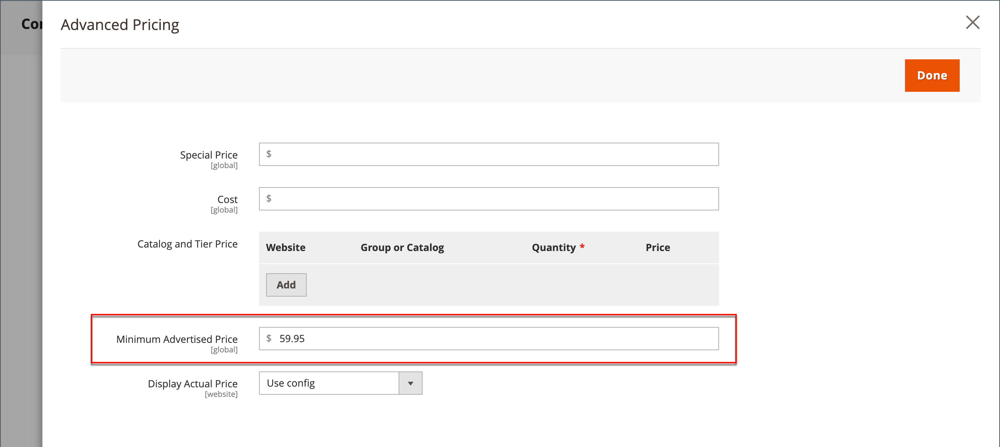

# Lägsta annonspris

Det är ibland förbjudet för handlare att visa ett pris som är lägre än tillverkarens rekommenderade försäljningspris (MSRP). Minimikampanjpris ger er möjlighet att följa tillverkarens krav samtidigt som ni ger era kunder ett bättre pris. Eftersom kraven skiljer sig från en tillverkare till en annan kan du konfigurera din butik så att du inte kan visa det faktiska priset på sidor där det inte är tillåtet.

Funktionen MAP lägger till länken _Klicka för pris_ i stället för det vanliga produktpriset. Om priset i din butik ligger under det fastställda minimipriset för den produkten finns det två sätt att hantera prisinformationen i butiken. Det första sättet är att priset inte visas. Om köparen klickar på knappen _Klicka för pris_ syns bara det faktiska priset som du säljer produkten till. Det andra sättet är att listan/marknadspriset visas med en genomstrykning för att understryka att priset är lägre.

Med MAP-funktionen kan du också föreslå förbättringar. När en kund till exempel lägger till en sådan produkt i kundvagnen dirigeras de inte om till kundvagnen, och i stället visas erbjudanden som gör att köparen kan:

- Ta bort en artikel från vagnen (kan göras om köparen bara vill förtydliga priset och ännu inte har fattat något beslut om köp)

- Lämna den i kundvagnen och fortsätt handla

- Gå till kassan

## MAP-logik

Vissa produkter har priser som är beroende av ett valt alternativ, t.ex. anpassade alternativ eller enkla produkter med egna SKU:er och lagerhantering). För dessa produkter används följande logik beroende på produkttyp och prisinställning. Det faktiska priset används av orderhantering, kundhanteringsverktyg och rapporter.

## Använda MAP med produkttyper

| Produkttyp | Beskrivning |
|--- |--- |
| [Enkel](product-create-simple.md), [Virtuell](product-create-virtual.md) | Det faktiska priset visas inte automatiskt på kataloglistan och produktsidorna, men inkluderas endast enligt inställningen [!UICONTROL Display Actual Price]. Priserna för anpassade alternativ visas normalt. |
| [Grupperad](product-create-grouped.md) | Priserna för associerade enkla produkter visas inte automatiskt på kataloglistan och produktsidorna, utan inkluderas endast enligt inställningen [!UICONTROL Display Actual Price]. |
| [Konfigurerbar](product-create-configurable.md) | Det faktiska priset visas inte automatiskt på kataloglistan och produktsidorna, men inkluderas endast enligt inställningen [!UICONTROL Display Actual Price]. Alternativpriserna visas normalt. |
| [Paket](product-create-bundle.md) (med fast pris) | Det faktiska priset visas inte automatiskt på katalogsidor, men inkluderas endast enligt inställningen [!UICONTROL Display Actual Price]. Priserna för paketartiklar visas normalt. MAP är inte tillgängligt för paketprodukter med dynamiska priser. |
| [Kan hämtas](product-create-downloadable.md) | Det faktiska priset visas inte automatiskt på kataloglistan och produktsidorna, men inkluderas endast enligt inställningen [!UICONTROL Display Actual Price]. Priset som är kopplat till varje nedladdningslänk visas normalt. |

{style="table-layout:auto"}

## Använda MAP med prisinställningar

| Prisinställning | Beskrivning |
|--- |--- |
| Pris | När MAP tillämpas på huvudpriset visas priserna för alternativ, paketartiklar och tillhörande produkter (som adderar eller subtraherar från huvudpriset) normalt. |
| Associerat produktpris | Om en produkt inte har något huvudpris och dess pris härleds från de associerade produktpriserna (t.ex. i en grupperad produkt), tillämpas MAP-inställningarna för de associerade produkterna. |
| [MSRP](product-price-minimum-advertised.md) | Om en produkt i varukorgen har specificerat tillverkarens föreslagna detaljhandelspris (MSRP), stryks inte priset över. |
| [Pris](product-price-tier.md) | Om nivåprissättning har angetts visas inte meddelandet om nivåprissättning i katalogen. På produktsidan visas ett meddelande som anger att priset kan vara lägre när du beställer mer än en viss kvantitet, men rabatten visas endast i procent. Rabatterna visas inte på produktsidan för associerade produkter i en grupperad produkt. Prisnivån visas enligt inställningen Visa faktiskt pris. |
| [Specialpris](product-price-special.md) | Om specialpriset anges visas specialpriset enligt inställningen Visa faktiskt pris. |

## MAP-konfiguration

Funktionen Minsta kampanjpris (MAP) är inte aktiverad som standard. Om du vill lägga till den här funktionen i din butik måste du aktivera den och konfigurera MAP-inställningarna för dina produkter. MAP-inställningarna kan tillämpas på alla produkter i katalogen eller konfigureras för specifika produkter. När MAP är aktiverat globalt döljs alla produktpriser i butiken. Det finns olika konfigurationsalternativ som du kan använda för att uppfylla villkoren i ditt avtal med tillverkaren, samtidigt som du erbjuder kunderna ett bättre pris.

{width="700" zoomable="yes"}

På global nivå kan du aktivera eller inaktivera MAP, tillämpa det på alla produkter och definiera hur det faktiska priset ska visas. Du kan också redigera texten i relaterade meddelanden och informationstips som visas i butiken.

När MAP är aktiverat blir MAP-inställningarna på produktnivå tillgängliga. Du kan tillämpa en karta för en enskild produkt genom att ange ett minimipris och välja hur du vill att det faktiska priset ska visas i butiken. MAP-inställningar på produktnivå åsidosätter de globala MAP-inställningarna.

{width="700" zoomable="yes"}

### Steg 1: Aktivera MAP för butiksvyn

1. Gå till **[!UICONTROL Stores]** > _[!UICONTROL Settings]_>**[!UICONTROL Configuration]**&#x200B;på sidofältet_ Admin _.

1. Om det är tillämpligt anger du **[!UICONTROL Store View]** i det övre högra hörnet till den vy där konfigurationen gäller.

1. Expandera **[!UICONTROL Sales]** i den vänstra panelen och välj **[!UICONTROL Sales]** under.

1. Expandera  i avsnittet _[!UICONTROL Minimum Advertised Price]_.

1. Ange **Aktivera MAP** till `Yes` om det behövs.

   {width="600" zoomable="yes"}

   En detaljerad lista över dessa konfigurationsalternativ finns i [_Lägsta annonspris_](../configuration-reference/sales/sales.md#minimum-advertised-price) i _Konfigurationsreferens_.

### Steg 2: Konfigurera MAP-inställningarna

Använd någon av följande metoder för att konfigurera MAP-inställningarna:

#### Metod 1: Konfigurera MAP för alla produkter

1. Så här avgör du när och var du vill att det faktiska priset ska vara synligt för kunderna:

   - Om du vill ändra standardvärdet avmarkerar du kryssrutan **[!UICONTROL Use system value]**.

   - Ange **Visa faktiskt pris** till något av följande:
      - `In Cart`
      - `Before Order Confirmation`
      - `On Gesture (on click)`

1. Ange den text som du vill ska visas i **[!UICONTROL Default Popup Text Message]**.

1. Ange eventuella ytterligare förklaringar som du vill ska visas i **[!UICONTROL Default "What's This" Text Message]**.

1. Klicka på **[!UICONTROL Save Config]** när du är klar.

#### Metod 2: Konfigurera MAP för en enskild produkt

1. Gå till **[!UICONTROL Catalog]** > **[!UICONTROL Inventory]** > **[!UICONTROL Products]** på sidofältet _Admin_.

1. Öppna produkten i **[!UICONTROL Edit]**-läge.

1. Expandera **[!UICONTROL Advanced Settings]** i den vänstra panelen och välj **[!UICONTROL Advanced Pricing]**.

   >[!NOTE]
   >
   >Fälten [!UICONTROL Manufacturer's Suggested Retail Price] och [!UICONTROL Display Actual Price] visas bara när [Minimalt annonspris](../configuration-reference/sales/sales.md#minimum-advertised-price) är aktiverat i konfigurationen.

1. Ange **[!UICONTROL Manufacturer's Suggested Retail Price]** (MSRP).

   I det här exemplet är produktpriset 54,00 USD och minimipriset är 59,95.

   {width="600" zoomable="yes"}

1. Ange **[!UICONTROL Display Actual Price]** till något av följande:

   - `Use config` - (Standard) Använder visningsinställningarna som [konfigurerade](../configuration-reference/sales/sales.md#minimum-advertised-price) för butiken. |
   - `On Gesture` - Visar det faktiska produktpriset i en popup när kunden klickar på _Klicka för pris_ eller _Vad är detta?_-länk.
   - `In Cart` - Visar det faktiska produktpriset i kundvagnen.
   - `Before Order Confirmation` - Visar det faktiska produktpriset i slutet av utcheckningsprocessen, precis innan ordern har bekräftats.

1. När du är klar klickar du på **[!UICONTROL Done]** och sedan på **[!UICONTROL Save]**.
