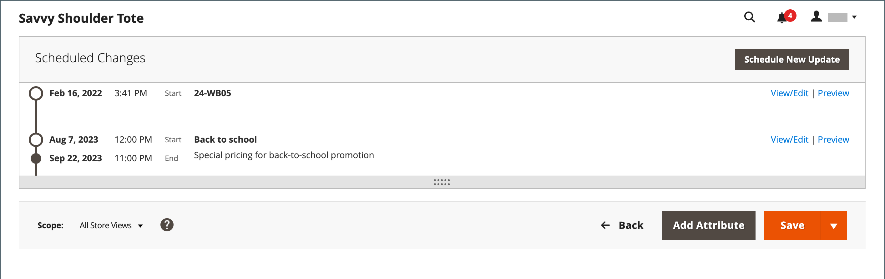
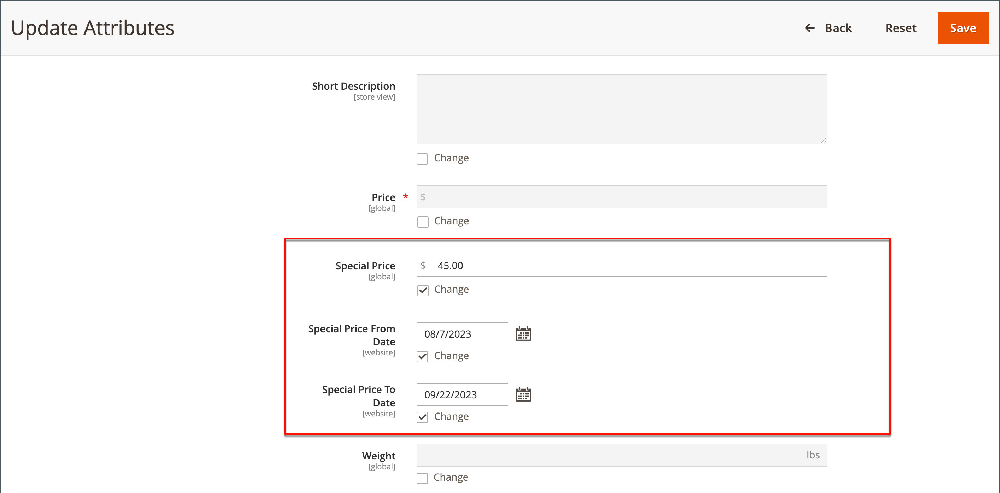

# Specialpriser

Ett särskilt pris kan erbjudas för en bestämd tidsperiod. Under den angivna tidsperioden visas specialpriset i stället för normalpriset, följt av en notering som visar det reguljära priset.

{width="700" zoomable="yes"}

## Använd specialpris på en enskild produkt

Du kan enkelt ange ett specialpris för en enskild produkt i katalogen.

### Använd en schemalagd uppdatering

{{ee-feature}}

Adobe Commerce stöder [schemalagda uppdateringar](../content-design/content-staging-scheduled-update.md). Använd de här kampanjverktygen för att tillämpa ett särskilt pris på en viss produkt under en viss tidsperiod.

1. Öppna produkten i redigeringsläge.

1. Klicka på **[!UICONTROL Scheduled Update]**.

   {width="600" zoomable="yes"}

1. Ange ett namn för specialpriserbjudandet för **Uppdatera namn**.

1. Ange en kort **[!UICONTROL Description]**.

1. Använd ikonen _Kalender_ (  ) för att välja **[!UICONTROL Start Date]** och **[!UICONTROL End Date]** för specialpriserbjudandet.

   Du kan även använda skjutreglagen **[!UICONTROL Hour]** och **[!UICONTROL Minute]** för att välja start- och sluttid. Klicka på **[!UICONTROL Close]** när start och slut är inställda.

   {width="600" zoomable="yes"}

1. Bläddra ned till fältet _Pris_, klicka på **[!UICONTROL Advanced Pricing]** och ange mängden **[!UICONTROL Special Price]** som ska användas enligt den schemalagda uppdateringen.

   {width="600" zoomable="yes"}

1. När du är klar klickar du på **[!UICONTROL Done]** och sedan på **[!DNL Save]**.

   I butiken ska specialpriset visas både i kataloglistan och på produktsidan.

   _[!UICONTROL Scheduled Change]_&#x200B;visas högst upp på sidan.

   {width="600" zoomable="yes"}

### Använd ett enkelt start- och slutdatum

{{ce-feature}}

Magento Open Source har alternativ för enkla start- och slutdatum i Avancerade priser.

1. Öppna produkten i redigeringsläge.

1. Bläddra ned till fältet _[!UICONTROL Price]_, klicka på&#x200B;**[!UICONTROL Advanced Pricing]**&#x200B;och ange **[!UICONTROL Special Price]**-mängden.

1. Använd ikonen _Kalender_ (  ) för att välja **[!UICONTROL Start Date]** och **[!UICONTROL End Date]** för specialpriserbjudandet.

   Det särskilda priset gäller omedelbart efter midnatt i början av startdatumet (00:01) och fortsätter till och med strax före midnatt (23:59) dagen före slutdatumet.

   {width="600" zoomable="yes"}

1. När du är klar klickar du på **[!UICONTROL Done]** och sedan på **[!UICONTROL Save]**.

   I butiken ska specialpriset visas både i kataloglistan och på produktsidan.

## Tillämpa ett specialpris på flera produkter

Du kan också tilldela ett specialpris till flera produkter, till exempel flera varianter av en [konfigurerbar produkt](product-create-configurable.md).

### Ange ett specialpris för valda produkter

{{ee-feature}}

I följande exempel visas hur du tilldelar samma specialpris till flera produktvarianter av en konfigurerbar produkt i Adobe Commerce.

1. På sidan _[!UICONTROL Products]_&#x200B;klickar du på&#x200B;**[!UICONTROL Filters]**&#x200B;och anger **[!UICONTROL Name]**&#x200B;för den konfigurerbara produkten.

1. Ange **[!UICONTROL Type]** till `Configurable Product` och klicka på **[!UICONTROL Apply Filters]**.

1. Om du vill tilldela alla produkter samma specialpris anger du kontrollen i den första kolumnens rubrik till `Select All`.

   Du kan också markera kryssrutan för varje produkt som du vill inkludera.

1. Ställ in kontrollen **[!UICONTROL Actions]** på `Update attributes`.

1. Bläddra ned till fältet _[!UICONTROL Special Price]_&#x200B;och markera kryssrutan **[!UICONTROL Change]**&#x200B;nedanför fältet&#x200B;_[!UICONTROL Special Price]_ och ange det specialpris som du vill erbjuda.

   {width="600" zoomable="yes"}

1. Klicka på **[!UICONTROL Save]** när du är klar.

Specialpriset i butiken visas i kataloger och på produktsidan. För en konfigurerbar produkt visas det ordinarie priset även på produktsidan när du väljer alternativ.

### Ange ett särskilt pris och datumintervall för valda produkter

{{ce-feature}}

I följande exempel visas hur du tilldelar samma specialpris till flera produktvarianter av en konfigurerbar produkt i Magento Open Source.

1. Gå till **[!UICONTROL Catalog]** > **[!UICONTROL Products]** på sidofältet _Admin_.

1. Klicka på **[!UICONTROL Filters]**.

1. Ange **[!UICONTROL Name]** för den konfigurerbara produkten.

1. Ange **[!UICONTROL Type]** till `Simple Product`.

   {width="600" zoomable="yes"}

1. Klicka på **[!UICONTROL Apply Filters]**.

   I rutnätet visas alla enkla produkter som är associerade som varianter av den konfigurerbara produkten.

1. Om du vill tilldela alla produkter samma specialpris anger du kontrollen i den första kolumnens rubrik till `Select All`.

   Du kan också markera kryssrutan för varje produkt som du vill inkludera.

1. Ställ in kontrollen **[!UICONTROL Actions]** på `Update attributes`.

   {width="600" zoomable="yes"}

1. Bläddra ned till fältet _[!UICONTROL Special Price]** och gör följande:

   - Markera kryssrutan **[!UICONTROL Change]** nedanför fältet _[!UICONTROL Special Price]** och ange det specialpris som du vill erbjuda.

   - Markera kryssrutan **[!UICONTROL Change]** nedanför fältet _Specialpris från datum_, klicka på _Kalender_ (  ) och välj det första datumet för specialpriserbjudandet.

     Det särskilda priset gäller omedelbart efter midnatt i början av startdatumet (00:01) och fortsätter till och med strax före midnatt (23:59) dagen före slutdatumet.

   - Markera kryssrutan **[!UICONTROL Change]** nedanför fältet _Specialpris till datum_, klicka på _Kalender_ (  ) och välj det sista datumet för specialpriserbjudandet.

   {width="600" zoomable="yes"}

1. Klicka på **[!UICONTROL Save]** när du är klar.

   Ett meddelande visar hur många poster som uppdaterades med specialpriset.

   Specialpriset blir tillgängligt i butiken det angivna datumet och visas i kataloglistor och på produktsidan. För en konfigurerbar produkt visas det ordinarie priset även på produktsidan när du väljer alternativ.

   {width="600" zoomable="yes"}

## Testning

Om specialpriset inte visas korrekt i butiken både på kataloglistan och på produktsidorna rensar du webbläsarens cache:

1. Gå till **[!UICONTROL System]** > **[!UICONTROL Cache Management]** på sidofältet _Admin_.

1. Klicka på **[!UICONTROL Flush Magento Cache]**.

>[!NOTE]
>
>Det **_slutliga_**-produktpriset beräknas som det **_lägsta_** relevanta priset, med följande formel:  `Final Price=Min(Regular(Base) Price, Group(Tier) Price, Special Price, Catalog Price Rule) + Sum(Min Price per each required custom option)`

>[!NOTE]
>
>**_Fast pris_** anpassningsbara produktalternativ _påverkas_ inte av reglerna för grupppris, pris, specialpris eller katalogpris.
