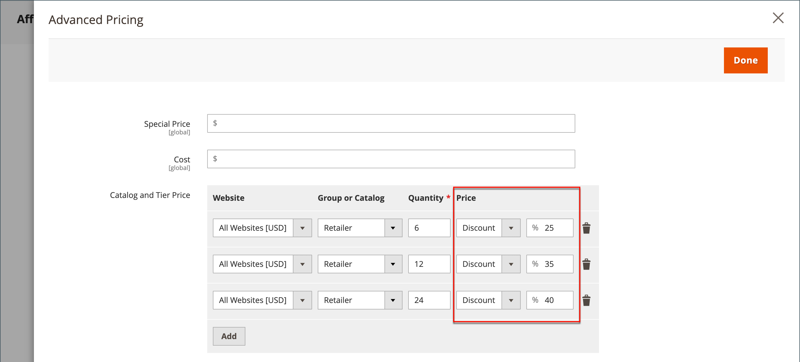

# Nivåpriser

Med nivåpriser kan ni erbjuda mängdrabatt från en produktlista eller en produktsida i butiken. Rabatten kan tillämpas på en viss butiksvy, kundgrupp eller delad katalog.

Om du har många produkter att uppdatera är det mest effektivt att importera nivåprisändringarna i stället för att ange dem individuellt. Mer information finns i [Importera nivåpriser](../systems/data-import-price-tier.md).

{width="700" zoomable="yes"}

På produktsidan beräknas kvantitetsrabatten och ett meddelande visas, till exempel:

`Buy 6 for $5.95 each and save 15%`

Priserna i butiken har företräde från högsta till lägsta kvantitet. Om du har ett nivåpris för kvantiteten `5` och en för `10`, och en kund lägger till fem, sex, sju, åtta eller nio artiklar i kundvagnen, får kunden det rabatterade priset för kvantitetsnivån `5`. När kunden lägger till den tionde artikeln ersätter det rabatterade priset som anges för nivån `10` skiktet skiktet för kvantiteten `5`, och det rabatterade priset för `10` gäller.

## Lägg till en prisnivå för en produkt

1. Öppna produkten i redigeringsläge.

1. Klicka **[!UICONTROL Advanced Pricing]** nedanför fältet _[!UICONTROL Price]_.

1. Klicka på **[!UICONTROL Add]** i avsnittet _[!UICONTROL Tier Price]_.

   Om du skapar en nivå med flera priser klickar du på **[!UICONTROL Add]** för varje ytterligare nivå så att du kan arbeta med alla nivåer samtidigt. Varje nivå i gruppen har samma webbplats och kundgrupp eller delad katalogtilldelning, men olika kvantitet och pris.

## Konfigurera prisnivån

1. Om din butik har flera webbplatser väljer du den **[!UICONTROL Website]** som nivåpriset gäller för.

1. Om det behövs kan du begränsa tillgängligheten för prisnivån genom att välja **[!UICONTROL Customer Group]** eller **[!UICONTROL Shared Catalog]** ( endast tillgänglig med [Adobe Commerce B2B](./b2b/../introduction.md)).

1. För **[!UICONTROL Qty]** anger du den kvantitet som måste beställas för att få rabatten.

   - **Metod 1:** Ange priset som ett fast belopp

     Ange **[!UICONTROL Price]** till `Fixed` och ange det justerade priset för en enhet på den nivån.

     {width="600" zoomable="yes"}

   - **Metod 2:** Ange pris i procent

     Ange **[!UICONTROL Price]** till `Discount` och ange det rabatterade priset som en procentandel av produktens baspris.

     Ange till exempel talet `15` för en rabatt på 15 procent. (Priset sparas med två decimaler, till exempel `15.00`.)

     >[!NOTE]
     >
     >För att få det rabatterade priset beräknas den definierade procentandelen mot det värde som definieras i fältet _[!UICONTROL Price]_, inte i fältet&#x200B;_[!UICONTROL Special Price]_.

     {width="600" zoomable="yes"}

## Slutför priskonfigurationen

1. Om du vill lägga till en annan uppsättning nivåpriser för en annan webbplats eller kundgrupp upprepar du de föregående stegen.

1. När du är klar klickar du på **[!UICONTROL Done]** och sedan på **[!UICONTROL Save]**.

>[!NOTE]
>
>Det **_slutliga_**-produktpriset beräknas som det **_lägsta_** relevanta priset, med följande formel:  `Final Price=Min(Regular(Base) Price, Group(Tier) Price, Special Price, Catalog Price Rule) + Sum(Min Price per each required custom option)`

>[!NOTE]
>
>**_Fast pris_** anpassningsbara produktalternativ _påverkas_ inte av reglerna för grupppris, pris, specialpris eller katalogpris.
