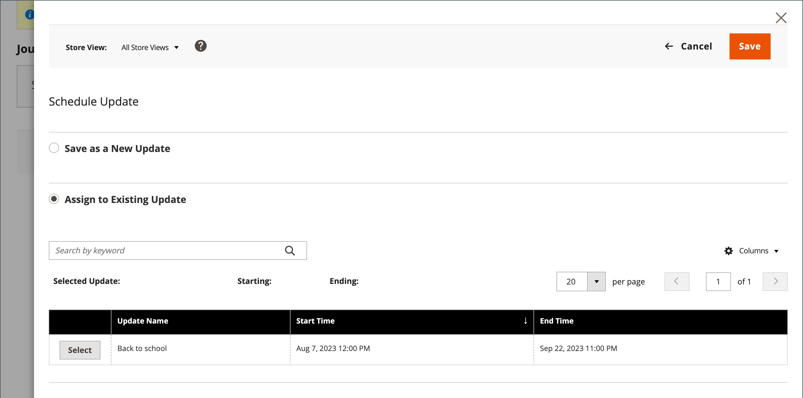

# Schemalägg produktuppdateringar

{{ee-feature}}

Produktuppdateringar kan tillämpas enligt schema och grupperas med andra innehållsändringar. Du kan använda [innehållstaging](../content-design/content-staging.md) för att skapa en kampanj baserat på schemalagda ändringar av produkten eller tillämpa ändringarna på en befintlig kampanj.

>[!NOTE]
>
>Fälten [!UICONTROL Set Product as New From], [!UICONTROL To] och fliken [!UICONTROL Schedule Design Update] har tagits bort i  Adobe Commerce och kan inte ändras direkt i produkten. Du måste skapa en schemalagd uppdatering för dessa aktiveringar.

>[!NOTE]
>
>Alla schemalagda uppdateringar tillämpas i följd, vilket innebär att alla enheter bara kan ha en schemalagd uppdatering åt gången. Alla schemalagda uppdateringar tillämpas på alla butiksvyer inom tidsramen. Därför kan en enhet inte ha olika schemalagda uppdateringar för olika butiksvyer samtidigt. Alla värden för entitetsattribut i alla butiksvyer, som inte påverkas av den aktuella schemalagda uppdateringen, hämtas från standardvärdena och inte från den tidigare schemalagda uppdateringen.

>[!NOTE]
>
>En mellanlagringsförhandsvisning för en schemalagd uppdatering startar alltid från butiksvyn **default** som emulerar kundens upplevelse av att navigera genom mellanlagringsuppdateringskampanjen.

## Skapa en schemalagd uppdatering

1. Gå till **[!UICONTROL Catalog]** > **[!UICONTROL Products]** på sidofältet _Admin_.

1. Välj en befintlig produkt och klicka på **[!UICONTROL Edit]**.

1. Klicka på **[!UICONTROL Schedule New Update]**.

1. Välj **[!UICONTROL Save as a New Update]**.

1. Ange ett namn för den nya innehållstagningskampanjen för **[!UICONTROL Update Name]**.

1. Ange en kort **[!UICONTROL Description]** av uppdateringen och hur den ska användas.

1. Använd kalenderverktyget () för att välja **[!UICONTROL Start Date]** och **[!UICONTROL End Date]** för kampanjen.

   >[!NOTE]
   >
   >Kampanjen **[!UICONTROL Start Date]** och **[!UICONTROL End Date]** måste definieras med hjälp av administratörstidszonen **_default_** som konverteras från den lokala tidszonen för varje webbplats. Om du till exempel har flera webbplatser i olika tidszoner där du vill starta en kampanj som baseras på en tidszon i USA måste du schemalägga en separat uppdatering för varje lokal tidszon. Ange **[!UICONTROL Start Date]** och **[!UICONTROL End Date]** för varje, så konverteras den från den lokala webbplatsens tidszon till administratörens standardtidszon.

   {width="600" zoomable="yes"}

1. Bläddra ned till _[!UICONTROL Price]_och klicka på&#x200B;**[!UICONTROL Advanced Pricing]**.

1. Ange **[!UICONTROL Special Price]** för produkten under den schemalagda kampanjen och klicka på **[!UICONTROL Done]**.

1. Klicka på **[!UICONTROL Save]** när du är klar.

## Tilldela till befintlig uppdatering

1. Gå till **[!UICONTROL Catalog]** > **[!UICONTROL Products]** på sidofältet _Admin_.

1. Välj en befintlig produkt och klicka på **[!UICONTROL Edit]**.

1. Klicka på **[!UICONTROL Schedule New Update]**.

1. Välj **[!UICONTROL Assign to Existing Campaign]**.

1. Välj den kampanj som ska ändras i listan.

   {width="600" zoomable="yes"}

1. Expandera  **[!UICONTROL Content]**.

1. Klicka på **[!UICONTROL Save]** när du är klar.

## Visa den schemalagda ändringen

Den schemalagda ändringen visas högst upp på produktsidan med kampanjens start- och slutdatum.

{width="600" zoomable="yes"}

## Redigera den schemalagda ändringen

1. Klicka på **[!UICONTROL View/Edit]** i rutan _[!UICONTROL Scheduled Changes]_överst på sidan.

1. Gör de ändringar som behövs för den schemalagda uppdateringen.

>[!NOTE]
>
>Om en kampanj är länkad till mer än en produkt kan kampanjen bara redigeras från [Content Staging Dashboard](../content-design/content-staging-dashboard.md).

1. Klicka på **[!UICONTROL Save]**.

## Ta bort den schemalagda ändringen

1. Klicka på **[!UICONTROL View/Edit]** i rutan _[!UICONTROL Scheduled Changes]_överst på sidan.

1. Klicka på **[!UICONTROL Remove from Update]** i det övre fältet.

   {width="600" zoomable="yes"}

1. I dialogrutan väljer du **[!UICONTROL Delete the Update]** och klickar på **[!UICONTROL Done]**.

   >[!NOTE]
   >
   >Produkten tas bort från uppdateringen och alla schemalagda ändringar går förlorade.

## Schemalägg en designuppdatering

{{ce-feature}}

Avsnittet _[!UICONTROL Schedule Design Update]_ger dig möjlighet att göra tillfälliga ändringar av utseendet på produktsidan. Du kan schemalägga designändringar för en säsong, en befordran eller bara för att göra saker och ting fräscha. Designändringar kan schemaläggas i förväg så att de träder i kraft, eller_ drop _, enligt ditt definierade schema.

{width="600" zoomable="yes"}

| Fält | Beskrivning |
|--- |--- |
| [!UICONTROL Schedule Update From/To] | Anger datumintervallet när en anpassad layout används på produkten. |
| [!UICONTROL New Theme] | Använder ett anpassat tema för produkten. |
| [!UICONTROL New Layout] | Använder en annan layout på produktsidan. Alternativ:  **[!UICONTROL No layout updates]**- Som standard är layoutuppdateringar inte tillgängliga för produktsidan. **[!UICONTROL Empty]** - Gör att du kan definiera en egen layout, till exempel en sida med fyra kolumner. (Kräver förståelse för XML.)  **[!UICONTROL 1 column]**- Använder en layout med en kolumn på produktsidan. **[!UICONTROL 2 columns with left bar]** - Använder en layout med två kolumner och vänster sidospalt på produktsidan.  **[!UICONTROL 2 columns with right bar]**- Använder en layout med två kolumner och höger sidospalt på produktsidan. **[!UICONTROL 3 columns]** - Använder en layout med tre kolumner på produktsidan. |

{style="table-layout:auto"}
