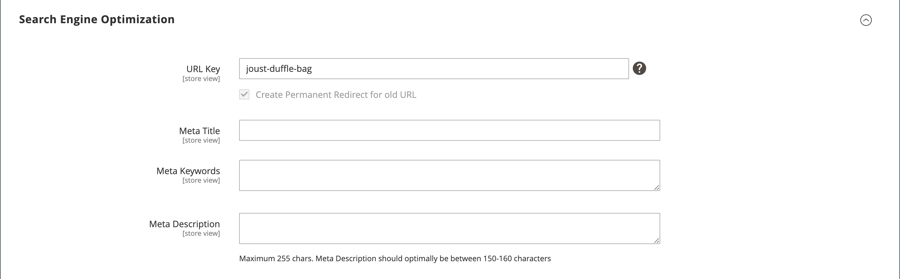

# Produktinställningar - [!UICONTROL Search Engine Optimization]

_Sökmotoroptimering_ (SEO) är ett sätt att finjustera innehållet och presentationen för en webbplats för att förbättra det sätt på vilket sidorna indexeras av sökmotorer.

_[!UICONTROL Search Engine Optimization]_-inställningarna för en produkt anger fälten [ URL-nyckel ](catalog-urls.md) och [ metadata ](../merchandising-promotions/meta-data.md) som används av sökmotorer för att indexera produkten. Även om vissa sökmotorer ignorerar metatangentord används de även av andra sökmotorer. Den aktuella [SEO-metoden ](../merchandising-promotions/seo-overview.md) är att infoga nyckelord med högt värde i både metatiteln och metabeskrivningen.

Standardvärdet för varje metadatafält kan genereras automatiskt baserat på värden som anges i konfigurationen. Varje fält innehåller en platshållare som ersätts med ett faktiskt värde. Mer information finns i [Automatisk generering av produktfält](../configuration-reference/catalog/catalog.md#uicontrol-product-fields-auto-generation).

## Fyll i SEO-fälten

1. Öppna produkten i redigeringsläge.

1. Bläddra nedåt och utöka  i avsnittet _[!UICONTROL Search Engine Optimization]_.

{width="600" zoomable="yes"}

1. Ange **[!UICONTROL URL Key]** (valfritt).

   Standardnyckeln för URL baseras på produktnamnet. Du kan använda standardinställningen eller ändra den efter behov. Mer information finns i [Katalogadresser](catalog-urls.md).

1. Ange **[!UICONTROL Meta Title]** (valfritt).

   Meta-titeln är den text som visas högst upp i webbläsarfönstret. Du kan använda standardvärdet, som baseras på produktnamnet, eller ändra det efter behov.

1. Lägg till **[!UICONTROL Meta Keywords]** (valfritt).

   Meta-nyckelorden används mer än andra av vissa sökmotorer. Det är en god vana att ange några nyckelord med högt värde för att få produkten mer synlig.

1. Ange **[!UICONTROL Meta Description]**.

   Meta-beskrivningen är den text som visas i sökresultatlistor. Du får bäst resultat om du anger en beskrivning som är mellan 150 och 160 tecken lång.

## Fältreferens

| Fält | [Omfång](../getting-started/websites-stores-views.md#scope-settings) | Beskrivning |
|--- |--- |------------------|
| [!UICONTROL URL Key] | Butiksvy | Bestämmer produktens onlineadress. URL-nyckeln läggs till i butikens bas-URL och visas i adressfältet i en webbläsare. Commerce skapar först en _sökmotorvänlig_ URL som baseras på produktnamnet. URL-nyckeln ska vara alla små bokstäver, med bindestreck som inte är avslutande mellan dessa tecken i stället för mellanslag. Ta inte med ett suffix som `.html` i URL-nyckeln eftersom det hanteras i konfigurationen. |
| [!UICONTROL Meta Title] | Butiksvy | Titeln visas i namnlisten och på fliken i webbläsaren och används även som rubrik på en sökmotorresultatsida (SERP). Meta-titeln ska vara unik för sidan och ha färre än 70 tecken. Automatiskt genererat värde: `{{name}}` |
| [!UICONTROL Meta Keywords] | Butiksvy | Relevanta nyckelord för produkten. Använd nyckelord som kunderna kan använda för att hitta produkten. Automatiskt genererat värde: `{{name}}` |
| [!UICONTROL Meta Description] | Butiksvy | Metabeskrivningen ger en kort översikt över sidan med sökresultatlistor. En idealisk längd är mellan 150 och 160 tecken lång, med högst 255 tecken. Även om de inte är synliga för kunden innehåller vissa sökmotorer metabeskrivningen på sökresultatsidan. Automatiskt genererat värde: `{{name}} {{description}}` |

{style="table-layout:auto"}
