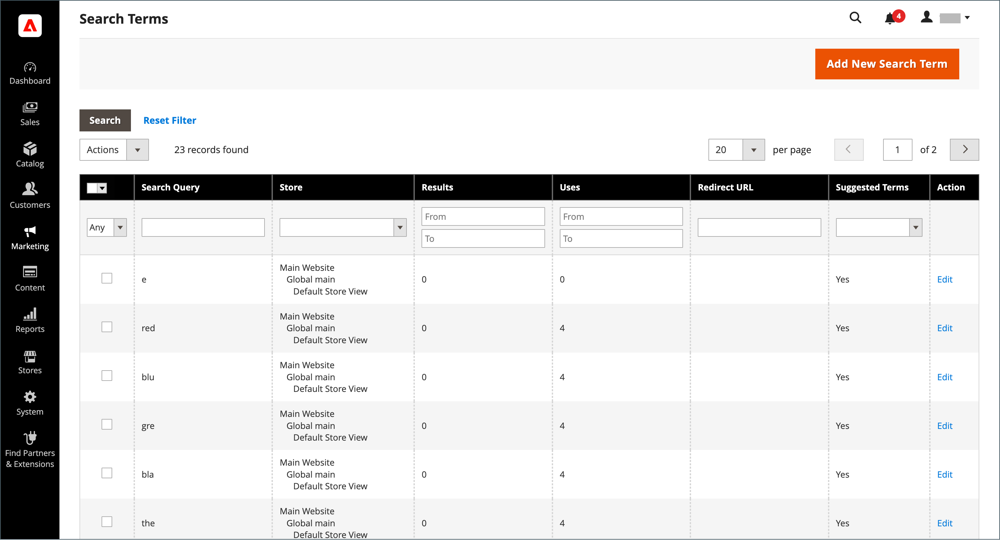
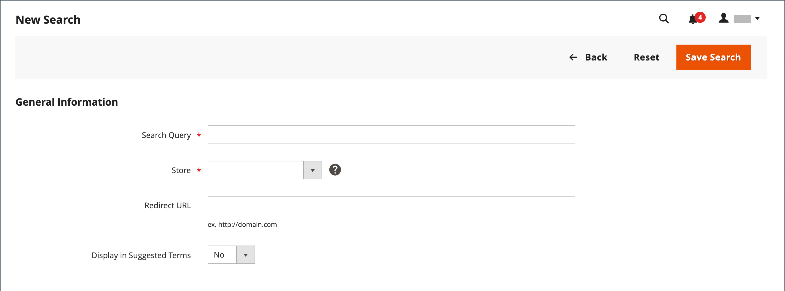

# Hantera söktermer

[Startsidan](../content-design/pages.md) för en sökterm kan vara en innehållssida, en kategorisida, en produktinformationssida eller till och med en sida på en annan webbplats.

Använd söktermer för att fånga vanliga felstavningar och dirigera om dem till rätt sida. Om du till exempel säljer möbler av järn som har bildats vet du att många personer stavar om termen som _stavjärn_, eller till och med _strykjärn_. Du kan ange varje felstavat ord som en sökterm och göra dem synonymer för _ifyllt järn_. Även om ordet är felstavat dirigeras sökningen till sidan för ifyllt järn.

Du kan också ta reda på vad kunderna letar efter genom att undersöka de söktermer de använder för att hitta produkter i din butik. Om tillräckligt många söker efter en produkt som inte finns i din katalog kan det tyda på en säljmöjlighet. I stället för att lämna dem tomma kan du dirigera om dem till en annan produkt i katalogen.

## Lägg till söktermer

När du lär dig nya ord som andra använder för att söka i din butik kan du lägga till dem i sökordslistan för att dirigera personer till de produkter som matchar bäst i din katalog.

{width="700" zoomable="yes"}

| Kolumn | Beskrivning |
|--- |--- |
| [!UICONTROL Search Query] | Frågan som användes för att utföra sökningen. |
| [!UICONTROL Store] | Det arkiv där sökfrågan tillämpades. |
| [!UICONTROL Results] | Antal resultat som hittats av frågan. |
| [!UICONTROL Uses] | Antal användare. |
| [!UICONTROL Redirect URL] | URL för målsidan där användaren omdirigerades efter att sökningen utförts. |
| [!UICONTROL Suggested Terms] | Avgör om frågeresultatet visar föreslagna termer. |
| [!UICONTROL Actions] | Öppnar produkten i redigeringsläge. |

{style="table-layout:auto"}

>[!NOTE]
>
>Antalet resultat uppdateras varje gång en kund gör en sökning med den här sökfrågan. Den uppdateras inte om någon av produkterna ändras eller tas bort.

### Lägg till en sökterm

1. Gå till **[!UICONTROL Marketing]** > _[!UICONTROL SEO & Search]_>**[!UICONTROL Search Terms]**på sidofältet_ Admin _.

1. Klicka på **[!UICONTROL Add New Search Term]**.

   {width="600" zoomable="yes"}

1. Ange det ord eller den fras du vill lägga till som ett nytt sökord under _[!UICONTROL General Information]_i rutan **[!UICONTROL Search Query]**.

1. Om din butik finns tillgänglig på flera språk väljer du lämplig **[!UICONTROL Store]**-vy.

1. Om du vill dirigera om sökresultaten till en annan sida i din butik, eller till en annan webbplats, anger du målsidans fullständiga URL i fältet **[!UICONTROL Redirect URL]**.

1. Om du vill att den här termen ska vara tillgänglig för användning som förslag när sökningen inte returnerar några resultat anger du **[!UICONTROL Display in Suggested Terms]** till `Yes`.

1. Klicka på **[!UICONTROL Save Search]** när du är klar.

## Redigera en sökterm

1. I rutnätet _[!UICONTROL Search Terms]_klickar du på raden för en post för att öppna söktermen i redigeringsläge.

1. Gör de ändringar som behövs.

1. Klicka på **[!UICONTROL Save Search]** när du är klar.

## Ta bort en sökterm

Det finns två metoder för att ta bort en sökterm - från rutnätet och på redigeringssidan.

**Metod 1:** I stödrastret _[!UICONTROL Search Terms]_

1. Markera kryssrutan för den term som ska tas bort i listan.

1. I listans övre vänstra hörn anger du **[!UICONTROL Actions]** till `Delete`.

1. Klicka på **[!UICONTROL Submit]** när du är klar.

**Metod 2:** På sidan _[!UICONTROL Edit a Search Term]_

1. Gå till **[!UICONTROL Marketing]** > _[!UICONTROL SEO & Search]_>**[!UICONTROL Search Terms]**på sidofältet_ Admin _.

1. Sök efter den sökterm som ska tas bort och öppna den i redigeringsläge.

1. Klicka på **[!UICONTROL Delete Search]**.

1. Bekräfta åtgärden genom att klicka på **[!UICONTROL OK]**.

## Vanliga söktermer

Länken _Sökvillkor_ i sidfoten på din butik visar de söktermer som används av besökare i din butik, rankade efter popularitet. Söktermer visas i formatet _tagg i molnet_, där textens storlek anger termens popularitet.

Vanliga söktermer är som standard aktiverade som sökmotoroptimeringsverktyg, men har ingen direkt anslutning till katalogsökprocessen. Eftersom sidan Sökvillkor indexeras av sökmotorer kan alla termer på sidan hjälpa dig att förbättra din sökmotorrankning och butikens synlighet. URL:en för sidan Popular Search Terms är: `mystore.com/search/term/popular/`

{width="600" zoomable="yes"}

**_Så här konfigurerar du vanliga söktermer:_**

1. Gå till **[!UICONTROL Stores]** > _[!UICONTROL Settings]_>**[!UICONTROL Configuration]**på sidofältet_ Admin _.

1. Expandera **[!UICONTROL Catalog]** i den vänstra panelen och välj **[!UICONTROL Catalog]** under.

1. Expandera  i avsnittet **[!UICONTROL Search Engine Optimization]**.

   {width="600" zoomable="yes"}

   En detaljerad lista över dessa alternativ finns i [Optimering av sökmotor](../configuration-reference/catalog/catalog.md#search-engine-optimization) i _Konfigurationsreferens_.

1. Ange **[!UICONTROL Popular Search Terms]** efter behov.

   Om det behövs avmarkerar du kryssrutan **[!UICONTROL Use system value]** för att ändra den här inställningen.

1. Klicka på **[!UICONTROL Save Config]** när du är klar.

>[!NOTE]
>
>Du kan konfigurera cachelagringen av populära [katalogsökningar](search-configuration.md) ytterligare.

## Sök synonymer

Ett sätt att förbättra effekten av [katalogsökning](search-configuration.md) är att inkludera olika termer som andra kan använda för att beskriva samma objekt. Du vill inte förlora en försäljning bara för att någon letar efter en _soffa_ och din produkt listas som en _soffa_. Du kan fånga fler söktermer genom att ange _sofa_, _davenport_ och _loveseat_ som synonymer för _soffa_ och dirigera dem till samma landningssida.

Adobe Commerce har stöd för två olika synonymhanteringslösningar:

- Funktionen [Synonymer](https://experienceleague.adobe.com/docs/commerce-merchant-services/live-search/live-search-admin/synonyms/synonyms.html) för Live-sökning är tillgänglig för Adobe Commerce-installationer med Live Search installerat.
- Standardfunktionen för söksynonymer (som beskrivs på den här sidan) är tillgänglig direkt för alla Adobe Commerce-installationer.

>[!NOTE]
>
>Standardfunktionen för söksynonymer som är färdig har stöd för `name` och `sku` produktattribut **_endast_**.

>[!IMPORTANT]
>
>Söksynonymfunktionen använder endast en fulltextmatchande sökmetod.

{width="700" zoomable="yes"}

### Skapa en synonymgrupp

1. Gå till **[!UICONTROL Marketing]** > _[!UICONTROL SEO & Search]_>**[!UICONTROL Search Synonyms]**på sidofältet_ Admin _.

   Rutnätet _[!UICONTROL Search Synonyms]_visas. Om det är första gången du använder söksynonymer är rutnätet tomt.

   {width="700" zoomable="yes"}

1. Klicka på **[!UICONTROL New Synonym Group]**.

   {width="700" zoomable="yes"}

1. Ange **[!UICONTROL Scope]** till de butiksvyer där synonymer används.

1. Ange varje synonym i gruppen, avgränsade med kommatecken. Välj ord som andra kan använda som sökvillkor. Exempel:

   - `sweatshirt, sweat shirt, hoodie, fleece`
   - `cell phone, mobile phone, smart phone`
   - `couch, sofa, davenport`
   - `wrought iron, rot iron, rod iron`

1. Markera kryssrutan **[!UICONTROL Merge existing synonyms]** om du vill sammanfoga dessa synonymer i en grupp med andra som har samma omfång.

1. Klicka på **[!UICONTROL Save Synonym Group]** när du är klar.

### Redigera en synonymgrupp

1. I stödrastret _[!UICONTROL Search Synonyms]_klickar du på raden för en post för att öppna synonymgruppen i redigeringsläge.

1. Gör de ändringar som behövs.

1. Klicka på **[!UICONTROL Save Synonym Group]** när du är klar.

### Ta bort en synonymgrupp

Det finns två metoder för att ta bort en synonymgrupp - från stödrastret och på redigeringssidan.

**Metod 1:** i stödrastret Söksynonymer

1. Markera kryssrutan för gruppen som ska tas bort i rutnätet _[!UICONTROL Search Synonyms]_.

1. I listans övre vänstra hörn anger du **[!UICONTROL Actions]** till `Delete`.

1. Klicka på **[!UICONTROL Submit]** när du är klar.

**Metod 2:** På sidan Redigera en synonymgrupp

1. I stödrastret Sök synonymer klickar du på raden för en post för att öppna synonymgruppen i redigeringsläge.

1. Klicka på **[!UICONTROL Delete Synonym Group]**.

1. Bekräfta borttagningen av gruppen när du uppmanas till detta.

## Rapport om sökvillkor

I rapporten Sökvillkor visas antalet resultat för varje term och antalet träffar som termen användes. Rapportdata kan filtreras efter term, butik, resultat och träffar, och exporteras för ytterligare analys.

### Visa rapporten

1. Gå till **[!UICONTROL Reports]** > _[!UICONTROL Marketing]_>**[!UICONTROL Search Terms]**på sidofältet_ Admin _.

1. Använd kontrollerna för att filtrera rapporten efter behov.

   {width="700" zoomable="yes"}

## Exportera rapporten

1. Välj ett exportformat för **[!UICONTROL Export to]**:

   - `CSV` - en kommaavgränsad värdefil som innehåller oformaterade textdata
   - `Excel XML` - Ett XML-baserat kalkylbladsdataformat

1. Klicka på **[!UICONTROL Export]**.

   Den genererade filen sparas automatiskt i den mapp du har valt för nedladdning.

### Rapportkolumner

| Kolumn | Beskrivning |
|--- |--- |
| [!UICONTROL ID] | Unikt, numeriskt ID genererat för söktermsposten |
| [!UICONTROL Search Query] | Frågan som användes för att utföra sökningen |
| [!UICONTROL Store] | Det arkiv där sökfrågan tillämpades |
| [!UICONTROL Results] | Antal resultat |
| [!UICONTROL Hits] | Antal användare |

{style="table-layout:auto"}
