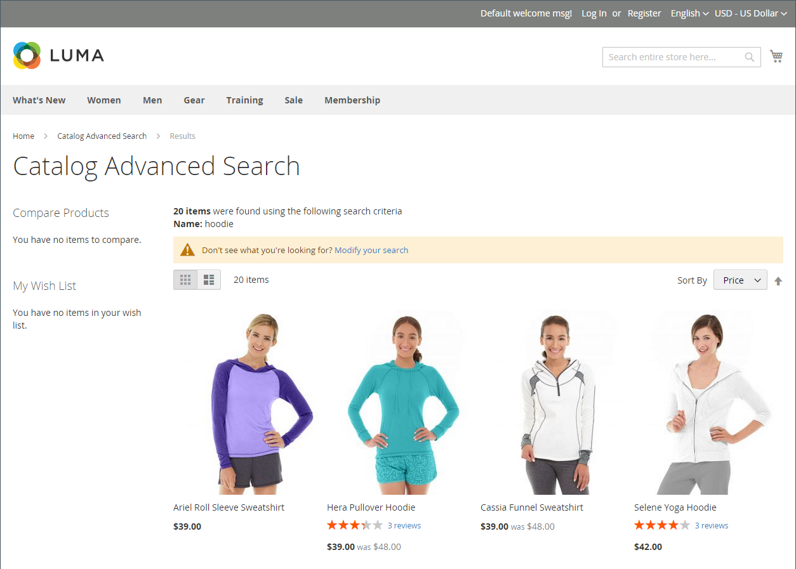

# Översikt över katalogsökning

>[!TIP]
>
>[[!DNL Live Search]](https://experienceleague.adobe.com/docs/commerce/live-search/overview.html) har en snabb, superrelevant och intuitiv sökupplevelse och är tillgänglig för Adobe Commerce utan extra kostnad. I det här avsnittet beskrivs standardsökfunktionen som kan skilja sig från [!DNL Live Search].

Forskning visar att personer som använder sökningar är mer benägna att köpa än kunder som bara använder navigering. Enligt vissa undersökningar är sannolikheten att köpa sökningar nästan dubbelt så stor för dem.

I följande avsnitt beskrivs de grundläggande katalogsökfunktionerna. Mer information om hur du konfigurerar och anpassar sökfunktionerna i den inbyggda katalogen finns i:

- [Konfigurera katalogsökning](search-configuration.md)
- [Sökresultat](search-results.md)
- [Hantera söktermer](search-terms.md)

>[!NOTE]
>
>Den inbyggda sökfunktionen i Commerce ger exakt matchande sökresultat. Medan [!DNL Live Search] är en valfri modul tillgänglig för installation och aktivering i Adobe Commerce, implementeras på ett annat sätt och resultatet begränsas inte till den exakta söksträngen. Om du till exempel har tio produkter som är numeriskt märkta för _Omega_: en sökning för `Omega 1` resulterar i en enda matchning för _Omega 1_ med den inbyggda sökfunktionen. Men samma söksträng som drivs av Live Search ger en matchning för flera objekt, _Omega 1_ och _Omega 10_.

## Snabbsökning

>[!NOTE]
>
>När [[!DNL Live Search]](https://experienceleague.adobe.com/en/docs/commerce/live-search/overview) har installerats och [[!DNL Storefront Popover]](https://experienceleague.adobe.com/en/docs/commerce/live-search/live-search-storefront/storefront-popover)-widgeten har aktiverats returnerar sökrutan sökresultaten i en popup-ruta.

Sökrutan i butikens sidhuvud hjälper besökare att hitta produkter i din katalog. Söktexten kan vara det fullständiga eller delvisa produktnamnet eller något annat ord eller fras som beskriver produkten. De söktermer som andra använder för att hitta produkter kan hanteras från administratören.

1. För **[!UICONTROL Search]** anger kunden de första bokstäverna i vad de vill hitta.

   Eventuella matchningar i katalogen visas nedan med antalet resultat.

1. Kunden trycker på Retur eller klickar på ett resultat i listan över matchande produkter.

   {width="700" zoomable="yes"}

## Avancerad sökning

>[!NOTE]
>
>Den avancerade formulärsökningsfunktionen som beskrivs här gäller inte för [[!DNL Live Search]](https://experienceleague.adobe.com/docs/commerce/live-search/overview.html).

Med avancerad sökning kan kunderna söka i katalogen baserat på värden som anges i ett formulär. Eftersom formuläret innehåller flera fält kan en sökning innehålla flera parametrar. Resultatet är en lista över alla produkter i katalogen som uppfyller villkoren. En länk till den avancerade sökningen finns i sidfoten på din butik.

{width="700" zoomable="yes"}

Varje fält i formuläret motsvarar ett attribut från produktkatalogen. Om du vill lägga till ett fält anger du attributets klientegenskaper till `Include in Advanced Search`. Som en god praxis bör du bara inkludera de fält som kunderna mest sannolikt använder för att hitta en produkt, eftersom sökningen går för långsammare.

1. I butikens sidfot klickar kunden på **[!UICONTROL Advanced Search]**.

1. I formuläret _Avancerad sökning_ lägger till fullständiga eller partiella värden i så många fält som behövs.

1. Klicka på **[!UICONTROL Search]** för att visa resultatet.

   {width="700" zoomable="yes"}

1. Om de inte ser vad de söker i sökresultaten klickar kunden på **[!UICONTROL Modify your search]** och försöker med en annan kombination av villkor.
