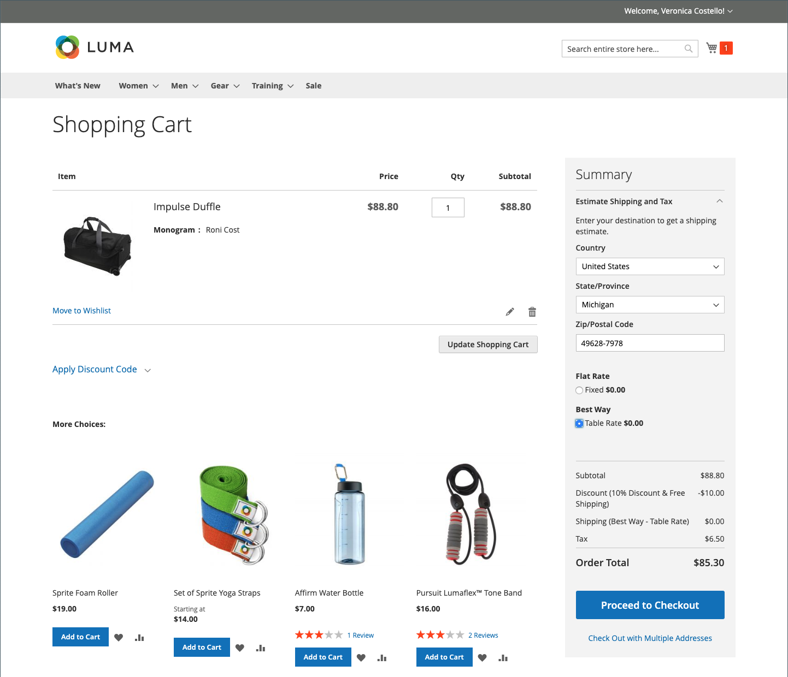

# Produktinställningar - [!UICONTROL Customizable Options]

Att lägga till anpassningsbara alternativ till en produkt är ett enkelt sätt att erbjuda ett urval av alternativ med text, urval och datuminmatningstyper. Anpassningsbara alternativ är en bra lösning om era inventeringsbehov är enkla. Eftersom de baseras på variationer av en enda SKU kan de dock inte användas för att hantera aktier eller som grund för prisregelvillkoren. Om du har flera produkter med samma alternativ kan du konfigurera en produkt och importera alternativen till de andra produkterna.

När en kund köper en produkt med ett anpassningsbart alternativ visas en beskrivning av varje valt alternativ under produktbeskrivningen och eventuella tillhörande pålägg (eller pålägg) tillämpas automatiskt på artikelns pris.

{width="700" zoomable="yes"}

Om en kundvagnsprisregel utlöses av köpet gäller den första beräkningen först produktpriset och därefter radartikelpriset med eventuella justeringar för tillämpliga anpassningsbara alternativ. I följande exempel köper kunden en dubblettpåse för 74,00 USD plus ett anpassningsbart alternativ för ett monogram. Ett pålägg på 14,80 USD tillämpas på basproduktpriset och det justerade priset visas som 88,80 USD. I det här fallet utlöser köpet av dubblettpåsen en kundvagnsregel som baseras på produktens SKU och tillämpar en rabatt på köpet, plus fri frakt. Även om kundvagnsprisregeln inte aktiveras av det anpassningsbara alternativet tillämpas rabatten på kundvagnens innehåll, som inkluderar pålägg för det anpassningsbara alternativet.

{width="700" zoomable="yes"}

>[!NOTE]
>
>Rabatten för katalogprisregel gäller inte för alternativ som kan anpassas till fasta priser.

## Skapa anpassningsbara alternativ

1. Öppna produkten i redigeringsläge.

1. Bläddra nedåt och utöka  i avsnittet _[!UICONTROL Customizable Options]_.

1. Klicka på **[!UICONTROL Add Option]**.

   {width="600" zoomable="yes"}

1. Ange de nya inställningarna:

   - Ange ett namn för alternativet för **[!UICONTROL Option Title]**.

   - Ange **[!UICONTROL Option Type]** som typ av datainmatning.

   - Om alternativet inte krävs för att köpa produkten avmarkerar du kryssrutan **[!UICONTROL Required]**.

1. Fyll i fälten enligt datainmatningstyp:

   - Ange ett namn för alternativet för **[!UICONTROL Title]**.

   - (Valfritt) För **[!UICONTROL Price]** anger du eventuella pålägg eller pålägg från basproduktpriset som gäller det här alternativet.

   - Ange **[!UICONTROL Price Type]** till något av följande:

      - `Fixed` - Priset på variationen skiljer sig från priset på basprodukten med ett fast penningbelopp, till exempel $1.
      - `Percentage` - Priset på variationen skiljer sig från priset på basprodukten med en procentandel, till exempel 10 %.

   - (Valfritt) Ange **[!UICONTROL SKU]** som alternativ. Alternativet SKU är ett suffix som läggs till i produktens SKU.

   - Om _[!UICONTROL Option Type]_&#x200B;är `File` anger du parametrarna för filen. För **[!UICONTROL Compatible File Extensions]**&#x200B;anger du giltiga tillägg som kommaavgränsade värden (till exempel `png, jpg, gif`). Ange den maximala bildstorleken i pixlar för **[!UICONTROL Maximum Image Size]**. Om det är en textinmatning anger du det maximala värdet för **[!UICONTROL Maximum Characters]**.

   {width="600" zoomable="yes"}

1. (Valfritt) Om du vill lägga till ytterligare ett anpassningsbart alternativ klickar du på **[!UICONTROL Add Option]**.

   - Slutför inställningarna som tidigare.

   - Om du vill ändra alternativens ordning klickar du på ikonen _[!UICONTROL Order]_ och drar alternativet till en ny plats i listan.

   Upprepa det här steget för varje alternativ som ska läggas till.

1. Klicka på **[!UICONTROL Save]** när du är klar.

## Importera anpassningsbara alternativ

1. Klicka på **[!UICONTROL Import Options]** i avsnittet _Anpassningsbara alternativ_.

1. Alla produkter med anpassningsbara alternativ visas i rutnätet.

1. I listan markerar du kryssrutan för produkten med de alternativ som du vill importera.

1. Klicka på **[!UICONTROL Import]**.

1. När det är klart kan du fortsätta lägga till fler anpassade alternativ eller klicka på **[!UICONTROL Save and Close]**.

## Indatatyper

| Typ | Beskrivning |
|---------------------|---------------|
| [!UICONTROL Text] | En inmatningsrad eller textruta där kunden kan ange nödvändig information. Alternativ: **[!UICONTROL Field]**- Ett enradigt inmatningsfält för text. **[!UICONTROL Area]** - Ett indatafält med flera rader. Den här typen stöder inte avancerad formatering som HTML. Använd Max. tecken för att begränsa hur lång text som kan anges och för att säkerställa korrekt återgivning av den angivna texten i Admin. |
| [!UICONTROL File] | Låter kunden överföra en fil. |
| [!UICONTROL Select] | Låter kunden välja ett eller flera alternativ, beroende på vilken indatatyp som används. Alternativ: **[!UICONTROL Drop-down]**- En nedrullningsbar lista med alternativ som bara tillåter ett val. **[!UICONTROL Radio Buttons]** - En uppsättning alternativ som bara tillåter en markering. **[!UICONTROL Checkbox]**- En kryssruta är en variant av ett ja/nej-alternativ. Om produkten har flera kryssrutor kan du göra flera val. **[!UICONTROL Multiple Select]** - En listruta med alternativ som accepterar flera val. Om du vill välja flera alternativ håller du ned Ctrl (PC) eller Kommando (Mac) och klickar på varje alternativ. |
| [!UICONTROL Date] | Låter kunden ange ett datum eller en tid eller välja värdet från en kalender. Alternativ:  **[!UICONTROL Date]**- Ett inmatningsfält för ett datumvärde. Datumet kan anges direkt i fältet eller väljas från en lista eller kalender. Indatametoden och indataformatet bestäms av konfigurationen för [datum- och tidsalternativ](attributes-input-types.md#date-and-time-options). **[!UICONTROL Date & Time]** - Ett indatafält för ett datum- och tidsvärde. **[!UICONTROL Time]**- Ett indatafält för ett tidsvärde. |

{style="table-layout:auto"}
